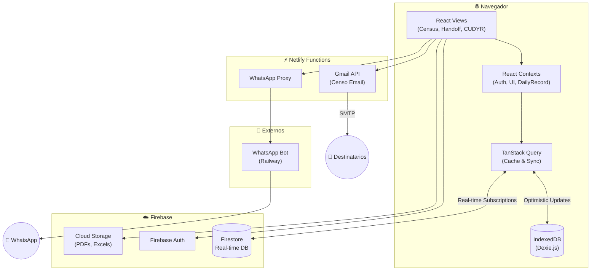
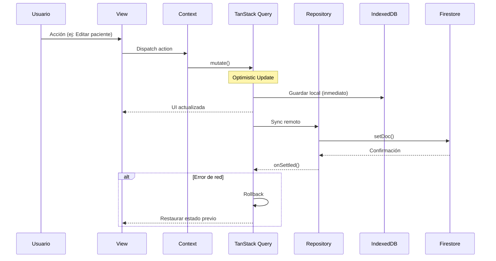
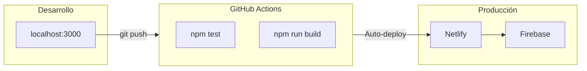

# Arquitectura del Sistema HHR

Sistema de gestión de censo diario de pacientes hospitalizados para el Hospital Hanga Roa.

---

## 🏗️ Diagrama de Alto Nivel



---

## 📦 Stack Tecnológico

| Capa | Tecnología | Versión |
|------|------------|---------|
| **UI** | React | 19.2 |
| **Language** | TypeScript | 5.8 |
| **Build** | Vite | 6.4 |
| **State Management** | TanStack Query | 5.x |
| **Styling** | Vanilla CSS | - |
| **Database** | Firestore | - |
| **Local Storage** | IndexedDB (Dexie.js) | 4.x |
| **Auth** | Firebase Auth | - |
| **Validation** | Zod | 3.25 |
| **Testing** | Vitest + Playwright | - |
| **Hosting** | Netlify | - |

---

## 🗂️ Estructura de Directorios

```
├── components/                 # Componentes React
│   ├── census/                 # Tabla de pacientes
│   ├── modals/                 # Modales de acción
│   ├── layout/                 # Navbar, DateStrip
│   └── shared/                 # ErrorBoundary, Skeletons
│
├── views/                      # Páginas (lazy-loaded)
│   ├── census/                 # CensusView + sub-componentes
│   ├── cudyr/                  # CudyrView
│   ├── handoff/                # HandoffView
│   ├── backup/                 # BackupFilesView
│   └── admin/                  # AuditView, ConfigView
│
├── hooks/                      # Custom Hooks
│   ├── useDailyRecordQuery.ts  # TanStack Query wrapper
│   ├── useStaffQuery.ts        # Catálogos de personal
│   ├── useBedManagement.ts     # Operaciones de camas
│   ├── usePatientHistoryQuery.ts
│   └── useBackupFilesQuery.ts
│
├── services/                   # Lógica de negocio
│   ├── storage/                # IndexedDB, Firestore
│   ├── repositories/           # Patrón Repository
│   ├── backup/                 # PDF/Excel Storage
│   ├── pdf/                    # Generación de PDFs
│   └── exporters/              # Excel exports
│
├── context/                    # React Contexts
│   ├── AuthContext.tsx
│   ├── UIContext.tsx
│   ├── StaffContext.tsx
│   └── DailyRecordContext.tsx
│
├── schemas/                    # Validación Zod
│   ├── zodSchemas.ts           # Schemas principales
│   └── validation.ts           # Helpers
│
├── types/                      # TypeScript types
│   ├── core.ts                 # Tipos base
│   └── index.ts                # Re-exports
│
└── tests/                      # Tests (701+)
    ├── hooks/
    ├── services/
    ├── components/
    └── integration/
```

---

## 🔄 Flujo de Datos



---

## 🧱 Patrones de Diseño

### 1. Repository Pattern
```typescript
// Abstrae el acceso a datos
import { DailyRecordRepository } from '@/services/repositories/DailyRecordRepository';

const record = await DailyRecordRepository.getForDate('2026-01-08');
await DailyRecordRepository.save(updatedRecord);
```

### 2. TanStack Query Hooks
```typescript
// Cache, sync, optimistic updates automatizados
const { data, isLoading } = useDailyRecordQuery(dateString);
const mutation = useSaveDailyRecordMutation();

mutation.mutate(updatedRecord); // UI se actualiza inmediatamente
```

### 3. Composición de Hooks
```typescript
// useDailyRecord compone múltiples hooks especializados
function useDailyRecord(dateString: string) {
    const query = useDailyRecordQuery(dateString);
    const bedOps = useBedManagement(dateString);
    const discharges = usePatientDischarges(dateString);
    // ...
}
```

### 4. Context para Estado Global
- `AuthContext` - Autenticación y roles
- `UIContext` - Estado de UI (modales, notificaciones)
- `StaffContext` - Catálogos de enfermeras/TENS
- `DailyRecordContext` - Registro diario actual

---

## 🔐 Seguridad

### Cliente
- RBAC (Role-Based Access Control) en `utils/permissions.ts`
- Validación Zod antes de cada escritura
- No hay secretos en el código cliente

### Firebase
- Security Rules en `firestore.rules`
- Storage Rules en `storage.rules`
- Autenticación obligatoria para todas las operaciones

### Serverless
- Validación de headers en Netlify Functions
- Secretos en variables de entorno (no en código)

---

## 📊 Módulos Principales

| Módulo | Descripción | Archivos Clave |
|--------|-------------|----------------|
| **Census** | Gestión de camas y pacientes | `views/census/`, `useBedManagement.ts` |
| **CUDYR** | Scoring de dependencia | `views/cudyr/`, `cudyrScoreUtils.ts` |
| **Handoff** | Entrega de turno | `views/handoff/`, `handoffPdfGenerator.ts` |
| **Backup** | Archivos históricos | `views/backup/`, `pdfStorageService.ts` |
| **Audit** | Logs de acciones | `views/admin/AuditView.tsx`, `auditService.ts` |
| **Reports** | Exportación Excel/PDF | `services/exporters/` |

---

## 🚀 Despliegue



1. **Netlify**: Auto-deploy desde branch `main`
2. **Netlify Functions**: `netlify/functions/*.ts`
3. **Firebase**: Firestore + Storage + Auth

---

### 5. Proactive Sync (Analytics)
El hook `useMinsalStats` implementa una sincronización proactiva que detecta brechas de datos en IndexedDB comparando la cantidad de registros locales con los días esperados en el rango seleccionado. Si faltan datos, se dispara una sincronización automática desde Firestore.

---

*Última actualización: 24 de Enero 2026*
