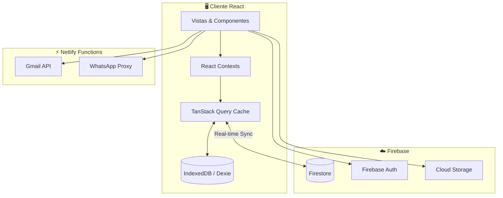

# 🏥 Hospital Hanga Roa - Sistema de Gestión Clínica

[](./tests)
[](https://react.dev)
[](https://www.typescriptlang.org)
[](https://firebase.google.com)
[](https://tanstack.com/query)

Sistema integral de gestión hospitalaria para el **Hospital Hanga Roa** de Isla de Pascua, Chile. Desarrollado con React, TypeScript, Firebase y TanStack Query.

---

## 🚀 Características Principales

| Módulo | Descripción |
|--------|-------------|
| **📋 Censo Diario** | Registro en tiempo real de pacientes hospitalizados con 26 camas + camas extras |
| **🏥 CUDYR** | Categorización de dependencia de pacientes con scoring automático |
| **🔄 Entrega de Turno** | Handoff digital de enfermería y médico con checklist y firmas |
| **📊 Reportes** | Exportación a Excel y PDF con análisis estadístico mensual |
| **📱 Modo Offline** | Persistencia en IndexedDB con sincronización automática |
| **📝 Auditoría** | Log inmutable de acciones críticas (admisiones, altas, traslados) |
| **💬 WhatsApp** | Bot integrado para notificaciones automáticas de turno |

---

## 🏗️ Arquitectura



### Flujo de Datos
```
Usuario → View → Context → TanStack Query → Repository → Firebase/IndexedDB
                    ↓              ↓              ↓
                 Estado      Optimistic      Validación Zod
                 Global        Updates
```

---

## 📁 Estructura del Proyecto

```
├── components/              # Componentes React reutilizables
│   ├── census/              # Tabla de pacientes
│   ├── modals/              # Modales de acción
│   ├── layout/              # Navbar, DateStrip
│   └── shared/              # ErrorBoundary, Skeletons
│
├── views/                   # Páginas principales (lazy-loaded)
│   ├── census/              # Censo Diario
│   ├── cudyr/               # CUDYR
│   ├── handoff/             # Entrega de Turno
│   ├── backup/              # Archivos de Respaldo
│   └── admin/               # Auditoría y Configuración
│
├── hooks/                   # Custom Hooks
│   ├── useDailyRecordQuery  # TanStack Query para registros
│   ├── useStaffQuery        # Catálogos de personal
│   ├── useBedManagement     # Operaciones de camas
│   └── useHandoffLogic      # Lógica de entrega de turno
│
├── services/                # Lógica de negocio
│   ├── storage/             # IndexedDB, Firestore
│   ├── repositories/        # Patrón Repository
│   ├── backup/              # PDF/Excel Storage
│   └── pdf/                 # Generación de PDFs
│
├── context/                 # React Contexts
├── schemas/                 # Validación Zod
├── types/                   # TypeScript types
└── tests/                   # 701+ tests (Vitest + Playwright)
```

---

## 🛠️ Stack Tecnológico

| Categoría | Tecnología | Propósito |
|-----------|------------|-----------|
| **Frontend** | React 19.2 | UI declarativa |
| **State Management** | TanStack Query 5 | Cache, sync, optimistic updates |
| **Language** | TypeScript 5.8 | Type safety |
| **Build** | Vite 6.4 | Fast bundling, HMR |
| **Database** | Firestore + IndexedDB | Cloud + Offline persistence |
| **Auth** | Firebase Auth | Google Sign-In |
| **Storage** | Firebase Storage | PDFs y Excels de backup |
| **Validation** | Zod 3.25 | Runtime type checking |
| **Testing** | Vitest + Playwright | Unit, Integration, E2E |
| **Styling** | Vanilla CSS + Tailwind | Design tokens system |
| **Deployment** | Netlify | Auto-deploy + Serverless Functions |

---

## 🏃‍♂️ Inicio Rápido

### Requisitos
- Node.js **20.x** o superior
- npm **9.x** o superior

### Instalación

```bash
# Clonar repositorio
git clone https://github.com/DanielOpazoD/HHR-entornodeprueba.git
cd HHR-entornodeprueba

# Instalar dependencias
npm install

# Configurar variables de entorno
cp .env.example .env
# Editar .env con tus credenciales de Firebase
```

### Desarrollo

```bash
npm run dev          # Servidor de desarrollo (http://localhost:3000)
npm run build        # Build de producción
npm run preview      # Preview del build
```

### Testing

```bash
npm test             # Ejecutar todos los tests (701+)
npm test -- --watch  # Modo watch
npm run test:e2e     # Tests E2E con Playwright
```

---

## 🔐 Roles y Permisos

| Rol | Acceso |
|-----|--------|
| **Admin** | Acceso total, configuración, auditoría, gestión de personal |
| **Enfermera Hospital** | Editar Censo, CUDYR, Entrega de Enfermería |
| **Médico** | Entrega Médica, Vista de Censo (solo lectura) |
| **Viewer** | Solo lectura del Censo |

---

## 📊 Estado del Proyecto

| Métrica | Valor |
|---------|-------|
| Tests Pasando | **701** |
| Cobertura de Código | ~65% |
| Lighthouse Performance | 92 |
| Build Size (Gzip) | ~450kb |

---

## 📚 Documentación Adicional

- [Arquitectura Detallada](./ARCHITECTURE.md)
- [Guía de Contribución](./CONTRIBUTING.md)
- [Changelog](./CHANGELOG.md)
- [Estado del Proyecto](./PROJECT_STATUS.md)
- [Testing Guide](./docs/testing/README.md)
- [WhatsApp Deployment](./docs/whatsapp-deployment.md)

---

## 📝 Variables de Entorno

```env
# Firebase (requerido)
VITE_FIREBASE_API_KEY=...
VITE_FIREBASE_AUTH_DOMAIN=...
VITE_FIREBASE_PROJECT_ID=...
VITE_FIREBASE_STORAGE_BUCKET=...
VITE_FIREBASE_MESSAGING_SENDER_ID=...
VITE_FIREBASE_APP_ID=...

# Gmail API (opcional, para envío de censo)
GMAIL_CLIENT_ID=...
GMAIL_CLIENT_SECRET=...
GMAIL_REFRESH_TOKEN=...

# WhatsApp Bot (opcional)
VITE_WHATSAPP_BOT_URL=...
```

---

## 👥 Equipo

**Desarrollador Principal**: Dr. Daniel Opazo  
**Email**: daniel.opazo@hospitalhangaroa.cl  
**Ubicación**: Hospital Hanga Roa, Isla de Pascua, Chile

---

## 📝 Licencia

Propiedad del Hospital Hanga Roa. Uso privado e institucional.

---

*Última actualización: Enero 2026*
