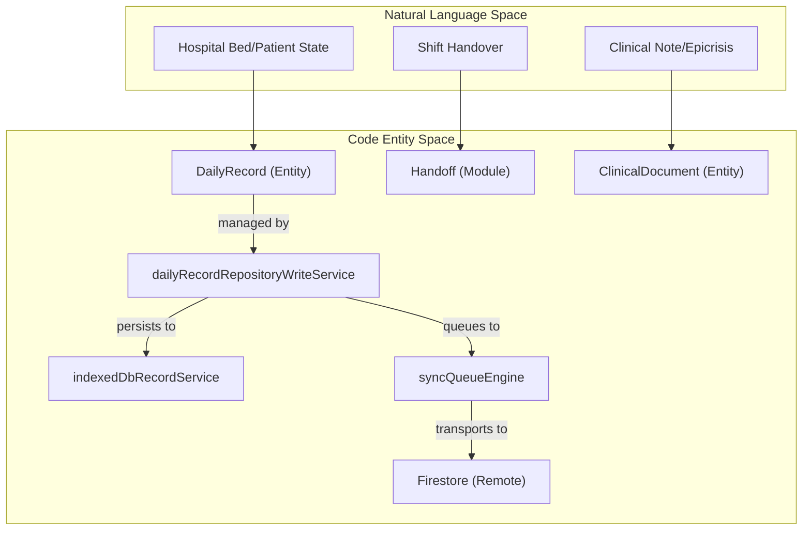
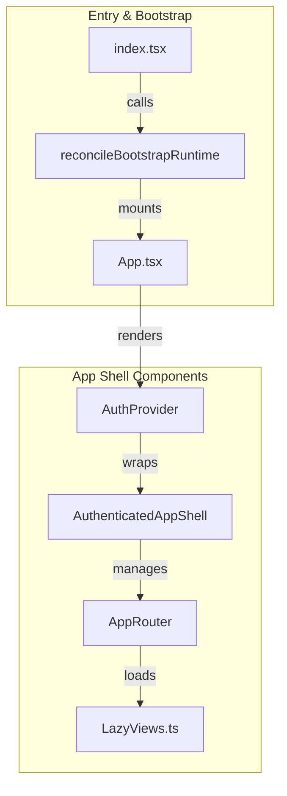

# Overview

# Overview

Relevant source files

The following files were used as context for generating this wiki page:

- [.github/workflows/ci-cd.yml](.github/workflows/ci-cd.yml)
- [ARCHITECTURE.md](ARCHITECTURE.md)
- [README.md](README.md)
- [docs/ADR_CONTROLLER_DECOMPOSITION_PATTERN.md](docs/ADR_CONTROLLER_DECOMPOSITION_PATTERN.md)
- [docs/ADR_DEBOUNCED_INPUT_MULTITAB_SAFETY.md](docs/ADR_DEBOUNCED_INPUT_MULTITAB_SAFETY.md)
- [docs/CENSUS_OPERATIONAL_VALIDATION_CHECKLIST.md](docs/CENSUS_OPERATIONAL_VALIDATION_CHECKLIST.md)
- [docs/CI_GATES_AND_FAILURE_RUNBOOKS.md](docs/CI_GATES_AND_FAILURE_RUNBOOKS.md)
- [docs/DEVELOPER_COMMANDS.md](docs/DEVELOPER_COMMANDS.md)
- [docs/DOCUMENTATION_MAP.md](docs/DOCUMENTATION_MAP.md)
- [docs/QUALITY_GUARDRAILS.md](docs/QUALITY_GUARDRAILS.md)
- [docs/RUNBOOK_SUPPORT_OPERATIONS.md](docs/RUNBOOK_SUPPORT_OPERATIONS.md)
- [docs/RUNBOOK_SYNC_RESILIENCE.md](docs/RUNBOOK_SYNC_RESILIENCE.md)
- [docs/SAFE_CHANGE_CHECKLIST.md](docs/SAFE_CHANGE_CHECKLIST.md)
- [docs/TECHNICAL_APPLICATION_AUDIT.md](docs/TECHNICAL_APPLICATION_AUDIT.md)
- [docs/TODO_TRIAGE_PROCESS.md](docs/TODO_TRIAGE_PROCESS.md)
- [docs/api/media/ADR_DAILY_RECORD_RUNTIME_PATH.md](docs/api/media/ADR_DAILY_RECORD_RUNTIME_PATH.md)
- [docs/api/media/ARCHITECTURE.md](docs/api/media/ARCHITECTURE.md)
- [docs/api/media/system-behaviors.md](docs/api/media/system-behaviors.md)
- [docs/architecture.md](docs/architecture.md)
- [docs/compliance/traceability-matrix.md](docs/compliance/traceability-matrix.md)
- [docs/system-behaviors.md](docs/system-behaviors.md)
- [functions/index.js](functions/index.js)
- [index.html](index.html)
- [package.json](package.json)
- [playwright.emulator-critical.config.ts](playwright.emulator-critical.config.ts)
- [public/version.json](public/version.json)
- [scripts/check-docs-drift.mjs](scripts/check-docs-drift.mjs)
- [scripts/check-feature-public-api-boundary.mjs](scripts/check-feature-public-api-boundary.mjs)
- [scripts/check-persistence-hub-boundaries.mjs](scripts/check-persistence-hub-boundaries.mjs)
- [scripts/check-quality-aggregate.mjs](scripts/check-quality-aggregate.mjs)
- [scripts/check-release-evidence.mjs](scripts/check-release-evidence.mjs)
- [scripts/check-technical-ownership-map.mjs](scripts/check-technical-ownership-map.mjs)
- [scripts/config/guardrail-governance.json](scripts/config/guardrail-governance.json)
- [scripts/config/technical-execution-baseline.json](scripts/config/technical-execution-baseline.json)
- [scripts/config/technical-ownership-map.json](scripts/config/technical-ownership-map.json)
- [scripts/feature-public-api-allowlist.json](scripts/feature-public-api-allowlist.json)
- [scripts/releaseConfidenceMatrixSupport.mjs](scripts/releaseConfidenceMatrixSupport.mjs)
- [scripts/scan-todos.mjs](scripts/scan-todos.mjs)
- [src/App.tsx](src/App.tsx)
- [src/app-shell/bootstrap/appShellLoadingPolicy.ts](src/app-shell/bootstrap/appShellLoadingPolicy.ts)
- [src/components/ui/InitialLoadingScreen.tsx](src/components/ui/InitialLoadingScreen.tsx)
- [src/constants/email.ts](src/constants/email.ts)
- [src/features/README.md](src/features/README.md)
- [src/features/handoff/README.md](src/features/handoff/README.md)
- [src/hooks/README.md](src/hooks/README.md)
- [src/index.tsx](src/index.tsx)
- [src/services/README.md](src/services/README.md)
- [src/services/auth/README.md](src/services/auth/README.md)
- [src/services/auth/authCredentialFlow.ts](src/services/auth/authCredentialFlow.ts)
- [src/services/repositories/README.md](src/services/repositories/README.md)
- [src/services/repositories/repositoryFirestoreRuntime.ts](src/services/repositories/repositoryFirestoreRuntime.ts)
- [src/services/security/passwordGenerator.ts](src/services/security/passwordGenerator.ts)
- [src/services/storage/README.md](src/services/storage/README.md)
- [src/services/storage/firestore/firestoreServiceRuntime.ts](src/services/storage/firestore/firestoreServiceRuntime.ts)
- [src/services/storage/legacyfirebase/legacyFirebaseLogger.ts](src/services/storage/legacyfirebase/legacyFirebaseLogger.ts)
- [src/services/storage/legacyfirebase/legacyFirebaseRecordService.ts](src/services/storage/legacyfirebase/legacyFirebaseRecordService.ts)
- [src/services/transfers/transferTemplateFetchController.ts](src/services/transfers/transferTemplateFetchController.ts)
- [src/tests/README.md](src/tests/README.md)
- [src/tests/app-shell/BootstrapRouteChrome.test.tsx](src/tests/app-shell/BootstrapRouteChrome.test.tsx)
- [src/tests/app-shell/appShellLoadingPolicy.test.ts](src/tests/app-shell/appShellLoadingPolicy.test.ts)
- [src/tests/build/releaseConfidenceMatrixSupport.test.ts](src/tests/build/releaseConfidenceMatrixSupport.test.ts)
- [src/tests/build/releaseEvidence.test.ts](src/tests/build/releaseEvidence.test.ts)
- [src/tests/components/AppLoadingBehavior.test.tsx](src/tests/components/AppLoadingBehavior.test.tsx)
- [src/tests/components/InitialLoadingScreen.test.tsx](src/tests/components/InitialLoadingScreen.test.tsx)
- [src/tests/components/index.bootstrap.test.tsx](src/tests/components/index.bootstrap.test.tsx)
- [src/tests/constants/email.test.ts](src/tests/constants/email.test.ts)
- [src/tests/security/startupPrebootContractStatic.test.ts](src/tests/security/startupPrebootContractStatic.test.ts)
- [src/tests/services/security/passwordGenerator.test.ts](src/tests/services/security/passwordGenerator.test.ts)
- [src/tests/services/storage/legacyFirebaseLogger.test.ts](src/tests/services/storage/legacyFirebaseLogger.test.ts)
- [src/tests/services/storage/legacyFirebaseRecordCache.test.ts](src/tests/services/storage/legacyFirebaseRecordCache.test.ts)

The **HHR (Hospital Hanga Roa) ServicioHospitalizados** system is a specialized clinical web application designed for hospital census management, shift handovers (handoffs), and operational clinical workflows at Hospital Hanga Roa. It is built to operate in high-stakes clinical environments where network reliability may vary, employing an **offline-first architecture** to ensure data continuity.

The system manages the "Daily Record" (`DailyRecord`), a central entity representing the state of the hospital (patients, beds, staffing, and clinical observations) for any given ISO date [src/services/repositories/README.md:7-15]().

## Core Technology Stack

The system utilizes a modern, type-safe stack designed for resilience and performance:

| Layer              | Technology                 | Purpose                                                              |
| :----------------- | :------------------------- | :------------------------------------------------------------------- |
| **Frontend**       | React 19 + TypeScript      | Component-based UI with strict typing [README.md:65]()               |
| **Bundler**        | Vite 6                     | Fast development and optimized production builds [README.md:66]()    |
| **Styling**        | Tailwind CSS 4             | Utility-first design system and clinical themes [README.md:67]()     |
| **Data Fetching**  | TanStack Query             | Reactive caching and server-state management [README.md:68]()        |
| **Local Storage**  | IndexedDB (Dexie.js)       | Primary offline-first persistence layer [README.md:70]()             |
| **Remote Storage** | Firebase (Firestore)       | Real-time cloud synchronization and backup [README.md:71]()          |
| **Backend**        | Firebase/Netlify Functions | Serverless logic for exports, AI, and integrations [README.md:130]() |

Sources: [README.md:61-73](), [package.json:1-8]()

## Design Principles

### 1. Offline-First & Real-Time Sync

The system follows a "Local-First" approach. Data is always written to the local IndexedDB via `Dexie.js` first, ensuring the UI remains responsive even without a connection [src/services/storage/README.md:58-62](). A background synchronization engine (`syncQueueEngine`) then propagates changes to Firestore when online [src/services/storage/README.md:50-51]().

### 2. Version Reconcilliation

To prevent data corruption from stale clients, the system performs an automatic version check against `version.json` on startup and during active sessions [docs/system-behaviors.md:7-32](). If a mismatch is detected, the system executes a `clientBootstrapRecovery` flow to refresh the application [docs/system-behaviors.md:37-44]().

### 3. Strict Quality Guardrails

The codebase is governed by a multi-tiered CI/CD gate system (Inner Loop, Merge Gate, Release Gate) that enforces architectural boundaries, bundle budgets, and critical test coverage [docs/CI_GATES_AND_FAILURE_RUNBOOKS.md:18-97]().

Sources: [docs/system-behaviors.md:7-33](), [src/services/storage/README.md:1-5](), [scripts/config/guardrail-governance.json:1-55]()

## System Conceptual Map

The following diagram illustrates how clinical concepts map to the primary code entities and storage layers.

### Clinical to Code Entity Mapping

Title: Clinical Domain to Code Entity Space

Sources: [src/services/repositories/README.md:7-15](), [src/services/storage/README.md:50-51](), [README.md:135-148]()

### System Entrypoint and Shell Logic

Title: Application Bootstrap and Shell Wiring

Sources: [src/index.tsx:101-121](), [src/App.tsx:170-203](), [src/App.tsx:34-38]()

## Child Sections

For detailed technical information, refer to the following child pages:

### [Getting Started & Developer Setup](#1.1)

Covers the environment requirements (Node 22), local development commands (`npm run dev`), and the use of Firebase emulators for testing. It details the `ci:inner-loop` and `ci:release-gate` scripts used to maintain code quality.

- **Key Files:** [package.json](), [README.md](), [docs/DEVELOPER_COMMANDS.md]()

### [System Architecture Overview](#1.2)

Provides a deep dive into the four-layer architecture (Features, Application, Services, Domain). Explains the "Golden Path" for data persistence, the Repository Pattern implementation, and the conflict resolution strategy used when merging local and remote clinical data.

- **Key Files:** [src/services/repositories/README.md](), [src/services/storage/README.md](), [ARCHITECTURE.md]()

---

Sources: [package.json:9-15](), [README.md:135-148](), [docs/CI_GATES_AND_FAILURE_RUNBOOKS.md:1-5]()

---
