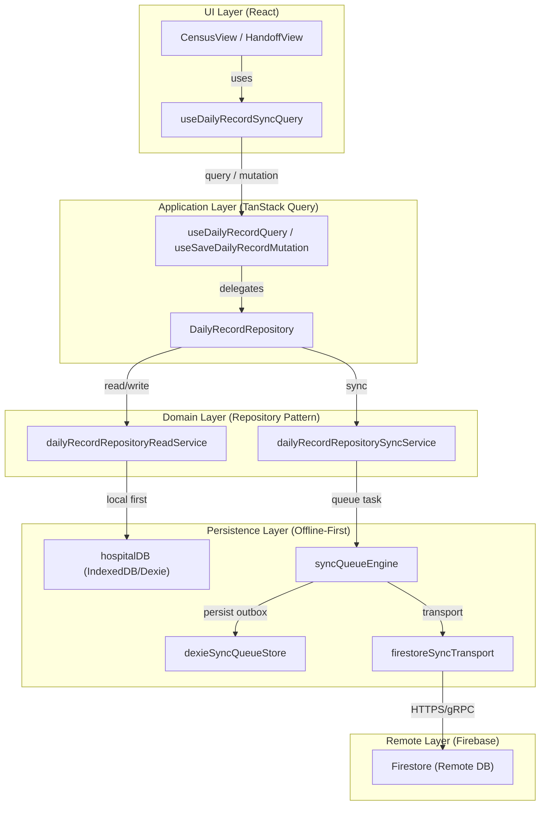

# System Architecture Overview

# System Architecture Overview

<details>
<summary>Relevant source files</summary>

The following files were used as context for generating this wiki page:

- [docs/CENSUS_OPERATIONAL_VALIDATION_CHECKLIST.md](docs/CENSUS_OPERATIONAL_VALIDATION_CHECKLIST.md)
- [docs/RUNBOOK_SUPPORT_OPERATIONS.md](docs/RUNBOOK_SUPPORT_OPERATIONS.md)
- [docs/RUNBOOK_SYNC_RESILIENCE.md](docs/RUNBOOK_SYNC_RESILIENCE.md)
- [docs/SAFE_CHANGE_CHECKLIST.md](docs/SAFE_CHANGE_CHECKLIST.md)
- [docs/architecture.md](docs/architecture.md)
- [docs/system-behaviors.md](docs/system-behaviors.md)
- [index.html](index.html)
- [reports/architectural-hotspots.json](reports/architectural-hotspots.json)
- [reports/architectural-hotspots.md](reports/architectural-hotspots.md)
- [scripts/check-docs-drift.mjs](scripts/check-docs-drift.mjs)
- [scripts/config/technical-execution-baseline.json](scripts/config/technical-execution-baseline.json)
- [scripts/report-dev-metrics.mjs](scripts/report-dev-metrics.mjs)
- [src/App.tsx](src/App.tsx)
- [src/app-shell/bootstrap/appShellLoadingPolicy.ts](src/app-shell/bootstrap/appShellLoadingPolicy.ts)
- [src/components/ui/InitialLoadingScreen.tsx](src/components/ui/InitialLoadingScreen.tsx)
- [src/features/README.md](src/features/README.md)
- [src/features/handoff/README.md](src/features/handoff/README.md)
- [src/hooks/README.md](src/hooks/README.md)
- [src/hooks/controllers/dailyRecordQueryController.ts](src/hooks/controllers/dailyRecordQueryController.ts)
- [src/hooks/useDailyRecordQuery.ts](src/hooks/useDailyRecordQuery.ts)
- [src/hooks/useDailyRecordSyncQuery.ts](src/hooks/useDailyRecordSyncQuery.ts)
- [src/hooks/useDailyRecordSyncQuerySupport.ts](src/hooks/useDailyRecordSyncQuerySupport.ts)
- [src/hooks/useDevMetrics.ts](src/hooks/useDevMetrics.ts)
- [src/hooks/useVersionCheck.ts](src/hooks/useVersionCheck.ts)
- [src/index.tsx](src/index.tsx)
- [src/services/README.md](src/services/README.md)
- [src/services/auth/README.md](src/services/auth/README.md)
- [src/services/auth/authCredentialFlow.ts](src/services/auth/authCredentialFlow.ts)
- [src/services/auth/authRoleCache.ts](src/services/auth/authRoleCache.ts)
- [src/services/config/clientBootstrapRecovery.ts](src/services/config/clientBootstrapRecovery.ts)
- [src/services/config/postDeployRecentRecordRefresh.ts](src/services/config/postDeployRecentRecordRefresh.ts)
- [src/services/repositories/README.md](src/services/repositories/README.md)
- [src/services/repositories/repositoryFirestoreRuntime.ts](src/services/repositories/repositoryFirestoreRuntime.ts)
- [src/services/storage/README.md](src/services/storage/README.md)
- [src/services/storage/firestore/firestoreServiceRuntime.ts](src/services/storage/firestore/firestoreServiceRuntime.ts)
- [src/services/storage/indexeddb/indexedDbCore.ts](src/services/storage/indexeddb/indexedDbCore.ts)
- [src/services/storage/indexeddb/indexedDbCoreFlows.ts](src/services/storage/indexeddb/indexedDbCoreFlows.ts)
- [src/services/storage/indexeddb/indexedDbCoreRecovery.ts](src/services/storage/indexeddb/indexedDbCoreRecovery.ts)
- [src/services/storage/legacyfirebase/legacyFirebaseLogger.ts](src/services/storage/legacyfirebase/legacyFirebaseLogger.ts)
- [src/services/storage/legacyfirebase/legacyFirebaseRecordService.ts](src/services/storage/legacyfirebase/legacyFirebaseRecordService.ts)
- [src/services/transfers/transferTemplateFetchController.ts](src/services/transfers/transferTemplateFetchController.ts)
- [src/tests/README.md](src/tests/README.md)
- [src/tests/app-shell/BootstrapRouteChrome.test.tsx](src/tests/app-shell/BootstrapRouteChrome.test.tsx)
- [src/tests/app-shell/appShellLoadingPolicy.test.ts](src/tests/app-shell/appShellLoadingPolicy.test.ts)
- [src/tests/components/AppLoadingBehavior.test.tsx](src/tests/components/AppLoadingBehavior.test.tsx)
- [src/tests/components/InitialLoadingScreen.test.tsx](src/tests/components/InitialLoadingScreen.test.tsx)
- [src/tests/components/index.bootstrap.test.tsx](src/tests/components/index.bootstrap.test.tsx)
- [src/tests/hooks/controllers/dailyRecordQueryController.test.ts](src/tests/hooks/controllers/dailyRecordQueryController.test.ts)
- [src/tests/hooks/useDailyRecordSyncQuery.test.tsx](src/tests/hooks/useDailyRecordSyncQuery.test.tsx)
- [src/tests/hooks/useVersionCheck.test.tsx](src/tests/hooks/useVersionCheck.test.tsx)
- [src/tests/integration/critical-paths.test.tsx](src/tests/integration/critical-paths.test.tsx)
- [src/tests/security/startupPrebootContractStatic.test.ts](src/tests/security/startupPrebootContractStatic.test.ts)
- [src/tests/services/bookmarks/bookmarkService.test.ts](src/tests/services/bookmarks/bookmarkService.test.ts)
- [src/tests/services/config/clientBootstrapRecovery.test.ts](src/tests/services/config/clientBootstrapRecovery.test.ts)
- [src/tests/services/config/postDeployRecentRecordRefresh.test.ts](src/tests/services/config/postDeployRecentRecordRefresh.test.ts)
- [src/tests/services/storage/indexedDbCoreFlows.test.ts](src/tests/services/storage/indexedDbCoreFlows.test.ts)
- [src/tests/services/storage/indexedDbCoreRecovery.test.ts](src/tests/services/storage/indexedDbCoreRecovery.test.ts)
- [src/tests/services/storage/legacyFirebaseLogger.test.ts](src/tests/services/storage/legacyFirebaseLogger.test.ts)
- [src/tests/services/storage/legacyFirebaseRecordCache.test.ts](src/tests/services/storage/legacyFirebaseRecordCache.test.ts)
- [src/tests/utils/clinicalDateUtils.test.ts](src/tests/utils/clinicalDateUtils.test.ts)
- [src/tests/utils/clinicalDayUtilsEntrypointGovernanceStatic.test.ts](src/tests/utils/clinicalDayUtilsEntrypointGovernanceStatic.test.ts)
- [src/tests/utils/dateUtils.test.ts](src/tests/utils/dateUtils.test.ts)
- [src/tests/views/census/censusStaffHeaderController.test.ts](src/tests/views/census/censusStaffHeaderController.test.ts)
- [src/utils/clinicalDateUtils.ts](src/utils/clinicalDateUtils.ts)
- [src/utils/clinicalDayAdmissionUtils.ts](src/utils/clinicalDayAdmissionUtils.ts)
- [src/utils/clinicalDayScheduleUtils.ts](src/utils/clinicalDayScheduleUtils.ts)
- [src/utils/clinicalDayUtils.ts](src/utils/clinicalDayUtils.ts)
- [src/utils/clinicalStayDayUtils.ts](src/utils/clinicalStayDayUtils.ts)

</details>

The HHR (Hospital Hanga Roa) ServicioHospitalizados system utilizes an **offline-first, local-authoritative architecture**. It is designed to ensure clinical continuity in low-connectivity environments while maintaining real-time synchronization across devices when online.

## Offline-First Data Pipeline

The core data flow prioritizes local persistence using **IndexedDB (via Dexie.js)** as the primary source of truth for the UI. Synchronization with **Firebase Firestore** occurs asynchronously through a persistent outbox mechanism.

### Data Flow Logic

1.  **React + TanStack Query**: The UI layer requests data via hooks like `useDailyRecordQuery`.
2.  **Repository Layer**: The `DailyRecordRepository` determines if the request can be satisfied locally or requires remote hydration.
3.  **IndexedDB (Dexie.js)**: Data is read from/written to the local browser database immediately.
4.  **Sync Pipeline**: Writes are queued in a persistent outbox. The `syncQueueEngine` attempts to push these changes to Firestore using a Last-Write-Wins (LWW) or domain-specific merge strategy.

### Diagram: Persistence & Sync Pipeline

This diagram bridges the clinical UI actions to the underlying storage services.



**Sources:** `src/services/repositories/README.md:7-14`(), `src/services/storage/README.md:58-63`(), `src/hooks/useDailyRecordSyncQuery.ts:56-85`()

---

## High-Level Module Map

The codebase is organized into a layered architecture to separate clinical logic from infrastructure details.

| Layer           | Directory           | Responsibility                                                                   |
| :-------------- | :------------------ | :------------------------------------------------------------------------------- |
| **Features**    | `src/features/`     | Module-specific UI components and logic (Census, Handoff, Lab).                  |
| **Application** | `src/application/`  | Cross-cutting concerns and core contracts (e.g., `dailyRecordCoreContracts.ts`). |
| **Services**    | `src/services/`     | Infrastructure implementations: Storage, Auth, Repositories, and Observability.  |
| **Domain**      | `src/types/domain/` | Pure data structures and TypeScript interfaces for clinical entities.            |

**Sources:** `src/services/repositories/README.md:24-45`(), `src/services/storage/README.md:7-18`()

---

## Repository Provider Pattern

The system uses a **Repository Provider Pattern** to inject data access logic into the React component tree. This allows for easy mocking during testing and decouples the UI from specific storage implementations.

- **`RepositoryContext`**: Provides a unified access point for all repositories.
- **`DefaultRepositoryProvider`**: Injects the production implementations of `DailyRecordRepository`, `PatientMasterRepository`, and others into the app.
- **Usage**: Components use the `useRepositories()` hook to access data services without knowing if they are backed by IndexedDB, Firestore, or a Mock.

**Sources:** `src/App.tsx:187-203`(), `src/services/repositories/README.md:65-74`()

---

## Local Persistence & Fallback Strategy

The system monitors the health of IndexedDB. If the local database fails to initialize or becomes corrupted, the architecture supports a **Sticky Fallback Mode** where the app continues to function in-memory or degrades to a `local_only` state to prevent data loss.

### Diagram: IndexedDB Lifecycle & Recovery

This diagram maps the `indexedDbCore` logic to its internal state transitions.

```mermaid
stateDiagram-v2
    [*] --> "Initializing" : "initializeDatabase()"
    "Initializing" --> "Ready" : "db.open() success"
    "Initializing" --> "FallbackMode" : "open failed / timeout"

    "Ready" --> "Closed" : "Unexpected Close Event"
    "Closed" --> "Recovering" : "ensureDbReady()"

    "Recovering" --> "Ready" : "runFreshOpenAttempt() success"
    "Recovering" --> "StickyFallback" : "Recovery budget exhausted"

    "StickyFallback" --> "BackgroundRetry" : "backgroundRecoveryScheduler"
    "BackgroundRetry" --> "Ready" : "Retry success"
```

**Sources:** `src/services/storage/indexeddb/indexedDbCore.ts:70-152`(), `docs/system-behaviors.md:87-103`()

---

## Concurrency & Conflict Resolution

The system employs a **Last-Write-Wins (LWW)** strategy by default, but implements specific domain policies for clinical data:

1.  **Field-Level Merging**: Instead of overwriting entire documents, patches are applied to specific fields to minimize data loss between concurrent users.
2.  **Integrity Guards**: The `dailyRecordRepositoryWriteService` includes "shrinkage guards" to prevent accidental deletion of patient rows during high-latency sync.
3.  **LWW Heuristics**: The `resolveDailyRecordConflict` function handles merging logic based on clinical vs. administrative priorities (e.g., staffing vs. patient movements).
4.  **Outbox Fallback**: If a write fails due to a conflict or lack of permissions, it remains in the `syncQueueEngine` for manual or automated retry.

**Sources:** `src/services/repositories/README.md:16-23`(), `docs/system-behaviors.md:111-129`(), `src/hooks/useDailyRecordSyncQuery.ts:153-191`()

---

## Versioning and Runtime Safety

To prevent data corruption from incompatible client versions, the system implements a **Runtime Contract** check.

- **`version.json`**: Generated during build; checked by the client on bootstrap and periodically during the session.
- **Reconciliation**: If a new version is detected, the system clears legacy Service Workers and refreshes the page.
- **Blocking**: If the remote schema version is ahead of the client, sensitive writes are blocked to protect data integrity.

**Sources:** `docs/system-behaviors.md:7-33`(), `src/App.tsx:40-45`(), `src/index.tsx:121-148`()

---
