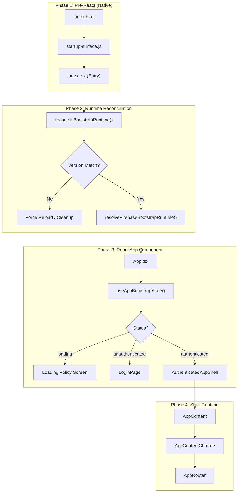
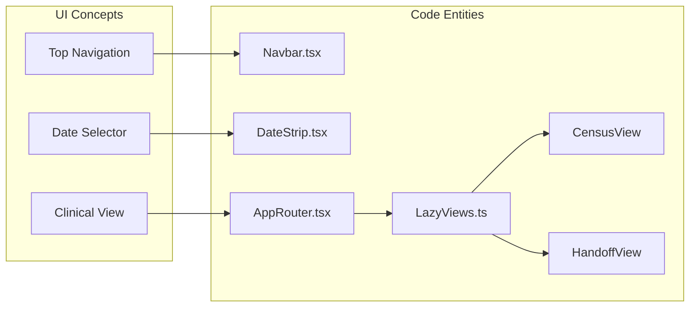

# Application Bootstrap & Shell

# Application Bootstrap & Shell

Relevant source files

The following files were used as context for generating this wiki page:

- [docs/BOOTSTRAP_AND_REFRESH_PERFORMANCE.md](docs/BOOTSTRAP_AND_REFRESH_PERFORMANCE.md)
- [docs/SAFE_CHANGE_CHECKLIST.md](docs/SAFE_CHANGE_CHECKLIST.md)
- [docs/system-behaviors.md](docs/system-behaviors.md)
- [e2e/critical-emulator.spec.ts](e2e/critical-emulator.spec.ts)
- [index.html](index.html)
- [scripts/check-bundle-budget.mjs](scripts/check-bundle-budget.mjs)
- [scripts/config/bundle-budget.json](scripts/config/bundle-budget.json)
- [scripts/operationalHealthSupport.mjs](scripts/operationalHealthSupport.mjs)
- [scripts/run-e2e-critical-emulator-ci.sh](scripts/run-e2e-critical-emulator-ci.sh)
- [src/App.tsx](src/App.tsx)
- [src/app-shell/bootstrap/appShellLoadingPolicy.ts](src/app-shell/bootstrap/appShellLoadingPolicy.ts)
- [src/app-shell/bootstrap/bootstrapAppRuntime.ts](src/app-shell/bootstrap/bootstrapAppRuntime.ts)
- [src/app-shell/bootstrap/bootstrapAppRuntime.types.ts](src/app-shell/bootstrap/bootstrapAppRuntime.types.ts)
- [src/app-shell/bootstrap/useAppBootstrapState.ts](src/app-shell/bootstrap/useAppBootstrapState.ts)
- [src/app-shell/runtime/AuthenticatedAppShell.tsx](src/app-shell/runtime/AuthenticatedAppShell.tsx)
- [src/app-shell/runtime/useAuthenticatedAppRuntime.ts](src/app-shell/runtime/useAuthenticatedAppRuntime.ts)
- [src/components/AppRouter.tsx](src/components/AppRouter.tsx)
- [src/components/app-router/appRouterController.tsx](src/components/app-router/appRouterController.tsx)
- [src/components/device-selector/DeviceMenu.tsx](src/components/device-selector/DeviceMenu.tsx)
- [src/components/layout/AppContent.tsx](src/components/layout/AppContent.tsx)
- [src/components/layout/app-content/AppContentChrome.tsx](src/components/layout/app-content/AppContentChrome.tsx)
- [src/components/layout/app-content/AppContentOverlays.tsx](src/components/layout/app-content/AppContentOverlays.tsx)
- [src/components/layout/app-content/appContentCensusDateController.ts](src/components/layout/app-content/appContentCensusDateController.ts)
- [src/components/layout/app-content/appContentChromeController.ts](src/components/layout/app-content/appContentChromeController.ts)
- [src/components/layout/app-content/appContentOverlaysController.ts](src/components/layout/app-content/appContentOverlaysController.ts)
- [src/components/layout/app-content/usePatientSearchShortcut.ts](src/components/layout/app-content/usePatientSearchShortcut.ts)
- [src/components/ui/InitialLoadingScreen.tsx](src/components/ui/InitialLoadingScreen.tsx)
- [src/firebaseConfig.ts](src/firebaseConfig.ts)
- [src/hooks/usePatientMovementMutationByIdExecutor.ts](src/hooks/usePatientMovementMutationByIdExecutor.ts)
- [src/hooks/useStalenessGuard.ts](src/hooks/useStalenessGuard.ts)
- [src/index.tsx](src/index.tsx)
- [src/services/auth/firebaseStartupUiPolicy.ts](src/services/auth/firebaseStartupUiPolicy.ts)
- [src/services/firebase-runtime/firebaseServiceBootstrap.ts](src/services/firebase-runtime/firebaseServiceBootstrap.ts)
- [src/services/storage/storageFallbackUiPolicy.ts](src/services/storage/storageFallbackUiPolicy.ts)
- [src/shared/ui/loginBackgroundModeController.ts](src/shared/ui/loginBackgroundModeController.ts)
- [src/tests/README.md](src/tests/README.md)
- [src/tests/app-shell/BootstrapRouteChrome.test.tsx](src/tests/app-shell/BootstrapRouteChrome.test.tsx)
- [src/tests/app-shell/appShellLoadingPolicy.test.ts](src/tests/app-shell/appShellLoadingPolicy.test.ts)
- [src/tests/app-shell/bootstrapAppRuntime.test.ts](src/tests/app-shell/bootstrapAppRuntime.test.ts)
- [src/tests/app-shell/useAppBootstrapState.test.tsx](src/tests/app-shell/useAppBootstrapState.test.tsx)
- [src/tests/app-shell/useAuthenticatedAppRuntime.test.tsx](src/tests/app-shell/useAuthenticatedAppRuntime.test.tsx)
- [src/tests/build/operationalHealthSupport.test.ts](src/tests/build/operationalHealthSupport.test.ts)
- [src/tests/components/AppContent.entrypoint.test.tsx](src/tests/components/AppContent.entrypoint.test.tsx)
- [src/tests/components/AppContent.test.tsx](src/tests/components/AppContent.test.tsx)
- [src/tests/components/AppContentChrome.test.tsx](src/tests/components/AppContentChrome.test.tsx)
- [src/tests/components/AppContentOverlays.test.tsx](src/tests/components/AppContentOverlays.test.tsx)
- [src/tests/components/AppLoadingBehavior.test.tsx](src/tests/components/AppLoadingBehavior.test.tsx)
- [src/tests/components/AppRouter.test.tsx](src/tests/components/AppRouter.test.tsx)
- [src/tests/components/InitialLoadingScreen.test.tsx](src/tests/components/InitialLoadingScreen.test.tsx)
- [src/tests/components/appContentCensusDateController.test.ts](src/tests/components/appContentCensusDateController.test.ts)
- [src/tests/components/appContentChromeController.test.ts](src/tests/components/appContentChromeController.test.ts)
- [src/tests/components/appContentOverlaysController.test.ts](src/tests/components/appContentOverlaysController.test.ts)
- [src/tests/components/index.bootstrap.test.tsx](src/tests/components/index.bootstrap.test.tsx)
- [src/tests/features/census/censusPublicPreload.test.ts](src/tests/features/census/censusPublicPreload.test.ts)
- [src/tests/security/startupPrebootContractStatic.test.ts](src/tests/security/startupPrebootContractStatic.test.ts)
- [src/tests/services/auth/firebaseStartupUiPolicy.test.ts](src/tests/services/auth/firebaseStartupUiPolicy.test.ts)
- [src/tests/services/storage/storageFallbackUiPolicy.test.ts](src/tests/services/storage/storageFallbackUiPolicy.test.ts)
- [src/tests/shared/ui/loginBackgroundModeController.test.ts](src/tests/shared/ui/loginBackgroundModeController.test.ts)

This section provides a high-level overview of the HHR application's initialization sequence, from the initial HTML delivery to the rendering of the authenticated clinical workspace. The system employs a multi-stage bootstrap process designed to handle offline-first requirements, version reconciliation, and transient authentication states without UI flickering (FOUC).

## Bootstrap Overview

The application entry point is `index.html`, which loads a minimal `startup-surface.js` to prepare the CSS environment before the React bundle executes [index.html:8-16](). The actual logic begins in `src/index.tsx`, which orchestrates the runtime reconciliation and Firebase initialization.

### Initialization Sequence

The bootstrap follows a strictly ordered set of stages:

1.  **Runtime Reconciliation**: `reconcileBootstrapRuntime` checks for version mismatches and legacy Service Workers [src/index.tsx:121-122]().
2.  **Pre-mount Decision**: The system determines which loading screen to show (or to remain silent) based on pathnames and local storage "hints" of previous sessions [src/app-shell/bootstrap/appShellLoadingPolicy.ts:22-47]().
3.  **Firebase Resolution**: `resolveFirebaseBootstrapRuntime` initializes the Firebase SDK and attempts to rehydrate the user session [src/index.tsx:136]().
4.  **App Mounting**: Once the runtime is settled, the main `App.tsx` is mounted [src/index.tsx:101-109]().

### Bootstrap Logic Flow

The following diagram illustrates the transition from a raw browser request to the `AuthenticatedAppShell`.

**Bootstrap & Shell Transition Flow**

**Sources:** [src/index.tsx:121-148](), [src/App.tsx:72-177](), [src/app-shell/bootstrap/appShellLoadingPolicy.ts:49-92]().

## Core Shell Components

Once authenticated, the application is wrapped in the `AuthenticatedAppShell`, which manages the high-level layout and global providers.

| Component            | Responsibility                                                                                                                                                        |
| :------------------- | :-------------------------------------------------------------------------------------------------------------------------------------------------------------------- |
| `AppContent`         | Top-level container that resolves the module theme and injects the `ReminderCenterProvider` [src/components/layout/AppContent.tsx:18-66]().                           |
| `AppContentChrome`   | Orchestrates the persistent UI elements like the `Navbar`, `DateStrip`, and `BookmarkBar` [src/components/layout/app-content/AppContentChrome.tsx:31-79]().           |
| `AppRouter`          | Handles internal module routing, rendering the appropriate view based on the `currentModule` state [src/components/AppRouter.tsx:35-111]().                           |
| `AppContentOverlays` | Manages global modals and floating elements like `GlobalPatientSearchModal` and the `SyncWatcher` [src/components/layout/app-content/AppContentOverlays.tsx:31-75](). |

**Sources:** [src/components/layout/AppContent.tsx:5-10](), [src/components/AppRouter.tsx:13-22]().

## Module-Aware Architecture

The shell is "module-aware," meaning it adjusts its visual theme and available actions based on the active feature (e.g., Census, Handoff, or Clinical Documents). This is governed by the `resolveModuleTheme` utility, which applies CSS variables to the shell container [src/components/layout/AppContent.tsx:52]().

**Entity Mapping: Navigation to Code**

**Sources:** [src/components/layout/app-content/AppContentChrome.tsx:54-75](), [src/views/LazyViews.ts:1-21]().

## Child Pages

For more granular technical details, refer to the following sub-pages:

- **[Bootstrap Lifecycle & Loading Policy](#2.1)**: Detailed breakdown of the `reconcileBootstrapRuntime` process, the `version.json` check, and how the app prevents "Flash of Unauthenticated Content" using the `BootstrapRouteChrome`.
- **[App Shell, Routing & Layout](#2.2)**: Technical specification of the `AppRouter`, the lazy-loading registry in `LazyViews.ts`, and the `DateStrip` interaction model.
- **[Build Pipeline & Deployment](#2.3)**: Overview of the Vite build process, manual chunking strategies to optimize the shell's loading performance, and Netlify deployment configurations.

**Sources:** [docs/system-behaviors.md:7-52](), [src/app-shell/bootstrap/appShellLoadingPolicy.ts:1-14]().

---
