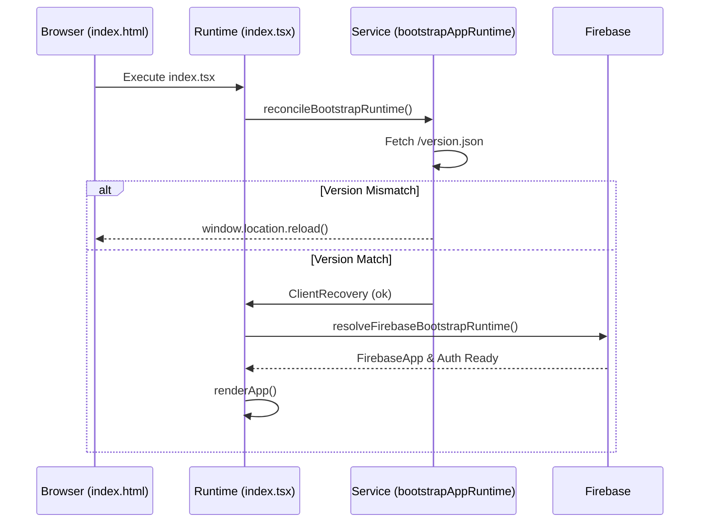
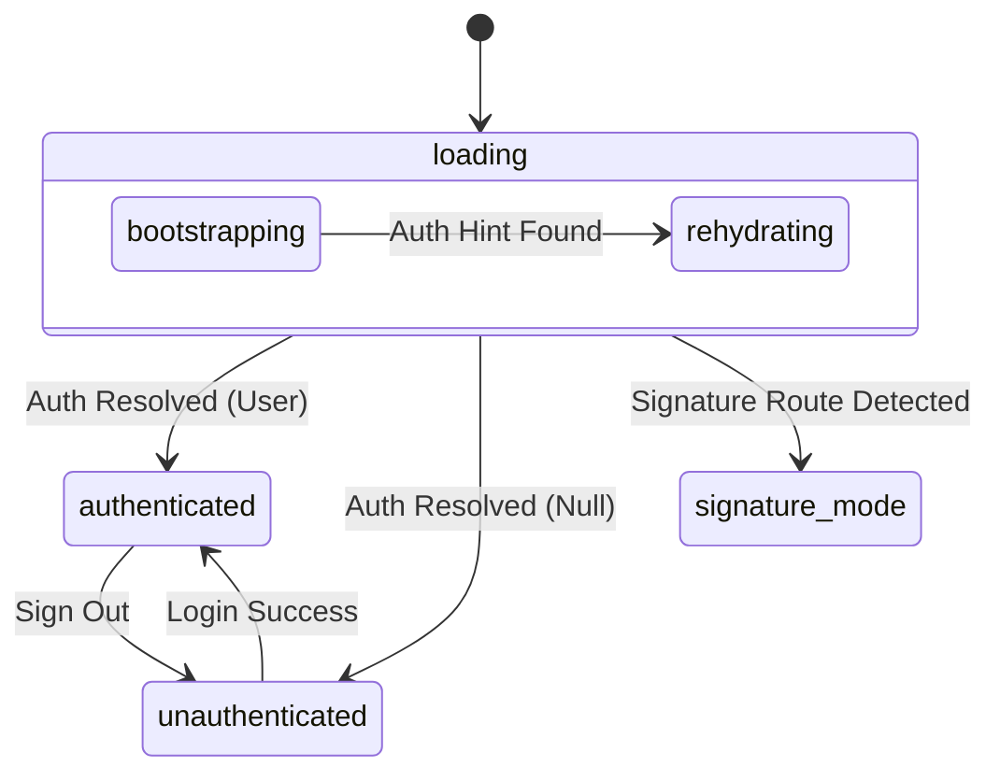

# Bootstrap Lifecycle & Loading Policy

# Bootstrap Lifecycle & Loading Policy

Relevant source files

The following files were used as context for generating this wiki page:

- [docs/BOOTSTRAP_AND_REFRESH_PERFORMANCE.md](docs/BOOTSTRAP_AND_REFRESH_PERFORMANCE.md)
- [docs/SAFE_CHANGE_CHECKLIST.md](docs/SAFE_CHANGE_CHECKLIST.md)
- [docs/system-behaviors.md](docs/system-behaviors.md)
- [e2e/critical-emulator.spec.ts](e2e/critical-emulator.spec.ts)
- [index.html](index.html)
- [scripts/check-bundle-budget.mjs](scripts/check-bundle-budget.mjs)
- [scripts/config/bundle-budget.json](scripts/config/bundle-budget.json)
- [scripts/operationalHealthSupport.mjs](scripts/operationalHealthSupport.mjs)
- [scripts/run-e2e-critical-emulator-ci.sh](scripts/run-e2e-critical-emulator-ci.sh)
- [src/App.tsx](src/App.tsx)
- [src/app-shell/bootstrap/BootstrapCensusChrome.tsx](src/app-shell/bootstrap/BootstrapCensusChrome.tsx)
- [src/app-shell/bootstrap/appShellLoadingPolicy.ts](src/app-shell/bootstrap/appShellLoadingPolicy.ts)
- [src/app-shell/bootstrap/bootstrapAppRuntime.ts](src/app-shell/bootstrap/bootstrapAppRuntime.ts)
- [src/app-shell/bootstrap/bootstrapAppRuntime.types.ts](src/app-shell/bootstrap/bootstrapAppRuntime.types.ts)
- [src/app-shell/bootstrap/useAppBootstrapState.ts](src/app-shell/bootstrap/useAppBootstrapState.ts)
- [src/app-shell/runtime/AuthenticatedAppShell.tsx](src/app-shell/runtime/AuthenticatedAppShell.tsx)
- [src/app-shell/runtime/useAuthenticatedAppRuntime.ts](src/app-shell/runtime/useAuthenticatedAppRuntime.ts)
- [src/components/ui/InitialLoadingScreen.tsx](src/components/ui/InitialLoadingScreen.tsx)
- [src/firebaseConfig.ts](src/firebaseConfig.ts)
- [src/hooks/stabilityRulesController.ts](src/hooks/stabilityRulesController.ts)
- [src/hooks/useAppState.ts](src/hooks/useAppState.ts)
- [src/hooks/useDateNavigation.ts](src/hooks/useDateNavigation.ts)
- [src/hooks/useStalenessGuard.ts](src/hooks/useStalenessGuard.ts)
- [src/index.tsx](src/index.tsx)
- [src/services/auth/firebaseStartupUiPolicy.ts](src/services/auth/firebaseStartupUiPolicy.ts)
- [src/services/firebase-runtime/firebaseServiceBootstrap.ts](src/services/firebase-runtime/firebaseServiceBootstrap.ts)
- [src/services/storage/storageFallbackUiPolicy.ts](src/services/storage/storageFallbackUiPolicy.ts)
- [src/shared/ui/loginBackgroundModeController.ts](src/shared/ui/loginBackgroundModeController.ts)
- [src/tests/README.md](src/tests/README.md)
- [src/tests/app-shell/BootstrapRouteChrome.test.tsx](src/tests/app-shell/BootstrapRouteChrome.test.tsx)
- [src/tests/app-shell/appShellLoadingPolicy.test.ts](src/tests/app-shell/appShellLoadingPolicy.test.ts)
- [src/tests/app-shell/bootstrapAppRuntime.test.ts](src/tests/app-shell/bootstrapAppRuntime.test.ts)
- [src/tests/app-shell/useAppBootstrapState.test.tsx](src/tests/app-shell/useAppBootstrapState.test.tsx)
- [src/tests/app-shell/useAuthenticatedAppRuntime.test.tsx](src/tests/app-shell/useAuthenticatedAppRuntime.test.tsx)
- [src/tests/build/operationalHealthSupport.test.ts](src/tests/build/operationalHealthSupport.test.ts)
- [src/tests/components/AppLoadingBehavior.test.tsx](src/tests/components/AppLoadingBehavior.test.tsx)
- [src/tests/components/InitialLoadingScreen.test.tsx](src/tests/components/InitialLoadingScreen.test.tsx)
- [src/tests/components/index.bootstrap.test.tsx](src/tests/components/index.bootstrap.test.tsx)
- [src/tests/features/census/censusPublicPreload.test.ts](src/tests/features/census/censusPublicPreload.test.ts)
- [src/tests/hooks/stabilityRulesController.test.ts](src/tests/hooks/stabilityRulesController.test.ts)
- [src/tests/hooks/useAppState.test.ts](src/tests/hooks/useAppState.test.ts)
- [src/tests/hooks/useDateNavigation.test.ts](src/tests/hooks/useDateNavigation.test.ts)
- [src/tests/security/startupPrebootContractStatic.test.ts](src/tests/security/startupPrebootContractStatic.test.ts)
- [src/tests/services/auth/firebaseStartupUiPolicy.test.ts](src/tests/services/auth/firebaseStartupUiPolicy.test.ts)
- [src/tests/services/storage/storageFallbackUiPolicy.test.ts](src/tests/services/storage/storageFallbackUiPolicy.test.ts)
- [src/tests/shared/ui/loginBackgroundModeController.test.ts](src/tests/shared/ui/loginBackgroundModeController.test.ts)
- [src/tests/views/handoff/HandoffView.medical.test.tsx](src/tests/views/handoff/HandoffView.medical.test.tsx)
- [src/tests/views/handoff/HandoffView.test.tsx](src/tests/views/handoff/HandoffView.test.tsx)

The HHR system employs a multi-stage bootstrap sequence designed for **offline-first resilience**, **FOUC (Flash of Unstyled Content) prevention**, and **seamless version reconciliation**. The lifecycle transitions the application from a raw HTML surface to a fully rehydrated, authenticated state while maintaining clinical context (date and module) across refreshes.

## 1. The Startup Surface (Pre-JS)

Before the React application or the main JavaScript bundle is executed, the system initializes a "Startup Surface" via `index.html`. This ensures the user sees a themed background immediately rather than a white screen.

- **File Role**: `index.html` loads `startup-surface.js` synchronously to set the initial theme and layout hints [index.html:1-8]().
- **Styling**: The initial background color is set to `#eef4f8` to match the clinical module chrome [index.html:2]().
- **Surface Selection**: `startup-surface.js` determines if the user should see the `login` surface or the `app` surface based on URL and local storage hints [index.html:12-16]().

## 2. Phase 1: Runtime Reconciliation

The entry point `index.tsx` initiates `reconcileBootstrapRuntime` before mounting the main `App` component. This phase handles version checks and legacy Service Worker cleanup.

### Implementation Flow

1.  **Telemetry Setup**: Listeners are installed to catch early runtime errors [index.tsx:37-38]().
2.  **Version Check**: The system fetches `version.json` from the server. If a mismatch is detected, it clears legacy caches and triggers a hard reload [docs/system-behaviors.md:15-22]().
3.  **Firebase Settlement**: `resolveFirebaseBootstrapRuntime` initializes the Firebase SDK and attempts to rehydrate the auth state [index.tsx:136]().

**Sequence: Runtime Initialization**

Sources: [index.tsx:121-148](), [docs/system-behaviors.md:7-33](), [src/app-shell/bootstrap/bootstrapAppRuntime.ts:1-20]()

## 3. Phase 2: Loading Policy & Loading Screens

The `appShellLoadingPolicy.ts` governs what the user sees while Firebase and the App Shell chunks are loading. It uses "Auth Hints" (local storage markers) to predict if a user is already logged in, preventing a "flicker" to the login page during a refresh.

### Loading Screen Modes

| Mode                     | Condition                                          | Visual Result                               |
| :----------------------- | :------------------------------------------------- | :------------------------------------------ |
| `silent`                 | Root route (`/`) with no auth hints                | Blank themed background                     |
| `login-shell`            | `/login` or root route with no hints               | Branded login background with clinical icon |
| `bootstrap-route-chrome` | Authenticated route (e.g., `/census`) + Auth Hints | Top navbar and module chrome (no data)      |

Sources: [src/app-shell/bootstrap/appShellLoadingPolicy.ts:10-14](), [src/components/ui/InitialLoadingScreen.tsx:15-29]()

### Pre-Mount Decision Logic

The function `resolvePreMountLoadingScreenDecision` checks for `hhr_logged_this_session` or Firebase Auth hints in storage [src/app-shell/bootstrap/appShellLoadingPolicy.ts:22-47](). If hints exist and the user is on a module route, it renders `BootstrapRouteChrome` immediately to provide visual continuity [index.tsx:78-85]().

## 4. Phase 3: Bootstrap State Machine

The `useAppBootstrapState` hook coordinates the transition between four primary states. It integrates authentication, date navigation, and version stability.

### State Transitions

- **`loading`**: Auth is rehydrating or Firebase is connecting.
- **`unauthenticated`**: Auth resolved to null; redirects to `LoginPage`.
- **`authenticated`**: Auth resolved; renders `AuthenticatedAppShell`.
- **`signature_mode`**: Special restricted state for medical signatures.

**State Machine: App Bootstrap**

Sources: [src/app-shell/bootstrap/useAppBootstrapState.ts:27-48](), [src/App.tsx:86-177]()

## 5. Performance & Preloading

To minimize perceived latency, the system performs "speculative preloading" of authenticated chunks while the runtime is still settling.

- **Speculative Preload**: If `renderBootstrapRouteChrome` is active, `index.tsx` triggers `preloadAuthenticatedShellChunk()` and `preloadAuthenticatedRouteChunk()` in parallel with Firebase initialization [index.tsx:73-76]().
- **Budget Enforcement**: Bundle sizes are strictly controlled via `bundle-budget.json` to ensure the entry-app remains under 120KB and the authenticated shell under 560KB [scripts/config/bundle-budget.json:4-24]().

## 6. FOUC & Staleness Prevention

The lifecycle includes several guards to ensure data integrity and visual stability:

1.  **Staleness Guard**: `useStalenessGuard` monitors the time since the last successful sync. If the app is kept open too long without updates, it forces a refresh [src/app-shell/bootstrap/useAppBootstrapState.ts:203]().
2.  **Storage Migration**: IndexedDB schema migrations are triggered only after auth is confirmed but before the UI fully renders data [src/app-shell/bootstrap/useAppBootstrapState.ts:201]().
3.  **Bootstrap Route Chrome**: Renders a skeleton of the `Census` or `Handoff` header using `BootstrapRouteChrome.tsx` so that the navbar doesn't "pop" in after the page loads [src/app-shell/bootstrap/BootstrapCensusChrome.tsx:1-15]().

Sources: [src/app-shell/bootstrap/useAppBootstrapState.ts:197-224](), [docs/system-behaviors.md:143-158]()

---
