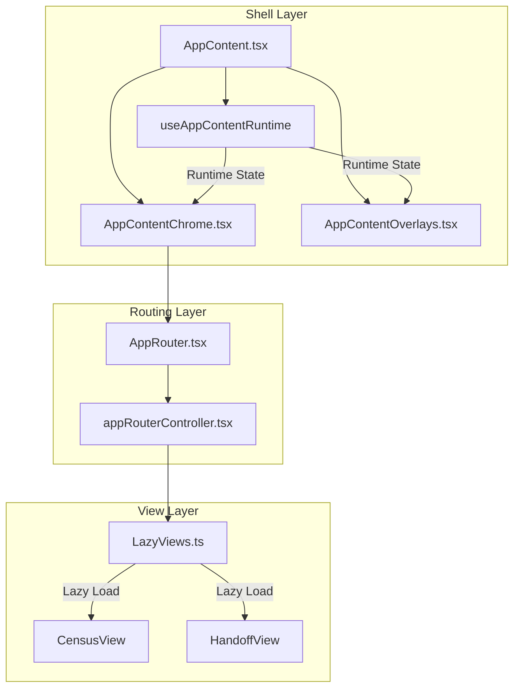
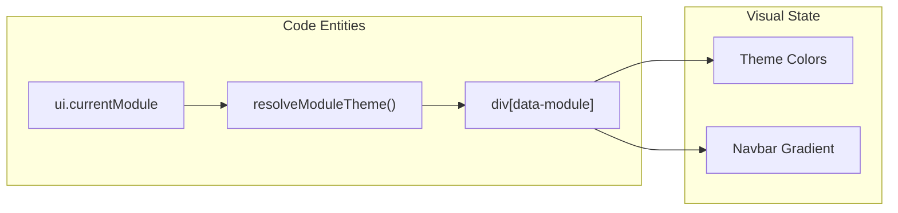

# App Shell, Routing & Layout

# App Shell, Routing & Layout

Relevant source files

The following files were used as context for generating this wiki page:

- [docs/superpowers/specs/2026-04-20-domain-boundaries-foundation.md](docs/superpowers/specs/2026-04-20-domain-boundaries-foundation.md)
- [scripts/check-census-feature-boundary.mjs](scripts/check-census-feature-boundary.mjs)
- [scripts/check-lazy-views-feature-entrypoints.mjs](scripts/check-lazy-views-feature-entrypoints.mjs)
- [scripts/check-repo-hygiene.mjs](scripts/check-repo-hygiene.mjs)
- [src/application/cudyr/public.ts](src/application/cudyr/public.ts)
- [src/components/AppRouter.tsx](src/components/AppRouter.tsx)
- [src/components/app-router/appRouterController.tsx](src/components/app-router/appRouterController.tsx)
- [src/components/device-selector/DeviceMenu.tsx](src/components/device-selector/DeviceMenu.tsx)
- [src/components/layout/AppContent.tsx](src/components/layout/AppContent.tsx)
- [src/components/layout/DateStrip.tsx](src/components/layout/DateStrip.tsx)
- [src/components/layout/Navbar.tsx](src/components/layout/Navbar.tsx)
- [src/components/layout/NavbarTabs.tsx](src/components/layout/NavbarTabs.tsx)
- [src/components/layout/SummaryCard.tsx](src/components/layout/SummaryCard.tsx)
- [src/components/layout/app-content/AppContentChrome.tsx](src/components/layout/app-content/AppContentChrome.tsx)
- [src/components/layout/app-content/AppContentOverlays.tsx](src/components/layout/app-content/AppContentOverlays.tsx)
- [src/components/layout/app-content/appContentCensusDateController.ts](src/components/layout/app-content/appContentCensusDateController.ts)
- [src/components/layout/app-content/appContentChromeController.ts](src/components/layout/app-content/appContentChromeController.ts)
- [src/components/layout/app-content/appContentOverlaysController.ts](src/components/layout/app-content/appContentOverlaysController.ts)
- [src/components/layout/app-content/moduleThemeController.ts](src/components/layout/app-content/moduleThemeController.ts)
- [src/components/layout/app-content/usePatientSearchShortcut.ts](src/components/layout/app-content/usePatientSearchShortcut.ts)
- [src/components/layout/date-strip/DateStripDayButtons.tsx](src/components/layout/date-strip/DateStripDayButtons.tsx)
- [src/components/layout/date-strip/DateStripMonthNavigator.tsx](src/components/layout/date-strip/DateStripMonthNavigator.tsx)
- [src/components/layout/date-strip/DateStripQuickActions.tsx](src/components/layout/date-strip/DateStripQuickActions.tsx)
- [src/components/layout/date-strip/DateStripYearNavigator.tsx](src/components/layout/date-strip/DateStripYearNavigator.tsx)
- [src/components/layout/date-strip/actions/EmailDropdown.tsx](src/components/layout/date-strip/actions/EmailDropdown.tsx)
- [src/components/layout/date-strip/actions/HandoffSaveDropdown.tsx](src/components/layout/date-strip/actions/HandoffSaveDropdown.tsx)
- [src/components/layout/date-strip/actions/PdfButtons.tsx](src/components/layout/date-strip/actions/PdfButtons.tsx)
- [src/components/layout/date-strip/actions/SaveDropdown.tsx](src/components/layout/date-strip/actions/SaveDropdown.tsx)
- [src/components/layout/date-strip/actions/dateStripActionStateController.ts](src/components/layout/date-strip/actions/dateStripActionStateController.ts)
- [src/components/ui/base/MedicalButton.tsx](src/components/ui/base/MedicalButton.tsx)
- [src/features/census/census-view.ts](src/features/census/census-view.ts)
- [src/features/census/public.ts](src/features/census/public.ts)
- [src/features/cudyr/index.ts](src/features/cudyr/index.ts)
- [src/features/cudyr/public.ts](src/features/cudyr/public.ts)
- [src/features/prescriptions/internal.ts](src/features/prescriptions/internal.ts)
- [src/hooks/useGlobalPatientSearch.ts](src/hooks/useGlobalPatientSearch.ts)
- [src/hooks/usePatientMovementMutationByIdExecutor.ts](src/hooks/usePatientMovementMutationByIdExecutor.ts)
- [src/tests/components/AppContent.entrypoint.test.tsx](src/tests/components/AppContent.entrypoint.test.tsx)
- [src/tests/components/AppContent.test.tsx](src/tests/components/AppContent.test.tsx)
- [src/tests/components/AppContentChrome.test.tsx](src/tests/components/AppContentChrome.test.tsx)
- [src/tests/components/AppContentOverlays.test.tsx](src/tests/components/AppContentOverlays.test.tsx)
- [src/tests/components/AppRouter.test.tsx](src/tests/components/AppRouter.test.tsx)
- [src/tests/components/DateStrip.test.tsx](src/tests/components/DateStrip.test.tsx)
- [src/tests/components/HandoffSaveDropdown.test.tsx](src/tests/components/HandoffSaveDropdown.test.tsx)
- [src/tests/components/NavbarTabs.test.tsx](src/tests/components/NavbarTabs.test.tsx)
- [src/tests/components/appContentCensusDateController.test.ts](src/tests/components/appContentCensusDateController.test.ts)
- [src/tests/components/appContentChromeController.test.ts](src/tests/components/appContentChromeController.test.ts)
- [src/tests/components/appContentOverlaysController.test.ts](src/tests/components/appContentOverlaysController.test.ts)
- [src/tests/components/dateStripActionStateController.test.ts](src/tests/components/dateStripActionStateController.test.ts)
- [src/tests/components/layout/date-strip/DateStripQuickActions.test.tsx](src/tests/components/layout/date-strip/DateStripQuickActions.test.tsx)
- [src/tests/features/prescriptions/PrescriptionDetailModal.test.tsx](src/tests/features/prescriptions/PrescriptionDetailModal.test.tsx)
- [src/tests/integration/authSyncDeployLifecycle.test.tsx](src/tests/integration/authSyncDeployLifecycle.test.tsx)
- [src/tests/views/census/PatientRow.test.tsx](src/tests/views/census/PatientRow.test.tsx)
- [src/views/LazyViews.ts](src/views/LazyViews.ts)
- [storage.rules](storage.rules)

The App Shell represents the primary user interface structure of the HHR system. It manages the global navigation, date-based state synchronization, and the dynamic mounting of clinical modules. The shell is designed to be "module-aware," adapting its visual theme and available actions based on the active clinical context.

## App Shell Architecture

The shell is composed of a hierarchy of controllers and layout components that wrap the main application content. It ensures that critical services like the `ReminderCenterProvider` and `AppProviders` are available to all modules [src/components/layout/AppContent.tsx:49-65]().

### Component Hierarchy

1.  **`AppContent`**: The root layout wrapper. It initializes the `useAppContentRuntime` and manages global shell effects like module transitions and signature mode detection [src/components/layout/AppContent.tsx:18-46]().
2.  **`AppContentChrome`**: Orchestrates the visible persistent UI elements including the `Navbar`, `DateStrip`, and `BookmarkBar` [src/components/layout/app-content/AppContentChrome.tsx:52-77]().
3.  **`AppRouter`**: The functional core that resolves which clinical view to render based on the `currentModule` state [src/components/AppRouter.tsx:35-57]().
4.  **`AppContentOverlays`**: Manages global modals and floating UI elements like the `SyncWatcher`, `PinLockScreen`, and `GlobalPatientSearchModal` [src/components/layout/app-content/AppContentOverlays.tsx:31-75]().

### Data Flow: Shell Initialization

The following diagram illustrates how the shell components interact to resolve the UI state.

**Shell Component Interaction**

Sources: [src/components/layout/AppContent.tsx:18-62](), [src/components/layout/app-content/AppContentChrome.tsx:31-77](), [src/components/AppRouter.tsx:35-58]()

## AppRouter & Module Mounting

The `AppRouter` does not use standard path-based routing (e.g., React Router). Instead, it uses a state-driven approach where the `currentModule` (of type `ModuleType`) determines the rendered component [src/components/AppRouter.tsx:46-57]().

### View Registry (`LazyViews.ts`)

To optimize bundle size, all major clinical views are registered in `LazyViews.ts` using `lazyWithRetry`. This ensures that code for the Handoff module is not loaded until the user navigates away from the Census [src/views/LazyViews.ts:9-39]().

### Routing Logic

The `AppRouter` uses `resolveCoreModuleRoute` and `resolveSimpleModuleRoute` to match the state to a view [src/components/AppRouter.tsx:56-57]().

- **Core Modules**: Modules like `CENSUS` or `NURSING_HANDOFF` that require complex props (date strings, access profiles) [src/components/AppRouter.tsx:79-94]().
- **Simple Modules**: Admin or configuration views that render without complex domain props [src/components/AppRouter.tsx:95-105]().

Sources: [src/components/AppRouter.tsx:13-22](), [src/views/LazyViews.ts:1-158]()

## Navigation Components

### Navbar

The `Navbar` provides the top-level module switcher. It is "module-aware," changing its background gradient based on the active module to provide immediate visual feedback to the user [src/components/layout/Navbar.tsx:71-102]().

| Module            | Visual Theme (Gradient)           |
| :---------------- | :-------------------------------- |
| `CENSUS`          | Sky Blue (`#0c4a6e` to `#0369a1`) |
| `MEDICAL_HANDOFF` | Teal (`teal-800` to `teal-700`)   |
| `ERRORS`          | Rose (`rose-900` to `rose-800`)   |

Sources: [src/components/layout/Navbar.tsx:71-102]()

### DateStrip & Quick Actions

The `DateStrip` is the secondary navigation tier. It handles date selection and provides "Quick Actions" that are contextually relevant to the patients currently visible in the census [src/components/layout/DateStrip.tsx:81-114]().

- **Quick Actions (`DateStripQuickActions`)**: Includes buttons for Radiology (MMRAD) and Laboratory results [src/components/layout/date-strip/DateStripQuickActions.tsx:75-122]().
- **Lazy Loading**: Clinical quick actions are delayed by 1200ms (`FEATURE_QUICK_ACTIONS_STARTUP_DELAY_MS`) to prioritize the rendering of the main census table [src/components/layout/date-strip/DateStripQuickActions.tsx:5-37]().

Sources: [src/components/layout/DateStrip.tsx:142-201](), [src/components/layout/date-strip/DateStripQuickActions.tsx:20-42]()

## CSS Accent & Theme System

The application uses a module-aware CSS system driven by the `data-module` attribute on the root shell element [src/components/layout/AppContent.tsx:51-53]().

The `resolveModuleTheme` function maps the `currentModule` to a specific string used by Tailwind CSS or global styles to apply accents [src/components/layout/AppContent.tsx:10]().

**Module Theme Mapping**

Sources: [src/components/layout/AppContent.tsx:51-53](), [src/components/layout/Navbar.tsx:71-102]()

## Overlay Management

The `AppContentOverlays` component handles UI elements that exist outside the standard flow.

- **`SyncWatcher`**: Monitors background synchronization with Firestore [src/components/layout/app-content/AppContentOverlays.tsx:70]().
- **`PinLockScreen`**: Enforces security when the session is idle or requires re-authentication [src/components/layout/app-content/AppContentOverlays.tsx:71]().
- **`GlobalPatientSearchModal`**: Triggered via `Ctrl+K` or the search icon, allowing users to find patients across the entire historical record [src/components/layout/app-content/AppContentOverlays.tsx:64-68]().

Sources: [src/components/layout/app-content/AppContentOverlays.tsx:31-75](), [src/components/layout/app-content/usePatientSearchShortcut.ts:36]()

---
