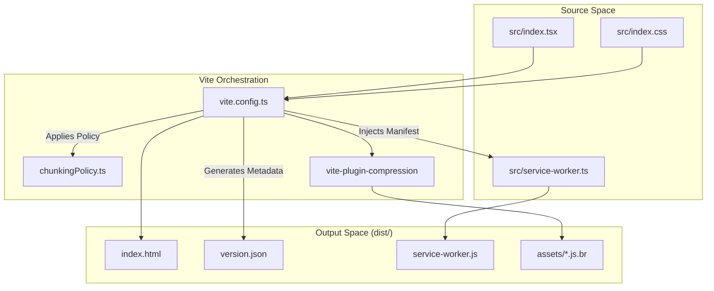

# Build Pipeline & Deployment

# Build Pipeline & Deployment

Relevant source files

The following files were used as context for generating this wiki page:

- [.github/workflows/preview.yml](.github/workflows/preview.yml)
- [.github/workflows/security-audit.yml](.github/workflows/security-audit.yml)
- [.nvmrc](.nvmrc)
- [docs/BOOTSTRAP_AND_REFRESH_PERFORMANCE.md](docs/BOOTSTRAP_AND_REFRESH_PERFORMANCE.md)
- [docs/architecture/build-chunking.md](docs/architecture/build-chunking.md)
- [e2e/auth-multi-tab-lock.spec.ts](e2e/auth-multi-tab-lock.spec.ts)
- [e2e/critical-emulator.spec.ts](e2e/critical-emulator.spec.ts)
- [functions/package-lock.json](functions/package-lock.json)
- [functions/package.json](functions/package.json)
- [netlify.toml](netlify.toml)
- [package-lock.json](package-lock.json)
- [playwright.preview.config.ts](playwright.preview.config.ts)
- [scripts/check-bundle-budget.mjs](scripts/check-bundle-budget.mjs)
- [scripts/check-chunk-graph.mjs](scripts/check-chunk-graph.mjs)
- [scripts/check-dependency-vulnerabilities.mjs](scripts/check-dependency-vulnerabilities.mjs)
- [scripts/config/bundle-budget.json](scripts/config/bundle-budget.json)
- [scripts/config/chunkingPolicy.ts](scripts/config/chunkingPolicy.ts)
- [scripts/operationalHealthSupport.mjs](scripts/operationalHealthSupport.mjs)
- [scripts/run-e2e-critical-emulator-ci.sh](scripts/run-e2e-critical-emulator-ci.sh)
- [src/app-shell/bootstrap/bootstrapAppRuntime.ts](src/app-shell/bootstrap/bootstrapAppRuntime.ts)
- [src/app-shell/bootstrap/bootstrapAppRuntime.types.ts](src/app-shell/bootstrap/bootstrapAppRuntime.types.ts)
- [src/app-shell/bootstrap/useAppBootstrapState.ts](src/app-shell/bootstrap/useAppBootstrapState.ts)
- [src/app-shell/runtime/AuthenticatedAppShell.tsx](src/app-shell/runtime/AuthenticatedAppShell.tsx)
- [src/app-shell/runtime/useAuthenticatedAppRuntime.ts](src/app-shell/runtime/useAuthenticatedAppRuntime.ts)
- [src/features/clinical-documents/services/clinicalDocumentAiFileTextService.ts](src/features/clinical-documents/services/clinicalDocumentAiFileTextService.ts)
- [src/firebaseConfig.ts](src/firebaseConfig.ts)
- [src/hooks/useStalenessGuard.ts](src/hooks/useStalenessGuard.ts)
- [src/index.css](src/index.css)
- [src/service-worker.ts](src/service-worker.ts)
- [src/services/auth/authFlow.ts](src/services/auth/authFlow.ts)
- [src/services/auth/authShared.ts](src/services/auth/authShared.ts)
- [src/services/auth/firebaseStartupUiPolicy.ts](src/services/auth/firebaseStartupUiPolicy.ts)
- [src/services/firebase-runtime/firebaseServiceBootstrap.ts](src/services/firebase-runtime/firebaseServiceBootstrap.ts)
- [src/services/storage/storageFallbackUiPolicy.ts](src/services/storage/storageFallbackUiPolicy.ts)
- [src/shared/ui/loginBackgroundModeController.ts](src/shared/ui/loginBackgroundModeController.ts)
- [src/tests/app-shell/bootstrapAppRuntime.test.ts](src/tests/app-shell/bootstrapAppRuntime.test.ts)
- [src/tests/app-shell/useAppBootstrapState.test.tsx](src/tests/app-shell/useAppBootstrapState.test.tsx)
- [src/tests/app-shell/useAuthenticatedAppRuntime.test.tsx](src/tests/app-shell/useAuthenticatedAppRuntime.test.tsx)
- [src/tests/build/chunkingPolicy.test.ts](src/tests/build/chunkingPolicy.test.ts)
- [src/tests/build/operationalHealthSupport.test.ts](src/tests/build/operationalHealthSupport.test.ts)
- [src/tests/features/census/censusPublicPreload.test.ts](src/tests/features/census/censusPublicPreload.test.ts)
- [src/tests/features/clinical-documents/clinicalDocumentAiFileTextService.test.ts](src/tests/features/clinical-documents/clinicalDocumentAiFileTextService.test.ts)
- [src/tests/security/netlifyHeadersStatic.test.ts](src/tests/security/netlifyHeadersStatic.test.ts)
- [src/tests/services/auth/firebaseStartupUiPolicy.test.ts](src/tests/services/auth/firebaseStartupUiPolicy.test.ts)
- [src/tests/services/storage/storageFallbackUiPolicy.test.ts](src/tests/services/storage/storageFallbackUiPolicy.test.ts)
- [src/tests/shared/ui/loginBackgroundModeController.test.ts](src/tests/shared/ui/loginBackgroundModeController.test.ts)
- [vite.config.ts](vite.config.ts)

This section details the HHR (Hospital Hanga Roa) build infrastructure, including the Vite-based compilation pipeline, PWA service worker strategies, and the Netlify deployment configuration. The system is designed for high reliability in clinical environments with strict Content Security Policy (CSP) enforcement and automated bundle budget monitoring.

## Vite Build Configuration

The application uses Vite for fast development and optimized production builds. The configuration integrates several critical plugins to manage clinical data exports and PWA capabilities.

### Key Configuration Entities

- **Version Plugin**: Injects a `version.json` into the build output containing `Date.now()` as the version and an ISO build date [vite.config.ts:16-30](). This is used by the client-side `useVersionCheck` hook to detect new deployments [src/app-shell/bootstrap/useAppBootstrapState.ts:202]().
- **ExcelJS Runtime Asset**: Emits `exceljs.min.js` as a vendor asset to ensure the heavy Excel library is available for the Excel export workers [vite.config.ts:32-63]().
- **Compression**: Generates both Gzip and Brotli (.br) assets for production to minimize clinical data transmission times [vite.config.ts:141-157]().
- **Terser Minification**: Specifically configured to drop `console.log` and `console.debug` in production while preserving Safari 10 compatibility [vite.config.ts:181-191]().

### Build Data Flow

The following diagram illustrates how the Vite configuration orchestrates the transformation from source to deployment assets.

**Build Transformation Pipeline**

Sources: [vite.config.ts:1-196](), [scripts/config/chunkingPolicy.ts:1-126](), [src/service-worker.ts:1-68]()

## Manual Chunking Policy

To prevent circular dependencies and optimize the "Golden Path" (initial clinical census view), the system implements a strict manual chunking policy in `chunkingPolicy.ts`.

### Strategic Chunk Divisions

- **`vendor-react`**: Groups React, React-DOM, and TanStack Query to avoid race conditions where `createContext` might be called before the library is fully loaded [scripts/config/chunkingPolicy.ts:38-47]().
- **`app-authenticated-shell`**: Aggregates the core application layout and context providers (Census, Reminders) into a single chunk to ensure the authenticated UI paints atomically [scripts/config/chunkingPolicy.ts:6-16]().
- **`vendor-firebase-core`**: Combines Firebase App and Auth. These are kept together because splitting them previously caused vendor-to-vendor circular cycles that crashed production on Netlify [scripts/config/chunkingPolicy.ts:57-75]().
- **Heavy Feature Isolation**: Libraries like `exceljs`, `jspdf`, and `pdf-lib` are isolated into specific vendor chunks (e.g., `vendor-pdf-core`, `vendor-excel-zip`) to keep them out of the critical bootstrap path [scripts/config/chunkingPolicy.ts:81-123]().

### Bundle Budgets

The CI/CD pipeline enforces strict size limits defined in `bundle-budget.json` to prevent performance regression.

| Chunk Label               | Pattern                            | Max Bytes | Severity |
| :------------------------ | :--------------------------------- | :-------- | :------- |
| `entry-app`               | `entry`                            | 120,000   | Error    |
| `firebase-core`           | `^vendor-firebase-core-.*\.js$`    | 350,000   | Error    |
| `app-authenticated-shell` | `^app-authenticated-shell-.*\.js$` | 560,000   | Error    |

Sources: [scripts/config/chunkingPolicy.ts:1-126](), [scripts/config/bundle-budget.json:1-49](), [src/tests/build/chunkingPolicy.test.ts:56-66]()

## PWA & Service Worker Strategy

The application utilizes a "Network First" strategy for navigation and clinical data, ensuring users see the most recent hospital state while having offline fallbacks.

### Workbox Implementation

- **Injection Point**: Uses `injectManifest` with `self.__WB_MANIFEST` to allow VitePWA to manage the asset manifest [src/service-worker.ts:62-67]().
- **Navigation Fallback**: If a network request for a page fails (offline), the worker catches the error and serves `/offline.html` [src/service-worker.ts:150-157]().
- **Aggressive Activation**: The `install` event calls `self.skipWaiting()` to replace stale workers immediately, ensuring users don't run mixed-version chunk graphs after a deploy [src/service-worker.ts:163-171]().

### Caching Routes

| Content Type  | Strategy       | Cache Name        |
| :------------ | :------------- | :---------------- |
| Google Fonts  | `CacheFirst`   | `fonts-v2.4.0`    |
| Local Images  | `CacheFirst`   | `images-v2.4.0`   |
| Firebase Data | `NetworkFirst` | `firebase-v2.4.0` |
| Navigations   | `NetworkFirst` | `pages-v2.4.0`    |

Sources: [src/service-worker.ts:91-147](), [vite.config.ts:105-139]()

## Deployment & Security (Netlify)

The `netlify.toml` file configures the build environment (Node 22) and enforces clinical-grade security headers.

### Content Security Policy (CSP)

The CSP is strictly defined to allow Firebase and Google Auth while blocking `unsafe-inline` scripts in the SPA shell.

- **`script-src`**: Restricted to `'self'` and Google APIs [netlify.toml:26]().
- **`style-src`**: Allows `'unsafe-inline'` to support Vite and UI library style injections [netlify.toml:26]().
- **`connect-src`**: Explicitly whitelists Firebase Realtime Database (`wss://*.firebaseio.com`), Firestore, and Netlify Functions [netlify.toml:26]().

### Cache Control Policy

- **Immutable Assets**: Files in `/assets/*` (hashed by Vite) are cached for 1 year [netlify.toml:53-56]().
- **No-Cache Entrypoints**: `index.html`, `version.json`, and service worker scripts (`sw.js`, `service-worker.js`, `registerSW.js`) are set to `no-cache, no-store, must-revalidate` to prevent version mismatch errors [netlify.toml:42-75]().

### Redirects

A global redirect maps all non-file requests to `/index.html` with a 200 status, enabling client-side routing for the React application [netlify.toml:13-16]().

Sources: [netlify.toml:1-82](), [src/tests/security/netlifyHeadersStatic.test.ts:1-70]()

---
