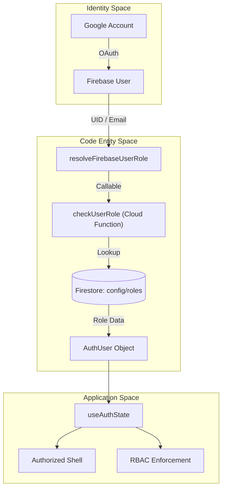
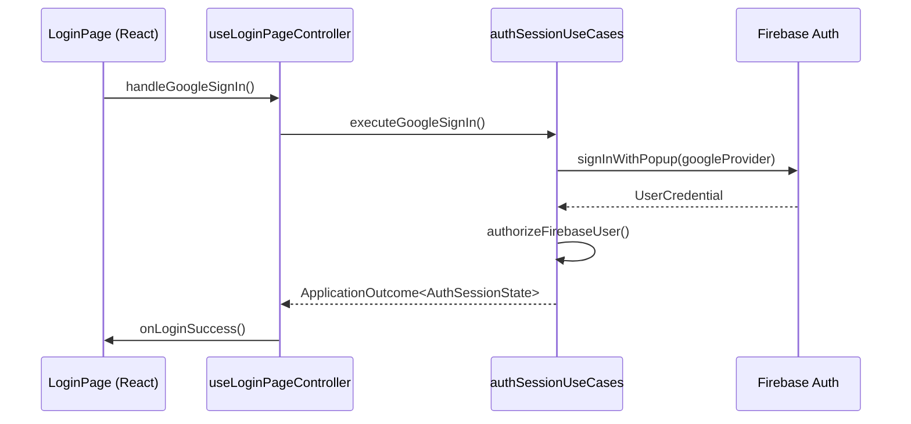

# Authentication & Authorization

# Authentication & Authorization

Relevant source files

The following files were used as context for generating this wiki page:

- [src/application/auth/authSessionUseCases.ts](src/application/auth/authSessionUseCases.ts)
- [src/components/layout/StorageStatusBadge.tsx](src/components/layout/StorageStatusBadge.tsx)
- [src/components/ui/DatabaseStatusBanner.tsx](src/components/ui/DatabaseStatusBanner.tsx)
- [src/features/auth/components/LoginPage.tsx](src/features/auth/components/LoginPage.tsx)
- [src/features/auth/components/LoginPageCard.tsx](src/features/auth/components/LoginPageCard.tsx)
- [src/features/auth/components/loginRuntimePolicy.ts](src/features/auth/components/loginRuntimePolicy.ts)
- [src/features/auth/components/useLoginPageController.ts](src/features/auth/components/useLoginPageController.ts)
- [src/hooks/controllers/authBootstrapController.ts](src/hooks/controllers/authBootstrapController.ts)
- [src/hooks/controllers/authResolvedStateSubscription.ts](src/hooks/controllers/authResolvedStateSubscription.ts)
- [src/hooks/useAuthState.ts](src/hooks/useAuthState.ts)
- [src/hooks/useAuthStateSupport.ts](src/hooks/useAuthStateSupport.ts)
- [src/services/auth/authAccessResolution.ts](src/services/auth/authAccessResolution.ts)
- [src/services/auth/authClaimSyncService.ts](src/services/auth/authClaimSyncService.ts)
- [src/services/auth/authErrorPolicy.ts](src/services/auth/authErrorPolicy.ts)
- [src/services/auth/authFallback.ts](src/services/auth/authFallback.ts)
- [src/services/auth/authGoogleFlow.ts](src/services/auth/authGoogleFlow.ts)
- [src/services/auth/authPolicy.ts](src/services/auth/authPolicy.ts)
- [src/services/auth/authRedirectRuntime.ts](src/services/auth/authRedirectRuntime.ts)
- [src/services/auth/authRoleLookup.ts](src/services/auth/authRoleLookup.ts)
- [src/services/auth/authSession.ts](src/services/auth/authSession.ts)
- [src/services/auth/authStorageHints.ts](src/services/auth/authStorageHints.ts)
- [src/services/auth/authUiCopy.ts](src/services/auth/authUiCopy.ts)
- [src/services/storage/indexeddb/indexedDbMaintenanceService.ts](src/services/storage/indexeddb/indexedDbMaintenanceService.ts)
- [src/services/storage/indexeddb/indexedDbRecoveryPolicy.ts](src/services/storage/indexeddb/indexedDbRecoveryPolicy.ts)
- [src/tests/application/auth/authSessionUseCases.test.ts](src/tests/application/auth/authSessionUseCases.test.ts)
- [src/tests/components/DatabaseStatusBanner.test.tsx](src/tests/components/DatabaseStatusBanner.test.tsx)
- [src/tests/components/StorageStatusBadge.test.tsx](src/tests/components/StorageStatusBadge.test.tsx)
- [src/tests/features/auth/LoginPageCard.test.tsx](src/tests/features/auth/LoginPageCard.test.tsx)
- [src/tests/features/auth/useLoginPageController.test.ts](src/tests/features/auth/useLoginPageController.test.ts)
- [src/tests/hooks/controllers/authBootstrapController.test.ts](src/tests/hooks/controllers/authBootstrapController.test.ts)
- [src/tests/hooks/useAuthState.test.ts](src/tests/hooks/useAuthState.test.ts)
- [src/tests/hooks/useAuthStateSupport.sessionResolution.test.tsx](src/tests/hooks/useAuthStateSupport.sessionResolution.test.tsx)
- [src/tests/hooks/useAuthStateSupport.testUtils.ts](src/tests/hooks/useAuthStateSupport.testUtils.ts)
- [src/tests/services/auth/authAccessResolution.test.ts](src/tests/services/auth/authAccessResolution.test.ts)
- [src/tests/services/auth/authErrorPolicy.test.ts](src/tests/services/auth/authErrorPolicy.test.ts)
- [src/tests/services/auth/authFlowRuntime.test.ts](src/tests/services/auth/authFlowRuntime.test.ts)
- [src/tests/services/auth/authRedirectRuntime.test.ts](src/tests/services/auth/authRedirectRuntime.test.ts)
- [src/tests/services/auth/authRoleLookup.test.ts](src/tests/services/auth/authRoleLookup.test.ts)
- [src/tests/services/auth/authRuntimeSupport.test.ts](src/tests/services/auth/authRuntimeSupport.test.ts)
- [src/tests/services/auth/authSession.test.ts](src/tests/services/auth/authSession.test.ts)
- [src/tests/services/authService.test.ts](src/tests/services/authService.test.ts)
- [src/tests/services/storage/indexedDBService.test.ts](src/tests/services/storage/indexedDBService.test.ts)
- [src/tests/services/storage/indexedDbRecoveryPolicy.test.ts](src/tests/services/storage/indexedDbRecoveryPolicy.test.ts)

The HHR (Hospital Hanga Roa) authentication system provides a secure, multi-stage identity verification process integrated with **Firebase Auth** and **Google OAuth**. It implements a strict Role-Based Access Control (RBAC) model where user permissions are managed centrally in Firestore and enforced through both application logic and Firestore Security Rules.

### System Components Overview

The authentication architecture is divided into three main layers:

1.  **Identity Provider**: Firebase Auth handles Google OAuth 2.0 flows.
2.  **Authorization Service**: A custom resolution layer (`authAccessResolution.ts`) that maps Firebase UIDs to clinical roles defined in the `config/roles` Firestore collection.
3.  **Session Management**: A reactive state machine managed by `useAuthState` that handles bootstrapping, persistent storage hints, and cross-tab synchronization.

#### Auth Entity Relationship Diagram

This diagram maps the relationship between the user's identity and the code entities responsible for authorization.

Sources: [src/services/auth/authAccessResolution.ts:1-17](), [src/services/auth/authSession.ts:91-104](), [src/hooks/useAuthState.ts:107-132]()

---

### Multi-Stage Auth Bootstrap

The application uses a sophisticated bootstrap sequence to prevent "flashing" unauthenticated content and to handle the nuances of Firebase's asynchronous rehydration. The process is governed by `useResolvedAuthBootstrap` [src/hooks/useAuthStateSupport.ts:44-60](), which manages timeouts and recovery profiles.

- **Transient Flap Protection**: The system uses storage hints like `hhr_logged_this_session` and `Firebase Auth Hint` to decide if it should show a loading spinner or the login page immediately [src/hooks/useAuthState.ts:47-59]().
- **Popup Recovery**: `useLoginPageController` includes logic to wait for Google popup resolutions, preventing premature error states if a user is still interacting with the OAuth window [src/features/auth/components/useLoginPageController.ts:32-48]().
- **Broadcast Logout**: When a user logs out in one tab, a `BroadcastChannel` notifies all other open tabs to clear their caches and redirect to the login screen [src/hooks/useAuthState.ts:172-183]().

For a deep dive into the initialization logic and storage hints, see **[Auth Bootstrap & Login Flow](#3.1)**.

---

### Role-Based Access Control (RBAC)

Authorization is not granted simply by having a valid Google account. The system verifies the user against a whitelist in Firestore via the `checkUserRole` callable [src/tests/services/authService.test.ts:37-44]().

| Role                | Description                  | Access Level                      |
| :------------------ | :--------------------------- | :-------------------------------- |
| `admin`             | System administrator         | Full Read/Write + Admin Dashboard |
| `nurse_hospital`    | Hospital floor nursing staff | Clinical Read/Write               |
| `doctor_specialist` | Specialist physicians        | Restricted Write (Handoffs/Docs)  |
| `viewer`            | Audit or external observers  | Read-Only                         |

The `useAuthState` hook provides boolean flags like `isEditor` and `isViewer` to simplify UI branching [src/hooks/useAuthState.ts:90-96]().

For details on the role model and Firestore security enforcement, see **[Role-Based Access Control (RBAC)](#3.2)**.

---

### Login Interface

The `LoginPage` component [src/features/auth/components/LoginPage.tsx:16-30]() provides the primary entry point. It features a "Day/Night" toggle that persists in local storage [src/features/auth/components/useLoginPageController.ts:165-171]() and a critical "Reset Local Data" action [src/features/auth/components/LoginPageCard.tsx:55-68]() for troubleshooting IndexedDB issues without needing an active session.

#### Authentication Flow Diagram

This diagram bridges the UI actions to the underlying service calls.

Sources: [src/features/auth/components/useLoginPageController.ts:101-114](), [src/application/auth/authSessionUseCases.ts:1-10](), [src/services/auth/authFallback.ts:120-149]()

### Related Services & Utilities

- **`authSession.ts`**: Manages the `onAuthStateChanged` listener and session state transitions [src/services/auth/authSession.ts:54-128]().
- **`authStorageHints.ts`**: Handles low-level persistence of login hints in `localStorage` and `sessionStorage`.
- **`indexedDbMaintenanceService.ts`**: Provides `resetLocalAppStorage()` to clear clinical data and audit logs during a hard reset [src/features/auth/components/LoginPageCard.tsx:6-7]().

Sources: [src/services/auth/authSession.ts:1-52](), [src/features/auth/components/LoginPage.tsx:1-94](), [src/hooks/useAuthState.ts:107-200]()

---
