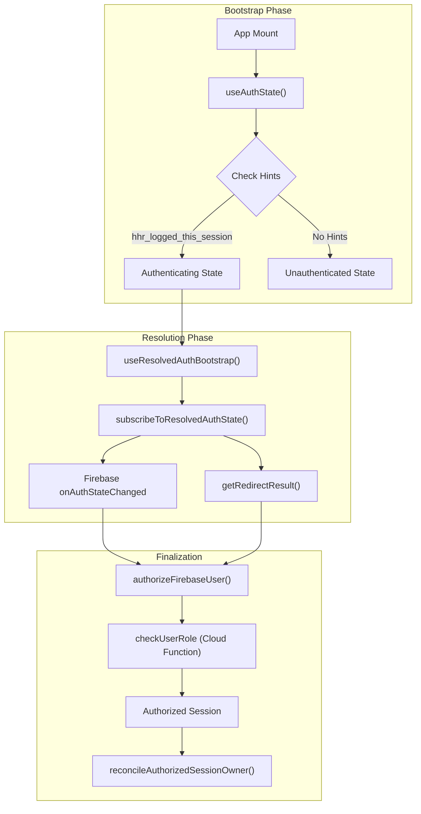
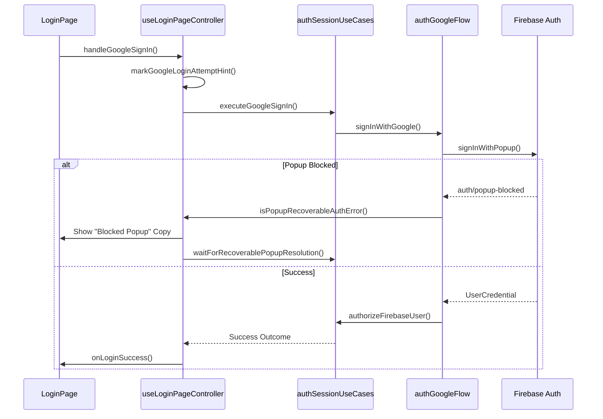

# Auth Bootstrap & Login Flow

# Auth Bootstrap & Login Flow

Relevant source files

The following files were used as context for generating this wiki page:

- [src/application/auth/authSessionUseCases.ts](src/application/auth/authSessionUseCases.ts)
- [src/components/layout/StorageStatusBadge.tsx](src/components/layout/StorageStatusBadge.tsx)
- [src/components/ui/DatabaseStatusBanner.tsx](src/components/ui/DatabaseStatusBanner.tsx)
- [src/features/auth/components/LoginPage.tsx](src/features/auth/components/LoginPage.tsx)
- [src/features/auth/components/LoginPageCard.tsx](src/features/auth/components/LoginPageCard.tsx)
- [src/features/auth/components/loginRuntimePolicy.ts](src/features/auth/components/loginRuntimePolicy.ts)
- [src/features/auth/components/useLoginPageController.ts](src/features/auth/components/useLoginPageController.ts)
- [src/hooks/controllers/authBootstrapController.ts](src/hooks/controllers/authBootstrapController.ts)
- [src/hooks/controllers/authResolvedStateSubscription.ts](src/hooks/controllers/authResolvedStateSubscription.ts)
- [src/hooks/useAuthState.ts](src/hooks/useAuthState.ts)
- [src/hooks/useAuthStateSupport.ts](src/hooks/useAuthStateSupport.ts)
- [src/services/auth/authErrorPolicy.ts](src/services/auth/authErrorPolicy.ts)
- [src/services/auth/authFallback.ts](src/services/auth/authFallback.ts)
- [src/services/auth/authGoogleFlow.ts](src/services/auth/authGoogleFlow.ts)
- [src/services/auth/authRedirectRuntime.ts](src/services/auth/authRedirectRuntime.ts)
- [src/services/auth/authStorageHints.ts](src/services/auth/authStorageHints.ts)
- [src/services/auth/authUiCopy.ts](src/services/auth/authUiCopy.ts)
- [src/services/storage/indexeddb/indexedDbMaintenanceService.ts](src/services/storage/indexeddb/indexedDbMaintenanceService.ts)
- [src/services/storage/indexeddb/indexedDbRecoveryPolicy.ts](src/services/storage/indexeddb/indexedDbRecoveryPolicy.ts)
- [src/tests/application/auth/authSessionUseCases.test.ts](src/tests/application/auth/authSessionUseCases.test.ts)
- [src/tests/components/DatabaseStatusBanner.test.tsx](src/tests/components/DatabaseStatusBanner.test.tsx)
- [src/tests/components/StorageStatusBadge.test.tsx](src/tests/components/StorageStatusBadge.test.tsx)
- [src/tests/features/auth/LoginPageCard.test.tsx](src/tests/features/auth/LoginPageCard.test.tsx)
- [src/tests/features/auth/useLoginPageController.test.ts](src/tests/features/auth/useLoginPageController.test.ts)
- [src/tests/hooks/controllers/authBootstrapController.test.ts](src/tests/hooks/controllers/authBootstrapController.test.ts)
- [src/tests/hooks/useAuthState.test.ts](src/tests/hooks/useAuthState.test.ts)
- [src/tests/hooks/useAuthStateSupport.sessionResolution.test.tsx](src/tests/hooks/useAuthStateSupport.sessionResolution.test.tsx)
- [src/tests/hooks/useAuthStateSupport.testUtils.ts](src/tests/hooks/useAuthStateSupport.testUtils.ts)
- [src/tests/services/auth/authErrorPolicy.test.ts](src/tests/services/auth/authErrorPolicy.test.ts)
- [src/tests/services/auth/authFlowRuntime.test.ts](src/tests/services/auth/authFlowRuntime.test.ts)
- [src/tests/services/auth/authRedirectRuntime.test.ts](src/tests/services/auth/authRedirectRuntime.test.ts)
- [src/tests/services/auth/authRuntimeSupport.test.ts](src/tests/services/auth/authRuntimeSupport.test.ts)
- [src/tests/services/authService.test.ts](src/tests/services/authService.test.ts)
- [src/tests/services/storage/indexedDBService.test.ts](src/tests/services/storage/indexedDBService.test.ts)
- [src/tests/services/storage/indexedDbRecoveryPolicy.test.ts](src/tests/services/storage/indexedDbRecoveryPolicy.test.ts)

The authentication system in HHR (Hospital Hanga Roa) is designed to handle the complexities of a clinical environment, including unreliable connectivity, cross-tab synchronization, and strict role-based access. It utilizes Firebase Auth with Google OAuth as the primary provider, supplemented by a multi-stage bootstrap process that ensures local state is reconciled before the UI is rendered.

## 1. Authentication Lifecycle

The authentication lifecycle is managed primarily by the `useAuthState` hook, which orchestrates the transition from an unknown initial state to a resolved session.

### High-Level Flow Diagram

"Natural Language Space" to "Code Entity Space" mapping of the authentication initialization.

**Sources:** [src/hooks/useAuthState.ts:107-142](), [src/hooks/useAuthStateSupport.ts:44-60](), [src/services/auth/authFallback.ts:120-149]()

## 2. The `useAuthState` Hook

`useAuthState` is the central authority for authentication state. It provides the current user, loading status, and operational flags used by the rest of the application.

### Key Responsibilities:

- **Initial State Determination**: Uses `shouldInitializeAsUnauthenticated` to prevent "flicker" (FOUC) by checking local storage hints like `hhr_logged_this_session` or `hhr_recent_manual_logout_v1` [src/hooks/useAuthState.ts:47-59]().
- **Logout Management**: Provides `handleLogout`, which clears session storage, signs out of Firebase, and logs the audit event [src/hooks/useAuthState.ts:124-127]().
- **Session Scoping**: Triggers `reconcileAuthorizedSessionOwner` upon successful login to ensure IndexedDB data is associated with the correct UID [src/hooks/useAuthState.ts:158-169]().
- **Cross-Tab Sync**: Listens to the `auth_broadcast_channel` to force logout if another tab signs out [src/hooks/useAuthState.ts:172-183]().

**Sources:** [src/hooks/useAuthState.ts:65-96](), [src/hooks/useAuthState.ts:172-183]()

## 3. Bootstrap & Recovery Mechanisms

### useResolvedAuthBootstrap

This hook handles the race conditions between Firebase re-authentication and the application bootstrap. It implements a **Safety Timeout** based on budget profiles to prevent the app from hanging indefinitely if Firebase is unreachable [src/hooks/useAuthStateSupport.ts:87-112]().

### Bootstrap Budget Profiles

The system adjusts its patience based on the user's context:

- **Manual Logout**: Resolves immediately as unauthenticated.
- **Pending Redirect**: Grants a longer timeout to allow Google OAuth to complete.
- **Offline**: Shortens the timeout to fallback to local-only mode faster.

**Sources:** [src/hooks/useAuthStateSupport.ts:80-85](), [src/services/auth/authBootstrapBudgets.ts]()

### Transient Flap Protection

To avoid unnecessary logouts during brief network interruptions, `useFirebaseConnectionStatus` monitors the underlying Firebase socket without immediately clearing the user session [src/hooks/useAuthState.ts:128-132]().

## 4. Login Flow & Popup Recovery

The login UI is managed by `LoginPage` and `useLoginPageController`.

### Code Entity Interaction Diagram

**Sources:** [src/features/auth/components/useLoginPageController.ts:101-163](), [src/services/auth/authGoogleFlow.ts:68-86]()

### Storage Hints & Multi-Tab Protection

1.  **`hhr_google_login_lock_v1`**: A localStorage lock that prevents multiple tabs from opening Google login popups simultaneously [src/services/auth/authGoogleFlow.ts:49-57]().
2.  **`hhr_logged_this_session`**: A `sessionStorage` hint that tells the app to wait for auth resolution on refresh because the user was previously logged in [src/hooks/useAuthState.ts:205-207]().
3.  **`hhr_auth_bootstrap_pending_v1`**: Indicates a redirect flow is in progress, preventing the app from resolving to "unauthenticated" too early [src/services/auth/authFallback.ts:131-135]().

## 5. Error Handling & Local Reset

The `LoginPageCard` provides a mechanism for users to recover from corrupted local states via `resetLocalAppStorage`.

- **Recoverable Errors**: Errors like `auth/popup-blocked` trigger a polling loop (`waitForRecoverablePopupResolution`) that waits for the user to manually allow the popup [src/features/auth/components/useLoginPageController.ts:32-48]().
- **Local Reset**: The `handleResetLocalSession` function invokes `resetLocalAppStorage` from the `indexedDbMaintenanceService`, which clears IndexedDB and all storage hints to provide a "clean slate" [src/features/auth/components/LoginPageCard.ts:55-68]().

**Sources:** [src/features/auth/components/useLoginPageController.ts:125-140](), [src/services/storage/indexeddb/indexedDbMaintenanceService.ts:6-10]()

## 6. Role Validation (`checkUserRole`)

Authentication is not complete until the user's role is verified.

1.  Firebase returns a valid `UserCredential`.
2.  The system calls the `checkUserRole` Cloud Function [src/tests/services/authService.test.ts:38-41]().
3.  If the user has no role in the `config/roles` collection, the system immediately signs them out of Firebase to prevent unauthorized persistence [src/tests/services/authService.test.ts:118-132]().

**Sources:** [src/services/auth/authAccessResolution.ts](), [src/tests/services/authService.test.ts:118-132]()

---
