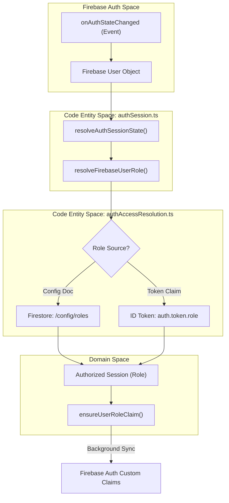
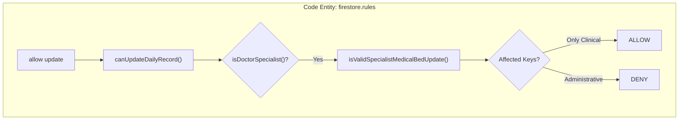

# Role-Based Access Control (RBAC)

# Role-Based Access Control (RBAC)

Relevant source files

The following files were used as context for generating this wiki page:

- [docs/AUTH_ACCESS_MODEL.md](docs/AUTH_ACCESS_MODEL.md)
- [docs/FIRESTORE_RULES_COMPLEXITY_AUDIT.md](docs/FIRESTORE_RULES_COMPLEXITY_AUDIT.md)
- [docs/MAINTENANCE_ITERATION_LOG.md](docs/MAINTENANCE_ITERATION_LOG.md)
- [docs/OPERATIVE_RULES_REFERENCE.md](docs/OPERATIVE_RULES_REFERENCE.md)
- [docs/RUNBOOK_AUTH_ACCESS_INCIDENTS.md](docs/RUNBOOK_AUTH_ACCESS_INCIDENTS.md)
- [firestore.rules](firestore.rules)
- [functions/lib/auth/authConfig.js](functions/lib/auth/authConfig.js)
- [functions/lib/auth/authEmailUtils.js](functions/lib/auth/authEmailUtils.js)
- [functions/lib/auth/authFunctionsFactory.js](functions/lib/auth/authFunctionsFactory.js)
- [functions/lib/auth/authHelpersFactory.js](functions/lib/auth/authHelpersFactory.js)
- [functions/lib/auth/authPolicies.js](functions/lib/auth/authPolicies.js)
- [functions/lib/logging/redaction.js](functions/lib/logging/redaction.js)
- [functions/lib/mirror/mirrorDailyRecordsFactory.js](functions/lib/mirror/mirrorDailyRecordsFactory.js)
- [functions/lib/mirror/mirrorSecondaryFirestoreFactory.js](functions/lib/mirror/mirrorSecondaryFirestoreFactory.js)
- [functions/lib/mirror/mirrorWriteHandlerFactory.js](functions/lib/mirror/mirrorWriteHandlerFactory.js)
- [netlify/functions/lib/firebase-auth.ts](netlify/functions/lib/firebase-auth.ts)
- [src/features/admin/index.ts](src/features/admin/index.ts)
- [src/features/admin/public.ts](src/features/admin/public.ts)
- [src/features/census/components/TransferRow.tsx](src/features/census/components/TransferRow.tsx)
- [src/features/census/components/TransferRowView.tsx](src/features/census/components/TransferRowView.tsx)
- [src/features/clinical-documents/services/clinicalDocumentDriveService.ts](src/features/clinical-documents/services/clinicalDocumentDriveService.ts)
- [src/features/handoff/components/HandoffRowCells.tsx](src/features/handoff/components/HandoffRowCells.tsx)
- [src/features/handoff/controllers/handoffRowCellsController.ts](src/features/handoff/controllers/handoffRowCellsController.ts)
- [src/features/laboratory/controllers/labAnalyticsController.ts](src/features/laboratory/controllers/labAnalyticsController.ts)
- [src/hooks/controllers/censusEmailRecipientRuntimeController.ts](src/hooks/controllers/censusEmailRecipientRuntimeController.ts)
- [src/hooks/useCensusEmailRecipientLists.ts](src/hooks/useCensusEmailRecipientLists.ts)
- [src/services/auth/authAccessResolution.ts](src/services/auth/authAccessResolution.ts)
- [src/services/auth/authClaimSyncService.ts](src/services/auth/authClaimSyncService.ts)
- [src/services/auth/authPolicy.ts](src/services/auth/authPolicy.ts)
- [src/services/auth/authRoleLookup.ts](src/services/auth/authRoleLookup.ts)
- [src/services/auth/authSession.ts](src/services/auth/authSession.ts)
- [src/services/google/googleDriveFolders.ts](src/services/google/googleDriveFolders.ts)
- [src/services/repositories/dailyRecordMasterSyncController.ts](src/services/repositories/dailyRecordMasterSyncController.ts)
- [src/services/repositories/dailyRecordWriteSupport.ts](src/services/repositories/dailyRecordWriteSupport.ts)
- [src/tests/features/backup/backupComponents.test.tsx](src/tests/features/backup/backupComponents.test.tsx)
- [src/tests/features/census/global-search/globalSearchContracts.test.ts](src/tests/features/census/global-search/globalSearchContracts.test.ts)
- [src/tests/functions/authHelpersFactory.test.ts](src/tests/functions/authHelpersFactory.test.ts)
- [src/tests/functions/mirrorDailyRecordsFactory.test.ts](src/tests/functions/mirrorDailyRecordsFactory.test.ts)
- [src/tests/hooks/controllers/censusEmailRecipientRuntimeController.test.ts](src/tests/hooks/controllers/censusEmailRecipientRuntimeController.test.ts)
- [src/tests/netlify/firebaseAuth.test.ts](src/tests/netlify/firebaseAuth.test.ts)
- [src/tests/services/auth/authAccessResolution.test.ts](src/tests/services/auth/authAccessResolution.test.ts)
- [src/tests/services/auth/authRoleLookup.test.ts](src/tests/services/auth/authRoleLookup.test.ts)
- [src/tests/services/auth/authSession.test.ts](src/tests/services/auth/authSession.test.ts)
- [src/tests/services/repositories/dailyRecordMasterSyncController.test.ts](src/tests/services/repositories/dailyRecordMasterSyncController.test.ts)
- [src/tests/utils/consoleTestUtils.ts](src/tests/utils/consoleTestUtils.ts)
- [src/tests/views/handoff/handoffRowCellsController.test.ts](src/tests/views/handoff/handoffRowCellsController.test.ts)

The Role-Based Access Control (RBAC) system in the HHR ServicioHospitalizados platform governs clinical and administrative access to patient data. It utilizes a hybrid model where roles are resolved through both Firestore-based configuration and Firebase Custom Claims, ensuring both flexibility for rapid access changes and high-performance enforcement via security rules.

## Role Model Definition

The system defines five primary roles, each with specific clinical and administrative scopes:

| Role                | Description          | Clinical Scope                                               | Administrative Scope                             |
| :------------------ | :------------------- | :----------------------------------------------------------- | :----------------------------------------------- |
| `admin`             | System Administrator | Full Read/Write across all modules.                          | Manage roles, system health, and global configs. |
| `nurse_hospital`    | Hospital Nurse       | Full Read/Write for Census, Handoff, and CUDYR.              | Can report system health.                        |
| `doctor_urgency`    | Urgency Physician    | Full Read for Census; Read/Write for Medical Handoff.        | Limited to clinical data.                        |
| `doctor_specialist` | Specialist Physician | Read/Write restricted to specific specialty fields and beds. | Restricted to specialty-specific entries.        |
| `viewer`            | Clinical Viewer      | Read-only access to Census and Laboratory results.           | No write permissions.                            |

**Note:** The role `viewer_census` is internally normalized to `viewer` during the resolution process [firestore.rules:16-20]().

## Access Resolution Pipeline

Access resolution occurs during the application bootstrap and is managed by the `authSession` service. The system prioritizes configured roles over token claims to allow for immediate revocation or promotion without requiring a user re-login.

### Resolution Logic (checkUserRole)

The `resolveFirebaseUserRole` function orchestrates the lookup [src/services/auth/authSession.ts:93-96](). It follows this hierarchy:

1.  **Firestore Config Lookup**: Checks the `config/roles` document where keys are user emails (normalized to lowercase) [firestore.rules:7-12]().
2.  **Custom Claims**: If no Firestore entry exists, it falls back to the `role` key within the Firebase Auth ID Token [firestore.rules:27-33]().
3.  **Anonymous Fallback**: Users authenticated anonymously are assigned the `viewer` role by default [src/services/auth/authSession.ts:78-89]().

### Data Flow: Auth Session to Code Entities

The following diagram illustrates how a Firebase User event is transformed into an authorized session with a specific role.

**Diagram: Auth Session Resolution Flow**

**Sources:** [src/services/auth/authSession.ts:70-104](), [src/services/auth/authAccessResolution.ts:1-7](), [firestore.rules:34-39]().

## Firestore Security Rules Enforcement

Security rules serve as the final authority for data integrity. The rules are segmented to prevent "Evaluation Limit" errors (1000 expressions) by using early-exit guards [docs/FIRESTORE_RULES_COMPLEXITY_AUDIT.md:80-88]().

### Key Rule Functions

- `getEffectiveRole()`: The central resolver within rules that implements the Config-over-Claim priority [firestore.rules:34-39]().
- `canUpdatePersistedDailyRecord()`: A complex guard that validates if a user can modify a record based on their role and the clinical date window [docs/FIRESTORE_RULES_COMPLEXITY_AUDIT.md:110-112]().
- `isSpecialistMedicalHandoffUpdate()`: A specialized validator that restricts `doctor_specialist` to only modify `medicalHandoffEntries` for specific beds (e.g., R1, NEO1, H1C1) or specific specialty blocks [firestore.rules:107-135]().

### Specialist Write Restrictions

The `doctor_specialist` role is unique because it cannot perform a full document update. Rules enforce that specialists only modify their designated specialty keys (e.g., `cirugia`, `pediatria`) within the `medicalHandoffBySpecialty` map [firestore.rules:147-167]().

**Diagram: Specialist Payload Validation**

**Sources:** [firestore.rules:61-63](), [firestore.rules:97-106](), [docs/FIRESTORE_RULES_COMPLEXITY_AUDIT.md:125-130]().

## Auth Services

### authRoleLookup

Provides low-level access to the `config/roles` document. It is used primarily during the bootstrap phase to determine the initial application state before the full UI mounts.

### authSession

The `authSession` service manages the lifecycle of the authenticated state.

- **Sign Out**: Clears local role caches for the user's email to ensure that subsequent logins by different users on the same device do not inherit stale permissions [src/services/auth/authSession.ts:30-40]().
- **Claim Sync**: The `ensureUserRoleClaim` function ensures that the Firebase ID Token is kept in sync with the Firestore configuration in the background, facilitating faster rule evaluation in future sessions [src/services/auth/authSession.ts:102-104]().

### authRoleLookup / authSession Interactions

| Service                | Function                   | Purpose                                                                                                               |
| :--------------------- | :------------------------- | :-------------------------------------------------------------------------------------------------------------------- |
| `authSession`          | `onAuthSessionStateChange` | Listens for Firebase Auth events and resolves the full `AuthSessionState` [src/services/auth/authSession.ts:54-70](). |
| `authSession`          | `signOut`                  | Orchestrates Firebase sign-out and cache purging [src/services/auth/authSession.ts:30-35]().                          |
| `authAccessResolution` | `resolveFirebaseUserRole`  | Implements the business logic for role prioritization [src/services/auth/authAccessResolution.ts:1-7]().              |
| `authClaimSyncService` | `ensureUserRoleClaim`      | Updates Firebase Custom Claims to match Firestore config [src/services/auth/authClaimSyncService.ts:11-13]().         |

**Sources:** [src/services/auth/authSession.ts:1-53](), [src/services/auth/authAccessResolution.ts:1-7](), [src/services/auth/authClaimSyncService.ts:1-13]().

---
