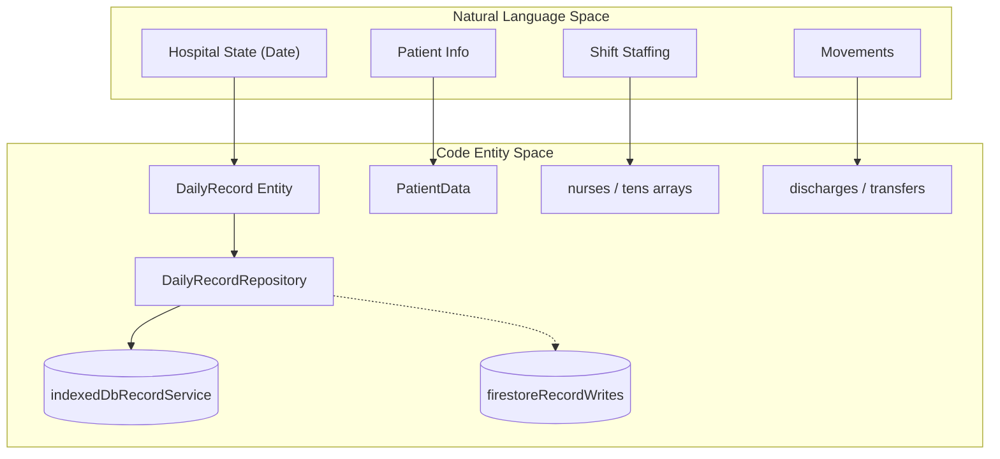
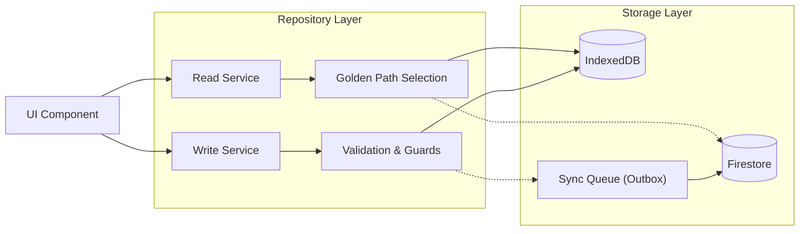

# Core Data Layer: DailyRecord

# Core Data Layer: DailyRecord

Relevant source files

The following files were used as context for generating this wiki page:

- [docs/CENSUS_OPERATIONAL_VALIDATION_CHECKLIST.md](docs/CENSUS_OPERATIONAL_VALIDATION_CHECKLIST.md)
- [docs/RUNBOOK_SUPPORT_OPERATIONS.md](docs/RUNBOOK_SUPPORT_OPERATIONS.md)
- [docs/RUNBOOK_SYNC_RESILIENCE.md](docs/RUNBOOK_SYNC_RESILIENCE.md)
- [docs/architecture.md](docs/architecture.md)
- [scripts/check-docs-drift.mjs](scripts/check-docs-drift.mjs)
- [scripts/config/technical-execution-baseline.json](scripts/config/technical-execution-baseline.json)
- [src/application/patient-flow/admissionDatePolicy.ts](src/application/patient-flow/admissionDatePolicy.ts)
- [src/features/README.md](src/features/README.md)
- [src/features/census/controllers/censusLogicController.ts](src/features/census/controllers/censusLogicController.ts)
- [src/features/handoff/README.md](src/features/handoff/README.md)
- [src/hooks/README.md](src/hooks/README.md)
- [src/services/README.md](src/services/README.md)
- [src/services/auth/README.md](src/services/auth/README.md)
- [src/services/auth/authCredentialFlow.ts](src/services/auth/authCredentialFlow.ts)
- [src/services/repositories/README.md](src/services/repositories/README.md)
- [src/services/repositories/dailyRecordAdmissionDateWritePolicy.ts](src/services/repositories/dailyRecordAdmissionDateWritePolicy.ts)
- [src/services/repositories/dailyRecordClinicalDomainService.ts](src/services/repositories/dailyRecordClinicalDomainService.ts)
- [src/services/repositories/dailyRecordDomainServices.ts](src/services/repositories/dailyRecordDomainServices.ts)
- [src/services/repositories/dailyRecordFieldShrinkageGuard.ts](src/services/repositories/dailyRecordFieldShrinkageGuard.ts)
- [src/services/repositories/dailyRecordHandoffDomainService.ts](src/services/repositories/dailyRecordHandoffDomainService.ts)
- [src/services/repositories/dailyRecordMetadataDomainService.ts](src/services/repositories/dailyRecordMetadataDomainService.ts)
- [src/services/repositories/dailyRecordMovementsDomainService.ts](src/services/repositories/dailyRecordMovementsDomainService.ts)
- [src/services/repositories/dailyRecordRepositoryReadService.ts](src/services/repositories/dailyRecordRepositoryReadService.ts)
- [src/services/repositories/dailyRecordRepositoryWriteService.ts](src/services/repositories/dailyRecordRepositoryWriteService.ts)
- [src/services/repositories/dailyRecordStaffingDomainService.ts](src/services/repositories/dailyRecordStaffingDomainService.ts)
- [src/services/repositories/repositoryFirestoreRuntime.ts](src/services/repositories/repositoryFirestoreRuntime.ts)
- [src/services/storage/README.md](src/services/storage/README.md)
- [src/services/storage/firestore/firestoreServiceRuntime.ts](src/services/storage/firestore/firestoreServiceRuntime.ts)
- [src/services/storage/legacyfirebase/legacyFirebaseLogger.ts](src/services/storage/legacyfirebase/legacyFirebaseLogger.ts)
- [src/services/storage/legacyfirebase/legacyFirebaseRecordService.ts](src/services/storage/legacyfirebase/legacyFirebaseRecordService.ts)
- [src/services/transfers/transferTemplateFetchController.ts](src/services/transfers/transferTemplateFetchController.ts)
- [src/tests/domain/handoff/patientView.test.ts](src/tests/domain/handoff/patientView.test.ts)
- [src/tests/features/census/DischargeRowView.test.tsx](src/tests/features/census/DischargeRowView.test.tsx)
- [src/tests/hooks/useDailyRecord.lifecycle.test.tsx](src/tests/hooks/useDailyRecord.lifecycle.test.tsx)
- [src/tests/integration/sync-ui-resilience.test.tsx](src/tests/integration/sync-ui-resilience.test.tsx)
- [src/tests/services/dailyRecordRepository.test.ts](src/tests/services/dailyRecordRepository.test.ts)
- [src/tests/services/repositories/DailyRecordRepository.initialization-and-bootstrap.test.ts](src/tests/services/repositories/DailyRecordRepository.initialization-and-bootstrap.test.ts)
- [src/tests/services/repositories/dailyRecordAdmissionDateWritePolicy.test.ts](src/tests/services/repositories/dailyRecordAdmissionDateWritePolicy.test.ts)
- [src/tests/services/repositories/dailyRecordClinicalDomainService.test.ts](src/tests/services/repositories/dailyRecordClinicalDomainService.test.ts)
- [src/tests/services/repositories/dailyRecordInitializationSupport.test.ts](src/tests/services/repositories/dailyRecordInitializationSupport.test.ts)
- [src/tests/services/repositories/dailyRecordMetadataDomainService.test.ts](src/tests/services/repositories/dailyRecordMetadataDomainService.test.ts)
- [src/tests/services/repositories/dailyRecordRepositoryWriteService.test.ts](src/tests/services/repositories/dailyRecordRepositoryWriteService.test.ts)
- [src/tests/services/repositories/dailyRecordStaffingDomainService.test.ts](src/tests/services/repositories/dailyRecordStaffingDomainService.test.ts)
- [src/tests/services/storage/legacyFirebaseLogger.test.ts](src/tests/services/storage/legacyFirebaseLogger.test.ts)
- [src/tests/services/storage/legacyFirebaseRecordCache.test.ts](src/tests/services/storage/legacyFirebaseRecordCache.test.ts)
- [src/tests/views/census/censusLogicController.test.ts](src/tests/views/census/censusLogicController.test.ts)
- [src/tests/views/handoff/medicalPatientHandoffRenderController.test.ts](src/tests/views/handoff/medicalPatientHandoffRenderController.test.ts)

The `DailyRecord` entity is the central data structure of the HHR (Hospital Hanga Roa) system. It represents the complete clinical and administrative state of the hospital for a specific ISO date (`YYYY-MM-DD`). The system employs an **offline-first architecture**, where data is primarily read from and written to a local IndexedDB instance before being asynchronously synchronized with Firebase Firestore.

### Entity Scope and Structure

A `DailyRecord` encapsulates all data points required to reconstruct the hospital's state for a given day, including:

- **Beds & Patients:** A map of bed identifiers to patient clinical data (RUT, pathology, specialty, devices, UPC status).
- **Movements:** Arrays tracking discharges, transfers, and CMA (Cirugía Mayor Ambulatoria).
- **Staffing:** Nursing and TENS assignments for day and night shifts.
- **Metadata:** Timestamps (`lastUpdated`), schema versions, and record-level status.

The system ensures that even if the remote connection is lost, the hospital can continue clinical operations using the local authoritative copy.

### Code Entity Mapping

The following diagram illustrates how clinical concepts map to the repository and storage layers within the codebase.

**Clinical to Code Mapping**

Sources: [src/services/repositories/README.md:1-15](), [src/services/storage/README.md:1-7](), [src/types/domain/dailyRecord.ts:1-20]()

---

## Repository Pattern Architecture

Access to `DailyRecord` is strictly governed by the Repository Pattern to decouple the UI from specific storage implementations. The repository is split into specialized services to handle different aspects of the data lifecycle.

### Data Flow Overview

The system follows a "Golden Path" for data resolution. When a record is requested, the system checks the local IndexedDB first and simultaneously attempts to hydrate from Firestore if enabled.

**DailyRecord Persistence Flow**

Sources: [src/services/repositories/README.md:7-15](), [src/services/repositories/dailyRecordRepositoryReadService.ts:65-113](), [src/services/repositories/dailyRecordRepositoryWriteService.ts:118-147]()

### Sub-Topic Navigation

#### [Repository Read & Write Services](#4.1)

The `dailyRecordRepositoryReadService` manages local-first reads with remote hydration [src/services/repositories/dailyRecordRepositoryReadService.ts:73-123](). The `dailyRecordRepositoryWriteService` enforces integrity via `AdmissionDatePolicy` and handles outbox fallbacks when Firestore is unreachable [src/services/repositories/dailyRecordRepositoryWriteService.ts:176-215]().
_For details, see [Repository Read & Write Services](#4.1)._

#### [Sync Queue & Firestore Transport](#4.2)

The system uses a persistent outbox (Sync Queue) to manage background synchronization. This includes retry logic with backoff and classification of tasks by domain context (clinical, staffing, handoff) [src/services/storage/README.md:48-53]().
_For details, see [Sync Queue & Firestore Transport](#4.2)._

#### [Conflict Resolution](#4.3)

When concurrent edits occur, the `resolveDailyRecordConflict` engine applies domain-specific policies to merge data. It distinguishes between clinical fields (where local edits are often prioritized) and administrative fields [src/services/repositories/dailyRecordConflictAutoMergeController.ts:93-116]().
_For details, see [Conflict Resolution](#4.3)._

#### [IndexedDB Storage Layer](#4.4)

The foundation of the offline-first strategy is the `indexedDbRecordService`, built on Dexie.js. It handles the local schema, migrations, and maintenance tasks like "Hard Resets" to recover from corrupted states [src/services/storage/README.md:23-41]().
_For details, see [IndexedDB Storage Layer](#4.4)._

---

## Operational Health & Resilience

The system provides a `System Health Dashboard` to monitor the status of the data layer. Administrators can track `pendingMutations`, `failedSyncTasks`, and `oldestPendingAgeMs` to identify users with synchronization issues [docs/RUNBOOK_SYNC_RESILIENCE.md:12-29]().

| Metric               | Warning Threshold | Critical Threshold |
| :------------------- | :---------------- | :----------------- |
| `oldestPendingAgeMs` | ≥ 5 min           | ≥ 15 min           |
| `retryingSyncTasks`  | ≥ 1               | ≥ 3                |
| `failedSyncTasks`    | -                 | > 0                |

Sources: [docs/RUNBOOK_SYNC_RESILIENCE.md:24-29](), [docs/RUNBOOK_SUPPORT_OPERATIONS.md:51-60]()

---
