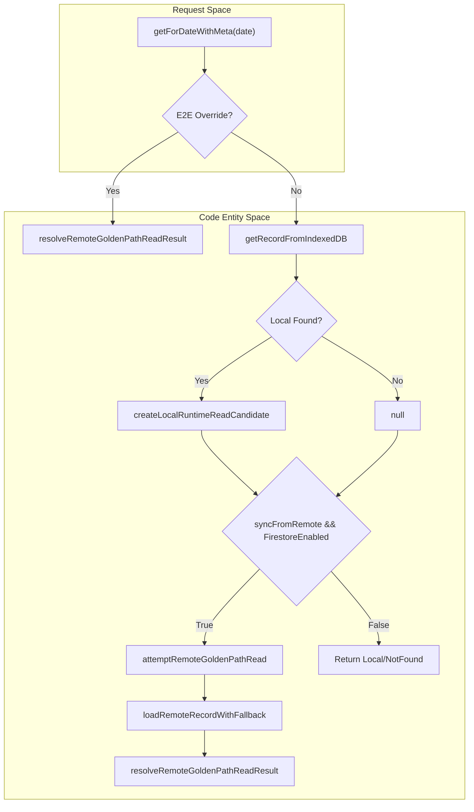
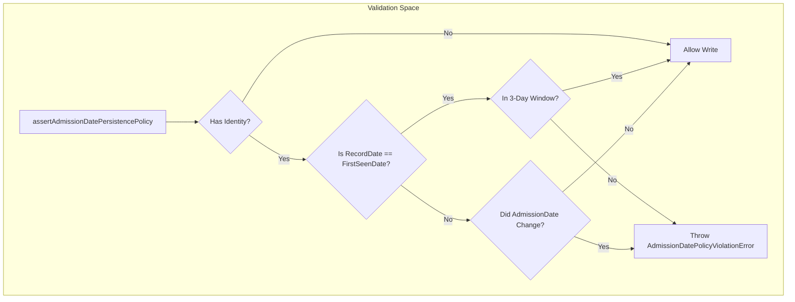

# Repository Read & Write Services

# Repository Read & Write Services

Relevant source files

The following files were used as context for generating this wiki page:

- [src/application/patient-flow/admissionDatePolicy.ts](src/application/patient-flow/admissionDatePolicy.ts)
- [src/features/census/controllers/censusLogicController.ts](src/features/census/controllers/censusLogicController.ts)
- [src/services/repositories/dailyRecordAdmissionDateWritePolicy.ts](src/services/repositories/dailyRecordAdmissionDateWritePolicy.ts)
- [src/services/repositories/dailyRecordClinicalDomainService.ts](src/services/repositories/dailyRecordClinicalDomainService.ts)
- [src/services/repositories/dailyRecordDomainServices.ts](src/services/repositories/dailyRecordDomainServices.ts)
- [src/services/repositories/dailyRecordFieldShrinkageGuard.ts](src/services/repositories/dailyRecordFieldShrinkageGuard.ts)
- [src/services/repositories/dailyRecordHandoffDomainService.ts](src/services/repositories/dailyRecordHandoffDomainService.ts)
- [src/services/repositories/dailyRecordInitializationSeed.ts](src/services/repositories/dailyRecordInitializationSeed.ts)
- [src/services/repositories/dailyRecordInitializationSupport.ts](src/services/repositories/dailyRecordInitializationSupport.ts)
- [src/services/repositories/dailyRecordMetadataDomainService.ts](src/services/repositories/dailyRecordMetadataDomainService.ts)
- [src/services/repositories/dailyRecordMovementsDomainService.ts](src/services/repositories/dailyRecordMovementsDomainService.ts)
- [src/services/repositories/dailyRecordRepositoryInitializationService.ts](src/services/repositories/dailyRecordRepositoryInitializationService.ts)
- [src/services/repositories/dailyRecordRepositoryLifecycleSupport.ts](src/services/repositories/dailyRecordRepositoryLifecycleSupport.ts)
- [src/services/repositories/dailyRecordRepositoryReadService.ts](src/services/repositories/dailyRecordRepositoryReadService.ts)
- [src/services/repositories/dailyRecordRepositoryWriteService.ts](src/services/repositories/dailyRecordRepositoryWriteService.ts)
- [src/services/repositories/dailyRecordStaffingDomainService.ts](src/services/repositories/dailyRecordStaffingDomainService.ts)
- [src/services/repositories/dataMigration.ts](src/services/repositories/dataMigration.ts)
- [src/services/repositories/helpers/validationHelper.ts](src/services/repositories/helpers/validationHelper.ts)
- [src/services/storage/firestore/firestoreShared.ts](src/services/storage/firestore/firestoreShared.ts)
- [src/tests/domain/handoff/patientView.test.ts](src/tests/domain/handoff/patientView.test.ts)
- [src/tests/features/census/DischargeRowView.test.tsx](src/tests/features/census/DischargeRowView.test.tsx)
- [src/tests/hooks/useDailyRecord.lifecycle.test.tsx](src/tests/hooks/useDailyRecord.lifecycle.test.tsx)
- [src/tests/integration/sync-ui-resilience.test.tsx](src/tests/integration/sync-ui-resilience.test.tsx)
- [src/tests/services/dailyRecordRepository.test.ts](src/tests/services/dailyRecordRepository.test.ts)
- [src/tests/services/repositories/DailyRecordRepository.initialization-and-bootstrap.test.ts](src/tests/services/repositories/DailyRecordRepository.initialization-and-bootstrap.test.ts)
- [src/tests/services/repositories/dailyRecordAdmissionDateWritePolicy.test.ts](src/tests/services/repositories/dailyRecordAdmissionDateWritePolicy.test.ts)
- [src/tests/services/repositories/dailyRecordClinicalDomainService.test.ts](src/tests/services/repositories/dailyRecordClinicalDomainService.test.ts)
- [src/tests/services/repositories/dailyRecordInitializationSupport.test.ts](src/tests/services/repositories/dailyRecordInitializationSupport.test.ts)
- [src/tests/services/repositories/dailyRecordMetadataDomainService.test.ts](src/tests/services/repositories/dailyRecordMetadataDomainService.test.ts)
- [src/tests/services/repositories/dailyRecordRepositoryLifecycleSupport.test.ts](src/tests/services/repositories/dailyRecordRepositoryLifecycleSupport.test.ts)
- [src/tests/services/repositories/dailyRecordRepositoryWriteService.test.ts](src/tests/services/repositories/dailyRecordRepositoryWriteService.test.ts)
- [src/tests/services/repositories/dailyRecordStaffingDomainService.test.ts](src/tests/services/repositories/dailyRecordStaffingDomainService.test.ts)
- [src/tests/services/repositories/dataMigration.test.ts](src/tests/services/repositories/dataMigration.test.ts)
- [src/tests/services/repositories/validationHelper.test.ts](src/tests/services/repositories/validationHelper.test.ts)
- [src/tests/views/census/censusLogicController.test.ts](src/tests/views/census/censusLogicController.test.ts)
- [src/tests/views/handoff/medicalPatientHandoffRenderController.test.ts](src/tests/views/handoff/medicalPatientHandoffRenderController.test.ts)

The Repository layer acts as the primary orchestrator for `DailyRecord` persistence and retrieval. It implements an offline-first strategy where data is immediately committed to IndexedDB and then asynchronously synchronized with Firestore. This layer is governed by strict clinical integrity guards, including schema migration, field shrinkage prevention, and Admission Date policies.

## Daily Record Read Service

The `dailyRecordRepositoryReadService` manages data retrieval using a "Golden Path" strategy. It prioritizes local data for performance while hydrating from remote sources to ensure consistency across devices.

### Implementation Details

The service utilizes `measureRepositoryOperation` to track performance, with a standard threshold of 120ms for repository reads [src/services/repositories/dailyRecordRepositoryReadService.ts:77-123]().

- **Local-First Retrieval**: It first checks `IndexedDB` via `getRecordFromIndexedDB` [src/services/repositories/dailyRecordRepositoryReadService.ts:81-81]().
- **Remote Hydration**: If `syncFromRemote` is enabled and Firestore is available, it invokes `attemptRemoteGoldenPathRead` [src/services/repositories/dailyRecordRepositoryReadService.ts:104-112]().
- **Legacy Bridge**: For historical data not yet in the new schema, it uses `bridgeLegacyRecord` to adapt old Firebase formats [src/services/repositories/dailyRecordRepositoryReadService.ts:125-128]().
- **E2E Overrides**: Supports a `window.__HHR_E2E_OVERRIDE__` injection point for automated testing [src/services/repositories/dailyRecordRepositoryReadService.ts:51-57]().

### Data Flow: Golden Path Read

Title: DailyRecord Read Pipeline

Sources: [src/services/repositories/dailyRecordRepositoryReadService.ts:73-123](), [src/services/repositories/dailyRecordRemoteReadController.ts:24-27]()

---

## Daily Record Write Service

The `dailyRecordRepositoryWriteService` handles full saves and partial updates. It is responsible for maintaining clinical data integrity through a series of pre-flight checks and fallback mechanisms.

### Key Components

1.  **Integrity Guards**: Before any write, the service runs `assertRemoteSaveCompatibility` to prevent data regressions (LWW - Last Write Wins enforcement) [src/services/repositories/dailyRecordRepositoryWriteService.ts:40-54]().
2.  **Field Shrinkage Guard**: Prevents accidental data loss where a UI component might send an empty field that was previously populated [src/services/repositories/dailyRecordRepositoryWriteService.ts:26-26]().
3.  **Outbox Fallback**: If a Firestore write fails due to network issues, the service uses `queueSyncTask` to place the operation in the persistent `SyncQueue` [src/tests/services/repositories/dailyRecordRepositoryWriteService.test.ts:109-125]().
4.  **Auto-Merge Recovery**: If a `DataRegressionError` occurs during a full save, it attempts `attemptConflictAutoMergeRecovery` to merge local changes with the remote version instead of failing [src/services/repositories/dailyRecordRepositoryWriteService.ts:87-116]().

### Write Outcomes

| Outcome                | Description                                                                             |
| :--------------------- | :-------------------------------------------------------------------------------------- |
| `persisted_and_synced` | Data saved to both IndexedDB and Firestore successfully.                                |
| `queued`               | Data saved to IndexedDB; Firestore write failed (retryable) and was moved to SyncQueue. |
| `blocked_validation`   | Write rejected due to `AdmissionDatePolicy` or integrity violations.                    |
| `unrecoverable`        | Write failed due to SyncQueue saturation (backpressure) or fatal API errors.            |

Sources: [src/services/repositories/dailyRecordRepositoryWriteService.ts:79-116](), [src/tests/services/repositories/dailyRecordRepositoryWriteService.test.ts:137-153]()

---

## Admission Date Policy Enforcement

The `AdmissionDatePolicy` is a clinical safety mechanism that prevents the modification of a patient's admission date after their first day of appearance in the system.

### Enforcement Rules

- **Window Violation**: On the first day a patient is seen (`firstSeenDate`), the `admissionDate` must fall within a 3-day window: `[baseDate - 1, baseDate, baseDate + 1]` [src/application/patient-flow/admissionDatePolicy.ts:89-91]().
- **Mutation Violation**: Once the record date is past the `firstSeenDate`, the `admissionDate` becomes immutable [src/application/patient-flow/admissionDatePolicy.ts:162-201]().
- **Clinical Day Alignment**: The policy uses `resolveClinicalDayBounds` to determine if an admission at 01:00 AM belongs to the previous calendar day or the current clinical day [src/application/patient-flow/admissionDatePolicy.ts:69-70]().

Title: AdmissionDatePolicy Validation Logic

Sources: [src/application/patient-flow/admissionDatePolicy.ts:121-201](), [src/services/repositories/dailyRecordAdmissionDateWritePolicy.ts:3-3]()

---

## Data Initialization & Carryover

When a new day is accessed, the `dailyRecordRepositoryInitializationService` prepares the record by carrying over patients and staffing from the previous day.

### Initialization Flow

1.  **Seed Resolution**: Determines if it should use a remote record, a copy from a previous day, or a fresh template [src/services/repositories/dailyRecordRepositoryInitializationService.ts:137-153]().
2.  **Patient Carryover**: Invokes `preparePatientForCarryover` which:
    - Clones patient identity [src/services/repositories/dailyRecordClinicalDomainService.ts:50-50]().
    - Resets `CUDYR` (Nursing Category) scores [src/services/repositories/dailyRecordClinicalDomainService.ts:51-51]().
    - Inherits Handoff notes (Night shift notes become the new Day shift notes) [src/services/repositories/dailyRecordHandoffDomainService.ts:17-19]().
3.  **Staffing Inheritance**: Copies the list of Nurses and TENS from the previous day to the new record [src/services/repositories/dailyRecordInitializationSupport.ts:28-28]().

### Implementation Summary Table

| Feature            | Service / Function          | Role                                               |
| :----------------- | :-------------------------- | :------------------------------------------------- |
| **Read**           | `getForDateWithMeta`        | Coordinates local read + remote hydration.         |
| **Write**          | `saveDetailed`              | Executes save with integrity and shrinkage guards. |
| **Partial Update** | `updatePartialDetailed`     | Updates specific fields using dot-notation.        |
| **Init**           | `initializeDay`             | Creates a new day record with inherited data.      |
| **Policy**         | `resolveAdmissionDateAudit` | Validates clinical admission date windows.         |

Sources: [src/services/repositories/dailyRecordRepositoryReadService.ts:73-76](), [src/services/repositories/dailyRecordRepositoryWriteService.ts:176-176](), [src/services/repositories/dailyRecordRepositoryInitializationService.ts:184-184](), [src/application/patient-flow/admissionDatePolicy.ts:73-78]()

---
