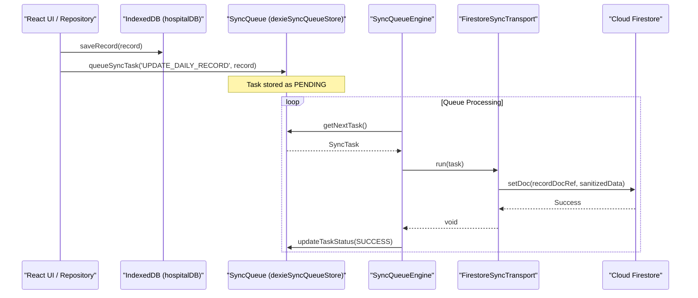

# Sync Queue & Firestore Transport

# Sync Queue & Firestore Transport

Relevant source files

The following files were used as context for generating this wiki page:

- [docs/HANDOFF_SPECIALIST_MEDICAL_WRITE_PATH.md](docs/HANDOFF_SPECIALIST_MEDICAL_WRITE_PATH.md)
- [functions/lib/specialistMedicalHandoffFunctions.js](functions/lib/specialistMedicalHandoffFunctions.js)
- [src/features/census/controllers/patientMovementRuntimeController.ts](src/features/census/controllers/patientMovementRuntimeController.ts)
- [src/features/census/hooks/usePatientMovementFeedback.ts](src/features/census/hooks/usePatientMovementFeedback.ts)
- [src/services/config/runtimeContractClient.ts](src/services/config/runtimeContractClient.ts)
- [src/services/repositories/dailyRecordRemoteLoader.ts](src/services/repositories/dailyRecordRemoteLoader.ts)
- [src/services/repositories/dailyRecordRepositorySyncService.ts](src/services/repositories/dailyRecordRepositorySyncService.ts)
- [src/services/repositories/monthIntegrity.ts](src/services/repositories/monthIntegrity.ts)
- [src/services/repositories/patientMasterMigration.ts](src/services/repositories/patientMasterMigration.ts)
- [src/services/repositories/repositoryPerformance.ts](src/services/repositories/repositoryPerformance.ts)
- [src/services/storage/firestore/firestoreQuerySupport.ts](src/services/storage/firestore/firestoreQuerySupport.ts)
- [src/services/storage/firestore/firestoreRecordQueries.ts](src/services/storage/firestore/firestoreRecordQueries.ts)
- [src/services/storage/firestore/firestoreRecordWrites.ts](src/services/storage/firestore/firestoreRecordWrites.ts)
- [src/services/storage/firestore/firestoreWriteSupport.ts](src/services/storage/firestore/firestoreWriteSupport.ts)
- [src/services/storage/sync/browserSyncRuntime.ts](src/services/storage/sync/browserSyncRuntime.ts)
- [src/services/storage/sync/dexieSyncQueueStore.ts](src/services/storage/sync/dexieSyncQueueStore.ts)
- [src/services/storage/sync/firestoreSyncTransport.ts](src/services/storage/sync/firestoreSyncTransport.ts)
- [src/services/storage/sync/syncDomainPolicy.ts](src/services/storage/sync/syncDomainPolicy.ts)
- [src/services/storage/sync/syncQueueEngine.ts](src/services/storage/sync/syncQueueEngine.ts)
- [src/services/storage/sync/syncQueuePorts.ts](src/services/storage/sync/syncQueuePorts.ts)
- [src/services/storage/syncQueueTypes.ts](src/services/storage/syncQueueTypes.ts)
- [src/tests/functions/specialistMedicalHandoffDeploymentContract.test.ts](src/tests/functions/specialistMedicalHandoffDeploymentContract.test.ts)
- [src/tests/functions/specialistMedicalHandoffFunctions.test.ts](src/tests/functions/specialistMedicalHandoffFunctions.test.ts)
- [src/tests/integration/sync-resilience.test.ts](src/tests/integration/sync-resilience.test.ts)
- [src/tests/services/config/runtimeContractClient.test.ts](src/tests/services/config/runtimeContractClient.test.ts)
- [src/tests/services/repositories/dailyRecordRemoteLoader.test.ts](src/tests/services/repositories/dailyRecordRemoteLoader.test.ts)
- [src/tests/services/repositories/dailyRecordRepositorySyncService.test.ts](src/tests/services/repositories/dailyRecordRepositorySyncService.test.ts)
- [src/tests/services/storage/firestoreRecordQueries.test.ts](src/tests/services/storage/firestoreRecordQueries.test.ts)
- [src/tests/services/storage/firestoreRecordWrites.test.ts](src/tests/services/storage/firestoreRecordWrites.test.ts)
- [src/tests/services/storage/firestoreWriteSupport.test.ts](src/tests/services/storage/firestoreWriteSupport.test.ts)
- [src/tests/services/storage/syncDomainPolicy.test.ts](src/tests/services/storage/syncDomainPolicy.test.ts)
- [src/tests/services/storage/syncQueueService.test.ts](src/tests/services/storage/syncQueueService.test.ts)

The HHR system utilizes a persistent outbox pattern to ensure data integrity in an offline-first environment. All clinical mutations are first committed to IndexedDB and then queued for synchronization. This page details the synchronization engine, the Firestore transport layer, and the mechanisms used to resolve conflicts and ensure consistency during transport.

## Sync Queue Architecture

The synchronization system is built around a persistent queue that survives page reloads and browser restarts. It decouples the UI from Firestore latency and connectivity issues.

### Core Components

- **`syncQueueEngine`**: The central orchestrator that manages the lifecycle of a `SyncTask`. It handles the transition from `PENDING` to `SUCCESS`, `FAILED`, or `CONFLICT` [src/services/storage/sync/syncQueueEngine.ts]().
- **`dexieSyncQueueStore`**: A persistent storage implementation using Dexie.js (IndexedDB) to store the outbox [src/services/storage/sync/dexieSyncQueueStore.ts]().
- **`firestoreSyncTransport`**: The implementation of `SyncTransportPort` that communicates with Firebase Firestore [src/services/storage/sync/firestoreSyncTransport.ts:79-91]().
- **`browserSyncRuntime`**: Monitors the `navigator.onLine` status and triggers queue processing when the connection is restored [src/services/storage/sync/browserSyncRuntime.ts]().

### Data Flow: Mutation to Firestore

The following diagram illustrates how a clinical update travels from the UI to the remote database.

**Sync Queue Data Flow**

Sources: [src/services/storage/sync/syncQueueEngine.ts](), [src/services/storage/sync/firestoreSyncTransport.ts:61-77](), [src/tests/integration/sync-resilience.test.ts:106-123]()

## Firestore Transport & Concurrency

The `firestoreSyncTransport` is responsible for translating domain objects into Firestore-compatible payloads and enforcing safety checks during the write.

### Concurrency Protection

Before performing a `setDoc`, the transport executes `assertSyncQueueConcurrency`. This check fetches the remote `lastUpdated` timestamp and compares it with the local record's timestamp [src/services/storage/sync/firestoreSyncTransport.ts:30-59]().

- **Same-Session Tolerance**: A window of 30 seconds (`SAME_SESSION_TOLERANCE_MS`) is allowed to permit rapid edits from the same user/session without triggering conflict errors [src/services/storage/sync/firestoreSyncTransport.ts:20-29]().
- **Drift Violation**: If the remote record is newer by more than 30 seconds, a `ConcurrencyError` is thrown, and the task status is updated to `CONFLICT` [src/services/storage/sync/firestoreSyncTransport.ts:51-58]().

### Payload Sanitization

Data is passed through `sanitizeForFirestore` to handle complex types (like Date objects or nested undefined values) before being sent to the `setDoc` operation [src/services/storage/firestore/firestoreShared.ts](), [src/services/storage/sync/firestoreSyncTransport.ts:69-73]().

Sources: [src/services/storage/sync/firestoreSyncTransport.ts:14-59](), [src/services/storage/firestore/firestoreWriteSupport.ts:33-107]()

## Specialist Write Path (Callable)

Due to complex Firestore Security Rules for the `doctor_specialist` role, specific medical handoff updates are routed through a Cloud Function instead of a direct Firestore write.

- **Detection**: `isSpecialistScopedDailyRecordPatch` identifies if a patch contains only medical handoff fields [src/services/repositories/dailyRecordClinicalDomainService.ts:17](), [src/services/storage/firestore/firestoreRecordWrites.ts:196]().
- **Routing**: If the user is a `doctor_specialist`, `updateRecordPartial` invokes `updateSpecialistMedicalHandoffViaCallable` [src/services/storage/firestore/firestoreRecordWrites.ts:207-213]().
- **Server-side Validation**: The Cloud Function `updateSpecialistMedicalHandoff` enforces a whitelist of clinical fields and ensures only one bed is modified per request [docs/HANDOFF_SPECIALIST_MEDICAL_WRITE_PATH.md:64-70]().

Sources: [src/services/storage/firestore/firestoreRecordWrites.ts:176-213](), [docs/HANDOFF_SPECIALIST_MEDICAL_WRITE_PATH.md:1-104]()

## DailyRecord Sync Service

The `dailyRecordRepositorySyncService` manages the real-time subscription to Firestore documents and the initial hydration of the local cache.

### Subscription Lifecycle

When `subscribeDetailed` is called, it creates a Firestore `onSnapshot` listener [src/services/storage/firestore/firestoreRecordQueries.ts:130-158]().

1.  **Remote Arrival**: When a remote update arrives, it is first passed through `migrateLegacyData` [src/services/repositories/dailyRecordRepositorySyncService.ts:82]().
2.  **Pending Write Check**: If the snapshot contains local pending writes (`hasPendingWrites: true`), the service yields a "local" source of truth to prevent UI flickering [src/services/repositories/dailyRecordRepositorySyncService.ts:84-97]().
3.  **Golden Path Resolution**: The `resolveDailyRecordPersistenceGoldenPath` determines if the remote record should overwrite the local one based on timestamps [src/services/repositories/dailyRecordRepositorySyncService.ts:25-30]().
4.  **Hydration**: If the remote record is newer, `persistHydratedRecordToLocalCache` updates IndexedDB [src/services/repositories/dailyRecordRepositorySyncService.ts:32]().

**Sync Consistency States**
| State | Description |
| :--- | :--- |
| `up_to_date` | Local and remote records are synchronized. |
| `local_kept` | Local record is newer; remote update was ignored. |
| `remote_applied` | Remote record was newer; local cache was updated (Hydration). |
| `missing_remote` | Document does not exist in Firestore. |
| `blocked` | Sync failed due to errors (e.g., network, permissions). |

Sources: [src/services/repositories/dailyRecordRepositorySyncService.ts:19-108](), [src/tests/services/repositories/dailyRecordRepositorySyncService.test.ts:65-125]()

## Retry and Backoff Logic

The `syncQueueEngine` implements an exponential backoff strategy for failed tasks:

1.  **Initial Failure**: If a task fails with a retryable error (e.g., network timeout), its `retryCount` is incremented [src/services/storage/sync/syncQueueEngine.ts]().
2.  **Backoff Calculation**: The `nextAttemptAt` timestamp is calculated using an exponential delay [src/tests/services/storage/syncQueueService.test.ts:74-88]().
3.  **Non-Retryable Errors**: Errors like `permission-denied` (Authorization) or `invalid-argument` (Validation) immediately mark the task as `FAILED` without retrying [src/tests/services/storage/syncQueueService.test.ts:150-165]().
4.  **Backpressure**: The queue has a hard limit (default 192 tasks). If reached, new unique tasks are rejected with `rejected_backpressure` [src/tests/services/storage/syncQueueService.test.ts:112-134]().

Sources: [src/tests/services/storage/syncQueueService.test.ts:74-165](), [src/services/storage/sync/syncQueueEngine.ts]()

## Post-Deploy Record Refresh

To ensure clients are running the latest data schema after a deployment, the system can trigger a record refresh. This is handled by the `dailyRecordRepositorySyncService` during the bootstrap phase or via the `runtimeContractClient`, which can signal the need for a hard reset or data migration if `version.json` indicates a breaking change [src/services/config/runtimeContractClient.ts]().

Sources: [src/services/repositories/dailyRecordRepositorySyncService.ts:8-9](), [src/services/config/runtimeContractClient.ts]()

---
