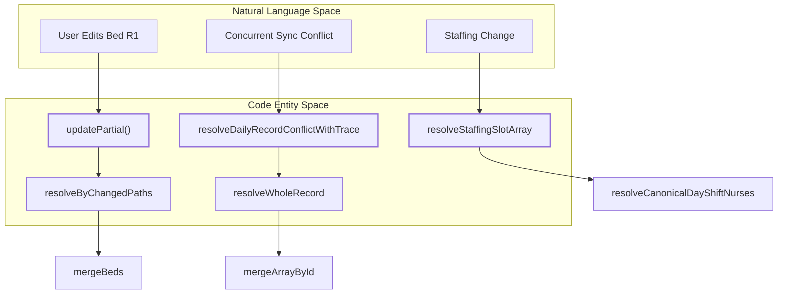
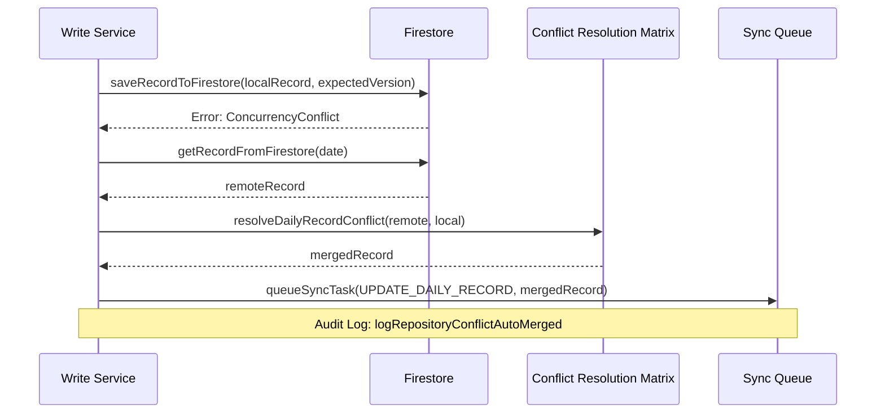

# Conflict Resolution

# Conflict Resolution

Relevant source files

The following files were used as context for generating this wiki page:

- [scripts/check-rules-source-governance.mjs](scripts/check-rules-source-governance.mjs)
- [scripts/rulesSourceGovernanceSupport.mjs](scripts/rulesSourceGovernanceSupport.mjs)
- [src/services/repositories/CatalogRepository.ts](src/services/repositories/CatalogRepository.ts)
- [src/services/repositories/conflictResolutionDeviceMergeUtils.ts](src/services/repositories/conflictResolutionDeviceMergeUtils.ts)
- [src/services/repositories/conflictResolutionMatrix.ts](src/services/repositories/conflictResolutionMatrix.ts)
- [src/services/repositories/conflictResolutionMergeUtils.ts](src/services/repositories/conflictResolutionMergeUtils.ts)
- [src/services/repositories/conflictResolutionPolicy.ts](src/services/repositories/conflictResolutionPolicy.ts)
- [src/services/repositories/conflictResolutionStaffingMergeUtils.ts](src/services/repositories/conflictResolutionStaffingMergeUtils.ts)
- [src/services/repositories/conflictResolutionTrace.ts](src/services/repositories/conflictResolutionTrace.ts)
- [src/services/repositories/legacyRecordBridgeService.ts](src/services/repositories/legacyRecordBridgeService.ts)
- [src/services/repositories/ports/repositoryLegacyBridgePort.ts](src/services/repositories/ports/repositoryLegacyBridgePort.ts)
- [src/services/storage/migration/legacyCatalogReadBridge.ts](src/services/storage/migration/legacyCatalogReadBridge.ts)
- [src/services/storage/migration/legacyFirestoreBridge.ts](src/services/storage/migration/legacyFirestoreBridge.ts)
- [src/services/storage/migration/legacyRecordReadBridge.ts](src/services/storage/migration/legacyRecordReadBridge.ts)
- [src/tests/emulator-ui/dailyRecordSyncQuery.emulator-ui.test.tsx](src/tests/emulator-ui/dailyRecordSyncQuery.emulator-ui.test.tsx)
- [src/tests/emulator/sync-concurrency.emulator.test.ts](src/tests/emulator/sync-concurrency.emulator.test.ts)
- [src/tests/repro/cie10Copy.test.ts](src/tests/repro/cie10Copy.test.ts)
- [src/tests/security/firestoreRulesAccessGroups.ts](src/tests/security/firestoreRulesAccessGroups.ts)
- [src/tests/security/firestoreRulesEmulatorConfig.test.ts](src/tests/security/firestoreRulesEmulatorConfig.test.ts)
- [src/tests/security/firestoreRulesEmulatorConfig.ts](src/tests/security/firestoreRulesEmulatorConfig.ts)
- [src/tests/security/firestoreRulesTestHarness.ts](src/tests/security/firestoreRulesTestHarness.ts)
- [src/tests/services/repositories/CatalogRepository.test.ts](src/tests/services/repositories/CatalogRepository.test.ts)
- [src/tests/services/repositories/DailyRecordRepository.lifecycle-support.ts](src/tests/services/repositories/DailyRecordRepository.lifecycle-support.ts)
- [src/tests/services/repositories/DailyRecordRepository.reads.test.ts](src/tests/services/repositories/DailyRecordRepository.reads.test.ts)
- [src/tests/services/repositories/conflictResolutionMatrix.test.ts](src/tests/services/repositories/conflictResolutionMatrix.test.ts)
- [src/tests/services/repositories/dailyRecordRepositoryWriteServiceAutoMerge.test.ts](src/tests/services/repositories/dailyRecordRepositoryWriteServiceAutoMerge.test.ts)
- [src/tests/services/repositories/legacyBridgeAudit.test.ts](src/tests/services/repositories/legacyBridgeAudit.test.ts)
- [src/tests/services/repositories/legacyRecordBridgeService.test.ts](src/tests/services/repositories/legacyRecordBridgeService.test.ts)

The HHR system utilizes a sophisticated conflict resolution engine to maintain data integrity across distributed clients (web browsers) and the central Firestore database. Because the application follows an **offline-first** approach, multiple users may edit the same `DailyRecord` concurrently while offline or during synchronization delays. The system employs a **Last-Write-Wins (LWW)** strategy at the record level, but enhances it with a **Conflict Resolution Matrix** that performs deep, domain-aware merging of specific fields to prevent data loss.

## Conflict Resolution Matrix

The core of the resolution logic resides in `resolveDailyRecordConflict` [src/services/repositories/conflictResolutionMatrix.ts:49-55](). This function takes a `remote` record (the current state in Firestore) and a `local` record (the state the client is trying to save) and produces a merged version.

The resolution process follows two primary paths:

1.  **Resolution by Changed Paths**: If the client provides a list of specific fields that were modified (e.g., `beds.R1.patientName`), the system applies only those changes to the remote baseline [src/services/repositories/conflictResolutionMatrix.ts:74-79]().
2.  **Whole Record Resolution**: If no paths are provided (or a wildcard `*` is used), the system performs a full merge based on the `lastUpdated` timestamps [src/services/repositories/conflictResolutionMatrix.ts:82-188]().

### Domain Policies

The resolution engine does not treat all data equally. It applies different policies based on the clinical or administrative context of the data:

| Policy Context     | Logic Description                                                                                          | Code Entity |
| :----------------- | :--------------------------------------------------------------------------------------------------------- | :---------- |
| **Clinical**       | Prioritizes the most recent update but preserves clinical history in arrays.                               | `clinical`  |
| **Administrative** | Movements (transfers/discharges) are merged via ID-based union to ensure no patient movement is lost.      | `movements` |
| **Staffing**       | Merges staffing slots by position to prevent "shuffling" assignments when multiple admins edit the roster. | `staffing`  |
| **Handoff**        | Performs deep object merging for checklists and novedades.                                                 | `handoff`   |

**Sources:** [src/services/repositories/conflictResolutionMergeUtils.ts:31-53](), [src/services/repositories/conflictResolutionMatrix.ts:92-137]()

## Implementation Detail: Code to Entity Mapping

The following diagram maps natural language concepts to the specific code entities responsible for executing the resolution logic.

### Logic Flow Mapping

**Sources:** [src/services/repositories/conflictResolutionMatrix.ts:57-80](), [src/services/repositories/conflictResolutionMergeUtils.ts:212-230](), [src/services/repositories/conflictResolutionStaffingMergeUtils.ts:37-45]()

## Merging Strategies

### ID-Based Array Merging

For arrays representing unique events (discharges, transfers, CMA), the system uses `mergeArrayById` [src/services/repositories/conflictResolutionMergeUtils.ts:76-104]().

- It generates a unique ID for each item (or uses the existing `id` field).
- It performs a union of the remote and local arrays.
- If an ID exists in both, the local version overrides the remote version to preserve the user's intent [src/tests/services/repositories/conflictResolutionMatrix.test.ts:47-67]().

### Staffing Slot Merging

Staffing data (Nurses and TENS) is managed through fixed-length arrays representing slots. The system uses `resolveStaffingSlotArray` to prevent remote assignments from being accidentally cleared by stale local "empty" slots [src/services/repositories/conflictResolutionStaffingMergeUtils.ts:37-45]().

- **Position-based merging**: It merges slots by their index.
- **Assigned over Vacant**: If a remote slot has a name and the local slot is empty, the remote name is preserved unless the local edit specifically targeted that staffing field [src/tests/services/repositories/conflictResolutionMatrix.test.ts:142-156]().

### Device Management

Patient devices (e.g., Oxygen, IV) require a specialized merge in `mergePatientDevices` [src/services/repositories/conflictResolutionDeviceMergeUtils.ts:40-83]().

- **Intentional Clear Heuristic**: If a device is present in the remote record but absent in the local record, the system checks `deviceDetails` for a `removalDate`. If a removal date exists, the device is considered "intentionally retired" and removed from the merged result [src/services/repositories/conflictResolutionDeviceMergeUtils.ts:63-69]().

## Concurrency Recovery Pipeline

When a write operation fails due to a `ConcurrencyError` (detected by Firestore security rules or version mismatch), the system triggers an automatic recovery pipeline.

**Sources:** [src/tests/services/repositories/dailyRecordRepositoryWriteServiceAutoMerge.test.ts:105-146](), [src/services/storage/firestore/firestoreRecordWrites.ts:31-35]()

### Conflict Tracing

Every resolution produces a `ConflictResolutionTrace` [src/services/repositories/conflictResolutionTrace.ts:21-24](). This trace contains a list of `ConflictResolutionTraceEntry` objects that detail exactly which strategy was used for every merged field (e.g., `strategy: 'merge_array_by_id'`, `winner: 'merged'`, `reason: 'movements_union_preserve_local_override'`) [src/services/repositories/conflictResolutionTrace.ts:14-19](). These traces are logged via `logRepositoryConflictAutoMerged` for administrative review [src/tests/services/repositories/dailyRecordRepositoryWriteServiceAutoMerge.test.ts:134-145]().

## Intentional Clear Heuristic

A common problem in LWW systems is the "stale clear": a user opens a record, another user adds data, and then the first user saves their (empty) record, wiping out the new data. HHR mitigates this via `isLocallyClearedPatient` [src/services/repositories/conflictResolutionMergeUtils.ts:201-210]().

- If a patient's identity (Name, RUT, Pathology) is completely empty in the local record but present in the remote record, the system assumes the local record is "stale" and preserves the remote patient data [src/services/repositories/conflictResolutionMergeUtils.ts:223-228]().
- This is bypassed only if the `changedPaths` explicitly indicate that the user intended to clear that specific bed [src/services/repositories/conflictResolutionMergeUtils.ts:217-221]().

**Sources:** [src/services/repositories/conflictResolutionMergeUtils.ts:188-210](), [src/tests/services/repositories/conflictResolutionMatrix.test.ts:114-126]()

---
