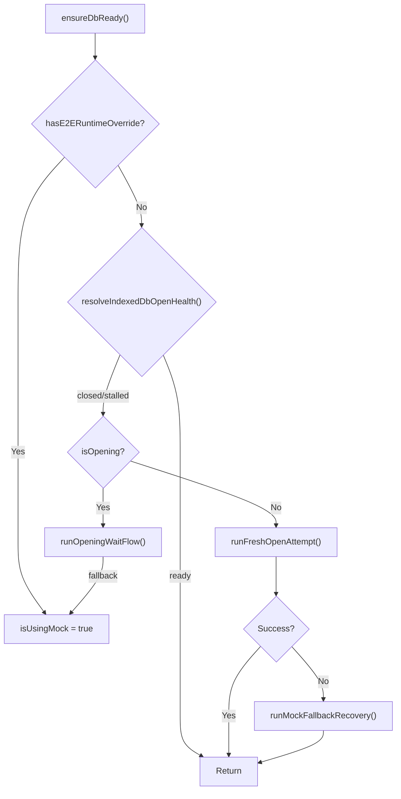
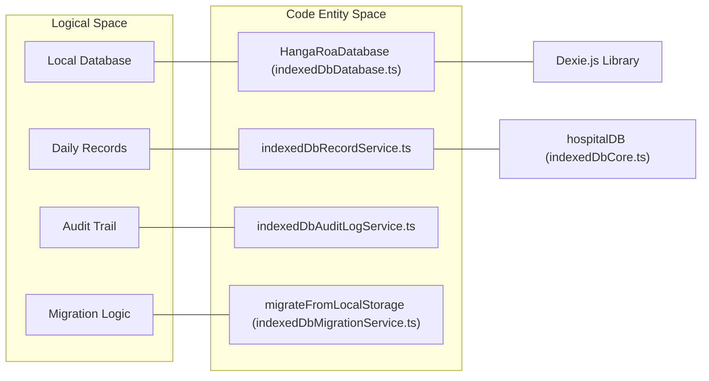

# IndexedDB Storage Layer

# IndexedDB Storage Layer

Relevant source files

The following files were used as context for generating this wiki page:

- [reports/architectural-hotspots.json](reports/architectural-hotspots.json)
- [reports/architectural-hotspots.md](reports/architectural-hotspots.md)
- [src/services/admin/dataMaintenanceSupport.ts](src/services/admin/dataMaintenanceSupport.ts)
- [src/services/records/recordQueryService.ts](src/services/records/recordQueryService.ts)
- [src/services/repositories/dailyRecordRepositoryFacadeSupport.ts](src/services/repositories/dailyRecordRepositoryFacadeSupport.ts)
- [src/services/storage/indexedDBService.ts](src/services/storage/indexedDBService.ts)
- [src/services/storage/indexeddb/indexedDbCore.ts](src/services/storage/indexeddb/indexedDbCore.ts)
- [src/services/storage/indexeddb/indexedDbCoreFlows.ts](src/services/storage/indexeddb/indexedDbCoreFlows.ts)
- [src/services/storage/indexeddb/indexedDbCoreRecovery.ts](src/services/storage/indexeddb/indexedDbCoreRecovery.ts)
- [src/services/storage/indexeddb/indexedDbMigrationService.ts](src/services/storage/indexeddb/indexedDbMigrationService.ts)
- [src/services/storage/indexeddb/indexedDbRecordService.ts](src/services/storage/indexeddb/indexedDbRecordService.ts)
- [src/services/storage/localStorageService.ts](src/services/storage/localStorageService.ts)
- [src/services/storage/localpersistence/localPersistenceService.ts](src/services/storage/localpersistence/localPersistenceService.ts)
- [src/services/storage/localstorage/localStorageCore.ts](src/services/storage/localstorage/localStorageCore.ts)
- [src/services/storage/unifiedLocalService.ts](src/services/storage/unifiedLocalService.ts)
- [src/tests/services/excelExport.reportService.test.ts](src/tests/services/excelExport.reportService.test.ts)
- [src/tests/services/excelExport.testUtils.ts](src/tests/services/excelExport.testUtils.ts)
- [src/tests/services/storage/indexedDbCoreFlows.test.ts](src/tests/services/storage/indexedDbCoreFlows.test.ts)
- [src/tests/services/storage/indexedDbCoreRecovery.test.ts](src/tests/services/storage/indexedDbCoreRecovery.test.ts)
- [src/tests/services/storage/unifiedLocalService.test.ts](src/tests/services/storage/unifiedLocalService.test.ts)
- [src/tests/utils/clinicalDateUtils.test.ts](src/tests/utils/clinicalDateUtils.test.ts)
- [src/tests/utils/clinicalDayUtilsEntrypointGovernanceStatic.test.ts](src/tests/utils/clinicalDayUtilsEntrypointGovernanceStatic.test.ts)
- [src/tests/utils/dateUtils.test.ts](src/tests/utils/dateUtils.test.ts)
- [src/tests/views/census/censusStaffHeaderController.test.ts](src/tests/views/census/censusStaffHeaderController.test.ts)
- [src/utils/clinicalDateUtils.ts](src/utils/clinicalDateUtils.ts)
- [src/utils/clinicalDayAdmissionUtils.ts](src/utils/clinicalDayAdmissionUtils.ts)
- [src/utils/clinicalDayScheduleUtils.ts](src/utils/clinicalDayScheduleUtils.ts)
- [src/utils/clinicalDayUtils.ts](src/utils/clinicalDayUtils.ts)
- [src/utils/clinicalStayDayUtils.ts](src/utils/clinicalStayDayUtils.ts)

The IndexedDB storage layer provides the primary persistence mechanism for the HHR system, enabling offline-first capabilities and high-performance local data access. It is built on top of **Dexie.js** and includes robust recovery mechanisms, a fallback in-memory/localStorage mode, and a migration path from legacy storage.

## Core Orchestration: indexedDbCore

The `indexedDbCore.ts` module is the central orchestrator for database lifecycle management. It manages the `HangaRoaDatabase` instance and ensures the database is ready before any operation is performed via `ensureDbReady`.

### Implementation Details

- **Singleton Instance**: Exports `hospitalDB` as the global database instance [src/services/storage/indexeddb/indexedDbCore.ts:165-165]().
- **Health Monitoring**: Uses `resolveIndexedDbOpenHealth` to detect unexpected closures or stalled opening processes [src/services/storage/indexeddb/indexedDbCore.ts:95-107]().
- **Fallback Management**: If IndexedDB fails to open after retries, the system switches to `isUsingMock = true`, which redirects operations to a temporary in-memory or `localStorage` store [src/services/storage/indexeddb/indexedDbCore.ts:122-123]().
- **Background Recovery**: When in fallback mode, a `backgroundRecoveryScheduler` is activated to periodically attempt to re-establish a real IndexedDB connection [src/services/storage/indexeddb/indexedDbCore.ts:28-33]().

### Database Ready Flow

The following diagram illustrates the `ensureDbReady` decision logic:

**IndexedDB Initialization and Recovery Flow**

Sources: [src/services/storage/indexeddb/indexedDbCore.ts:70-152](), [src/services/storage/indexeddb/indexedDbCoreFlows.ts:107-145]()

## Database Schema and Dexie.js Integration

The system uses `HangaRoaDatabase`, a class extending `Dexie`, to define the schema and handle migrations.

### Schema Entities

| Table          | Key          | Description                                           |
| :------------- | :----------- | :---------------------------------------------------- |
| `dailyRecords` | `date` (ISO) | Stores the `DailyRecord` clinical state for each day. |
| `auditLogs`    | `id`         | Local buffer for audit trail entries.                 |
| `catalogs`     | `id`         | Key-value store for staff lists (nurses, TENS).       |
| `settings`     | `id`         | Application-wide configuration and UI states.         |
| `errorLogs`    | `id`         | Telemetry for local failures.                         |

Sources: [src/services/storage/indexeddb/indexedDbDatabase.ts:2-10](), [src/services/storage/indexeddb/indexedDbRecordService.ts:38-38]()

## Record Service: indexedDbRecordService

This service provides the high-level API for interacting with clinical records, abstracting the complexity of the fallback mode.

### Key Functions

- `getRecordForDate(date)`: Retrieves a record by its ISO date string. If in fallback mode, it queries `localPersistence.records` [src/services/storage/indexeddb/indexedDbRecordService.ts:95-115]().
- `saveRecord(record)`: Persists a `DailyRecord`. It also triggers `syncE2ERuntimeRecordMirror` for testing environments and dispatches a store change event [src/services/storage/indexeddb/indexedDbRecordService.ts:117-138]().
- `getRecordsForMonth(year, month)`: Uses Dexie's `startsWith` on the date index to efficiently fetch a month's data [src/services/storage/indexeddb/indexedDbRecordService.ts:51-70]().
- `getRecordsRange(start, end)`: Uses Dexie's `between` query for range-based retrieval [src/services/storage/indexeddb/indexedDbRecordService.ts:72-93]().

Sources: [src/services/storage/indexeddb/indexedDbRecordService.ts:10-195]()

## Recovery and Maintenance

### Recovery Pipeline (`indexedDbCoreRecovery`)

When the database fails to initialize, `recoverIndexedDbInitialOpenRuntimeFailure` attempts several steps:

1. **Retry**: Multiple open attempts with backoff.
2. **Recreate**: If the schema is corrupted, it may attempt to delete and recreate the database.
3. **Fallback**: If all else fails, it transitions to the mock storage to prevent app crashes [src/services/storage/indexeddb/indexedDbCoreFlows.ts:130-144]().

### Maintenance Service

The `indexedDbMaintenanceService` provides tools for administrative data management:

- `performClientHardReset()`: Clears all IndexedDB tables, `localStorage`, and registered service workers to return the client to a clean state [src/services/storage/indexeddb/indexedDbMaintenanceService.ts:52-52]().
- `resetLocalDatabase()`: Specifically targets the IndexedDB instance for clearing [src/services/storage/indexeddb/indexedDbMaintenanceService.ts:51-51]().

Sources: [src/services/storage/indexedDBService.ts:50-54](), [src/services/storage/indexeddb/indexedDbCoreFlows.ts:49-66]()

## Data Migration

The `indexedDbMigrationService` handles the one-time transition of data from legacy `localStorage` keys to IndexedDB.

- **Trigger**: Runs during bootstrap if `indexeddb_migration_complete` is not set [src/services/storage/indexeddb/indexedDbMigrationService.ts:24-36]().
- **Scope**: Migrates `dailyRecords`, `nurses`, `tens`, and `auditLogs` [src/services/storage/indexeddb/indexedDbMigrationService.ts:41-68]().
- **Resilience**: If the database is recreated during a session, the migration flag is cleared to re-attempt data restoration from legacy storage [src/services/storage/indexeddb/indexedDbMigrationService.ts:82-86]().

Sources: [src/services/storage/indexeddb/indexedDbMigrationService.ts:1-80]()

## Clinical Day Utilities

Clinical logic depends on a "Clinical Day" definition which does not align with calendar midnights (e.g., shifts starting at 08:00 or 09:00).

### Utility Logic

- `resolveClinicalDayForDateTime(date, time)`: Determines the clinical date for a specific timestamp. For example, an admission at 02:00 AM on March 11th is assigned to the clinical day of March 10th [src/tests/utils/dateUtils.test.ts:190-194]().
- `getShiftSchedule(date)`: Returns the start/end times and descriptions for shifts based on whether the day is a business day or holiday [src/tests/utils/dateUtils.test.ts:148-176]().
- `resolveClinicalDayBounds(date)`: Calculates the exact minute-based boundaries for a clinical day [src/tests/utils/dateUtils.test.ts:178-187]().

Sources: [src/utils/clinicalDayUtils.ts:1-18](), [src/tests/utils/dateUtils.test.ts:129-204]()

## Entity Mapping: Code to System Space

This diagram maps the logical storage components to their specific code implementations.

**Storage Entity Mapping**

Sources: [src/services/storage/indexeddb/indexedDbCore.ts:165-167](), [src/services/storage/indexeddb/indexedDbRecordService.ts:7-8](), [src/services/storage/indexeddb/indexedDbMigrationService.ts:24-24]()

---
