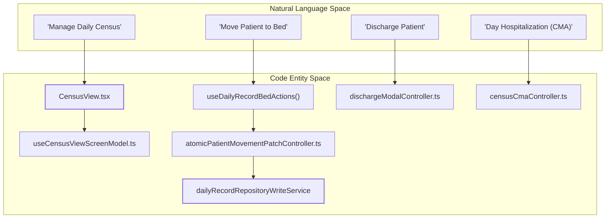
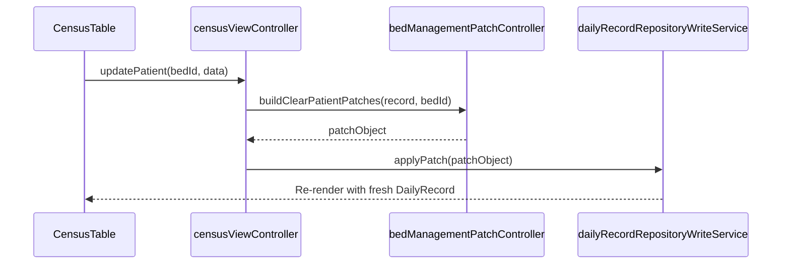

# Census Module

# Census Module

Relevant source files

The following files were used as context for generating this wiki page:

- [docs/ADR_CANONICAL_WRITE_ADOPTION_FACADES.md](docs/ADR_CANONICAL_WRITE_ADOPTION_FACADES.md)
- [docs/ADR_CANONICAL_WRITE_COMMANDS.md](docs/ADR_CANONICAL_WRITE_COMMANDS.md)
- [docs/TECHNICAL_DEBT_REGISTER.md](docs/TECHNICAL_DEBT_REGISTER.md)
- [src/application/census/cmaUndoPatchUseCase.ts](src/application/census/cmaUndoPatchUseCase.ts)
- [src/application/census/public.ts](src/application/census/public.ts)
- [src/application/shared/dailyRecordContracts.ts](src/application/shared/dailyRecordContracts.ts)
- [src/context/README.md](src/context/README.md)
- [src/context/dailyRecordContextContracts.ts](src/context/dailyRecordContextContracts.ts)
- [src/context/useDailyRecordFragmentedValues.ts](src/context/useDailyRecordFragmentedValues.ts)
- [src/context/useDailyRecordScopedActions.ts](src/context/useDailyRecordScopedActions.ts)
- [src/features/admin/controllers/publicMedicalSignatureContextController.ts](src/features/admin/controllers/publicMedicalSignatureContextController.ts)
- [src/features/census/components/CMASection.tsx](src/features/census/components/CMASection.tsx)
- [src/features/census/components/CensusRegisterMainContent.tsx](src/features/census/components/CensusRegisterMainContent.tsx)
- [src/features/census/components/CensusTable.tsx](src/features/census/components/CensusTable.tsx)
- [src/features/census/components/CensusView.tsx](src/features/census/components/CensusView.tsx)
- [src/features/census/components/EmptyDayPrompt.tsx](src/features/census/components/EmptyDayPrompt.tsx)
- [src/features/census/controllers/admitPatientGate.ts](src/features/census/controllers/admitPatientGate.ts)
- [src/features/census/controllers/censusCmaController.ts](src/features/census/controllers/censusCmaController.ts)
- [src/features/census/controllers/censusCreateDayAvailabilityController.ts](src/features/census/controllers/censusCreateDayAvailabilityController.ts)
- [src/features/census/controllers/censusViewController.ts](src/features/census/controllers/censusViewController.ts)
- [src/features/census/controllers/patientMovementUndoMutationController.ts](src/features/census/controllers/patientMovementUndoMutationController.ts)
- [src/features/census/controllers/transferCanonicalAdoptionController.ts](src/features/census/controllers/transferCanonicalAdoptionController.ts)
- [src/features/census/hooks/useCensusViewRouteModel.ts](src/features/census/hooks/useCensusViewRouteModel.ts)
- [src/features/census/hooks/useCensusViewScreenModel.ts](src/features/census/hooks/useCensusViewScreenModel.ts)
- [src/features/census/hooks/useCmaSectionActions.ts](src/features/census/hooks/useCmaSectionActions.ts)
- [src/features/census/hooks/useCmaSectionModel.ts](src/features/census/hooks/useCmaSectionModel.ts)
- [src/hooks/contracts/dailyRecordHookContracts.ts](src/hooks/contracts/dailyRecordHookContracts.ts)
- [src/hooks/controllers/dailyRecordBootstrapController.ts](src/hooks/controllers/dailyRecordBootstrapController.ts)
- [src/hooks/useCMA.ts](src/hooks/useCMA.ts)
- [src/hooks/useCensusLogic.ts](src/hooks/useCensusLogic.ts)
- [src/hooks/useDailyRecord.ts](src/hooks/useDailyRecord.ts)
- [src/hooks/useDailyRecordTypes.ts](src/hooks/useDailyRecordTypes.ts)
- [src/hooks/usePatientMovementAudit.ts](src/hooks/usePatientMovementAudit.ts)
- [src/hooks/usePersistence.ts](src/hooks/usePersistence.ts)
- [src/services/utils/featureFlags.ts](src/services/utils/featureFlags.ts)
- [src/tests/context/DailyRecordContext.test.tsx](src/tests/context/DailyRecordContext.test.tsx)
- [src/tests/features/census/admitPatientGate.test.ts](src/tests/features/census/admitPatientGate.test.ts)
- [src/tests/features/census/transferCanonicalAdoptionController.test.ts](src/tests/features/census/transferCanonicalAdoptionController.test.ts)
- [src/tests/hooks/controllers/dailyRecordBootstrapController.test.ts](src/tests/hooks/controllers/dailyRecordBootstrapController.test.ts)
- [src/tests/hooks/useFeatureFlag.test.ts](src/tests/hooks/useFeatureFlag.test.ts)
- [src/tests/integration/permissions.test.ts](src/tests/integration/permissions.test.ts)
- [src/tests/integration/setup.tsx](src/tests/integration/setup.tsx)
- [src/tests/security/originalDataBusinessUsageStatic.test.ts](src/tests/security/originalDataBusinessUsageStatic.test.ts)
- [src/tests/utils/permissions.test.ts](src/tests/utils/permissions.test.ts)
- [src/tests/views/census/CensusView.test.tsx](src/tests/views/census/CensusView.test.tsx)
- [src/tests/views/census/EmptyDayPrompt.test.tsx](src/tests/views/census/EmptyDayPrompt.test.tsx)
- [src/tests/views/census/censusCmaController.test.ts](src/tests/views/census/censusCmaController.test.ts)
- [src/tests/views/census/censusCreateDayAvailabilityController.test.ts](src/tests/views/census/censusCreateDayAvailabilityController.test.ts)
- [src/tests/views/census/censusViewController.test.ts](src/tests/views/census/censusViewController.test.ts)
- [src/tests/views/census/patientMovementUndoMutationController.test.ts](src/tests/views/census/patientMovementUndoMutationController.test.ts)

The **Census Module** is the core clinical module of the HHR system, responsible for the daily management of hospital beds, patient identities, and clinical movements. It provides a real-time representation of the hospital's state for any given date, facilitating coordination between nursing and medical staff.

The module is designed with an offline-first approach, utilizing the `DailyRecord` as its primary data structure [src/application/shared/dailyRecordCoreContracts.ts:4-7](). It supports complex workflows including admissions, bed transfers, discharges, and Day Hospitalization (CMA) management.

## Module Structure & Code Entities

The Census module bridges high-level clinical actions to low-level repository patches. The following diagram illustrates how clinical concepts map to specific code controllers and components.

### Clinical to Code Mapping

Sources: [src/features/census/components/CensusView.tsx:3-4](), [src/application/census/public.ts:16-25](), [src/features/census/controllers/censusCmaController.ts:90-93]()

## Key Features

### 1. Daily Census Lifecycle

The module operates on a per-date basis. If a record does not exist for the selected date, the system presents an `EmptyDayPrompt` [src/features/census/components/EmptyDayPrompt.tsx:32-43]().

- **Initialization:** Users can create a new day by copying from a previous record or starting blank [src/features/census/controllers/censusCreateDayAvailabilityController.ts:7-8]().
- **Locking Rules:** Copying from the previous day is restricted until 08:00 AM for the current date to prevent premature state duplication [src/tests/views/census/EmptyDayPrompt.test.tsx:19-38]().

For details, see [Census View & Table](#5.1).

### 2. Bed & Patient Management

The `CensusTable` is the primary interface for managing hospital beds.

- **Identity Management:** Patient data (Name, RUT, Age, Diagnosis) is managed via the `DemographicsModal` [src/features/census/components/CensusTable.tsx:22-26]().
- **Bed Actions:** Supports drag-and-drop for moving patients between beds, managed by `useCensusTableDragDrop` [src/features/census/components/CensusTable.tsx:58]().
- **Clinical Status:** Tracks UPC status, isolation requirements, and medical devices.

For details, see [Patient Row & Bed Management](#5.2).

### 3. Patient Movements

The system tracks the lifecycle of patient movements through specialized controllers:

- **Admissions:** Handled by `admitPatientGate`, which validates inputs and triggers the `admit-command` [src/features/census/controllers/admitPatientGate.ts:79-88]().
- **CMA (Cirugía Mayor Ambulatoria):** Manages day-hospitalization patients. It includes a specialized "Undo" logic that restores the patient to their original bed using `buildUndoCmaPatch` [src/application/census/cmaUndoPatchUseCase.ts:6]().
- **Discharges & Transfers:** Atomic movements are persisted via the `atomicPatientMovementPatchController` to ensure data integrity [src/application/census/public.ts:16]().

For details, see [Patient Movements (Admissions, Discharges, Transfers)](#5.3).

## Technical Architecture

The module follows a controller-service pattern where the UI components interact with specialized hooks that encapsulate business logic and repository calls.

### Census Data Flow

Sources: [src/features/census/components/CensusTable.tsx:73-83](), [src/hooks/controllers/bedManagementPatchController.ts:11](), [src/application/shared/dailyRecordCoreContracts.ts:42]()

### CMA Management Logic

The `censusCmaController` handles the lifecycle of ambulatory patients. It allows for the deletion or restoration of CMA records, ensuring that if a patient is "restored" (undoing an ambulatory discharge), they are returned to their original bed with all their previous clinical data intact [src/features/census/controllers/censusCmaController.ts:90-126]().

Sources: [src/features/census/controllers/censusCmaController.ts:11-21](), [src/hooks/useCMA.ts:49-89]()

## Child Pages

- **[Census View & Table](#5.1)**: Navigation, rendering logic, and the `EmptyDayPrompt` diagnostic system.
- **[Patient Row & Bed Management](#5.2)**: Detail on `PatientRow` components, bed management reducers, and the demographics modal.
- **[Patient Movements (Admissions, Discharges, Transfers)](#5.3)**: Lifecycle of admissions, discharges, and the atomic patch pattern for transfers.
- **[Global Patient Search & Patient Master](#5.4)**: Cross-day patient history and the `PatientMaster` synchronization.
- **[Census Email & Excel Export](#5.5)**: Integration with Gmail API and automated Excel report generation.

---
