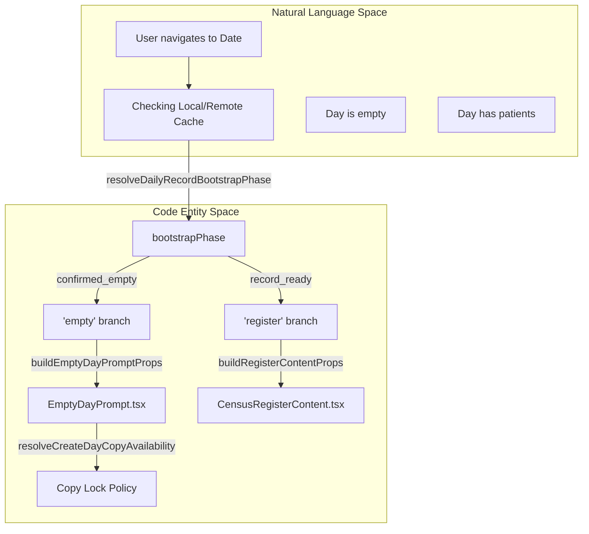
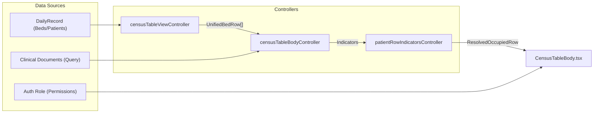

# Census View & Table

# Census View & Table

Relevant source files

The following files were used as context for generating this wiki page:

- [docs/superpowers/plans/2026-05-02-wound-care-mobile-qr-upload.md](docs/superpowers/plans/2026-05-02-wound-care-mobile-qr-upload.md)
- [functions/lib/woundCareMobileUploadFunctions.js](functions/lib/woundCareMobileUploadFunctions.js)
- [src/application/shared/dailyRecordContracts.ts](src/application/shared/dailyRecordContracts.ts)
- [src/application/wound-care/woundCareMobileUploadSessionUseCases.ts](src/application/wound-care/woundCareMobileUploadSessionUseCases.ts)
- [src/components/ui/Skeleton.tsx](src/components/ui/Skeleton.tsx)
- [src/components/ui/ViewLoader.tsx](src/components/ui/ViewLoader.tsx)
- [src/context/README.md](src/context/README.md)
- [src/features/census/components/CensusRegisterContent.tsx](src/features/census/components/CensusRegisterContent.tsx)
- [src/features/census/components/CensusRegisterMainContent.tsx](src/features/census/components/CensusRegisterMainContent.tsx)
- [src/features/census/components/CensusRegisterSections.tsx](src/features/census/components/CensusRegisterSections.tsx)
- [src/features/census/components/CensusTableBody.tsx](src/features/census/components/CensusTableBody.tsx)
- [src/features/census/components/CensusView.tsx](src/features/census/components/CensusView.tsx)
- [src/features/census/components/EmptyBedRow.tsx](src/features/census/components/EmptyBedRow.tsx)
- [src/features/census/components/EmptyDayPrompt.tsx](src/features/census/components/EmptyDayPrompt.tsx)
- [src/features/census/controllers/censusCreateDayAvailabilityController.ts](src/features/census/controllers/censusCreateDayAvailabilityController.ts)
- [src/features/census/controllers/censusTableBodyController.ts](src/features/census/controllers/censusTableBodyController.ts)
- [src/features/census/controllers/censusTableHeaderController.ts](src/features/census/controllers/censusTableHeaderController.ts)
- [src/features/census/controllers/censusTableLayoutController.ts](src/features/census/controllers/censusTableLayoutController.ts)
- [src/features/census/controllers/censusTableViewController.ts](src/features/census/controllers/censusTableViewController.ts)
- [src/features/census/controllers/censusViewController.ts](src/features/census/controllers/censusViewController.ts)
- [src/features/census/controllers/patientRowIndicatorsController.ts](src/features/census/controllers/patientRowIndicatorsController.ts)
- [src/features/census/hooks/useCensusTableBindingsModel.ts](src/features/census/hooks/useCensusTableBindingsModel.ts)
- [src/features/census/hooks/useCensusTableModel.ts](src/features/census/hooks/useCensusTableModel.ts)
- [src/features/census/hooks/useCensusViewRouteModel.ts](src/features/census/hooks/useCensusViewRouteModel.ts)
- [src/features/census/hooks/useCensusViewScreenModel.ts](src/features/census/hooks/useCensusViewScreenModel.ts)
- [src/features/census/hooks/useClinicalDocumentPresenceByBed.ts](src/features/census/hooks/useClinicalDocumentPresenceByBed.ts)
- [src/features/census/hooks/useDeferredCensusEnhancement.ts](src/features/census/hooks/useDeferredCensusEnhancement.ts)
- [src/features/census/types/censusTableComponentContracts.ts](src/features/census/types/censusTableComponentContracts.ts)
- [src/hooks/contracts/dailyRecordHookContracts.ts](src/hooks/contracts/dailyRecordHookContracts.ts)
- [src/hooks/controllers/dailyRecordBootstrapController.ts](src/hooks/controllers/dailyRecordBootstrapController.ts)
- [src/hooks/useCensusLogic.ts](src/hooks/useCensusLogic.ts)
- [src/hooks/useDailyRecordTypes.ts](src/hooks/useDailyRecordTypes.ts)
- [src/hooks/usePersistence.ts](src/hooks/usePersistence.ts)
- [src/tests/application/wound-care/woundCareMobileUploadSessionUseCases.test.ts](src/tests/application/wound-care/woundCareMobileUploadSessionUseCases.test.ts)
- [src/tests/features/census/useClinicalDocumentPresenceByBed.test.tsx](src/tests/features/census/useClinicalDocumentPresenceByBed.test.tsx)
- [src/tests/features/clinical-documents/clinicalDocumentPdfRenderService.test.ts](src/tests/features/clinical-documents/clinicalDocumentPdfRenderService.test.ts)
- [src/tests/functions/woundCareMobileUploadFunctions.test.ts](src/tests/functions/woundCareMobileUploadFunctions.test.ts)
- [src/tests/hooks/controllers/dailyRecordBootstrapController.test.ts](src/tests/hooks/controllers/dailyRecordBootstrapController.test.ts)
- [src/tests/integration/permissions.test.ts](src/tests/integration/permissions.test.ts)
- [src/tests/services/repositories/patientMasterContracts.test.ts](src/tests/services/repositories/patientMasterContracts.test.ts)
- [src/tests/utils/permissions.test.ts](src/tests/utils/permissions.test.ts)
- [src/tests/views/census/CensusRegisterContent.test.tsx](src/tests/views/census/CensusRegisterContent.test.tsx)
- [src/tests/views/census/CensusTable.clinical-indicators.test.tsx](src/tests/views/census/CensusTable.clinical-indicators.test.tsx)
- [src/tests/views/census/CensusView.test.tsx](src/tests/views/census/CensusView.test.tsx)
- [src/tests/views/census/EmptyDayPrompt.test.tsx](src/tests/views/census/EmptyDayPrompt.test.tsx)
- [src/tests/views/census/censusCreateDayAvailabilityController.test.ts](src/tests/views/census/censusCreateDayAvailabilityController.test.ts)
- [src/tests/views/census/censusTableHeaderController.test.ts](src/tests/views/census/censusTableHeaderController.test.ts)
- [src/tests/views/census/censusTableLayoutController.test.ts](src/tests/views/census/censusTableLayoutController.test.ts)
- [src/tests/views/census/censusTableViewController.test.ts](src/tests/views/census/censusTableViewController.test.ts)
- [src/tests/views/census/censusViewController.test.ts](src/tests/views/census/censusViewController.test.ts)
- [src/tests/views/census/patientRowIndicatorsController.test.ts](src/tests/views/census/patientRowIndicatorsController.test.ts)
- [src/tests/views/census/useCensusTableBindingsModel.test.ts](src/tests/views/census/useCensusTableBindingsModel.test.ts)
- [src/types/domain/woundCare.ts](src/types/domain/woundCare.ts)

The Census module is the central clinical hub of the HHR system, providing a real-time representation of hospital bed occupancy and patient status for a specific date. The Census View manages the transition between empty states (where no record exists) and the active clinical register, while the Census Table provides a high-performance grid for patient management.

## Census View Lifecycle & Navigation

The `CensusView` component acts as a router for the daily record's state. It uses `useCensusViewScreenModel` to determine whether to show a loading state, the `EmptyDayPrompt`, or the `CensusRegisterContent`.

### Data Flow and State Resolution

1.  **Date Selection**: The view receives `currentDateString` from the application shell.
2.  **Bootstrap Resolution**: `useCensusViewScreenModel` [src/features/census/hooks/useCensusViewScreenModel.ts]() consumes the `DailyRecordContext` to identify the `bootstrapPhase`.
3.  **Branching**: `resolveCensusViewBranch` [src/features/census/controllers/censusViewController.ts:43-45]() decides between `'empty'` (no data found) and `'register'` (data loaded).
4.  **Settling Period**: To prevent "flickering" of the empty state while Firestore is still syncing, `CensusView` implements an 800ms grace period [src/features/census/components/CensusView.tsx:72-75]().

### System State to Code Entity Mapping

The following diagram maps the logical states of the Census screen to the internal controller logic and UI components.

**Census View State Resolution**

Sources: [src/features/census/components/CensusView.tsx:36-51](), [src/features/census/controllers/censusViewController.ts:43-45](), [src/hooks/controllers/dailyRecordBootstrapController.ts:43-66]()

## Empty Day Prompt

When a `DailyRecord` does not exist for the selected date, the `EmptyDayPrompt` component is rendered. It provides diagnostic information and actions to initialize the day.

### Initialization Actions

- **Copy from Previous**: Allows copying patients, beds, and handoff notes from the most recent available date.
- **Copy Lock Policy**: To prevent administrative errors, copying to "Today" is locked until 08:00 AM [src/features/census/controllers/censusCreateDayAvailabilityController.ts](). A countdown is displayed using `resolveCreateDayCopyAvailability` [src/features/census/components/EmptyDayPrompt.tsx:51-54]().
- **Blank Initialization**: Allows starting a fresh census, requiring explicit confirmation.

### Diagnostics

The prompt displays a `CensusEmptyStateDiagnostic` [src/hooks/controllers/dailyRecordBootstrapController.ts:34-37]() which explains _why_ the day is empty (e.g., `remote_missing`, `sync_pending`, or `post_deploy_refresh`).

Sources: [src/features/census/components/EmptyDayPrompt.tsx:32-43](), [src/features/census/components/EmptyDayPrompt.tsx:142-174](), [src/hooks/controllers/dailyRecordBootstrapController.ts:136-188]()

## Census Table Architecture

The `CensusTable` is a complex grid that unifies bed definitions with patient data. It is managed by a series of controllers and hooks that handle layout, indicators, and row resolution.

### Row Unification

The table does not simply iterate over beds. It uses `buildCensusBedRows` [src/features/census/controllers/censusTableViewController.ts:62-81]() to create a flat list of `UnifiedBedRow` objects. This allows the system to:

1.  Render empty beds.
2.  Render occupied beds.
3.  Render "Cuna" (crib) sub-rows for pediatric/maternity contexts [src/features/census/controllers/censusTableViewController.ts:42-50]().

### Table Binding Model

`useCensusTableBindingsModel` [src/features/census/hooks/useCensusTableBindingsModel.ts:33-37]() serves as the primary data orchestrator for the table. It integrates:

- **Clinical Document Presence**: Uses `useClinicalDocumentPresenceByBed` [src/features/census/hooks/useClinicalDocumentPresenceByBed.ts:38-42]() to fetch indicators from the Clinical Documents module.
- **Discharge Detection**: Builds a set of `dischargedRuts` [src/features/census/hooks/useCensusTableBindingsModel.ts:22-31]() to identify patients who were discharged and readmitted on the same day.
- **Layout Config**: Calls `buildCensusTableLayoutBindings` [src/features/census/controllers/censusTableLayoutController.ts]() to define column widths, edit modes, and action handlers.

**Table Data Flow**

Sources: [src/features/census/hooks/useCensusTableBindingsModel.ts:38-51](), [src/features/census/controllers/censusTableBodyController.ts:12-31](), [src/features/census/controllers/censusTableViewController.ts:62-81]()

## Key Components and Controllers

| Entity                             | Role                                                                                                      | Source                                                                  |
| :--------------------------------- | :-------------------------------------------------------------------------------------------------------- | :---------------------------------------------------------------------- |
| `CensusTableBody`                  | Renders the collection of rows, managing virtualization or simple mapping.                                | [src/features/census/components/CensusTableBody.tsx]()                  |
| `censusTableLayoutController`      | Determines column visibility and widths based on `accessProfile` (e.g., 'specialist' vs 'default').       | [src/features/census/controllers/censusTableLayoutController.ts]()      |
| `useClinicalDocumentPresenceByBed` | A TanStack Query hook that fetches document counts for all patients currently in the table.               | [src/features/census/hooks/useClinicalDocumentPresenceByBed.ts:49-75]() |
| `resolvePatientRowMenuAlign`       | Logic to flip the action menu to open upwards if the row is near the bottom of the viewport.              | [src/features/census/controllers/censusTableBodyController.ts:33-35]()  |
| `useDeferredCensusEnhancement`     | Defers the loading of secondary indicators (like clinical documents) until the primary table has painted. | [src/features/census/hooks/useDeferredCensusEnhancement.ts]()           |

### Specialist Access Profile

When the `accessProfile` is set to `'specialist'`, the table layout is restricted. The `CensusRegisterContent` component skips rendering secondary sections like Discharges, Transfers, and Staffing headers to focus strictly on the patient grid [src/tests/views/census/CensusRegisterContent.test.tsx:54-78]().

Sources: [src/features/census/hooks/useCensusTableBindingsModel.ts:61-86](), [src/features/census/components/CensusRegisterContent.tsx](), [src/features/census/controllers/censusTableLayoutController.ts]()

---
