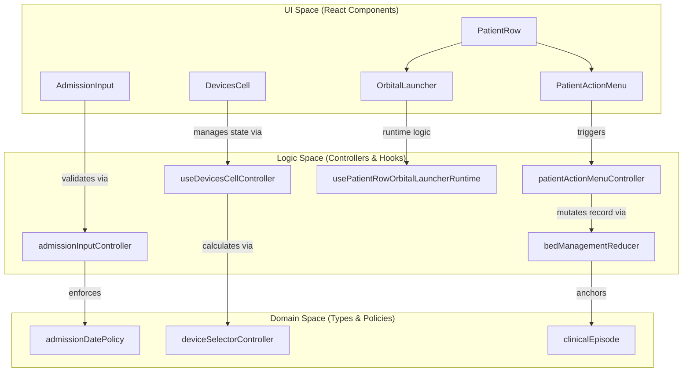
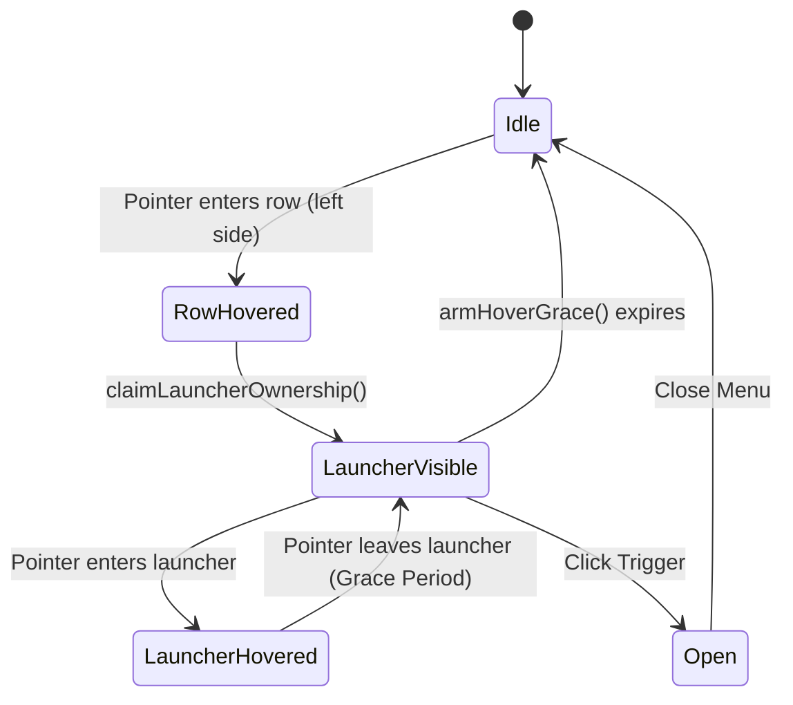

# Patient Row & Bed Management

# Patient Row & Bed Management

Relevant source files

The following files were used as context for generating this wiki page:

- [src/application/patient-flow/clinicalEpisode.ts](src/application/patient-flow/clinicalEpisode.ts)
- [src/components/DeviceSelector.tsx](src/components/DeviceSelector.tsx)
- [src/components/layout/date-strip/MedicalIndicationsQuickAction.tsx](src/components/layout/date-strip/MedicalIndicationsQuickAction.tsx)
- [src/constants/patient.ts](src/constants/patient.ts)
- [src/domain/upc/README.md](src/domain/upc/README.md)
- [src/domain/upc/upcCriteria.ts](src/domain/upc/upcCriteria.ts)
- [src/features/census/components/PatientRow.tsx](src/features/census/components/PatientRow.tsx)
- [src/features/census/components/patient-row/AdmissionInput.tsx](src/features/census/components/patient-row/AdmissionInput.tsx)
- [src/features/census/components/patient-row/DevicesCell.tsx](src/features/census/components/patient-row/DevicesCell.tsx)
- [src/features/census/components/patient-row/PatientActionMenu.tsx](src/features/census/components/patient-row/PatientActionMenu.tsx)
- [src/features/census/components/patient-row/PatientActionMenuClinicalSection.tsx](src/features/census/components/patient-row/PatientActionMenuClinicalSection.tsx)
- [src/features/census/components/patient-row/PatientActionMenuPanel.tsx](src/features/census/components/patient-row/PatientActionMenuPanel.tsx)
- [src/features/census/components/patient-row/PatientBedConfig.tsx](src/features/census/components/patient-row/PatientBedConfig.tsx)
- [src/features/census/components/patient-row/PatientInputCellSections.tsx](src/features/census/components/patient-row/PatientInputCellSections.tsx)
- [src/features/census/components/patient-row/PatientMainRowActionCell.tsx](src/features/census/components/patient-row/PatientMainRowActionCell.tsx)
- [src/features/census/components/patient-row/PatientMainRowView.tsx](src/features/census/components/patient-row/PatientMainRowView.tsx)
- [src/features/census/components/patient-row/PatientRowOrbitalQuickActions.tsx](src/features/census/components/patient-row/PatientRowOrbitalQuickActions.tsx)
- [src/features/census/components/patient-row/PatientRowOrbitalQuickActionsPortal.tsx](src/features/census/components/patient-row/PatientRowOrbitalQuickActionsPortal.tsx)
- [src/features/census/components/patient-row/UpcChecklistPanel.tsx](src/features/census/components/patient-row/UpcChecklistPanel.tsx)
- [src/features/census/components/patient-row/UpcChecklistPopover.tsx](src/features/census/components/patient-row/UpcChecklistPopover.tsx)
- [src/features/census/components/patient-row/patientRowActionContracts.ts](src/features/census/components/patient-row/patientRowActionContracts.ts)
- [src/features/census/components/patient-row/patientRowContracts.ts](src/features/census/components/patient-row/patientRowContracts.ts)
- [src/features/census/components/patient-row/patientRowDeviceContracts.ts](src/features/census/components/patient-row/patientRowDeviceContracts.ts)
- [src/features/census/components/patient-row/patientRowOrbitalLauncherRuntimeSupport.ts](src/features/census/components/patient-row/patientRowOrbitalLauncherRuntimeSupport.ts)
- [src/features/census/components/patient-row/patientRowOrbitalQuickActionAssets.ts](src/features/census/components/patient-row/patientRowOrbitalQuickActionAssets.ts)
- [src/features/census/components/patient-row/patientRowOrbitalQuickActionLayout.ts](src/features/census/components/patient-row/patientRowOrbitalQuickActionLayout.ts)
- [src/features/census/components/patient-row/patientRowViewContracts.ts](src/features/census/components/patient-row/patientRowViewContracts.ts)
- [src/features/census/components/patient-row/useDevicesCellController.ts](src/features/census/components/patient-row/useDevicesCellController.ts)
- [src/features/census/components/patient-row/usePatientActionMenu.ts](src/features/census/components/patient-row/usePatientActionMenu.ts)
- [src/features/census/components/patient-row/usePatientRowOrbitalLauncherMachine.ts](src/features/census/components/patient-row/usePatientRowOrbitalLauncherMachine.ts)
- [src/features/census/components/patient-row/usePatientRowOrbitalLauncherRuntime.ts](src/features/census/components/patient-row/usePatientRowOrbitalLauncherRuntime.ts)
- [src/features/census/components/patient-row/useUpcChecklistController.ts](src/features/census/components/patient-row/useUpcChecklistController.ts)
- [src/features/census/components/patient-row/useUpcChecklistState.ts](src/features/census/components/patient-row/useUpcChecklistState.ts)
- [src/features/census/controllers/admissionInputController.ts](src/features/census/controllers/admissionInputController.ts)
- [src/features/census/controllers/devicesCellController.ts](src/features/census/controllers/devicesCellController.ts)
- [src/features/census/controllers/patientActionMenuBindingController.ts](src/features/census/controllers/patientActionMenuBindingController.ts)
- [src/features/census/controllers/patientActionMenuController.ts](src/features/census/controllers/patientActionMenuController.ts)
- [src/features/census/controllers/patientActionMenuViewController.ts](src/features/census/controllers/patientActionMenuViewController.ts)
- [src/features/census/controllers/patientRowActionSectionBindingsController.ts](src/features/census/controllers/patientRowActionSectionBindingsController.ts)
- [src/features/census/controllers/patientRowOrbitalQuickActionsController.ts](src/features/census/controllers/patientRowOrbitalQuickActionsController.ts)
- [src/hooks/controllers/bedManagementPatchController.ts](src/hooks/controllers/bedManagementPatchController.ts)
- [src/hooks/controllers/bedManagementPatientIdentityPatchController.ts](src/hooks/controllers/bedManagementPatientIdentityPatchController.ts)
- [src/hooks/useBedManagementReducer.ts](src/hooks/useBedManagementReducer.ts)
- [src/services/auth/authRuntimeSnapshot.ts](src/services/auth/authRuntimeSnapshot.ts)
- [src/services/exporters/excel/sections/censusTable.ts](src/services/exporters/excel/sections/censusTable.ts)
- [src/services/factories/patientFactory.ts](src/services/factories/patientFactory.ts)
- [src/services/observability/clientOperationalRuntimeSnapshot.ts](src/services/observability/clientOperationalRuntimeSnapshot.ts)
- [src/services/pdf/medicalIndicationsPdfCoordinates.ts](src/services/pdf/medicalIndicationsPdfCoordinates.ts)
- [src/services/pdf/medicalIndicationsPdfService.ts](src/services/pdf/medicalIndicationsPdfService.ts)
- [src/shared/census/upcBedPolicy.ts](src/shared/census/upcBedPolicy.ts)
- [src/tests/application/patient-flow/clinicalEpisode.test.ts](src/tests/application/patient-flow/clinicalEpisode.test.ts)
- [src/tests/components/DeviceSelector.test.tsx](src/tests/components/DeviceSelector.test.tsx)
- [src/tests/components/PatientRow.layout-and-actions.test.tsx](src/tests/components/PatientRow.layout-and-actions.test.tsx)
- [src/tests/components/layout/date-strip/MedicalIndicationsQuickAction.test.tsx](src/tests/components/layout/date-strip/MedicalIndicationsQuickAction.test.tsx)
- [src/tests/domain/upc/upcClassification.test.ts](src/tests/domain/upc/upcClassification.test.ts)
- [src/tests/domain/upc/upcCriteria.test.ts](src/tests/domain/upc/upcCriteria.test.ts)
- [src/tests/features/census/components/patient-row/UpcChecklistPanel.test.tsx](src/tests/features/census/components/patient-row/UpcChecklistPanel.test.tsx)
- [src/tests/features/census/components/patient-row/UpcChecklistPopover.test.tsx](src/tests/features/census/components/patient-row/UpcChecklistPopover.test.tsx)
- [src/tests/features/census/components/patient-row/useUpcChecklistState.test.ts](src/tests/features/census/components/patient-row/useUpcChecklistState.test.ts)
- [src/tests/hooks/controllers/bedManagementPatientIdentityPatchController.test.ts](src/tests/hooks/controllers/bedManagementPatientIdentityPatchController.test.ts)
- [src/tests/hooks/useBedManagementReducer.bed-state.test.ts](src/tests/hooks/useBedManagementReducer.bed-state.test.ts)
- [src/tests/hooks/useBedManagementReducer.test.ts](src/tests/hooks/useBedManagementReducer.test.ts)
- [src/tests/hooks/usePatientDischarges.test.ts](src/tests/hooks/usePatientDischarges.test.ts)
- [src/tests/hooks/usePatientTransfers.test.ts](src/tests/hooks/usePatientTransfers.test.ts)
- [src/tests/integration/censusOperations.test.ts](src/tests/integration/censusOperations.test.ts)
- [src/tests/services/auth/authRuntimeSnapshot.test.ts](src/tests/services/auth/authRuntimeSnapshot.test.ts)
- [src/tests/services/censusWorkbookControllers.test.ts](src/tests/services/censusWorkbookControllers.test.ts)
- [src/tests/services/observability/clientOperationalRuntimeSnapshot.test.ts](src/tests/services/observability/clientOperationalRuntimeSnapshot.test.ts)
- [src/tests/services/patientFactory.test.ts](src/tests/services/patientFactory.test.ts)
- [src/tests/services/pdf/medicalIndicationsPdfService.test.ts](src/tests/services/pdf/medicalIndicationsPdfService.test.ts)
- [src/tests/services/repositories/conflictResolutionMatrix.devices.test.ts](src/tests/services/repositories/conflictResolutionMatrix.devices.test.ts)
- [src/tests/shared/census/upcBedPolicy.test.ts](src/tests/shared/census/upcBedPolicy.test.ts)
- [src/tests/views/census/PatientActionMenuPanel.test.tsx](src/tests/views/census/PatientActionMenuPanel.test.tsx)
- [src/tests/views/census/admissionInput.test.tsx](src/tests/views/census/admissionInput.test.tsx)
- [src/tests/views/census/admissionInputController.test.ts](src/tests/views/census/admissionInputController.test.ts)
- [src/tests/views/census/devicesCellController.test.ts](src/tests/views/census/devicesCellController.test.ts)
- [src/tests/views/census/patientActionMenuController.test.ts](src/tests/views/census/patientActionMenuController.test.ts)
- [src/tests/views/census/patientActionMenuPanelController.test.ts](src/tests/views/census/patientActionMenuPanelController.test.ts)
- [src/tests/views/census/patientActionMenuViewController.test.ts](src/tests/views/census/patientActionMenuViewController.test.ts)
- [src/tests/views/census/patientMovementCreationController.test.ts](src/tests/views/census/patientMovementCreationController.test.ts)
- [src/tests/views/census/patientRowOrbitalLauncherRuntimeSupport.test.ts](src/tests/views/census/patientRowOrbitalLauncherRuntimeSupport.test.ts)
- [src/tests/views/census/patientRowOrbitalQuickActionsController.test.ts](src/tests/views/census/patientRowOrbitalQuickActionsController.test.ts)
- [src/tests/views/census/useDevicesCellController.test.ts](src/tests/views/census/useDevicesCellController.test.ts)

The patient row is the primary unit of interaction within the Census module. It handles patient identity, clinical metadata (admission dates, devices, UPC status), and bed-level operations (moves, discharges). This functionality is powered by a sophisticated patch-based state management system that ensures data integrity and supports offline-first synchronization.

## Bed Management State Engine

The system uses a "Patch Reducer" pattern to manage bed state. Instead of returning a full new state object, the `bedManagementReducer` calculates the minimal set of changes (patches) required to transform the `DailyRecord`.

### bedManagementReducer

The `bedManagementReducer` [src/hooks/useBedManagementReducer.ts:11-17]() delegates to `resolveBedManagementPatch` to handle diverse actions:

- **UPDATE_PATIENT**: Updates specific fields while maintaining identity anchors.
- **MOVE_PATIENT / COPY_PATIENT**: Handles the atomic transfer of patient data between beds.
- **CLEAR_PATIENT**: Resets a bed to an empty state while preserving location metadata [src/tests/hooks/useBedManagementReducer.test.ts:186-210]().

### Identity Anchoring & Clinical Integrity

A critical feature of the reducer is the management of `firstSeenDate`. This field serves as the anchor for the patient's clinical episode within the HHR system.

| Scenario              | Behavior                                                                                                                                                                                                 |
| :-------------------- | :------------------------------------------------------------------------------------------------------------------------------------------------------------------------------------------------------- |
| **First Identity**    | When an empty bed receives its first patient name, `firstSeenDate` is anchored to the current `recordDate` [src/tests/hooks/useBedManagementReducer.test.ts:8-22]().                                     |
| **Identity Change**   | If a name is changed (correcting a typo), clinical notes (pathology, handoff notes) are cleared to prevent cross-patient data contamination [src/tests/hooks/useBedManagementReducer.test.ts:106-129](). |
| **Bed Re-use**        | If a bed was previously cleared and a new patient arrives, `firstSeenDate` is re-anchored to the new arrival date [src/tests/hooks/useBedManagementReducer.test.ts:80-104]().                            |
| **UPC Normalization** | When moving a patient from a UPC bed to a standard bed, the `isUPC` flag is automatically set to `false` [src/tests/hooks/useBedManagementReducer.test.ts:156-184]().                                    |

**Sources:** [src/hooks/useBedManagementReducer.ts](), [src/tests/hooks/useBedManagementReducer.test.ts]()

---

## Patient Row Architecture

The `PatientRow` component is decomposed into specialized views and input sections to handle the high density of clinical data.

### Component Hierarchy

- **PatientRow**: Container managing the layout and drag-and-drop context.
- **PatientMainRowView**: Renders the primary identity and clinical data cells.
- **PatientSubRowView**: Renders secondary information like cribs (neonatology) or companion data.
- **PatientInputCellSections**: A layout wrapper for specialized input cells [src/features/census/components/patient-row/PatientInputCellSections.tsx]().

### Interaction Model: Code-to-System Mapping

The following diagram bridges the UI components to their underlying controllers and domain logic.

Title: Patient Row Interaction Logic

**Sources:** [src/features/census/components/patient-row/PatientActionMenu.tsx](), [src/features/census/controllers/admissionInputController.ts](), [src/features/census/components/patient-row/usePatientRowOrbitalLauncherRuntime.ts]()

---

## Admission & Identity Management

### AdmissionInput

The `AdmissionInput` cell handles the clinical entry date and time. It is primarily read-only in the main table to drive users toward the demographics modal for formal identity changes [src/features/census/components/patient-row/AdmissionInput.tsx:5-11]().

**Key Features:**

- **Audit Logic**: Detects "suspicious" dates (e.g., admissions from years ago) and suggests the current clinical window [src/features/census/controllers/admissionInputController.ts:138-149]().
- **Auto-fill**: If a date is selected without a time, the system auto-fills the current system time [src/features/census/controllers/admissionInputController.ts:120-141]().
- **Critical Alerts**: Displays a red alert if a patient name exists but no admission date is recorded [src/features/census/components/patient-row/AdmissionInput.tsx:40-46]().

### Patient Identity Patch Controller

The `bedManagementPatientIdentityPatchController` ensures that updates to a patient's RUT (ID) or name are handled atomically, preserving the `firstSeenDate` unless a stale date is detected [src/features/census/controllers/admissionInputController.ts:143-178]().

**Sources:** [src/features/census/components/patient-row/AdmissionInput.tsx](), [src/features/census/controllers/admissionInputController.ts](), [src/hooks/controllers/bedManagementPatientIdentityPatchController.ts]()

---

## Device & UPC Management

### DeviceSelector & DevicesCell

The `DeviceSelector` is a complex component managing invasive devices (CVC, Cupula, etc.). It supports installation dates, notes, and a specific "Retire" workflow.

- **Normalization**: Legacy values like "2 VVP" are automatically normalized to discrete entries like `VVP#1` and `VVP#2` [src/tests/components/DeviceSelector.test.tsx:42-57]().
- **Atomic Retirement**: Retiring an invasive device requires a removal date and optional note, which is processed via `buildRetireDeviceMutation` [src/components/DeviceSelector.tsx:107-150]().
- **Portal Popover**: The device menu uses a portal to avoid clipping issues within the dense census table [src/components/DeviceSelector.tsx:238-258]().

### UpcChecklistPopover

For patients in Critical Care (UPC), the `UpcChecklistPopover` provides a specialized clinical checklist (e.g., sedation, weaning, nutrition) that is integrated directly into the patient row.

**Sources:** [src/components/DeviceSelector.tsx](), [src/features/census/components/patient-row/UpcChecklistPopover.tsx](), [src/features/census/components/patient-row/DevicesCell.tsx]()

---

## Quick Actions & Orbital Launcher

The system provides two ways to access patient-specific actions: the `PatientActionMenu` and the high-performance `OrbitalLauncher`.

### PatientActionMenu

A standard dropdown providing access to:

- Clinical Documents (with badge counts) [src/features/census/components/patient-row/PatientActionMenu.tsx:131-136]().
- Demographics and History.
- Exam and Imaging requests.
- Medical Indications [src/features/census/components/patient-row/PatientActionMenu.tsx:174-183]().

### Orbital Launcher Runtime

The `OrbitalLauncher` is a "quick-action" trigger that appears on the left side of a row when hovered. It uses a sophisticated state machine to manage visibility and ownership.

Title: Orbital Launcher State Flow

**Implementation Details:**

- **Grace Period**: A `HOVER_EXIT_GRACE_MS` (usually 400ms) timer prevents the launcher from flickering if the user moves the pointer quickly between the row and the launcher [src/features/census/components/patient-row/usePatientRowOrbitalLauncherRuntime.ts:95-119]().
- **Ownership**: Only one row can "own" the active launcher at a time, managed via `dispatchLauncherOwnerChange` [src/features/census/components/patient-row/usePatientRowOrbitalLauncherRuntime.ts:70-79]().
- **Zone Restriction**: Activation is restricted to the left side of the row to prevent accidental triggers while editing other cells [src/features/census/components/patient-row/usePatientRowOrbitalLauncherRuntime.ts:211-215]().

**Sources:** [src/features/census/components/patient-row/PatientActionMenu.tsx](), [src/features/census/components/patient-row/usePatientRowOrbitalLauncherRuntime.ts](), [src/features/census/components/patient-row/PatientRowOrbitalQuickActions.tsx]()

---
