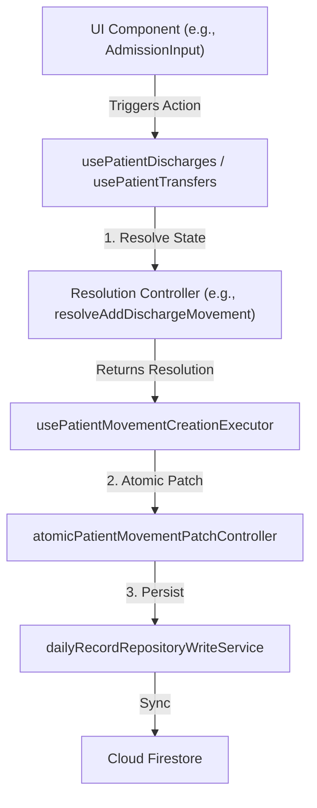
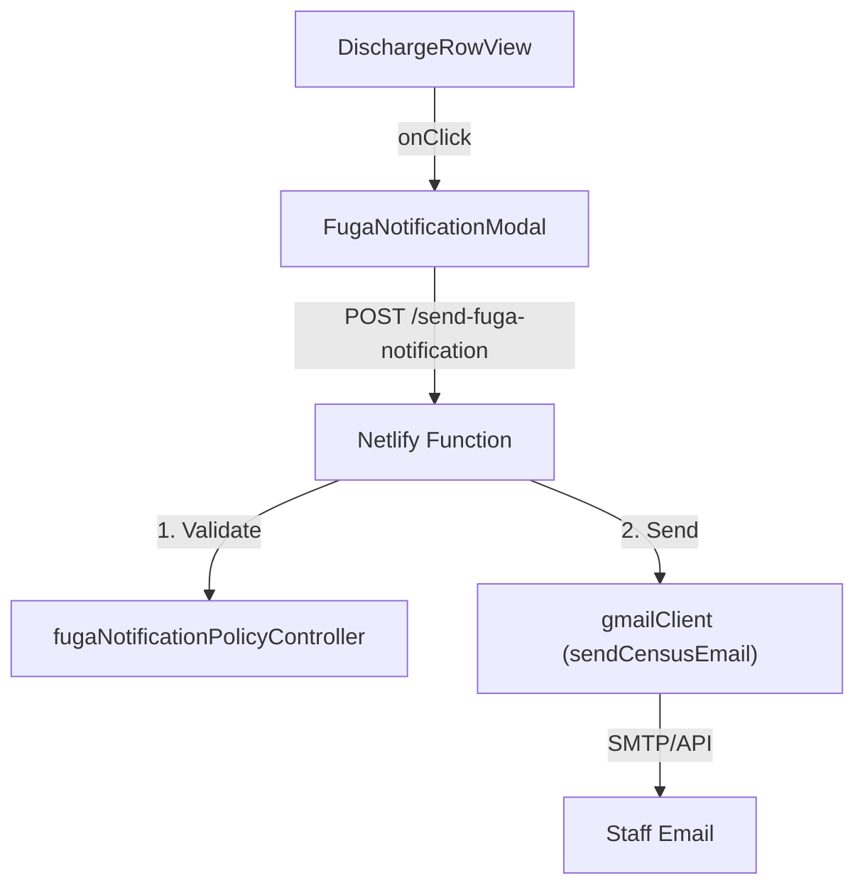

# Patient Movements (Admissions, Discharges, Transfers)

# Patient Movements (Admissions, Discharges, Transfers)

Relevant source files

The following files were used as context for generating this wiki page:

- [docs/estadistico-egreso.pdf](docs/estadistico-egreso.pdf)
- [docs/ieeh-test.pdf](docs/ieeh-test.pdf)
- [netlify/functions/send-fuga-notification.ts](netlify/functions/send-fuga-notification.ts)
- [public/docs/estadistico-egreso.pdf](public/docs/estadistico-egreso.pdf)
- [src/application/census/atomicPatientMovementPatchController.ts](src/application/census/atomicPatientMovementPatchController.ts)
- [src/components/modals/DemographicsModal.tsx](src/components/modals/DemographicsModal.tsx)
- [src/components/modals/actions/MoveCopyModal.tsx](src/components/modals/actions/MoveCopyModal.tsx)
- [src/components/modals/demographics/DemographicsAdmissionOriginField.tsx](src/components/modals/demographics/DemographicsAdmissionOriginField.tsx)
- [src/components/modals/demographics/DemographicsHeader.tsx](src/components/modals/demographics/DemographicsHeader.tsx)
- [src/components/modals/demographics/DemographicsOriginSection.tsx](src/components/modals/demographics/DemographicsOriginSection.tsx)
- [src/components/modals/demographics/DemographicsPersonalSection.tsx](src/components/modals/demographics/DemographicsPersonalSection.tsx)
- [src/components/modals/demographics/DemographicsSexField.tsx](src/components/modals/demographics/DemographicsSexField.tsx)
- [src/components/modals/demographics/types.ts](src/components/modals/demographics/types.ts)
- [src/components/modals/demographics/useDemographicsLogic.ts](src/components/modals/demographics/useDemographicsLogic.ts)
- [src/components/modals/demographics/utils.ts](src/components/modals/demographics/utils.ts)
- [src/features/census/components/DischargeRow.tsx](src/features/census/components/DischargeRow.tsx)
- [src/features/census/components/DischargeRowView.tsx](src/features/census/components/DischargeRowView.tsx)
- [src/features/census/components/FugaNotificationModal.tsx](src/features/census/components/FugaNotificationModal.tsx)
- [src/features/census/components/patient-row/PatientRowModals.tsx](src/features/census/components/patient-row/PatientRowModals.tsx)
- [src/features/census/controllers/atomicPatientMovementPatchController.ts](src/features/census/controllers/atomicPatientMovementPatchController.ts)
- [src/features/census/controllers/censusDatePresentationController.ts](src/features/census/controllers/censusDatePresentationController.ts)
- [src/features/census/controllers/fugaNotificationPolicyController.ts](src/features/census/controllers/fugaNotificationPolicyController.ts)
- [src/features/census/controllers/moveCopyModalController.ts](src/features/census/controllers/moveCopyModalController.ts)
- [src/features/census/controllers/patientRowModalController.ts](src/features/census/controllers/patientRowModalController.ts)
- [src/features/census/controllers/patientRowNewAdmissionIndicatorController.ts](src/features/census/controllers/patientRowNewAdmissionIndicatorController.ts)
- [src/features/census/hooks/useFugaNotificationModalModel.ts](src/features/census/hooks/useFugaNotificationModalModel.ts)
- [src/features/census/hooks/usePatientMovementCreationExecutor.ts](src/features/census/hooks/usePatientMovementCreationExecutor.ts)
- [src/features/census/hooks/usePatientMovementMutationExecutor.ts](src/features/census/hooks/usePatientMovementMutationExecutor.ts)
- [src/features/census/hooks/usePatientMovementUndoExecutor.ts](src/features/census/hooks/usePatientMovementUndoExecutor.ts)
- [src/hooks/controllers/createDayCopyAvailabilityController.ts](src/hooks/controllers/createDayCopyAvailabilityController.ts)
- [src/hooks/controllers/dailyRecordWriteOutcomeGuard.ts](src/hooks/controllers/dailyRecordWriteOutcomeGuard.ts)
- [src/hooks/useMovements.ts](src/hooks/useMovements.ts)
- [src/hooks/usePatientDischarges.ts](src/hooks/usePatientDischarges.ts)
- [src/hooks/usePatientMovementCreationExecutor.ts](src/hooks/usePatientMovementCreationExecutor.ts)
- [src/hooks/usePatientMovementFeedback.ts](src/hooks/usePatientMovementFeedback.ts)
- [src/hooks/usePatientMovementMutationExecutor.ts](src/hooks/usePatientMovementMutationExecutor.ts)
- [src/hooks/usePatientMovementUndoExecutor.ts](src/hooks/usePatientMovementUndoExecutor.ts)
- [src/hooks/usePatientTransfers.ts](src/hooks/usePatientTransfers.ts)
- [src/hooks/useTransferModalForm.ts](src/hooks/useTransferModalForm.ts)
- [src/services/email/gmailClient.ts](src/services/email/gmailClient.ts)
- [src/services/integrations/fugaNotificationService.ts](src/services/integrations/fugaNotificationService.ts)
- [src/services/storage/indexeddb/indexedDbSettingsService.ts](src/services/storage/indexeddb/indexedDbSettingsService.ts)
- [src/shared/date/admissionTimeOptions.ts](src/shared/date/admissionTimeOptions.ts)
- [src/tests/components/DemographicsModal.test.tsx](src/tests/components/DemographicsModal.test.tsx)
- [src/tests/components/MoveCopyModal.test.tsx](src/tests/components/MoveCopyModal.test.tsx)
- [src/tests/features/census/FugaNotificationModal.test.tsx](src/tests/features/census/FugaNotificationModal.test.tsx)
- [src/tests/hooks/controllers/dailyRecordWriteOutcomeGuard.test.ts](src/tests/hooks/controllers/dailyRecordWriteOutcomeGuard.test.ts)
- [src/tests/netlify/sendFugaNotificationFunction.test.ts](src/tests/netlify/sendFugaNotificationFunction.test.ts)
- [src/tests/views/census/DischargeRow.test.tsx](src/tests/views/census/DischargeRow.test.tsx)
- [src/tests/views/census/PatientRowModals.test.tsx](src/tests/views/census/PatientRowModals.test.tsx)
- [src/tests/views/census/moveCopyModalController.test.ts](src/tests/views/census/moveCopyModalController.test.ts)
- [src/tests/views/census/patientRowModalController.test.ts](src/tests/views/census/patientRowModalController.test.ts)
- [src/tests/views/census/patientRowNewAdmissionIndicatorController.test.ts](src/tests/views/census/patientRowNewAdmissionIndicatorController.test.ts)
- [src/tests/views/census/usePatientMovementCreationExecutor.test.ts](src/tests/views/census/usePatientMovementCreationExecutor.test.ts)
- [src/utils/dateUtils.ts](src/utils/dateUtils.ts)

This section covers the technical implementation of patient lifecycle events within the Census module. Patient movements are treated as atomic transitions that modify the state of a `DailyRecord`.

## Movement Lifecycle Overview

The system manages four primary types of movements:

1.  **Admissions**: Creating a new patient entry in an empty bed.
2.  **Discharges**: Finalizing a patient's stay and freeing the bed.
3.  **Transfers**: Moving a patient to another clinical center.
4.  **Internal Moves/Copies**: Shifting a patient between beds within the same or different clinical days.

### Movement Data Flow

Patient movements follow a canonical write pattern: UI components capture intent, controllers resolve the state transition, and a specialized executor applies the patch to the repository.

Title: Patient Movement Write Flow

Sources: [src/hooks/usePatientDischarges.ts:67-108](), [src/hooks/usePatientMovementCreationExecutor.ts:42-69](), [src/application/census/atomicPatientMovementPatchController.ts:1-20]()

## Admissions & Demographics

Admissions are initiated via the `AdmissionInput` or by clicking an empty bed. The core of the admission process is the `DemographicsModal`, which enforces data integrity for clinical records.

### Demographics Validation

The `DemographicsModal` utilizes `resolveRequiredDemographicsCompletion` to block saving until mandatory fields (Name, RUT/Document, Birth Date, Admission Date/Time, and Origin) are provided [src/components/modals/demographics/utils.ts:153-204]().

Key components in the admission flow:

- **`DemographicsModal`**: The primary container for patient data entry [src/components/modals/DemographicsModal.tsx:12-23]().
- **`DemographicsOriginSection`**: Manages admission-specific metadata, including `admissionDate` and `admissionTime` [src/components/modals/demographics/DemographicsOriginSection.tsx:38-43]().
- **`resolveIsNewAdmissionForRecord`**: A controller used to determine if a patient should be flagged as a "New Admission" (Ingreso) on the current clinical day based on their admission timestamp [src/features/census/controllers/patientRowNewAdmissionIndicatorController.ts:11-16]().

Sources: [src/components/modals/DemographicsModal.tsx:12-45](), [src/components/modals/demographics/utils.ts:153-204](), [src/features/census/controllers/patientRowNewAdmissionIndicatorController.ts:11-53]()

## Discharges & Fuga Notifications

Discharges are managed through the `usePatientDischarges` hook, which provides methods for adding, updating, and undoing discharges [src/hooks/usePatientDischarges.ts:38-43]().

### Discharge Flow & IEEH

When a patient is discharged, the system can generate an **Informe Estadístico de Egreso Hospitalario (IEEH)**.

- **`DischargeRowView`**: Renders the discharged patient in the movements section of the census [src/features/census/components/DischargeRowView.tsx:28-33]().
- **`LazyIEEHFormDialog`**: A portal-rendered dialog for capturing mandatory DEIS/MINSAL statistical data [src/features/census/components/DischargeRowView.tsx:86-107]().

### Fuga (Absconding) Notification

If the discharge type is set to "Fuga", a specific notification flow is triggered to alert administrative and clinical staff via email.

Title: Fuga Notification Architecture

- **`fugaNotificationPolicyController`**: Resolves recipients based on the patient's specialty (e.g., Psychiatry has a specific distribution list) [src/features/census/controllers/fugaNotificationPolicyController.ts:128-134]().
- **`send-fuga-notification.ts`**: A serverless function that enforces RBAC (only `nurse_hospital` or `admin`) and utilizes telemetry to track delivery [netlify/functions/send-fuga-notification.ts:26-42]().

Sources: [src/features/census/components/DischargeRowView.tsx:35-71](), [netlify/functions/send-fuga-notification.ts:128-171](), [src/hooks/usePatientDischarges.ts:67-108]()

## Bed Transfers (Move & Copy)

The `MoveCopyModal` handles internal patient movements. It supports two modes:

1.  **Move**: Moves a patient from Bed A to Bed B on the **same** clinical day.
2.  **Copy**: Duplicates patient demographics to a different bed on a **different** clinical day (typically used for "Tomorrow" planning).

### Implementation Details

- **`useMoveCopyTargetRecord`**: Fetches the availability of the target clinical day to ensure the destination bed is not occupied [src/components/modals/actions/MoveCopyModal.tsx:54-61]().
- **`resolveMoveCopyBedOptions`**: Filters the bed list to show valid destination targets, marking occupied beds as disabled [src/components/modals/actions/MoveCopyModal.tsx:62-75]().
- **`useMoveCopyModalState`**: Manages the multi-step selection process (Date -> Bed -> Confirm) [src/components/modals/actions/MoveCopyModal.tsx:40-53]().

Sources: [src/components/modals/actions/MoveCopyModal.tsx:17-84](), [src/tests/components/MoveCopyModal.test.tsx:41-59]()

## Atomic Movement Controller

To prevent data loss and ensure consistency across the `DailyRecord`, all movements utilize the `atomicPatientMovementPatchController`.

### Canonical Write Pattern

Instead of replacing the entire `DailyRecord` object, the system uses `buildAtomicPatientMovementPatch`. This ensures that:

1.  The specific bed state is updated.
2.  The movement list (admissions, discharges, or transfers) is updated.
3.  Other beds in the record remain untouched, reducing conflict surface during sync [src/hooks/usePatientMovementCreationExecutor.ts:54-61]().

| Entity               | Role                                                         | File Path                                                        |
| :------------------- | :----------------------------------------------------------- | :--------------------------------------------------------------- |
| **Executor**         | Coordinates resolution and persistence                       | `src/hooks/usePatientMovementCreationExecutor.ts`                |
| **Patch Controller** | Generates the atomic update payload                          | `src/application/census/atomicPatientMovementPatchController.ts` |
| **Undo Executor**    | Reverses movements (e.g., re-admitting a discharged patient) | `src/hooks/usePatientMovementUndoExecutor.ts`                    |

Sources: [src/hooks/usePatientMovementCreationExecutor.ts:37-69](), [src/application/census/atomicPatientMovementPatchController.ts:1-20](), [src/hooks/usePatientDischarges.ts:144-175]()

---
