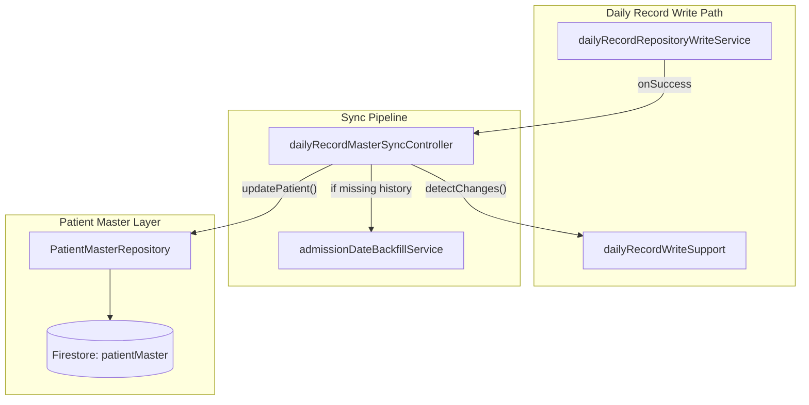
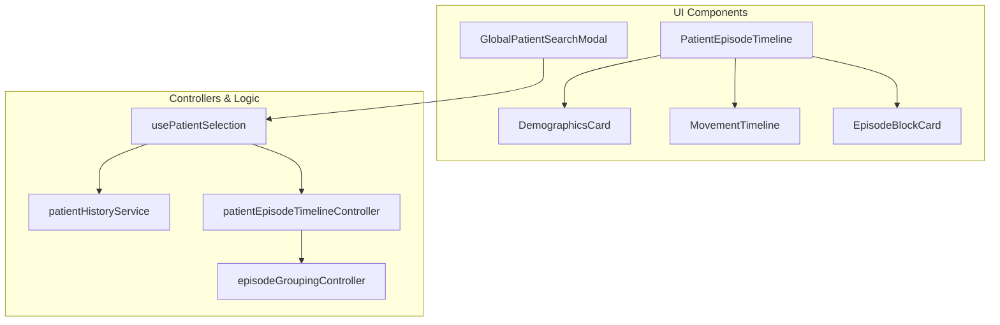

# Global Patient Search & Patient Master

# Global Patient Search & Patient Master

Relevant source files

The following files were used as context for generating this wiki page:

- [docs/FIRESTORE_RULES_COMPLEXITY_AUDIT.md](docs/FIRESTORE_RULES_COMPLEXITY_AUDIT.md)
- [docs/MAINTENANCE_ITERATION_LOG.md](docs/MAINTENANCE_ITERATION_LOG.md)
- [docs/OPERATIVE_RULES_REFERENCE.md](docs/OPERATIVE_RULES_REFERENCE.md)
- [firestore.rules](firestore.rules)
- [src/domain/CensusManager.ts](src/domain/CensusManager.ts)
- [src/features/analytics/contracts/analyticsDailyRecordContracts.ts](src/features/analytics/contracts/analyticsDailyRecordContracts.ts)
- [src/features/census/components/global-search/DemographicsCard.tsx](src/features/census/components/global-search/DemographicsCard.tsx)
- [src/features/census/components/global-search/DocRow.tsx](src/features/census/components/global-search/DocRow.tsx)
- [src/features/census/components/global-search/EpisodeBlockCard.tsx](src/features/census/components/global-search/EpisodeBlockCard.tsx)
- [src/features/census/components/global-search/GlobalPatientSearchModal.tsx](src/features/census/components/global-search/GlobalPatientSearchModal.tsx)
- [src/features/census/components/global-search/MovementTimeline.tsx](src/features/census/components/global-search/MovementTimeline.tsx)
- [src/features/census/components/global-search/PatientEpisodeTimeline.tsx](src/features/census/components/global-search/PatientEpisodeTimeline.tsx)
- [src/features/census/components/global-search/PatientSearchResultItem.tsx](src/features/census/components/global-search/PatientSearchResultItem.tsx)
- [src/features/census/components/global-search/README.md](src/features/census/components/global-search/README.md)
- [src/features/census/components/global-search/episodeGroupingController.ts](src/features/census/components/global-search/episodeGroupingController.ts)
- [src/features/census/components/global-search/globalSearchContracts.ts](src/features/census/components/global-search/globalSearchContracts.ts)
- [src/features/census/components/global-search/patientEpisodeTimelineController.ts](src/features/census/components/global-search/patientEpisodeTimelineController.ts)
- [src/features/census/components/global-search/useGlobalPatientSearch.ts](src/features/census/components/global-search/useGlobalPatientSearch.ts)
- [src/features/census/components/global-search/usePatientSelection.ts](src/features/census/components/global-search/usePatientSelection.ts)
- [src/features/handoff/components/HandoffRowCells.tsx](src/features/handoff/components/HandoffRowCells.tsx)
- [src/features/handoff/controllers/handoffRowCellsController.ts](src/features/handoff/controllers/handoffRowCellsController.ts)
- [src/features/laboratory/controllers/labAnalyticsController.ts](src/features/laboratory/controllers/labAnalyticsController.ts)
- [src/hooks/controllers/censusEmailRecipientRuntimeController.ts](src/hooks/controllers/censusEmailRecipientRuntimeController.ts)
- [src/hooks/useCensusEmailRecipientLists.ts](src/hooks/useCensusEmailRecipientLists.ts)
- [src/services/auth/authLoggers.ts](src/services/auth/authLoggers.ts)
- [src/services/backup/backupLoggers.ts](src/services/backup/backupLoggers.ts)
- [src/services/exporters/exporterLoggers.ts](src/services/exporters/exporterLoggers.ts)
- [src/services/patient/patientHistoryService.ts](src/services/patient/patientHistoryService.ts)
- [src/services/repositories/PatientMasterRepository.ts](src/services/repositories/PatientMasterRepository.ts)
- [src/services/repositories/contracts/patientMasterContracts.ts](src/services/repositories/contracts/patientMasterContracts.ts)
- [src/services/repositories/dailyRecordMasterSyncController.ts](src/services/repositories/dailyRecordMasterSyncController.ts)
- [src/services/repositories/dailyRecordPersistenceGoldenPath.ts](src/services/repositories/dailyRecordPersistenceGoldenPath.ts)
- [src/services/repositories/dailyRecordWriteSupport.ts](src/services/repositories/dailyRecordWriteSupport.ts)
- [src/services/repositories/ports/repositoryFirestoreRuntimePort.ts](src/services/repositories/ports/repositoryFirestoreRuntimePort.ts)
- [src/services/storage/storageLoggers.ts](src/services/storage/storageLoggers.ts)
- [src/services/utils/errorService.ts](src/services/utils/errorService.ts)
- [src/services/utils/errorServiceController.ts](src/services/utils/errorServiceController.ts)
- [src/services/utils/loggerScope.ts](src/services/utils/loggerScope.ts)
- [src/tests/features/census/global-search/DemographicsCard.test.tsx](src/tests/features/census/global-search/DemographicsCard.test.tsx)
- [src/tests/features/census/global-search/EpisodeBlockCard.test.tsx](src/tests/features/census/global-search/EpisodeBlockCard.test.tsx)
- [src/tests/features/census/global-search/MovementTimeline.test.tsx](src/tests/features/census/global-search/MovementTimeline.test.tsx)
- [src/tests/features/census/global-search/globalSearchContracts.test.ts](src/tests/features/census/global-search/globalSearchContracts.test.ts)
- [src/tests/features/census/global-search/groupEpisodesAsBlocks.test.ts](src/tests/features/census/global-search/groupEpisodesAsBlocks.test.ts)
- [src/tests/features/census/global-search/patientEpisodeTimelineController.test.ts](src/tests/features/census/global-search/patientEpisodeTimelineController.test.ts)
- [src/tests/features/census/global-search/patientSearchTimelineIntegration.test.tsx](src/tests/features/census/global-search/patientSearchTimelineIntegration.test.tsx)
- [src/tests/features/census/global-search/usePatientSelection.test.ts](src/tests/features/census/global-search/usePatientSelection.test.ts)
- [src/tests/hooks/controllers/censusEmailRecipientRuntimeController.test.ts](src/tests/hooks/controllers/censusEmailRecipientRuntimeController.test.ts)
- [src/tests/security/legacyRoleAliasStatic.test.ts](src/tests/security/legacyRoleAliasStatic.test.ts)
- [src/tests/services/patient/patientHistoryService.test.ts](src/tests/services/patient/patientHistoryService.test.ts)
- [src/tests/services/repositories/PatientMasterRepository.test.ts](src/tests/services/repositories/PatientMasterRepository.test.ts)
- [src/tests/services/repositories/dailyRecordMasterSyncController.test.ts](src/tests/services/repositories/dailyRecordMasterSyncController.test.ts)
- [src/tests/services/repositories/dailyRecordPersistenceGoldenPath.test.ts](src/tests/services/repositories/dailyRecordPersistenceGoldenPath.test.ts)
- [src/tests/services/utils/errorServiceSinks.test.ts](src/tests/services/utils/errorServiceSinks.test.ts)
- [src/tests/services/utils/loggerService.test.ts](src/tests/services/utils/loggerService.test.ts)
- [src/tests/views/handoff/handoffRowCellsController.test.ts](src/tests/views/handoff/handoffRowCellsController.test.ts)

The Global Patient Search and Patient Master system provides a centralized registry and historical view of all patients who have passed through the Hospital Hanga Roa (HHR) clinical census. It bridges the daily-record-oriented architecture with a patient-centric longitudinal view, allowing clinicians to reconstruct clinical episodes and access historical documents.

## Patient Master Architecture

The **Patient Master** is a specialized collection in Firestore (`patientMaster`) and a corresponding table in IndexedDB that stores a summary of every unique patient. It acts as a canonical index for searching and a trigger for historical backfills.

### Data Flow: DailyRecord to Patient Master Sync

The system maintains consistency between the daily census and the master registry via the `dailyRecordMasterSyncController`. Whenever a `DailyRecord` is saved, a background pipeline analyzes changes to admissions and discharges to update the `PatientMasterRepository`.

#### Sync Pipeline Logic

1.  **Change Detection**: The `dailyRecordMasterSyncController` identifies new admissions, discharges, or bed transfers within a `DailyRecord` [src/services/repositories/dailyRecordMasterSyncController.ts:1-20]().
2.  **Payload Preparation**: It uses small builders to generate seeds, events, and patches for the master record [docs/OPERATIVE_RULES_REFERENCE.md:64-67]().
3.  **Backfill Mechanism**: If an admission is detected without a corresponding master entry, the `admissionDateBackfillService` ensures historical continuity [src/services/repositories/dailyRecordMasterSyncController.ts:30-45]().
4.  **Persistence**: Updates are sent to the `PatientMasterRepository`, which handles both the local IndexedDB cache and the remote Firestore collection [src/services/repositories/PatientMasterRepository.ts:1-15]().

### Code Entity Space: Master Sync

The following diagram illustrates the relationship between the daily census writes and the patient master updates.

**DailyRecord to PatientMaster Sync Flow**

Sources: [src/services/repositories/dailyRecordMasterSyncController.ts:1-50](), [src/services/repositories/dailyRecordWriteSupport.ts:1-3](), [docs/OPERATIVE_RULES_REFERENCE.md:64-68]()

---

## Global Patient Search

The `GlobalPatientSearchModal` allows users to find patients by RUT or name across the entire history of the application.

### Search Implementation

- **Query Execution**: Uses `useGlobalPatientSearch` to query the `PatientMasterRepository`.
- **Result Handling**: Displays matches in `PatientSearchResultItem`.
- **Selection Logic**: When a patient is selected, `usePatientSelection` triggers a multi-stage hydration of the patient's history [src/features/census/components/global-search/usePatientSelection.ts:76-100]().

### History Hydration (`patientHistoryService`)

The `patientHistoryService` is responsible for reconstructing a patient's movements (admissions, transfers, discharges) by scanning both local and remote `DailyRecord` logs [src/services/patient/patientHistoryService.ts:10-40]().

- **Remote Range Capping**: Uses hospitalization hints (like `lastAdmission` and `lastDischarge`) from the Patient Master to limit the Firestore query range, optimizing performance [src/tests/services/patient/patientHistoryService.test.ts:129-156]().
- **Local-First Hydration**: If local records are incomplete (e.g., missing a discharge), it fetches the necessary range from Firestore and saves it to IndexedDB [src/tests/services/patient/patientHistoryService.test.ts:60-127]().

Sources: [src/features/census/components/global-search/usePatientSelection.ts:76-144](), [src/services/patient/patientHistoryService.ts:1-50](), [src/tests/services/patient/patientHistoryService.test.ts:1-127]()

---

## Patient Episode Timeline

Once a patient is selected, the `PatientEpisodeTimeline` orchestrates the display of their clinical history.

### Episode Grouping (`episodeGroupingController`)

Clinical episodes are not stored as single objects but are derived from movement data. The `episodeGroupingController` processes raw movements into logical "Hospitalization Blocks" [src/features/census/components/global-search/episodeGroupingController.ts:1-20]().

- **Grouping Logic**: A new episode begins at an "Admission" event and ends at a "Discharge" event.
- **Timeline State**: `buildPatientEpisodeTimelineState` transforms these groups into a UI-ready format for `PatientEpisodeTimeline` [src/features/census/components/global-search/patientEpisodeTimelineController.ts:1-30]().

### Clinical Documents Integration

The timeline allows users to view and download historical clinical documents associated with specific episodes.

- **Lazy Loading**: The `usePatientSelection` hook lazy-loads the `ClinicalDocumentRepository` only when the user requests documents for a specific episode [src/features/census/components/global-search/usePatientSelection.ts:25-44]().
- **Episode Key Resolution**: Documents are retrieved using a composite key (`rut__admissionDate`) via `buildClinicalEpisodeKey` [src/features/census/components/global-search/usePatientSelection.ts:151-175]().

### Code Entity Space: Timeline UI

The following diagram shows the component hierarchy and the controllers managing the timeline data.

**Global Search Detail Hierarchy**

Sources: [src/features/census/components/global-search/PatientEpisodeTimeline.tsx:40-97](), [src/features/census/components/global-search/usePatientSelection.ts:76-144](), [src/features/census/components/global-search/patientEpisodeTimelineController.ts:1-20]()

---

## Operative Rules & Clinical Logic

| Feature                | Rule / Implementation                                                                                    | Source                                                                    |
| :--------------------- | :------------------------------------------------------------------------------------------------------- | :------------------------------------------------------------------------ |
| **Search Target**      | "Go to Census" from search must open the last day the patient was hospitalized, not the admission date.  | [docs/OPERATIVE_RULES_REFERENCE.md:9-15]()                                |
| **Episode Continuity** | Readmissions are kept as separate hospitalizations and are not merged into previous bed changes.         | [src/tests/services/patient/patientHistoryService.test.ts:210-220]()      |
| **History Hydration**  | Force remote hydration is used when local IndexedDB has no matches for a specific RUT.                   | [src/tests/services/patient/patientHistoryService.test.ts:158-190]()      |
| **Handoff Display**    | `HandoffRowCells` delegates medical observation state (including drafts) to `handoffRowCellsController`. | [src/features/handoff/controllers/handoffRowCellsController.ts:209-227]() |

### Medical Observations & Drafts

The `handoffRowCellsController` manages the display of medical observations within the search and handoff views. It handles:

- **Draft Persistence**: `PendingMedicalEntryDraft` objects track unsaved notes [src/features/handoff/controllers/handoffRowCellsController.ts:10-13]().
- **Pruning**: `pruneResolvedPendingMedicalEntryDrafts` removes drafts once they are successfully persisted to Firestore or have expired [src/features/handoff/controllers/handoffRowCellsController.ts:88-109]().

Sources: [docs/OPERATIVE_RULES_REFERENCE.md:5-16](), [src/features/handoff/controllers/handoffRowCellsController.ts:1-227]()

---
