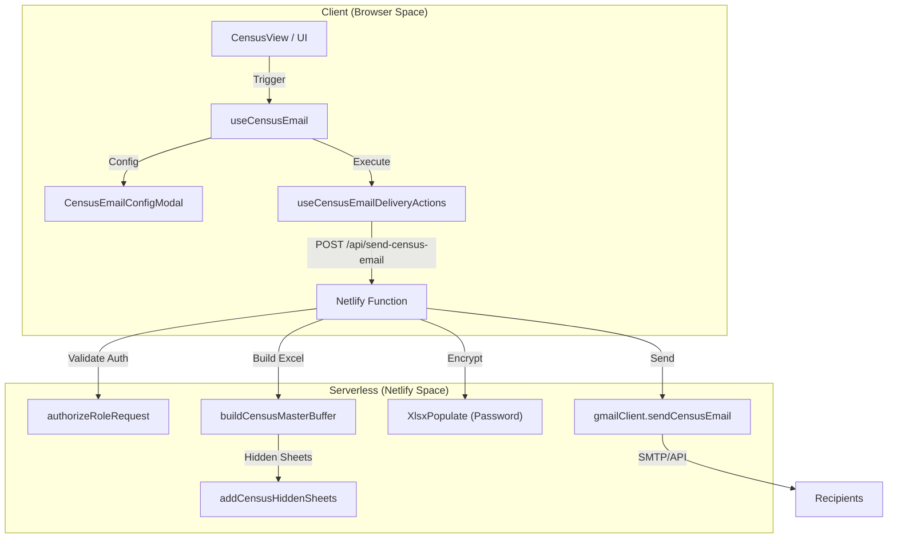
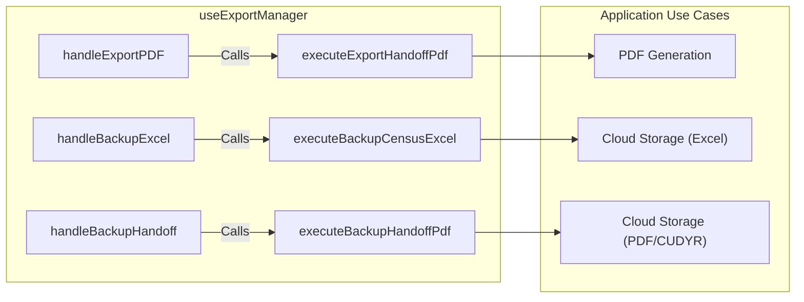

# Census Email & Excel Export

# Census Email & Excel Export

Relevant source files

The following files were used as context for generating this wiki page:

- [cors.json](cors.json)
- [docs/ADR_CENSUS_WORKBOOK_PROTECTION.md](docs/ADR_CENSUS_WORKBOOK_PROTECTION.md)
- [docs/superpowers/plans/2026-04-19-upc-hidden-sheets-classification.md](docs/superpowers/plans/2026-04-19-upc-hidden-sheets-classification.md)
- [netlify/functions/fhir-api.ts](netlify/functions/fhir-api.ts)
- [netlify/functions/firebase-config.js](netlify/functions/firebase-config.js)
- [netlify/functions/lib/firebase-server.ts](netlify/functions/lib/firebase-server.ts)
- [netlify/functions/send-census-email.ts](netlify/functions/send-census-email.ts)
- [public/sw.js](public/sw.js)
- [src/application/backup-export/backupFilesUseCases.ts](src/application/backup-export/backupFilesUseCases.ts)
- [src/application/ports/backupFilesPort.ts](src/application/ports/backupFilesPort.ts)
- [src/features/backup/README.md](src/features/backup/README.md)
- [src/features/census/components/CensusEmailConfigModal.tsx](src/features/census/components/CensusEmailConfigModal.tsx)
- [src/hooks/controllers/backupStorageOutcomeController.ts](src/hooks/controllers/backupStorageOutcomeController.ts)
- [src/hooks/controllers/bedOperationsAuditController.ts](src/hooks/controllers/bedOperationsAuditController.ts)
- [src/hooks/controllers/censusExcelSheetController.ts](src/hooks/controllers/censusExcelSheetController.ts)
- [src/hooks/useBackupArchiveStatus.ts](src/hooks/useBackupArchiveStatus.ts)
- [src/hooks/useBackupFileBrowserActions.ts](src/hooks/useBackupFileBrowserActions.ts)
- [src/hooks/useBackupFilesQuery.ts](src/hooks/useBackupFilesQuery.ts)
- [src/hooks/useBedOperationsController.ts](src/hooks/useBedOperationsController.ts)
- [src/hooks/useCensusEmail.ts](src/hooks/useCensusEmail.ts)
- [src/hooks/useCensusEmailDeliveryActions.ts](src/hooks/useCensusEmailDeliveryActions.ts)
- [src/hooks/useExportManager.ts](src/hooks/useExportManager.ts)
- [src/hooks/useFileOperations.ts](src/hooks/useFileOperations.ts)
- [src/hooks/useHandoffVisibility.ts](src/hooks/useHandoffVisibility.ts)
- [src/hooks/useValidation.ts](src/hooks/useValidation.ts)
- [src/services/backup/README.md](src/services/backup/README.md)
- [src/services/backup/backupCrudResults.ts](src/services/backup/backupCrudResults.ts)
- [src/services/exporters/excel/README.md](src/services/exporters/excel/README.md)
- [src/services/exporters/excel/builder.ts](src/services/exporters/excel/builder.ts)
- [src/services/exporters/excel/censusHiddenSheetsAggregation.ts](src/services/exporters/excel/censusHiddenSheetsAggregation.ts)
- [src/services/exporters/excel/censusHiddenSheetsBuilder.ts](src/services/exporters/excel/censusHiddenSheetsBuilder.ts)
- [src/services/exporters/excel/censusHiddenSheetsConfig.ts](src/services/exporters/excel/censusHiddenSheetsConfig.ts)
- [src/services/exporters/excel/censusHiddenSheetsContracts.ts](src/services/exporters/excel/censusHiddenSheetsContracts.ts)
- [src/services/exporters/excel/censusHiddenSheetsExcelHelpers.ts](src/services/exporters/excel/censusHiddenSheetsExcelHelpers.ts)
- [src/services/exporters/excel/censusHiddenSheetsProtection.ts](src/services/exporters/excel/censusHiddenSheetsProtection.ts)
- [src/services/exporters/excel/censusHiddenSheetsRenderer.ts](src/services/exporters/excel/censusHiddenSheetsRenderer.ts)
- [src/services/exporters/excel/censusHiddenSheetsStyles.ts](src/services/exporters/excel/censusHiddenSheetsStyles.ts)
- [src/services/exporters/excel/censusHiddenUpcSheets.ts](src/services/exporters/excel/censusHiddenUpcSheets.ts)
- [src/services/exporters/excel/censusWorkbookSerializer.ts](src/services/exporters/excel/censusWorkbookSerializer.ts)
- [src/services/exporters/excelJsModuleLoader.ts](src/services/exporters/excelJsModuleLoader.ts)
- [src/services/exporters/excelUtils.ts](src/services/exporters/excelUtils.ts)
- [src/services/transfers/documentFallbacks.ts](src/services/transfers/documentFallbacks.ts)
- [src/services/transfers/documentGeneratorService.ts](src/services/transfers/documentGeneratorService.ts)
- [src/services/transfers/templateGeneratorService.ts](src/services/transfers/templateGeneratorService.ts)
- [src/services/transfers/transferDocumentFallbackRegistry.ts](src/services/transfers/transferDocumentFallbackRegistry.ts)
- [src/shared/access/operationalAccessPolicy.ts](src/shared/access/operationalAccessPolicy.ts)
- [src/shared/contracts/applicationOutcomeFactories.ts](src/shared/contracts/applicationOutcomeFactories.ts)
- [src/tests/hooks/censusExcelSheetController.test.ts](src/tests/hooks/censusExcelSheetController.test.ts)
- [src/tests/hooks/controllers/backupStorageOutcomeController.test.ts](src/tests/hooks/controllers/backupStorageOutcomeController.test.ts)
- [src/tests/hooks/useBackupFilesQuery.test.tsx](src/tests/hooks/useBackupFilesQuery.test.tsx)
- [src/tests/hooks/useCensusEmail.test.ts](src/tests/hooks/useCensusEmail.test.ts)
- [src/tests/hooks/useExportManager.handoffNotices.test.ts](src/tests/hooks/useExportManager.handoffNotices.test.ts)
- [src/tests/hooks/useExportManager.test.ts](src/tests/hooks/useExportManager.test.ts)
- [src/tests/hooks/useFileOperations.test.ts](src/tests/hooks/useFileOperations.test.ts)
- [src/tests/netlify/fhirApi.test.ts](src/tests/netlify/fhirApi.test.ts)
- [src/tests/services/censusHiddenSheetsAggregation.test.ts](src/tests/services/censusHiddenSheetsAggregation.test.ts)
- [src/tests/services/censusHiddenSheetsRenderer.test.ts](src/tests/services/censusHiddenSheetsRenderer.test.ts)
- [src/tests/services/censusMasterWorkbook.test.ts](src/tests/services/censusMasterWorkbook.test.ts)
- [src/tests/services/censusWorkbookSanity.test.ts](src/tests/services/censusWorkbookSanity.test.ts)
- [src/tests/services/exporters/excelUtils.test.ts](src/tests/services/exporters/excelUtils.test.ts)
- [src/tests/services/transfers/templateGenerator.test.ts](src/tests/services/transfers/templateGenerator.test.ts)
- [src/tests/views/census/CensusEmailConfigModal.test.tsx](src/tests/views/census/CensusEmailConfigModal.test.tsx)
- [src/types/exceljs-browser.d.ts](src/types/exceljs-browser.d.ts)

The **Census Email & Excel Export** system provides clinical staff with the ability to generate password-protected Excel workbooks containing daily census snapshots and automated monthly summaries. This module integrates frontend React hooks, a serverless Netlify function for secure email delivery via Gmail API, and a complex Excel building engine.

## System Architecture & Data Flow

The export process transitions from the client-side UI to a serverless environment to handle sensitive operations like workbook encryption and email transmission.

### Export Data Flow Diagram

This diagram illustrates the transition from the `CensusView` to the `send-census-email` Netlify function.

**Sources:** [src/hooks/useCensusEmail.ts:103-113](), [netlify/functions/send-census-email.ts:37-65](), [src/hooks/useCensusEmailDeliveryActions.ts:1-20]()

## Excel Workbook Generation

The system uses `exceljs` to construct multi-sheet workbooks. A "Master Workbook" includes visible sheets for specific days and hidden sheets for administrative aggregation.

### Workbook Components

1.  **Visible Day Sheets:** Detailed patient lists for specific ISO dates, including bed assignments, patient data, and discharges [src/services/exporters/excel/builder.ts:35-37]().
2.  **Hidden Summary Sheets:** Automated monthly aggregations used for reporting.
    - **RESUMEN [MES]:** Occupancy rates, specialty counts, and discharge statistics [src/services/exporters/excel/censusHiddenSheetsAggregation.ts:139-165]().
    - **UPC PAC:** Tracking for Critical Care (UPC) patients across the month [src/services/exporters/excel/censusHiddenSheetsAggregation.ts:171-185]().
    - **UPC DET:** Detailed daily matrix of UPC patient classifications [src/tests/services/censusWorkbookSanity.test.ts:108-114]().

### Technical Implementation: `buildCensusMasterWorkbook`

The builder orchestrates the creation of the `Workbook` object, applies metadata, and ensures the workbook opens on the most recent census tab.

| Function                       | Responsibility                                                                            |
| :----------------------------- | :---------------------------------------------------------------------------------------- |
| `buildCensusMasterWorkbook`    | Entry point for workbook creation [src/services/exporters/excel/builder.ts:11-14]().      |
| `applyCensusWorkbookMetadata`  | Sets workbook properties and protection [src/services/exporters/excel/builder.ts:24]().   |
| `addCensusHiddenSheets`        | Injects the administrative summary sheets [src/services/exporters/excel/builder.ts:33](). |
| `reserveUniqueCensusSheetName` | Prevents collisions in sheet naming [src/services/exporters/excel/builder.ts:30]().       |

**Sources:** [src/services/exporters/excel/builder.ts:11-61](), [src/services/exporters/excel/censusHiddenSheetsAggregation.ts:139-175]()

## Netlify Function: `send-census-email`

The `send-census-email` function acts as a secure proxy for the Gmail API. It enforces Role-Based Access Control (RBAC) and performs final workbook encryption.

### Security & Validation

- **Authorization:** Only users with `admin` or `nurse_hospital` roles can trigger emails [netlify/functions/send-census-email.ts:35]().
- **Rate Limiting:** Limited to 5 requests per minute per IP [netlify/functions/send-census-email.ts:62]().
- **Encryption:** The Excel buffer is encrypted using a date-based PIN generated by `generateCensusPassword` [netlify/functions/send-census-email.ts:169-191]().
- **Validation:** Filenames and buffer sizes are validated before transmission to prevent corrupted attachments [netlify/functions/send-census-email.ts:148-167]().

**Sources:** [netlify/functions/send-census-email.ts:35-191]()

## Export Manager Hook (`useExportManager`)

The `useExportManager` hook centralizes various export and backup operations used across the `CENSUS` and `HANDOFF` modules.

### Functionality Mapping

This diagram maps UI actions to their underlying service implementations.

**Sources:** [src/hooks/useExportManager.ts:78-113](), [src/hooks/useExportManager.test.ts:111-121]()

### Key Methods

- **`handleExportPDF`:** Generates a clinical handoff PDF. It distinguishes between nursing and medical handoffs via the `isMedical` flag [src/hooks/useExportManager.ts:83-87]().
- **`handleBackupExcel`:** Archives the current day's Excel censo to cloud storage and updates the `isArchived` state [src/hooks/useExportManager.ts:115-142]().
- **`handleBackupHandoff`:** Saves a PDF backup of the shift handoff and optionally the monthly CUDYR (Patient Dependency) data [src/hooks/useExportManager.ts:160-198]().

**Sources:** [src/hooks/useExportManager.ts:1-200]()

## Clinical Document Tag Mapping

The system includes a `mapDataToTags` utility used during document generation (e.g., transfers). It converts clinical domain entities into a flat key-value structure for template injection.

| Category             | Tag Examples                                             | Code Reference                                                 |
| :------------------- | :------------------------------------------------------- | :------------------------------------------------------------- |
| **Patient Identity** | `paciente_nombre`, `paciente_rut`, `paciente_edad`       | [src/services/transfers/templateGeneratorService.ts:41-52]()   |
| **Clinical Context** | `paciente_diagnostico`, `paciente_cama`, `fecha_ingreso` | [src/services/transfers/templateGeneratorService.ts:58-69]()   |
| **COVID Screening**  | `covid_contacto_48h_si`, `covid_tos`, `covid_fiebre`     | [src/services/transfers/templateGeneratorService.ts:118-146]() |
| **IAAS/Infection**   | `iaas_precauciones_adicionales`, `iaas_carbapenemasas`   | [src/services/transfers/templateGeneratorService.ts:150-163]() |

**Sources:** [src/services/transfers/templateGeneratorService.ts:13-170]()

---
