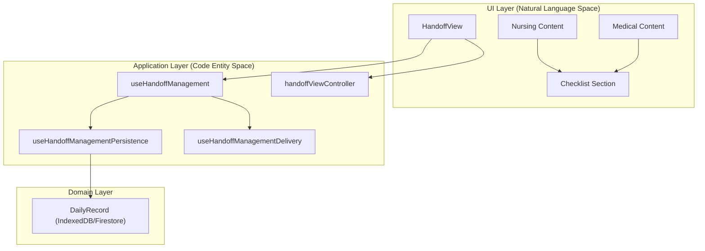
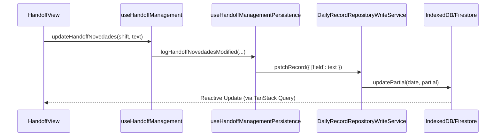

# Handoff Module (Shift Handover)

# Handoff Module (Shift Handover)

Relevant source files

The following files were used as context for generating this wiki page:

- [e2e/admit-edit-discharge-smoke.spec.ts](e2e/admit-edit-discharge-smoke.spec.ts)
- [src/application/shared/dailyRecordCoreContracts.ts](src/application/shared/dailyRecordCoreContracts.ts)
- [src/features/admin/components/MedicalSignatureView.tsx](src/features/admin/components/MedicalSignatureView.tsx)
- [src/features/handoff/components/HandoffChecklistSection.tsx](src/features/handoff/components/HandoffChecklistSection.tsx)
- [src/features/handoff/components/HandoffMedicalContent.tsx](src/features/handoff/components/HandoffMedicalContent.tsx)
- [src/features/handoff/components/HandoffNursingContent.tsx](src/features/handoff/components/HandoffNursingContent.tsx)
- [src/features/handoff/components/HandoffView.tsx](src/features/handoff/components/HandoffView.tsx)
- [src/features/handoff/components/MovementsSummary.tsx](src/features/handoff/components/MovementsSummary.tsx)
- [src/features/handoff/controllers/handoffViewController.ts](src/features/handoff/controllers/handoffViewController.ts)
- [src/features/handoff/controllers/medicalHandoffAccessController.ts](src/features/handoff/controllers/medicalHandoffAccessController.ts)
- [src/features/handoff/controllers/movementsSummaryController.ts](src/features/handoff/controllers/movementsSummaryController.ts)
- [src/hooks/controllers/exportManagerController.ts](src/hooks/controllers/exportManagerController.ts)
- [src/hooks/controllers/handoffLogicViewStateController.ts](src/hooks/controllers/handoffLogicViewStateController.ts)
- [src/hooks/controllers/handoffManagementPersistenceController.ts](src/hooks/controllers/handoffManagementPersistenceController.ts)
- [src/hooks/controllers/handoffNursingNoteController.ts](src/hooks/controllers/handoffNursingNoteController.ts)
- [src/hooks/useBedManagement.ts](src/hooks/useBedManagement.ts)
- [src/hooks/useBedOperations.ts](src/hooks/useBedOperations.ts)
- [src/hooks/useClinicalCrib.ts](src/hooks/useClinicalCrib.ts)
- [src/hooks/useDailyRecordDomainModules.ts](src/hooks/useDailyRecordDomainModules.ts)
- [src/hooks/useHandoffGeneralPersistenceActions.ts](src/hooks/useHandoffGeneralPersistenceActions.ts)
- [src/hooks/useHandoffLogic.ts](src/hooks/useHandoffLogic.ts)
- [src/hooks/useHandoffManagement.ts](src/hooks/useHandoffManagement.ts)
- [src/hooks/useHandoffManagementDelivery.ts](src/hooks/useHandoffManagementDelivery.ts)
- [src/hooks/useHandoffManagementPersistence.ts](src/hooks/useHandoffManagementPersistence.ts)
- [src/hooks/useHandoffPersistenceRuntime.ts](src/hooks/useHandoffPersistenceRuntime.ts)
- [src/hooks/useHandoffStaff.ts](src/hooks/useHandoffStaff.ts)
- [src/hooks/useNursingHandoffHandlers.ts](src/hooks/useNursingHandoffHandlers.ts)
- [src/tests/hooks/controllers/handoffManagementPersistenceController.test.ts](src/tests/hooks/controllers/handoffManagementPersistenceController.test.ts)
- [src/tests/hooks/useHandoffManagement.test.ts](src/tests/hooks/useHandoffManagement.test.ts)
- [src/tests/integration/daily-record-sync.test.tsx](src/tests/integration/daily-record-sync.test.tsx)
- [src/tests/integration/multiTabRegression.test.ts](src/tests/integration/multiTabRegression.test.ts)
- [src/tests/services/repositories/dailyRecordRepositoryWriteService.fieldShrinkage.test.ts](src/tests/services/repositories/dailyRecordRepositoryWriteService.fieldShrinkage.test.ts)
- [src/tests/views/handoff/MovementsSummary.test.tsx](src/tests/views/handoff/MovementsSummary.test.tsx)
- [src/tests/views/handoff/handoffViewController.test.ts](src/tests/views/handoff/handoffViewController.test.ts)

The **Handoff Module** provides a structured system for nursing and medical shift handovers at Hospital Hanga Roa. It ensures clinical continuity by consolidating patient status, administrative checklists, and specialty-specific medical notes into a unified view. The module supports real-time persistence, digital signatures for medical staff, and PDF generation for physical records.

### System Overview

The handoff system is built around the `HandoffView` component [src/features/handoff/components/HandoffView.tsx:200-205](), which dynamically switches between **Nursing** and **Medical** modes. It relies on the `useHandoffManagement` hook [src/hooks/useHandoffManagement.ts:14-18]() to orchestrate data persistence and delivery actions (like WhatsApp sharing or signing).

#### Core Entities & Logic

- **`DailyRecord`**: The source of truth containing `handoffNovedades`, checklists, and medical notes [src/features/handoff/controllers/handoffViewController.ts:67-78]().
- **`useHandoffViewScreenModel`**: The central hook managing the view state, role-based capabilities, and data bindings [src/features/handoff/components/HandoffView.tsx:33-38]().
- **`handoffViewController`**: Resolves titles, table styles, and audit descriptors based on the active shift and type [src/features/handoff/controllers/handoffViewController.ts:136-161]().

### Code-to-System Mapping

The following diagram illustrates how UI components map to their underlying management hooks and the shared data layer.

**Handoff Logic Architecture**

Sources: [src/features/handoff/components/HandoffView.tsx](), [src/hooks/useHandoffManagement.ts](), [src/features/handoff/controllers/handoffViewController.ts]()

---

### Nursing Handoff

The nursing handover focuses on administrative tasks and general patient evolution. It includes a shift-specific checklist (Day/Night) and a summary of "Novedades" (News/Events).

- **Checklist Management**: Managed via `updateHandoffChecklist` [src/hooks/useHandoffManagementPersistence.ts:19-30]().
- **Movements Summary**: Automatically aggregates admissions, discharges, and transfers for the shift [src/features/handoff/components/MovementsSummary.tsx:1-10]().
- **Persistence**: Uses `useHandoffGeneralPersistenceActions` to handle non-medical fields [src/hooks/useHandoffManagementPersistence.ts:30-30]().

For details, see [Handoff View & Nursing Handoff](#6.1).

---

### Medical Handoff & Specialist Path

The medical handover provides a specialized view for physicians, organized by clinical specialty (e.g., Surgery, Internal Medicine).

- **Specialist Write Path**: Doctors can sign the handover via a secure token-based link handled by `MedicalSignatureView` [src/features/admin/components/MedicalSignatureView.tsx:44-50]().
- **Digital Signatures**: The system tracks `scopedMedicalSignature` to verify who received the shift [src/features/handoff/components/HandoffMedicalContent.tsx:28-29]().
- **Access Control**: Managed by `medicalHandoffAccessController`, which determines if a user can edit or sign based on their role and the record date [src/features/handoff/controllers/handoffViewController.ts:22-24]().

For details, see [Medical Handoff & Specialist Write Path](#6.2).

---

### CUDYR Integration

The **CUDYR** (Categorización de Usuarios por Dependencia y Riesgo) module is integrated into the handoff flow to provide patient dependency scores.

- **Nocturnal Cut-off**: The system enforces a 01:00 AM cut-off for nocturnal categorization.
- **Visibility**: The handoff view includes a `HandoffNightCudyrActionButton` [src/features/handoff/components/HandoffView.tsx:173-179]() when viewing the night shift to facilitate mandatory reporting.

For details, see [CUDYR Module (Patient Dependency Scoring)](#6.3).

---

### PDF Generation Pipeline

The module includes a robust PDF generation engine to produce physical shift handover documents.

- **Print Logic**: The `HandoffPrintHeader` ensures consistent branding and metadata (date, shift, staff) across printed pages [src/features/handoff/components/HandoffView.tsx:148-158]().
- **Medical Tabs**: Supports printing specific specialties or the entire hospital census [src/features/handoff/components/HandoffMedicalContent.tsx:103-106]().

For details, see [Handoff PDF Generation](#6.4).

---

### Data Flow & Persistence

Handoff data is persisted using a local-first strategy. The `useHandoffManagement` hook integrates with the `DailyRecord` repository to ensure that edits (like nursing notes or medical signatures) are synchronized to Firestore while remaining available offline in IndexedDB.

**Handoff Persistence Flow**

Sources: [src/hooks/useHandoffManagement.ts:27-37](), [src/hooks/useHandoffManagementPersistence.ts:8-18](), [src/hooks/useDailyRecordDomainModules.ts:35-35]()

### Key Controllers and Hooks

| Entity                         | Role                                                  | Source                                                          |
| :----------------------------- | :---------------------------------------------------- | :-------------------------------------------------------------- |
| `useHandoffManagement`         | Main entry point for handoff business logic.          | [src/hooks/useHandoffManagement.ts:14]()                        |
| `handoffViewController`        | UI logic for titles, icons, and table formatting.     | [src/features/handoff/controllers/handoffViewController.ts:1]() |
| `useHandoffManagementDelivery` | Handles external actions (WhatsApp, Signature Links). | [src/hooks/useHandoffManagementDelivery.ts:36]()                |
| `MedicalSignatureView`         | Public-facing view for specialists to sign handoffs.  | [src/features/admin/components/MedicalSignatureView.tsx:44]()   |

**Sources:**

- `src/features/handoff/components/HandoffView.tsx`
- `src/hooks/useHandoffManagement.ts`
- `src/hooks/useHandoffManagementPersistence.ts`
- `src/hooks/useHandoffManagementDelivery.ts`
- `src/features/handoff/controllers/handoffViewController.ts`
- `src/features/admin/components/MedicalSignatureView.tsx`

---
