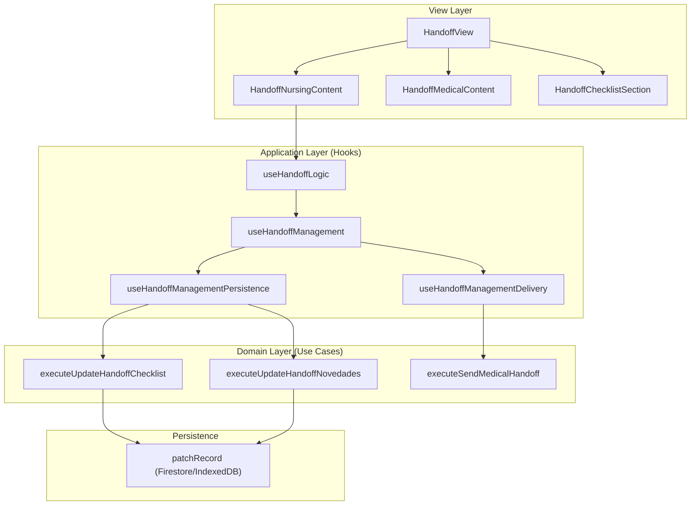
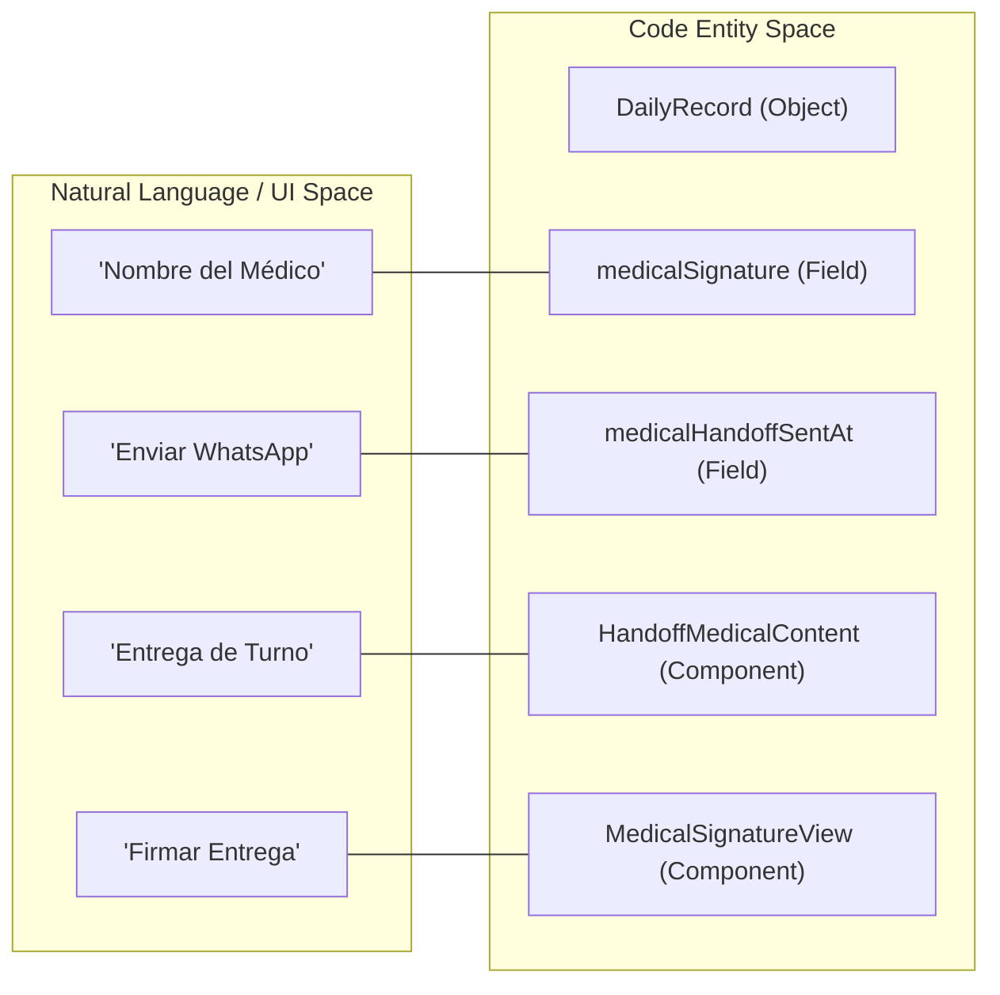

# Handoff View & Nursing Handoff

# Handoff View & Nursing Handoff

Relevant source files

The following files were used as context for generating this wiki page:

- [e2e/admit-edit-discharge-smoke.spec.ts](e2e/admit-edit-discharge-smoke.spec.ts)
- [src/application/handoff/handoffDeliveryUseCases.ts](src/application/handoff/handoffDeliveryUseCases.ts)
- [src/application/handoff/handoffManagementUseCases.ts](src/application/handoff/handoffManagementUseCases.ts)
- [src/application/handoff/handoffUseCaseSupport.ts](src/application/handoff/handoffUseCaseSupport.ts)
- [src/application/handoff/sendMedicalHandoffUseCase.ts](src/application/handoff/sendMedicalHandoffUseCase.ts)
- [src/application/shared/dailyRecordCoreContracts.ts](src/application/shared/dailyRecordCoreContracts.ts)
- [src/domain/handoff/management.ts](src/domain/handoff/management.ts)
- [src/features/admin/components/MedicalSignatureView.tsx](src/features/admin/components/MedicalSignatureView.tsx)
- [src/features/handoff/components/HandoffChecklistSection.tsx](src/features/handoff/components/HandoffChecklistSection.tsx)
- [src/features/handoff/components/HandoffMedicalContent.tsx](src/features/handoff/components/HandoffMedicalContent.tsx)
- [src/features/handoff/components/HandoffNursingContent.tsx](src/features/handoff/components/HandoffNursingContent.tsx)
- [src/features/handoff/components/HandoffView.tsx](src/features/handoff/components/HandoffView.tsx)
- [src/features/handoff/components/MovementsSummary.tsx](src/features/handoff/components/MovementsSummary.tsx)
- [src/features/handoff/controllers/handoffViewController.ts](src/features/handoff/controllers/handoffViewController.ts)
- [src/features/handoff/controllers/medicalHandoffAccessController.ts](src/features/handoff/controllers/medicalHandoffAccessController.ts)
- [src/features/handoff/controllers/movementsSummaryController.ts](src/features/handoff/controllers/movementsSummaryController.ts)
- [src/hooks/controllers/bedManagementDispatchController.ts](src/hooks/controllers/bedManagementDispatchController.ts)
- [src/hooks/controllers/censusEmailRecipientsBootstrapController.ts](src/hooks/controllers/censusEmailRecipientsBootstrapController.ts)
- [src/hooks/controllers/exportManagerController.ts](src/hooks/controllers/exportManagerController.ts)
- [src/hooks/controllers/handoffLogicViewStateController.ts](src/hooks/controllers/handoffLogicViewStateController.ts)
- [src/hooks/controllers/handoffManagementOutcomeController.ts](src/hooks/controllers/handoffManagementOutcomeController.ts)
- [src/hooks/controllers/handoffManagementPersistenceController.ts](src/hooks/controllers/handoffManagementPersistenceController.ts)
- [src/hooks/controllers/handoffNursingNoteController.ts](src/hooks/controllers/handoffNursingNoteController.ts)
- [src/hooks/useBedManagement.ts](src/hooks/useBedManagement.ts)
- [src/hooks/useBedOperations.ts](src/hooks/useBedOperations.ts)
- [src/hooks/useClinicalCrib.ts](src/hooks/useClinicalCrib.ts)
- [src/hooks/useDailyRecordCopyActions.ts](src/hooks/useDailyRecordCopyActions.ts)
- [src/hooks/useDailyRecordDomainModules.ts](src/hooks/useDailyRecordDomainModules.ts)
- [src/hooks/useHandoffGeneralPersistenceActions.ts](src/hooks/useHandoffGeneralPersistenceActions.ts)
- [src/hooks/useHandoffLogic.ts](src/hooks/useHandoffLogic.ts)
- [src/hooks/useHandoffManagement.ts](src/hooks/useHandoffManagement.ts)
- [src/hooks/useHandoffManagementDelivery.ts](src/hooks/useHandoffManagementDelivery.ts)
- [src/hooks/useHandoffManagementPersistence.ts](src/hooks/useHandoffManagementPersistence.ts)
- [src/hooks/useHandoffPersistenceRuntime.ts](src/hooks/useHandoffPersistenceRuntime.ts)
- [src/hooks/useHandoffStaff.ts](src/hooks/useHandoffStaff.ts)
- [src/hooks/useNurseManagement.ts](src/hooks/useNurseManagement.ts)
- [src/hooks/useNursingHandoffHandlers.ts](src/hooks/useNursingHandoffHandlers.ts)
- [src/hooks/useTransferManagementActions.ts](src/hooks/useTransferManagementActions.ts)
- [src/services/contracts/dailyRecordServiceContracts.ts](src/services/contracts/dailyRecordServiceContracts.ts)
- [src/services/transfers/transferErrorPolicy.ts](src/services/transfers/transferErrorPolicy.ts)
- [src/tests/hooks/controllers/handoffManagementOutcomeController.test.ts](src/tests/hooks/controllers/handoffManagementOutcomeController.test.ts)
- [src/tests/hooks/controllers/handoffManagementPersistenceController.test.ts](src/tests/hooks/controllers/handoffManagementPersistenceController.test.ts)
- [src/tests/hooks/useHandoffManagement.test.ts](src/tests/hooks/useHandoffManagement.test.ts)
- [src/tests/integration/daily-record-sync.test.tsx](src/tests/integration/daily-record-sync.test.tsx)
- [src/tests/integration/multiTabRegression.test.ts](src/tests/integration/multiTabRegression.test.ts)
- [src/tests/services/repositories/dailyRecordRepositoryWriteService.fieldShrinkage.test.ts](src/tests/services/repositories/dailyRecordRepositoryWriteService.fieldShrinkage.test.ts)
- [src/tests/services/transfers/transferMutationsResult.test.ts](src/tests/services/transfers/transferMutationsResult.test.ts)
- [src/tests/views/handoff/MovementsSummary.test.tsx](src/tests/views/handoff/MovementsSummary.test.tsx)
- [src/tests/views/handoff/handoffViewController.test.ts](src/tests/views/handoff/handoffViewController.test.ts)

The Handoff module facilitates the clinical shift handover process between nursing teams and medical staff. It provides a structured view of patient status, administrative checklists, and shift-specific notes, with support for both desktop usage and mobile-friendly medical signatures.

## Handoff Architecture & Data Flow

The Handoff system is built on a controller-view pattern that separates clinical logic from the presentation layer. It consumes the `DailyRecord` as its primary data source and utilizes specialized hooks for persistence and delivery.

### Component Hierarchy

- **`HandoffView`**: The root container that orchestrates the layout based on the `type` prop (`nursing` or `medical`) [src/features/handoff/components/HandoffView.tsx:20-21]().
- **`HandoffChecklistSection`**: Manages the administrative checklist (e.g., equipment status, pharmacy checks) and staff assignment [src/features/handoff/components/HandoffView.tsx:162-180]().
- **`HandoffNursingContent`**: The primary container for nursing-specific handover, featuring the patient table and shift notes [src/features/handoff/components/HandoffView.tsx:184]().
- **`HandoffPatientTable`**: Renders the list of patients with their respective clinical status and pending tasks.
- **`MovementsSummary`**: Displays a high-level overview of admissions, discharges, and transfers for the selected shift.

### Logic & Persistence Flow

The interaction between the UI and the data layer is managed by a chain of hooks that provide "Atomic" write capabilities to the `DailyRecord`.

Handoff Logic Sequence:

1.  **`useHandoffLogic`**: Manages local UI state, shift selection, and filtering.
2.  **`useHandoffManagement`**: Aggregates persistence and delivery actions, providing a unified API to the view [src/hooks/useHandoffManagement.ts:14-18]().
3.  **`useHandoffManagementPersistence`**: Handles state updates for checklists, staff, and clinical notes [src/hooks/useHandoffManagementPersistence.ts:8-18]().
4.  **`useHandoffManagementDelivery`**: Manages external actions like sending WhatsApp summaries and generating signature links [src/hooks/useHandoffManagementDelivery.ts:36-42]().

### Data Flow Diagram

**Sources:** [src/features/handoff/components/HandoffView.tsx:27-76](), [src/hooks/useHandoffManagement.ts:14-53](), [src/application/handoff/handoffManagementUseCases.ts:105-134]()

## Nursing Handoff Implementation

Nursing handoff is organized by shifts (`day` / `night`). The system tracks specific checklists and staff lists for each period.

### Shift Management

The `selectedShift` state determines which data fields from the `DailyRecord` are displayed and edited (e.g., `handoffNovedadesDayShift` vs `handoffNovedadesNightShift`) [src/features/handoff/controllers/handoffViewController.ts:31-34]().

### Key Features

- **Checklist Persistence**: Updates are performed via `executeUpdateHandoffChecklist`, which uses field-level patches to avoid overwriting concurrent changes [src/application/handoff/handoffManagementUseCases.ts:105-121]().
- **Staff Tracking**: Tracks three categories of staff: `delivers`, `receives`, and `tens` [src/application/handoff/handoffManagementUseCases.ts:220-230]().
- **Novedades (Shift Notes)**: A central text area for shift-wide observations, persisted via `executeUpdateHandoffNovedades` [src/application/handoff/handoffManagementUseCases.ts:123-134]().

### Handoff Management Interface

| Function                 | File                              | Description                                          |
| :----------------------- | :-------------------------------- | :--------------------------------------------------- |
| `updateHandoffChecklist` | `handoffManagementUseCases.ts`    | Toggles boolean items in the shift checklist.        |
| `updateHandoffNovedades` | `handoffManagementUseCases.ts`    | Persists general shift observations.                 |
| `updateHandoffStaff`     | `handoffManagementUseCases.ts`    | Updates the list of personnel involved in the shift. |
| `sendMedicalHandoff`     | `useHandoffManagementDelivery.ts` | Triggers WhatsApp delivery via Cloud Functions.      |

**Sources:** [src/hooks/useHandoffManagement.ts:14-53](), [src/application/handoff/handoffManagementUseCases.ts:1-17](), [src/features/handoff/controllers/handoffViewController.ts:80-92]()

## Medical Handoff & Signature Flow

Medical handoff includes a specialized flow for "Public Signatures," allowing doctors to sign the handoff from mobile devices without requiring a full system login.

### Signature Lifecycle

1.  **Link Generation**: A doctor generates a signature link for a specific scope (e.g., UPC or Specialty) [src/hooks/useHandoffManagementDelivery.ts:80-92]().
2.  **Public Access**: The link contains a token and date used by `MedicalSignatureView` to fetch a read-only version of the handoff [src/features/admin/components/MedicalSignatureView.tsx:58-66]().
3.  **Signing**: The doctor enters their name and submits. This calls `executeMarkMedicalHandoffAsSent`, which records the `medicalSignature` (name and timestamp) in the `DailyRecord` [src/hooks/useHandoffManagementDelivery.ts:58-71]().

### Entity Space Mapping

**Sources:** [src/features/admin/components/MedicalSignatureView.tsx:44-133](), [src/hooks/useHandoffManagementDelivery.ts:58-106](), [src/features/handoff/components/HandoffMedicalContent.tsx:53-83]()

## Persistence & Audit

The handoff module utilizes a "Patch-First" strategy to ensure high availability and conflict resolution in multi-user environments.

### Atomic Updates

Instead of saving the entire `DailyRecord` object, the `useHandoffManagementPersistence` hook utilizes `patchRecord`. This sends only the changed fields (e.g., `handoffDayChecklist.equipmentChecked: true`) to the repository [src/application/handoff/handoffManagementUseCases.ts:93-103]().

### Audit Logging

Every handoff action is logged to the `AuditContext`. For high-frequency updates like clinical notes, `logDebouncedEvent` is used to prevent log flooding [src/hooks/useHandoffManagement.ts:20-37]().

- **View Events**: `VIEW_NURSING_HANDOFF`, `VIEW_MEDICAL_HANDOFF` [src/features/handoff/controllers/handoffViewController.ts:163-178]().
- **Modification Events**: `HANDOFF_NOVEDADES_MODIFIED` [src/tests/hooks/useHandoffManagement.test.ts:152-175]().

**Sources:** [src/hooks/useHandoffManagement.ts:20-37](), [src/application/handoff/handoffManagementUseCases.ts:93-103](), [src/features/handoff/controllers/handoffViewController.ts:163-178]()

---
