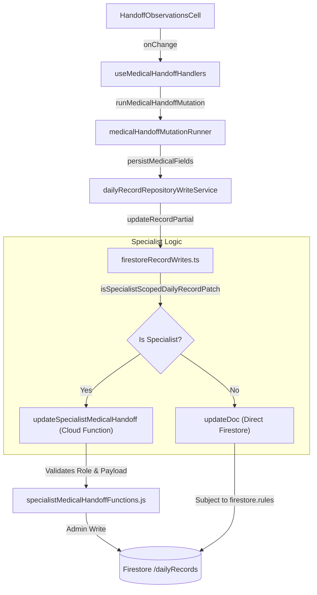

# Medical Handoff & Specialist Write Path

# Medical Handoff & Specialist Write Path

Relevant source files

The following files were used as context for generating this wiki page:

- [docs/FIRESTORE_RULES_COMPLEXITY_AUDIT.md](docs/FIRESTORE_RULES_COMPLEXITY_AUDIT.md)
- [docs/HANDOFF_SPECIALIST_MEDICAL_WRITE_PATH.md](docs/HANDOFF_SPECIALIST_MEDICAL_WRITE_PATH.md)
- [docs/MAINTENANCE_ITERATION_LOG.md](docs/MAINTENANCE_ITERATION_LOG.md)
- [docs/OPERATIVE_RULES_REFERENCE.md](docs/OPERATIVE_RULES_REFERENCE.md)
- [firestore.rules](firestore.rules)
- [functions/lib/specialistMedicalHandoffFunctions.js](functions/lib/specialistMedicalHandoffFunctions.js)
- [scripts/config/critical-coverage-thresholds.json](scripts/config/critical-coverage-thresholds.json)
- [src/features/handoff/components/HandoffPatientTable.tsx](src/features/handoff/components/HandoffPatientTable.tsx)
- [src/features/handoff/components/HandoffRow.tsx](src/features/handoff/components/HandoffRow.tsx)
- [src/features/handoff/components/HandoffRowCells.tsx](src/features/handoff/components/HandoffRowCells.tsx)
- [src/features/handoff/components/MedicalSpecialtyHandoffSection.tsx](src/features/handoff/components/MedicalSpecialtyHandoffSection.tsx)
- [src/features/handoff/controllers/handoffRowCellsController.ts](src/features/handoff/controllers/handoffRowCellsController.ts)
- [src/features/handoff/controllers/handoffRowController.ts](src/features/handoff/controllers/handoffRowController.ts)
- [src/features/handoff/controllers/medicalSpecialtyHandoffController.ts](src/features/handoff/controllers/medicalSpecialtyHandoffController.ts)
- [src/features/laboratory/controllers/labAnalyticsController.ts](src/features/laboratory/controllers/labAnalyticsController.ts)
- [src/hooks/controllers/censusEmailRecipientRuntimeController.ts](src/hooks/controllers/censusEmailRecipientRuntimeController.ts)
- [src/hooks/controllers/medicalHandoffHandlersController.ts](src/hooks/controllers/medicalHandoffHandlersController.ts)
- [src/hooks/useCensusEmailRecipientLists.ts](src/hooks/useCensusEmailRecipientLists.ts)
- [src/hooks/useMedicalHandoffHandlers.ts](src/hooks/useMedicalHandoffHandlers.ts)
- [src/services/config/runtimeContractClient.ts](src/services/config/runtimeContractClient.ts)
- [src/services/repositories/dailyRecordMasterSyncController.ts](src/services/repositories/dailyRecordMasterSyncController.ts)
- [src/services/repositories/dailyRecordWriteSupport.ts](src/services/repositories/dailyRecordWriteSupport.ts)
- [src/services/storage/firestore/firestoreRecordWrites.ts](src/services/storage/firestore/firestoreRecordWrites.ts)
- [src/services/storage/firestore/firestoreWriteSupport.ts](src/services/storage/firestore/firestoreWriteSupport.ts)
- [src/tests/features/census/global-search/globalSearchContracts.test.ts](src/tests/features/census/global-search/globalSearchContracts.test.ts)
- [src/tests/features/clinical-documents/clinicalDocumentDraftReducer.branchCoverage.test.ts](src/tests/features/clinical-documents/clinicalDocumentDraftReducer.branchCoverage.test.ts)
- [src/tests/features/handoff/medicalHandoffScopeController.test.ts](src/tests/features/handoff/medicalHandoffScopeController.test.ts)
- [src/tests/functions/specialistMedicalHandoffDeploymentContract.test.ts](src/tests/functions/specialistMedicalHandoffDeploymentContract.test.ts)
- [src/tests/functions/specialistMedicalHandoffFunctions.test.ts](src/tests/functions/specialistMedicalHandoffFunctions.test.ts)
- [src/tests/hooks/controllers/censusEmailRecipientRuntimeController.test.ts](src/tests/hooks/controllers/censusEmailRecipientRuntimeController.test.ts)
- [src/tests/hooks/controllers/medicalHandoffHandlersController.test.ts](src/tests/hooks/controllers/medicalHandoffHandlersController.test.ts)
- [src/tests/services/config/runtimeContractClient.test.ts](src/tests/services/config/runtimeContractClient.test.ts)
- [src/tests/services/repositories/dailyRecordMasterSyncController.test.ts](src/tests/services/repositories/dailyRecordMasterSyncController.test.ts)
- [src/tests/services/storage/firestoreRecordWrites.test.ts](src/tests/services/storage/firestoreRecordWrites.test.ts)
- [src/tests/services/storage/firestoreWriteSupport.test.ts](src/tests/services/storage/firestoreWriteSupport.test.ts)
- [src/tests/views/handoff/HandoffPatientTable.test.tsx](src/tests/views/handoff/HandoffPatientTable.test.tsx)
- [src/tests/views/handoff/HandoffRow.test.tsx](src/tests/views/handoff/HandoffRow.test.tsx)
- [src/tests/views/handoff/handoffRowCellsController.test.ts](src/tests/views/handoff/handoffRowCellsController.test.ts)
- [src/tests/views/handoff/medicalSpecialtyHandoffController.test.ts](src/tests/views/handoff/medicalSpecialtyHandoffController.test.ts)

This page details the implementation of the medical shift handover system and the specialized write path designed for medical specialists. It covers the frontend component architecture, the handler logic for medical entries, and the secure backend transition for specialist data.

## 1. Frontend Architecture

The medical handoff UI is integrated into the `HandoffView` but follows a distinct logic path compared to nursing handoffs. It focuses on medical observations, clinical events, and specialty-specific entries.

### Component Structure

- **HandoffMedicalContent**: The main container for medical-specific handoff data.
- **MedicalHandoffTabs**: Orchestrates the view between general medical handoff and structured specialty sections.
- **MedicalSpecialtyHandoffSection**: Displays and manages entries for specific specialties (e.g., Surgery, Internal Medicine) [src/features/handoff/components/MedicalSpecialtyHandoffSection.tsx]().
- **HandoffRowCells**: A collection of cells (`HandoffDiagnosisCell`, `HandoffObservationsCell`, etc.) that delegate visibility and state logic to a specialized controller [src/features/handoff/components/HandoffRowCells.tsx:1-6]().

### Row & Cell Logic

The `handoffRowCellsController` is responsible for determining the visual state of medical cells without polluting the JSX with clinical logic. It handles:

- **Status Mapping**: Translating `PatientStatus` (GRAVE, DE_CUIDADO, ESTABLE) to UI badge variants [src/features/handoff/controllers/handoffRowCellsController.ts:15-18]().
- **Event Visibility**: Determining if clinical events can be toggled or edited based on the row type (Main vs Sub-row) and user permissions [src/features/handoff/controllers/handoffRowCellsController.ts:20-28]().
- **Empty States**: Managing transitions between "create-entry", "primary-note", and "empty" states [src/features/handoff/controllers/handoffRowCellsController.ts:163-195]().

Sources: [src/features/handoff/components/HandoffRowCells.tsx](), [src/features/handoff/controllers/handoffRowCellsController.ts]()

## 2. Medical Handoff Handlers

The `useMedicalHandoffHandlers` hook provides a standardized API for all medical data mutations. It wraps low-level application commands in a context-aware execution runner.

### Key Operations

The hook exposes functions for the full lifecycle of a medical entry:

- **Primary Notes**: `handleMedicalPrimaryNoteChange` for the main patient observation [src/hooks/useMedicalHandoffHandlers.ts:115-141]().
- **Specialty Entries**: `handleMedicalEntryAdd`, `handleMedicalEntryNoteChange`, and `handleMedicalEntrySpecialtyChange` [src/hooks/useMedicalHandoffHandlers.ts:143-202]().
- **Audit Integration**: Every mutation automatically triggers a debounced audit log entry via `logDebouncedEvent` [src/hooks/useMedicalHandoffHandlers.ts:65-66]().

### Data Flow: Component to Persistence

The handler uses `runMedicalHandoffMutation` to orchestrate the write:

1. **Context Resolution**: Checks if the user has `doctor_specialist` or `doctor_urgency` roles and if the record is within the editable window [src/hooks/useMedicalHandoffHandlers.ts:67-83]().
2. **Execution**: Calls the domain application function (e.g., `executeUpdateMedicalEntryNote`) [src/hooks/useMedicalHandoffHandlers.ts:150-157]().
3. **Persistence**: Uses a `persistMedicalFields` callback provided by the parent census/handoff logic [src/hooks/useMedicalHandoffHandlers.ts:42-46]().

Sources: [src/hooks/useMedicalHandoffHandlers.ts](), [src/hooks/controllers/medicalHandoffHandlersController.ts]()

## 3. Specialist Write Path & Cloud Functions

To maintain high security and data integrity, medical specialists (who have restricted write access compared to nurses) use a specialized write path.

### The Specialist Callable Path

When a user with the `doctor_specialist` role attempts to save a medical handoff, the system routes the request through a Firebase Cloud Function instead of a direct Firestore `updateDoc` call.

- **Routing Logic**: `shouldRouteSpecialistPatchViaCallable` detects the specialist role [src/services/storage/firestore/firestoreRecordWrites.ts:72-85]().
- **Execution**: The `updateSpecialistMedicalHandoff` callable function is invoked [src/services/storage/firestore/firestoreRecordWrites.ts:87-101]().
- **Backend Function**: `specialistMedicalHandoffFunctions.js` (in the `functions` folder) validates the payload and performs the write on behalf of the specialist.

### Firestore Rules Enforcement

The `firestore.rules` file contains strict "Iterative Blocks" that define exactly which fields a specialist can modify.

- **Field White-listing**: Specialists can only touch `medicalHandoffEntries`, `medicalHandoffNote`, `medicalHandoffAudit`, and `clinicalEvents` [firestore.rules:73-82]().
- **Bed-Level Isolation**: The rules ensure that a specialist update only affects a single bed at a time [firestore.rules:107-111]().
- **Structural Integrity**: Rules like `isValidSpecialistMedicalBedUpdate` prevent specialists from modifying administrative or nursing data [firestore.rules:97-106]().

Sources: [src/services/storage/firestore/firestoreRecordWrites.ts](), [firestore.rules](), [functions/lib/specialistMedicalHandoffFunctions.js]()

## 4. Draft Persistence & Recovery

To prevent data loss during network instability or concurrent edits, the system implements a draft persistence layer.

### Draft Management

- **Local Persistence**: Drafts are stored locally with an expiration timestamp (`expiresAt`) [src/features/handoff/controllers/handoffRowCellsController.ts:10-13]().
- **Pruning**: The `pruneResolvedPendingMedicalEntryDrafts` function removes drafts once they match the persisted state in Firestore or have expired [src/features/handoff/controllers/handoffRowCellsController.ts:88-109]().
- **Display Projection**: `resolveDisplayMedicalObservationEntries` merges persisted entries with active local drafts to show the user their unsaved changes immediately [src/features/handoff/controllers/handoffRowCellsController.ts:115-151]().

### Diagram: Medical Handoff Write Pipeline

This diagram illustrates the flow from a UI interaction to the specialized specialist backend path.

Sources: [src/features/handoff/controllers/handoffRowCellsController.ts](), [src/hooks/useMedicalHandoffHandlers.ts](), [src/services/storage/firestore/firestoreRecordWrites.ts]()

## 5. Security & Access Control

Access is governed by the `medicalHandoffAccessController` and the `operationalAccessPolicy`.

### Access Policies

| Role                | Access Level       | Enforcement Mechanism                  |
| :------------------ | :----------------- | :------------------------------------- |
| `nurse_hospital`    | Full Edit          | `canEdit()` in `firestore.rules`       |
| `doctor_urgency`    | Medical Fields     | `isDoctor()` in `firestore.rules`      |
| `doctor_specialist` | Restricted Medical | `isDoctorSpecialist()` + Callable Path |
| `viewer`            | Read Only          | `hasAnyEffectiveRole()`                |

### Role Resolution

The system uses `getEffectiveRole()` to combine custom claims from Firebase Auth with dynamic role overrides stored in the `config/roles` document [firestore.rules:34-39]().

Sources: [firestore.rules:49-63](), [src/shared/access/operationalAccessPolicy.ts](), [docs/FIRESTORE_RULES_COMPLEXITY_AUDIT.md]()

---
