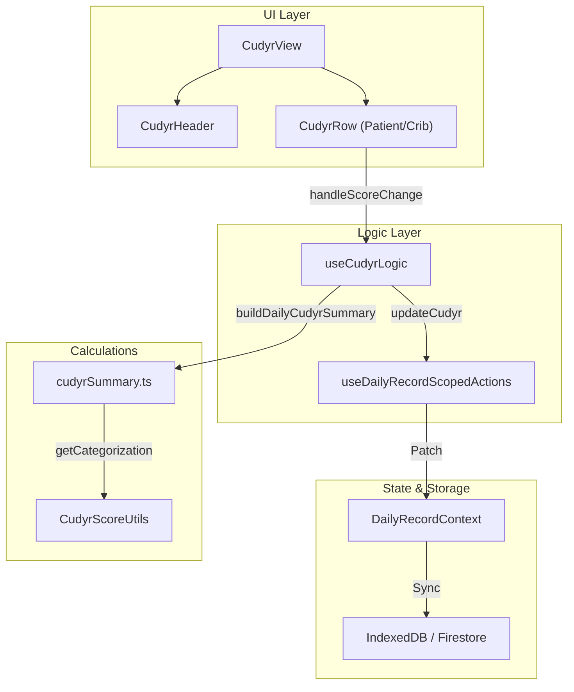
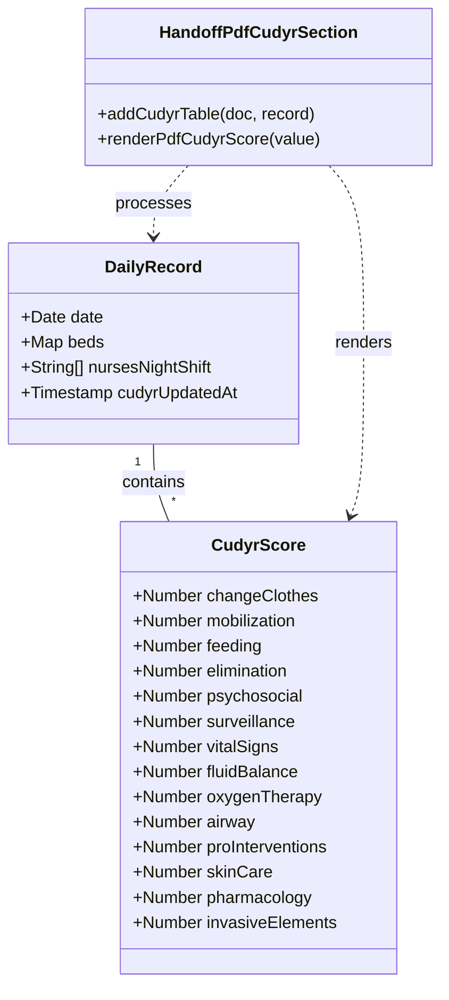

# CUDYR Module (Patient Dependency Scoring)

# CUDYR Module (Patient Dependency Scoring)

Relevant source files

The following files were used as context for generating this wiki page:

- [src/features/analytics/controllers/minsalAnalyticsPresentationController.ts](src/features/analytics/controllers/minsalAnalyticsPresentationController.ts)
- [src/features/cudyr/README.md](src/features/cudyr/README.md)
- [src/features/cudyr/components/CudyrHeader.tsx](src/features/cudyr/components/CudyrHeader.tsx)
- [src/features/cudyr/components/CudyrRow.tsx](src/features/cudyr/components/CudyrRow.tsx)
- [src/features/cudyr/components/CudyrView.tsx](src/features/cudyr/components/CudyrView.tsx)
- [src/features/cudyr/controllers/cudyrEligibilityController.ts](src/features/cudyr/controllers/cudyrEligibilityController.ts)
- [src/features/cudyr/controllers/cudyrRowViewController.ts](src/features/cudyr/controllers/cudyrRowViewController.ts)
- [src/features/cudyr/controllers/cudyrViewController.ts](src/features/cudyr/controllers/cudyrViewController.ts)
- [src/features/cudyr/hooks/useCudyrLogic.ts](src/features/cudyr/hooks/useCudyrLogic.ts)
- [src/features/handoff/components/HandoffCudyrPrint.tsx](src/features/handoff/components/HandoffCudyrPrint.tsx)
- [src/features/handoff/components/HandoffCudyrPrintHeader.tsx](src/features/handoff/components/HandoffCudyrPrintHeader.tsx)
- [src/features/handoff/components/HandoffCudyrPrintTable.tsx](src/features/handoff/components/HandoffCudyrPrintTable.tsx)
- [src/features/handoff/components/handoffCudyrPrintSupport.ts](src/features/handoff/components/handoffCudyrPrintSupport.ts)
- [src/services/cudyr/cudyrSummary.ts](src/services/cudyr/cudyrSummary.ts)
- [src/services/pdf/handoffPdfCudyrSection.ts](src/services/pdf/handoffPdfCudyrSection.ts)
- [src/tests/features/analytics/AnalyticsView.test.tsx](src/tests/features/analytics/AnalyticsView.test.tsx)
- [src/tests/features/analytics/minsalAnalyticsPresentationController.test.ts](src/tests/features/analytics/minsalAnalyticsPresentationController.test.ts)
- [src/tests/features/cudyr/CudyrHeader.test.tsx](src/tests/features/cudyr/CudyrHeader.test.tsx)
- [src/tests/features/cudyr/cudyrEligibilityController.test.ts](src/tests/features/cudyr/cudyrEligibilityController.test.ts)
- [src/tests/features/cudyr/cudyrRowViewController.test.ts](src/tests/features/cudyr/cudyrRowViewController.test.ts)
- [src/tests/features/cudyr/cudyrViewController.test.ts](src/tests/features/cudyr/cudyrViewController.test.ts)
- [src/tests/integration/cudyrTimestampFlow.test.tsx](src/tests/integration/cudyrTimestampFlow.test.tsx)
- [src/tests/services/calculations/cudyrSummary.test.ts](src/tests/services/calculations/cudyrSummary.test.ts)
- [src/tests/services/observability/operationalTelemetryService.test.ts](src/tests/services/observability/operationalTelemetryService.test.ts)
- [src/tests/services/pdf/handoffPdfCudyrSection.test.ts](src/tests/services/pdf/handoffPdfCudyrSection.test.ts)
- [src/tests/views/cudyr/CudyrView.test.tsx](src/tests/views/cudyr/CudyrView.test.tsx)
- [src/tests/views/handoff/handoffCudyrPrintSupport.test.ts](src/tests/views/handoff/handoffCudyrPrintSupport.test.ts)
- [src/utils/dateFormattingUtils.ts](src/utils/dateFormattingUtils.ts)

The CUDYR module (Categorización de Usuarios por Dependencia y Riesgo) is a clinical categorization tool used to measure nursing workload and patient complexity. It calculates dependency and risk scores based on 14 clinical parameters, facilitating resource allocation and statistical reporting.

## 1. Overview and Implementation

The CUDYR feature is integrated into the Handoff module but functions as a specialized view for data entry and analysis. It follows a strict eligibility logic based on admission timing and provides real-time scoring updates.

### Key Components

- **CudyrView**: The primary container that renders the categorization table and header [src/features/cudyr/components/CudyrView.tsx:13-42]().
- **CudyrHeader**: Displays real-time statistics (Occupancy, Categorization Index) and provides export actions [src/features/cudyr/components/CudyrHeader.tsx:74-80]().
- **CudyrRow**: Individual patient rows allowing input of the 14 CUDYR parameters [src/features/cudyr/components/CudyrRow.tsx]().
- **useCudyrLogic**: Hook managing the state, calculations, and persistence of scores within the `DailyRecord` context [src/features/cudyr/hooks/useCudyrLogic.ts:12-100]().

### Data Flow: Scoring to Persistence

The system uses a reactive flow where inputs in the `CudyrRow` trigger updates in the `DailyRecordContext`.

**Sources:** [src/features/cudyr/components/CudyrView.tsx:13-23](), [src/features/cudyr/hooks/useCudyrLogic.ts:18-30](), [src/services/cudyr/cudyrSummary.ts:4-7]().

---

## 2. Eligibility Rules

CUDYR categorization is subject to specific clinical administrative rules to ensure the data represents a full shift's workload.

### The "8-Hour / 01:00 AM" Rule

A patient is only eligible for categorization if they have been admitted for at least 8 hours relative to the nocturnal cut-off time.

- **Reference Time**: Fixed at 01:00 AM of the day following the record date [src/domain/cudyr/cudyrEligibility.ts]().
- **Eligibility Logic**:
  - Patients admitted after 01:00 AM on the record date but before the 8-hour threshold (17:00 PM) are eligible.
  - Patients admitted after 17:00 PM are considered "Blocked" (Bloqueado) because they won't have 8 hours of stay by the 01:00 AM cut-off [src/features/cudyr/controllers/cudyrEligibilityController.ts:9-10]().
- **Visual Feedback**: Ineligible patients appear with a "(Bloq.)" suffix in reports and their scoring inputs are disabled [src/services/pdf/handoffPdfCudyrSection.ts:104-105]().

**Sources:** [src/features/cudyr/controllers/cudyrEligibilityController.ts](), [src/services/pdf/handoffPdfCudyrSection.ts:98-105]().

---

## 3. CUDYR Calculations and Summary

The system calculates three primary values for each eligible patient:

1.  **Dependency Score (0-18)**: Sum of the first 6 parameters (Clothes, Mobilization, Feeding, Elimination, Psychosocial, Surveillance) [src/features/cudyr/components/CudyrView.tsx:102-103]().
2.  **Risk Score (0-24)**: Sum of the remaining 8 parameters (Vital Signs, Balance, Oxygen, Airway, Interventions, Skin, Pharma, Invasive) [src/features/cudyr/components/CudyrView.tsx:108-109]().
3.  **Final Category**: A matrix-based result (e.g., A1, B2, D3) derived from the Dependency and Risk scores [src/services/cudyr/CudyrScoreUtils.ts]().

### Statistical Summary

The `buildDailyCudyrSummary` service aggregates data for the entire unit:

- **Occupied Count**: Total eligible patients currently in beds [src/services/cudyr/cudyrSummary.ts:160-172]().
- **Categorized Count**: Eligible patients who have all 14 parameters filled [src/services/cudyr/cudyrSummary.ts:174-178]().
- **Categorization Index**: `(Categorized / Occupied) * 100` [src/features/cudyr/components/CudyrHeader.tsx:85-86]().

**Sources:** [src/services/cudyr/cudyrSummary.ts:4-7](), [src/features/cudyr/components/CudyrHeader.tsx:85-87](), [src/features/cudyr/components/CudyrView.tsx:98-115]().

---

## 4. Handoff Integration and PDF Generation

CUDYR data is a critical section of the nursing handoff. It is rendered in both the print view and the generated PDF.

### PDF Implementation

The `addCudyrTable` function in `handoffPdfCudyrSection.ts` handles the generation of the CUDYR page within the shift report PDF.

| Feature     | Implementation Detail                                                                                                                           |
| :---------- | :---------------------------------------------------------------------------------------------------------------------------------------------- |
| **Header**  | Includes Night Shift Nurses and the fixed application cut-off timestamp [src/services/pdf/handoffPdfCudyrSection.ts:35-43]().                   |
| **Summary** | Statistical breakdown of categories (A, B, C, D) [src/services/pdf/handoffPdfCudyrSection.ts:49-89]().                                          |
| **Table**   | Grid rendering of all 14 parameters + calculated results for every bed and clinical crib [src/services/pdf/handoffPdfCudyrSection.ts:91-132](). |
| **Styling** | Conditional cell coloring based on the Category (e.g., Red for 'A', Orange for 'B') [src/services/pdf/handoffPdfCudyrSection.ts:178-194]().     |

### Code-to-Natural-Language Mapping

**Sources:** [src/services/pdf/handoffPdfCudyrSection.ts:18-198](), [src/features/handoff/components/HandoffCudyrPrint.tsx:13-38](), [src/tests/services/pdf/handoffPdfCudyrSection.test.ts:18-110]().

---

## 5. Export Services

The module supports a monthly Excel export via `cudyrExportService`. This service aggregates daily summaries for a specific month to generate the official CUDYR report required by hospital administration.

- **Trigger**: `handleExportExcel` in `CudyrHeader` [src/features/cudyr/components/CudyrHeader.tsx:88-108]().
- **Service**: `generateCudyrMonthlyExcel` (dynamically imported to reduce bundle size) [src/features/cudyr/components/CudyrHeader.tsx:93-94]().
- **Logging**: Operations are logged via `cudyrExportLogger` [src/features/cudyr/components/CudyrHeader.tsx:96-100]().

**Sources:** [src/features/cudyr/components/CudyrHeader.tsx:88-108](), [src/services/cudyr/cudyrSummary.ts:215-217]().

---
