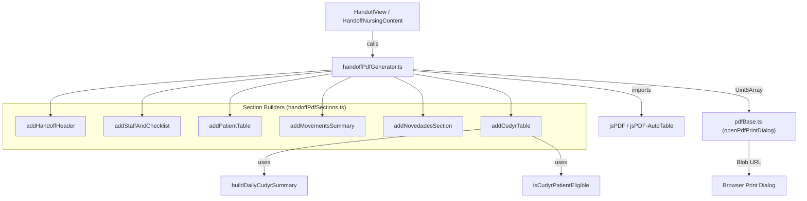
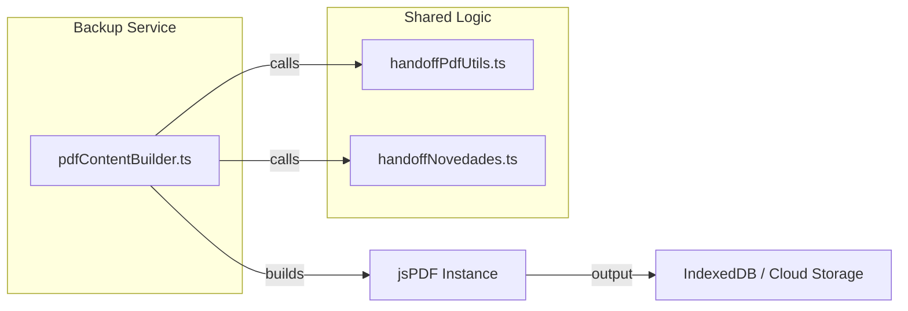

# Handoff PDF Generation

# Handoff PDF Generation

Relevant source files

The following files were used as context for generating this wiki page:

- [src/components/device-selector/DeviceBadge.tsx](src/components/device-selector/DeviceBadge.tsx)
- [src/features/census/components/patient-row/RutPassportInput.tsx](src/features/census/components/patient-row/RutPassportInput.tsx)
- [src/features/handoff/components/HandoffCudyrPrint.tsx](src/features/handoff/components/HandoffCudyrPrint.tsx)
- [src/features/handoff/components/HandoffCudyrPrintHeader.tsx](src/features/handoff/components/HandoffCudyrPrintHeader.tsx)
- [src/features/handoff/components/HandoffCudyrPrintTable.tsx](src/features/handoff/components/HandoffCudyrPrintTable.tsx)
- [src/features/handoff/components/handoffCudyrPrintSupport.ts](src/features/handoff/components/handoffCudyrPrintSupport.ts)
- [src/schemas/inputSchemas.ts](src/schemas/inputSchemas.ts)
- [src/services/backup/pdfContentBuilder.ts](src/services/backup/pdfContentBuilder.ts)
- [src/services/exporters/censusRawWorkbook.ts](src/services/exporters/censusRawWorkbook.ts)
- [src/services/exporters/excel/sections/headerSection.ts](src/services/exporters/excel/sections/headerSection.ts)
- [src/services/pdf/handoffPdfCudyrSection.ts](src/services/pdf/handoffPdfCudyrSection.ts)
- [src/services/pdf/handoffPdfGenerator.ts](src/services/pdf/handoffPdfGenerator.ts)
- [src/services/pdf/handoffPdfLayoutSections.ts](src/services/pdf/handoffPdfLayoutSections.ts)
- [src/services/pdf/handoffPdfPatientTableSection.ts](src/services/pdf/handoffPdfPatientTableSection.ts)
- [src/services/pdf/handoffPdfSections.ts](src/services/pdf/handoffPdfSections.ts)
- [src/services/pdf/handoffPdfTypes.ts](src/services/pdf/handoffPdfTypes.ts)
- [src/services/pdf/handoffPdfUtils.ts](src/services/pdf/handoffPdfUtils.ts)
- [src/services/staff/dailyRecordStaffing.ts](src/services/staff/dailyRecordStaffing.ts)
- [src/tests/integration/cudyrTimestampFlow.test.tsx](src/tests/integration/cudyrTimestampFlow.test.tsx)
- [src/tests/services/backup/pdfContentBuilder.test.ts](src/tests/services/backup/pdfContentBuilder.test.ts)
- [src/tests/services/exporters/exportCsvSerialization.test.ts](src/tests/services/exporters/exportCsvSerialization.test.ts)
- [src/tests/services/pdf/handoffPdfCudyrSection.test.ts](src/tests/services/pdf/handoffPdfCudyrSection.test.ts)
- [src/tests/services/pdf/handoffPdfGenerator.test.ts](src/tests/services/pdf/handoffPdfGenerator.test.ts)
- [src/tests/services/pdf/handoffPdfUtils.test.ts](src/tests/services/pdf/handoffPdfUtils.test.ts)
- [src/tests/services/staff/dailyRecordStaffing.test.ts](src/tests/services/staff/dailyRecordStaffing.test.ts)
- [src/tests/views/census/rutPassportInput.test.tsx](src/tests/views/census/rutPassportInput.test.tsx)
- [src/tests/views/handoff/handoffCudyrPrintSupport.test.ts](src/tests/views/handoff/handoffCudyrPrintSupport.test.ts)
- [src/utils/dateFormattingUtils.ts](src/utils/dateFormattingUtils.ts)

The Handoff PDF Generation pipeline is responsible for creating structured, printable reports for nursing and medical shift handovers. It aggregates clinical data from the `DailyRecord`, including patient status, movements, and nursing checklists, and includes a specialized section for CUDYR (Categorización de Usuario Dependiente y Riesgo) scoring.

## Pipeline Architecture

The PDF generation follows a modular pipeline where a generator orchestrates several layout and content sections using `jsPDF` and `jsPDF-autotable`.

### Core Data Flow

The flow starts with the `generateHandoffPdf` function, which determines the format (Medical vs. Nursing) and the shift (Day vs. Night).

Title: Handoff PDF Generation Pipeline

Sources: [src/services/pdf/handoffPdfGenerator.ts:28-91](), [src/services/pdf/handoffPdfSections.ts:4-18](), [src/services/pdf/handoffPdfCudyrSection.ts:18-198]()

## Component Roles

### Handoff PDF Generator

The entry point `generateHandoffPdf` in `handoffPdfGenerator.ts` handles dynamic imports of `jsPDF` to optimize bundle size [src/services/pdf/handoffPdfGenerator.ts:34-38](). It coordinates the sequence of sections:

1.  **Header**: Adds the HHR logo, institution name, and date [src/services/pdf/handoffPdfLayoutSections.ts:14-60]().
2.  **Staff & Checklist**: (Nursing only) Lists delivering/receiving nurses and TENS, followed by shift-specific checklist items (e.g., Braden scale for Day, Pharmacy counts for Night) [src/services/pdf/handoffPdfLayoutSections.ts:62-155]().
3.  **Patient Table**: Renders the main census table with diagnostics and observations [src/services/pdf/handoffPdfGenerator.ts:61-63]().
4.  **Movements**: Summarizes admissions, discharges, and transfers [src/services/pdf/handoffPdfGenerator.ts:66-67]().
5.  **CUDYR**: Appended specifically for Nursing Night shifts [src/services/pdf/handoffPdfGenerator.ts:81-83]().

### CUDYR Section Logic

The `addCudyrTable` function in `handoffPdfCudyrSection.ts` performs real-time calculations to generate a statistical summary of patient dependency [src/services/pdf/handoffPdfCudyrSection.ts:49-89]().

| Feature               | Implementation                                                                                                                                               |
| :-------------------- | :----------------------------------------------------------------------------------------------------------------------------------------------------------- |
| **Eligibility**       | Patients are checked via `isCudyrPatientEligible` (requires 8h stay and 01:00 AM cutoff) [src/services/pdf/handoffPdfCudyrSection.ts:98-98]().               |
| **Color Coding**      | Cells in the "Cat" (Category) column are colored based on score (A=Red, B=Orange, C=Yellow, D=Green) [src/services/pdf/handoffPdfCudyrSection.ts:178-194](). |
| **Statistical Index** | Calculates `categorizationIndex` as `(categorized / occupied) * 100` [src/services/pdf/handoffPdfCudyrSection.ts:54-57]().                                   |
| **Staffing**          | Resolves night shift nurses using `resolvePresentedNightShiftNurses` [src/services/pdf/handoffPdfCudyrSection.ts:35-35]().                                   |

Sources: [src/services/pdf/handoffPdfCudyrSection.ts:18-198](), [src/services/staff/dailyRecordStaffing.ts:97-110]()

## Backup PDF Storage Service

For offline-first resilience and audit purposes, the system includes a `pdfContentBuilder` used by the backup storage service. This replicates the handoff logic but is designed to run without side effects (like immediate printing) to generate Blobs for local storage.

Title: Backup PDF Content Builder

Sources: [src/services/backup/pdfContentBuilder.ts:83-201](), [src/services/pdf/handoffPdfUtils.ts:10-18]()

### Implementation Details

- **Logo Handling**: Images are converted to Base64 via `getBase64ImageFromURL` to ensure they can be embedded in the PDF without external network requests during the generation phase [src/services/pdf/handoffPdfUtils.ts:10-10]().
- **Staff Resolution**: The system uses `resolvePresentedDayShiftNurses` and `resolvePresentedNightShiftNurses` to handle legacy data structures and the modern `staffingDetailsV1` schema [src/services/staff/dailyRecordStaffing.ts:81-110]().
- **CUDYR Cutoff**: The application date for CUDYR is strictly calculated using `resolveCudyrNightApplicationDate`, which usually points to the calendar day following the record date (the 01:00 AM cut-off) [src/services/pdf/handoffPdfCudyrSection.ts:36-36]().

Sources: [src/services/pdf/handoffPdfLayoutSections.ts:26-30](), [src/services/staff/dailyRecordStaffing.ts:81-110](), [src/services/pdf/handoffPdfCudyrSection.test.ts:106-109]()

---
