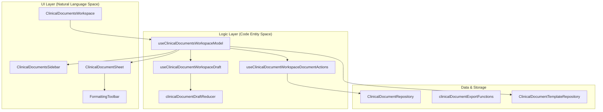
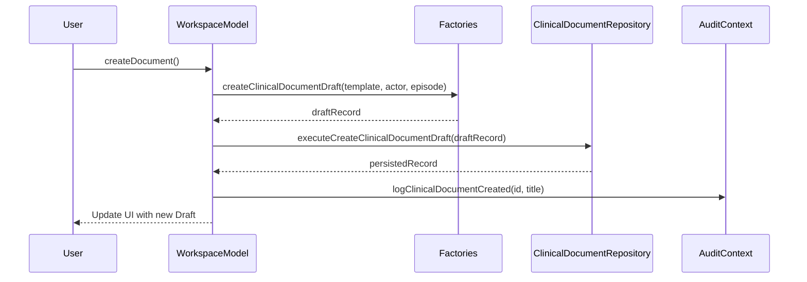

# Clinical Documents Module

# Clinical Documents Module

Relevant source files

The following files were used as context for generating this wiki page:

- [docs/FOUNDATION_CONTINUATION_TRACKER.md](docs/FOUNDATION_CONTINUATION_TRACKER.md)
- [docs/ITERATIVE_QUALITY_EXECUTION_PLAN.md](docs/ITERATIVE_QUALITY_EXECUTION_PLAN.md)
- [scripts/check-clinical-documents-feature-boundary.mjs](scripts/check-clinical-documents-feature-boundary.mjs)
- [scripts/check-shared-layer-boundary.mjs](scripts/check-shared-layer-boundary.mjs)
- [scripts/folder-dependency-allowlist.json](scripts/folder-dependency-allowlist.json)
- [src/application/clinical-documents/clinicalDocumentEditorUseCases.ts](src/application/clinical-documents/clinicalDocumentEditorUseCases.ts)
- [src/application/clinical-documents/clinicalDocumentJsonUseCases.ts](src/application/clinical-documents/clinicalDocumentJsonUseCases.ts)
- [src/application/clinical-documents/clinicalDocumentPdfExportUseCase.ts](src/application/clinical-documents/clinicalDocumentPdfExportUseCase.ts)
- [src/application/clinical-documents/clinicalDocumentPrintOpenUseCase.ts](src/application/clinical-documents/clinicalDocumentPrintOpenUseCase.ts)
- [src/application/clinical-documents/clinicalDocumentTemplateUseCases.ts](src/application/clinical-documents/clinicalDocumentTemplateUseCases.ts)
- [src/application/clinical-documents/clinicalDocumentUseCases.ts](src/application/clinical-documents/clinicalDocumentUseCases.ts)
- [src/application/ports/clinicalDocumentPort.ts](src/application/ports/clinicalDocumentPort.ts)
- [src/features/clinical-documents/components/ClinicalDocumentSectionList.tsx](src/features/clinical-documents/components/ClinicalDocumentSectionList.tsx)
- [src/features/clinical-documents/components/ClinicalDocumentSheet.tsx](src/features/clinical-documents/components/ClinicalDocumentSheet.tsx)
- [src/features/clinical-documents/components/ClinicalDocumentsModal.tsx](src/features/clinical-documents/components/ClinicalDocumentsModal.tsx)
- [src/features/clinical-documents/components/ClinicalDocumentsSidebar.tsx](src/features/clinical-documents/components/ClinicalDocumentsSidebar.tsx)
- [src/features/clinical-documents/components/ClinicalDocumentsWorkspace.tsx](src/features/clinical-documents/components/ClinicalDocumentsWorkspace.tsx)
- [src/features/clinical-documents/components/clinicalDocumentSheetShared.ts](src/features/clinical-documents/components/clinicalDocumentSheetShared.ts)
- [src/features/clinical-documents/contracts/clinicalDocumentsSidebarContracts.ts](src/features/clinical-documents/contracts/clinicalDocumentsSidebarContracts.ts)
- [src/features/clinical-documents/controllers/clinicalDocumentsWorkspaceViewModel.ts](src/features/clinical-documents/controllers/clinicalDocumentsWorkspaceViewModel.ts)
- [src/features/clinical-documents/domain/rules.ts](src/features/clinical-documents/domain/rules.ts)
- [src/features/clinical-documents/hooks/clinicalDocumentDraftReducer.ts](src/features/clinical-documents/hooks/clinicalDocumentDraftReducer.ts)
- [src/features/clinical-documents/hooks/useClinicalDocumentWorkspaceDocumentActions.ts](src/features/clinical-documents/hooks/useClinicalDocumentWorkspaceDocumentActions.ts)
- [src/features/clinical-documents/hooks/useClinicalDocumentWorkspaceDraft.ts](src/features/clinical-documents/hooks/useClinicalDocumentWorkspaceDraft.ts)
- [src/features/clinical-documents/hooks/useClinicalDocumentsWorkspaceModel.ts](src/features/clinical-documents/hooks/useClinicalDocumentsWorkspaceModel.ts)
- [src/features/clinical-documents/internal.ts](src/features/clinical-documents/internal.ts)
- [src/features/clinical-documents/services/clinicalDocumentPdfService.ts](src/features/clinical-documents/services/clinicalDocumentPdfService.ts)
- [src/features/clinical-documents/services/clinicalDocumentPrintPdfService.ts](src/features/clinical-documents/services/clinicalDocumentPrintPdfService.ts)
- [src/features/clinical-documents/styles/clinicalDocumentSheet.css](src/features/clinical-documents/styles/clinicalDocumentSheet.css)
- [src/services/repositories/ClinicalDocumentTemplateRepository.ts](src/services/repositories/ClinicalDocumentTemplateRepository.ts)
- [src/shared/clinical-documents/clinicalDocumentPresentation.ts](src/shared/clinical-documents/clinicalDocumentPresentation.ts)
- [src/tests/features/clinical-documents/ClinicalDocumentSheet.test.tsx](src/tests/features/clinical-documents/ClinicalDocumentSheet.test.tsx)
- [src/tests/features/clinical-documents/ClinicalDocumentsSidebar.test.tsx](src/tests/features/clinical-documents/ClinicalDocumentsSidebar.test.tsx)
- [src/tests/features/clinical-documents/ClinicalDocumentsWorkspace.test.tsx](src/tests/features/clinical-documents/ClinicalDocumentsWorkspace.test.tsx)
- [src/tests/features/clinical-documents/clinicalDocumentJsonUseCases.test.ts](src/tests/features/clinical-documents/clinicalDocumentJsonUseCases.test.ts)
- [src/tests/features/clinical-documents/useClinicalDocumentWorkspaceDocumentActions.test.ts](src/tests/features/clinical-documents/useClinicalDocumentWorkspaceDocumentActions.test.ts)

The **Clinical Documents Module** provides a comprehensive workspace for clinicians to create, manage, and export medical documentation such as Epicrisis, Evolution notes, and Nursing Clinical Updates. It is designed with a "sheet-first" philosophy, mimicking the layout of a physical medical document while providing digital advantages like autosave, rich text formatting, and AI-assisted data import.

The module is centered around the `ClinicalDocumentsWorkspace` component, which orchestrates the interaction between the document list, the editor, and external data sources (Lab results, MMRAD imaging).

### System Overview Diagram

The following diagram illustrates the relationship between the UI components and the underlying controller/service logic.

**Clinical Documents Architecture Map**

Sources: [src/features/clinical-documents/components/ClinicalDocumentsWorkspace.tsx:39-51](), [src/features/clinical-documents/hooks/useClinicalDocumentsWorkspaceModel.ts:41-116](), [src/features/clinical-documents/hooks/useClinicalDocumentWorkspaceDocumentActions.ts:59-75]()

---

## 7.1 Clinical Documents Workspace & Draft Management

The workspace serves as the primary container for document management. It handles the lifecycle of a clinical document from creation using templates to persistent storage.

- **Draft Management**: Documents are managed as local drafts via `useClinicalDocumentWorkspaceDraft`, which utilizes a dedicated reducer (`clinicalDocumentDraftReducer`) to handle complex state transitions (e.g., patching sections, reordering content).
- **Autosave Engine**: The system includes a "flush-on-deactivate" mechanism where changes are synchronized to the repository whenever an editor section loses focus.
- **Conflict Detection**: The workspace monitors remote changes to prevent overwriting data if multiple clinicians access the same patient episode.
- **UI Features**: Includes a sidebar for document selection, a zoom system for the sheet view, and a sidebar collapse toggle to maximize editing space.

For details, see [Clinical Documents Workspace & Draft Management](#7.1).

Sources: [src/features/clinical-documents/components/ClinicalDocumentsWorkspace.tsx:52-100](), [src/features/clinical-documents/hooks/useClinicalDocumentsWorkspaceModel.ts:75-116](), [src/features/clinical-documents/hooks/useClinicalDocumentWorkspaceDraft.ts:1-50]()

---

## 7.2 Rich Text Editor & Document Sections

The editor provides a structured yet flexible environment for medical writing. It uses a custom rich text implementation tailored for clinical needs.

- **Structured Sections**: Documents are composed of discrete sections (e.g., Anamnesis, Physical Exam, Plan). The `ClinicalDocumentSectionList` allows for visibility toggling and reordering.
- **Formatting Toolbar**: A specialized toolbar (`ClinicalDocumentFormattingToolbar`) provides standard text styling, undo/redo capabilities, and a zoom control.
- **Indications Catalog**: A personal and specialty-based catalog of medical indications can be managed and inserted directly into the "Plan" section.
- **External Insertion**: Support for inserting Lab results and MMRAD imaging reports directly into the active editor cursor position.

For details, see [Rich Text Editor & Document Sections](#7.2).

Sources: [src/features/clinical-documents/components/ClinicalDocumentSheet.tsx:150-184](), [src/features/clinical-documents/components/ClinicalDocumentsWorkspace.tsx:61-77](), [src/features/clinical-documents/components/ClinicalDocumentsSidebar.tsx:113-159]()

---

## 7.3 Clinical Document Export (PDF, Drive, IEEH)

Once completed, documents can be exported through several specialized pipelines handled by `useClinicalDocumentWorkspaceExportActions`.

- **PDF Generation**: Supports both browser-based printing and structured PDF generation via `clinicalDocumentPdfService`.
- **Google Drive Integration**: Automated upload of generated PDFs to the hospital's Google Drive storage for long-term archiving.
- **IEEH (Informe Estadístico de Egreso Hospitalario)**: A dedicated sub-module for generating the statistical discharge report required by MINSAL, including a specialized print controller and PDF service.

For details, see [Clinical Document Export (PDF, Drive, IEEH)](#7.3).

Sources: [src/features/clinical-documents/hooks/useClinicalDocumentsWorkspaceModel.ts:218-224](), [src/features/clinical-documents/services/clinicalDocumentPdfService.ts:1-20](), [src/features/clinical-documents/services/clinicalDocumentPrintPdfService.ts:1-15]()

---

## 7.4 AI Import & CIE-10 Search

The module leverages serverless functions to assist clinicians in data entry and coding.

- **AI Import**: Clinicians can upload external files (e.g., previous discharge summaries) which are processed by a Netlify function to extract and map data into the document's structured sections.
- **CIE-10 AI Search**: An intelligent search service that helps doctors find the correct diagnostic codes based on natural language descriptions.
- **Clinical Summary**: AI-generated summaries of the patient's current episode to expedite the creation of evolution notes.

For details, see [AI Import & CIE-10 Search](#7.4).

Sources: [src/features/clinical-documents/hooks/useClinicalDocumentsWorkspaceModel.ts:202-216](), [src/features/clinical-documents/hooks/useClinicalDocumentWorkspaceDocumentActions.ts:150-151](), [src/features/clinical-documents/components/ClinicalDocumentsSidebar.tsx:43-44]()

---

### Key Data Structures

| Entity                     | Description                                                               | File Reference                                                                    |
| :------------------------- | :------------------------------------------------------------------------ | :-------------------------------------------------------------------------------- |
| `ClinicalDocumentRecord`   | The core document entity containing sections, metadata, and patient data. | [src/features/clinical-documents/domain/entities.ts]()                            |
| `ClinicalDocumentTemplate` | Definition of document structure (e.g., Epicrisis vs. Evolución).         | [src/features/clinical-documents/domain/entities.ts]()                            |
| `PatientData`              | The patient context required to initialize a document episode.            | [src/features/clinical-documents/contracts/clinicalDocumentsPatientContract.ts]() |

### Core Use Cases

**Document Creation Flow**

Sources: [src/features/clinical-documents/hooks/useClinicalDocumentWorkspaceDocumentActions.ts:78-146](), [src/application/clinical-documents/clinicalDocumentUseCases.ts:1-30]()

---
