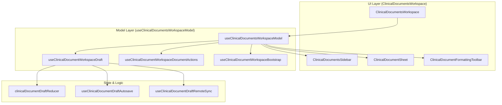
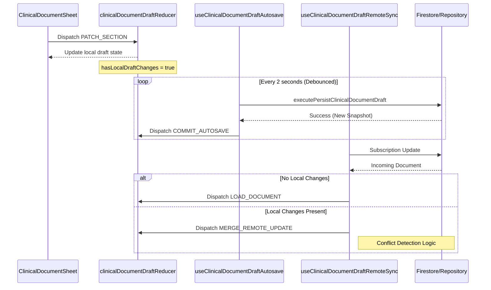

# Clinical Documents Workspace & Draft Management

# Clinical Documents Workspace & Draft Management

Relevant source files

The following files were used as context for generating this wiki page:

- [src/features/clinical-documents/components/ClinicalDocumentAnnexPage.tsx](src/features/clinical-documents/components/ClinicalDocumentAnnexPage.tsx)
- [src/features/clinical-documents/components/ClinicalDocumentLabInsertDialog.tsx](src/features/clinical-documents/components/ClinicalDocumentLabInsertDialog.tsx)
- [src/features/clinical-documents/components/ClinicalDocumentSectionList.tsx](src/features/clinical-documents/components/ClinicalDocumentSectionList.tsx)
- [src/features/clinical-documents/components/ClinicalDocumentSheet.tsx](src/features/clinical-documents/components/ClinicalDocumentSheet.tsx)
- [src/features/clinical-documents/components/ClinicalDocumentStatusBar.tsx](src/features/clinical-documents/components/ClinicalDocumentStatusBar.tsx)
- [src/features/clinical-documents/components/ClinicalDocumentsModal.tsx](src/features/clinical-documents/components/ClinicalDocumentsModal.tsx)
- [src/features/clinical-documents/components/ClinicalDocumentsSidebar.tsx](src/features/clinical-documents/components/ClinicalDocumentsSidebar.tsx)
- [src/features/clinical-documents/components/ClinicalDocumentsWorkspace.tsx](src/features/clinical-documents/components/ClinicalDocumentsWorkspace.tsx)
- [src/features/clinical-documents/components/clinicalDocumentSheetShared.ts](src/features/clinical-documents/components/clinicalDocumentSheetShared.ts)
- [src/features/clinical-documents/contracts/clinicalDocumentsSidebarContracts.ts](src/features/clinical-documents/contracts/clinicalDocumentsSidebarContracts.ts)
- [src/features/clinical-documents/controllers/clinicalDocumentsWorkspaceViewModel.ts](src/features/clinical-documents/controllers/clinicalDocumentsWorkspaceViewModel.ts)
- [src/features/clinical-documents/domain/rules.ts](src/features/clinical-documents/domain/rules.ts)
- [src/features/clinical-documents/hooks/clinicalDocumentDraftReducer.ts](src/features/clinical-documents/hooks/clinicalDocumentDraftReducer.ts)
- [src/features/clinical-documents/hooks/useClinicalDocumentSheetState.ts](src/features/clinical-documents/hooks/useClinicalDocumentSheetState.ts)
- [src/features/clinical-documents/hooks/useClinicalDocumentWorkspaceDocumentActions.ts](src/features/clinical-documents/hooks/useClinicalDocumentWorkspaceDocumentActions.ts)
- [src/features/clinical-documents/hooks/useClinicalDocumentWorkspaceDraft.ts](src/features/clinical-documents/hooks/useClinicalDocumentWorkspaceDraft.ts)
- [src/features/clinical-documents/hooks/useClinicalDocumentsWorkspaceModel.ts](src/features/clinical-documents/hooks/useClinicalDocumentsWorkspaceModel.ts)
- [src/features/clinical-documents/services/clinicalDocumentPdfService.ts](src/features/clinical-documents/services/clinicalDocumentPdfService.ts)
- [src/features/clinical-documents/services/clinicalDocumentPrintPdfService.ts](src/features/clinical-documents/services/clinicalDocumentPrintPdfService.ts)
- [src/features/clinical-documents/services/clinicalDocumentPrintSupport.ts](src/features/clinical-documents/services/clinicalDocumentPrintSupport.ts)
- [src/features/clinical-documents/styles/clinicalDocumentSheet.css](src/features/clinical-documents/styles/clinicalDocumentSheet.css)
- [src/features/laboratory/controllers/labSummaryController.ts](src/features/laboratory/controllers/labSummaryController.ts)
- [src/features/laboratory/public.ts](src/features/laboratory/public.ts)
- [src/services/repositories/ClinicalDocumentTemplateRepository.ts](src/services/repositories/ClinicalDocumentTemplateRepository.ts)
- [src/services/repositories/dailyRecordSyncCompatibility.ts](src/services/repositories/dailyRecordSyncCompatibility.ts)
- [src/tests/features/clinical-documents/ClinicalDocumentFormattingToolbar.test.tsx](src/tests/features/clinical-documents/ClinicalDocumentFormattingToolbar.test.tsx)
- [src/tests/features/clinical-documents/ClinicalDocumentIeehPanel.test.tsx](src/tests/features/clinical-documents/ClinicalDocumentIeehPanel.test.tsx)
- [src/tests/features/clinical-documents/ClinicalDocumentLabInsertDialog.test.tsx](src/tests/features/clinical-documents/ClinicalDocumentLabInsertDialog.test.tsx)
- [src/tests/features/clinical-documents/ClinicalDocumentSheet.test.tsx](src/tests/features/clinical-documents/ClinicalDocumentSheet.test.tsx)
- [src/tests/features/clinical-documents/ClinicalDocumentStatusBar.test.tsx](src/tests/features/clinical-documents/ClinicalDocumentStatusBar.test.tsx)
- [src/tests/features/clinical-documents/ClinicalDocumentsSidebar.test.tsx](src/tests/features/clinical-documents/ClinicalDocumentsSidebar.test.tsx)
- [src/tests/features/clinical-documents/ClinicalDocumentsWorkspace.behavior.test.tsx](src/tests/features/clinical-documents/ClinicalDocumentsWorkspace.behavior.test.tsx)
- [src/tests/features/clinical-documents/ClinicalDocumentsWorkspace.test.tsx](src/tests/features/clinical-documents/ClinicalDocumentsWorkspace.test.tsx)
- [src/tests/features/clinical-documents/clinicalDocumentPrintSupport.test.ts](src/tests/features/clinical-documents/clinicalDocumentPrintSupport.test.ts)
- [src/tests/features/clinical-documents/useClinicalDocumentWorkspaceDocumentActions.test.ts](src/tests/features/clinical-documents/useClinicalDocumentWorkspaceDocumentActions.test.ts)
- [src/tests/features/laboratory/labSummaryController.test.ts](src/tests/features/laboratory/labSummaryController.test.ts)
- [src/tests/services/repositories/dailyRecordSyncCompatibility.test.ts](src/tests/services/repositories/dailyRecordSyncCompatibility.test.ts)

The **Clinical Documents Workspace** is a high-fidelity editing environment designed for medical documentation (Epicrisis, Evolution notes, IEEH). It implements an offline-first draft management system with autosave capabilities, remote sync conflict detection, and a flexible UI zoom system.

## Workspace Architecture

The workspace is organized as a split-view container managed by `useClinicalDocumentsWorkspaceModel` [src/features/clinical-documents/hooks/useClinicalDocumentsWorkspaceModel.ts:41-46](). It coordinates the interaction between the document sidebar, the main editing sheet, and the global formatting toolbar.

### Key Components

- **`ClinicalDocumentsWorkspace`**: The root container that manages the grid layout and portals the toolbar into the application shell [src/features/clinical-documents/components/ClinicalDocumentsWorkspace.tsx:39-45]().
- **`ClinicalDocumentsSidebar`**: Handles document selection, template switching, and advanced tools like AI import and JSON export [src/features/clinical-documents/components/ClinicalDocumentsSidebar.tsx:27-52]().
- **`ClinicalDocumentSheet`**: The "paper-like" editor surface that renders document sections, patient info, and the rich text editor [src/features/clinical-documents/components/ClinicalDocumentSheet.tsx:14-69]().
- **`ClinicalDocumentFormattingToolbar`**: A floating or anchored toolbar providing text formatting, undo/redo, and zoom controls [src/features/clinical-documents/components/ClinicalDocumentsWorkspace.tsx:108-124]().

### Component Interaction Diagram

This diagram maps the UI entities to their underlying controllers and hooks.

Sources: [src/features/clinical-documents/components/ClinicalDocumentsWorkspace.tsx:39-51](), [src/features/clinical-documents/hooks/useClinicalDocumentsWorkspaceModel.ts:41-116](), [src/features/clinical-documents/hooks/useClinicalDocumentWorkspaceDraft.ts:83-113]().

## Draft Management & Reducer

The system uses a centralized `useReducer` pattern via `clinicalDocumentDraftReducer` to manage the complex state of a clinical document draft [src/features/clinical-documents/hooks/useClinicalDocumentWorkspaceDraft.ts:93-97]().

### State Transitions

The reducer handles granular updates to ensure data integrity and track "dirty" states:

- **`LOAD_DOCUMENT`**: Initializes the workspace with a document from the repository [src/features/clinical-documents/hooks/useClinicalDocumentWorkspaceDraft.ts:162-166]().
- **`PATCH_SECTION`**: Updates the HTML content of a specific document section [src/features/clinical-documents/hooks/useClinicalDocumentWorkspaceDraft.ts:196-197]().
- **`PATCH_FIELD`**: Updates patient demographic fields (e.g., age, diagnosis) [src/features/clinical-documents/hooks/useClinicalDocumentWorkspaceDraft.ts:192]().
- **`MOVE_SECTION` / `REORDER_SECTION`**: Manages the structural layout of the document [src/features/clinical-documents/hooks/useClinicalDocumentWorkspaceDraft.ts:200-202]().

### Local vs. Remote State Flow

The workspace maintains a `baseState` (the last known persisted version) and the current `draft`. Conflict detection is performed by comparing snapshots of these states [src/features/clinical-documents/hooks/useClinicalDocumentWorkspaceDraft.ts:103-106]().

Sources: [src/features/clinical-documents/hooks/useClinicalDocumentWorkspaceDraft.ts:103-137](), [src/features/clinical-documents/hooks/useClinicalDocumentDraftRemoteSync.ts:1-20](), [src/features/clinical-documents/hooks/clinicalDocumentDraftReducer.ts:11-14]().

## Autosave Engine

The `useClinicalDocumentDraftAutosave` hook implements a debounced persistence strategy [src/features/clinical-documents/hooks/useClinicalDocumentWorkspaceDraft.ts:126-137]().

1.  **Dirty Tracking**: The system calculates a snapshot of the current draft using `serializeClinicalDocument` [src/features/clinical-documents/hooks/useClinicalDocumentWorkspaceDraft.ts:104-105]().
2.  **Debounce**: Changes trigger a timer. If no further changes occur within the window, the persistence logic executes.
3.  **Manual Flush**: The `flushPendingAutosave` function is provided to the UI to ensure changes are saved immediately when an editor is deactivated (blurred) [src/features/clinical-documents/components/ClinicalDocumentsWorkspace.tsx:94-100]().

## Zoom & UI Layout System

The workspace features a dynamic zoom system to accommodate different screen sizes and user preferences, particularly useful when reviewing dense medical records.

| Constant                      | Value | Description                                                                                                               |
| :---------------------------- | :---- | :------------------------------------------------------------------------------------------------------------------------ |
| `ZOOM_DEFAULT`                | 110%  | Initial zoom level [src/features/clinical-documents/components/ClinicalDocumentsWorkspace.tsx:20]().                      |
| `ZOOM_MIN`                    | 60%   | Minimum allowed zoom [src/features/clinical-documents/components/ClinicalDocumentsWorkspace.tsx:18]().                    |
| `ZOOM_MAX`                    | 150%  | Maximum allowed zoom [src/features/clinical-documents/components/ClinicalDocumentsWorkspace.tsx:19]().                    |
| `ZOOM_WITH_SIDEBAR_COLLAPSED` | 130%  | Auto-zoom target when sidebar is hidden [src/features/clinical-documents/components/ClinicalDocumentsWorkspace.tsx:21](). |

### Sidebar Collapse Logic

When the sidebar is toggled, the workspace adjusts the grid layout and scales the zoom level to maximize the editor's readability [src/features/clinical-documents/components/ClinicalDocumentsWorkspace.tsx:79-92]().

Sources: [src/features/clinical-documents/components/ClinicalDocumentsWorkspace.tsx:17-21](), [src/features/clinical-documents/components/ClinicalDocumentsWorkspace.tsx:152-154]().

## External Content Insertion

The workspace supports inserting content from other modules (Laboratory, Radiology) directly into the document at the current cursor position or a targeted section.

- **`resolveClinicalDocumentInsertTarget`**: Determines which section should receive the text if no editor is currently active [src/features/clinical-documents/components/ClinicalDocumentsWorkspace.tsx:68-72]().
- **`ClinicalDocumentLabInsertDialog`**: A modal interface for selecting lab results to be formatted as HTML and inserted into the draft [src/features/clinical-documents/components/ClinicalDocumentsWorkspace.tsx:11]().
- **HTML Sanitization**: All inserted content is escaped and converted to valid HTML (e.g., converting newlines to ` `) to maintain document structure [src/features/clinical-documents/components/ClinicalDocumentsWorkspace.tsx:23-29]().

Sources: [src/features/clinical-documents/components/ClinicalDocumentsWorkspace.tsx:61-77](), [src/features/clinical-documents/controllers/clinicalDocumentExternalInsertController.ts:13]().

---
