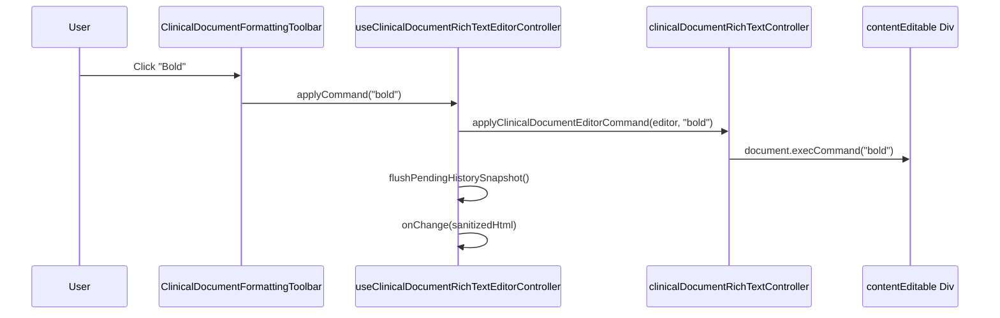
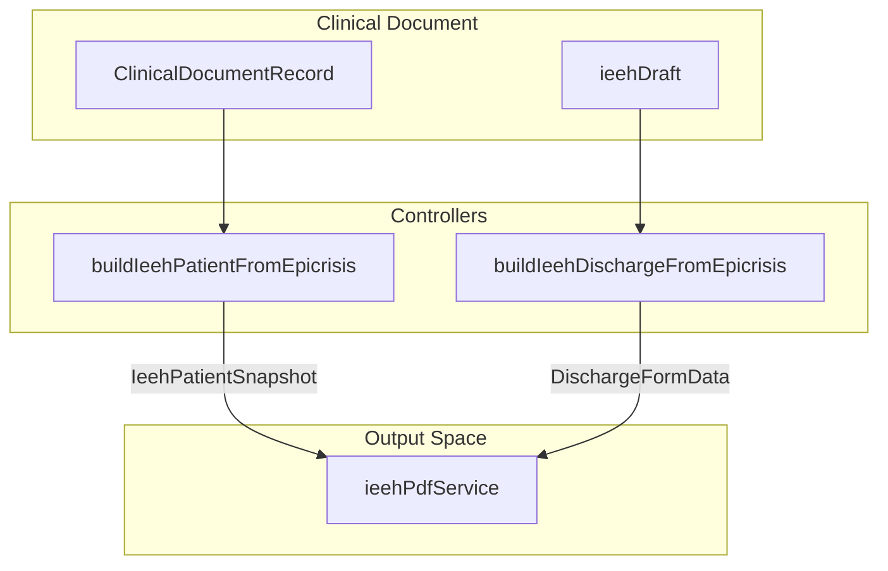

# Rich Text Editor & Document Sections

# Rich Text Editor & Document Sections

Relevant source files

The following files were used as context for generating this wiki page:

- [functions/lib/clinicalDocumentExportFunctions.js](functions/lib/clinicalDocumentExportFunctions.js)
- [src/application/patient-flow/README.md](src/application/patient-flow/README.md)
- [src/application/patient-flow/clinicalEpisodeContracts.ts](src/application/patient-flow/clinicalEpisodeContracts.ts)
- [src/features/clinical-documents/components/ClinicalDocumentFormattingToolbar.tsx](src/features/clinical-documents/components/ClinicalDocumentFormattingToolbar.tsx)
- [src/features/clinical-documents/components/ClinicalDocumentIeehPanel.tsx](src/features/clinical-documents/components/ClinicalDocumentIeehPanel.tsx)
- [src/features/clinical-documents/components/ClinicalDocumentPlanSection.tsx](src/features/clinical-documents/components/ClinicalDocumentPlanSection.tsx)
- [src/features/clinical-documents/components/ClinicalDocumentRichTextEditor.tsx](src/features/clinical-documents/components/ClinicalDocumentRichTextEditor.tsx)
- [src/features/clinical-documents/components/clinicalDocumentSectionRendererRegistry.tsx](src/features/clinical-documents/components/clinicalDocumentSectionRendererRegistry.tsx)
- [src/features/clinical-documents/controllers/clinicalDocumentEmptySectionTemplateController.ts](src/features/clinical-documents/controllers/clinicalDocumentEmptySectionTemplateController.ts)
- [src/features/clinical-documents/controllers/clinicalDocumentEpisodeController.ts](src/features/clinical-documents/controllers/clinicalDocumentEpisodeController.ts)
- [src/features/clinical-documents/controllers/clinicalDocumentHtmlSanitizer.ts](src/features/clinical-documents/controllers/clinicalDocumentHtmlSanitizer.ts)
- [src/features/clinical-documents/controllers/clinicalDocumentIeehController.ts](src/features/clinical-documents/controllers/clinicalDocumentIeehController.ts)
- [src/features/clinical-documents/controllers/clinicalDocumentIeehPrintController.ts](src/features/clinical-documents/controllers/clinicalDocumentIeehPrintController.ts)
- [src/features/clinical-documents/controllers/clinicalDocumentIndentationController.ts](src/features/clinical-documents/controllers/clinicalDocumentIndentationController.ts)
- [src/features/clinical-documents/controllers/clinicalDocumentMandatoryListShapeController.ts](src/features/clinical-documents/controllers/clinicalDocumentMandatoryListShapeController.ts)
- [src/features/clinical-documents/controllers/clinicalDocumentPlanSectionController.ts](src/features/clinical-documents/controllers/clinicalDocumentPlanSectionController.ts)
- [src/features/clinical-documents/controllers/clinicalDocumentRichTextController.ts](src/features/clinical-documents/controllers/clinicalDocumentRichTextController.ts)
- [src/features/clinical-documents/hooks/useClinicalDocumentRichTextEditorController.ts](src/features/clinical-documents/hooks/useClinicalDocumentRichTextEditorController.ts)
- [src/services/terminology/fonasaDatabase.json](src/services/terminology/fonasaDatabase.json)
- [src/tests/features/clinical-documents/clinicalDocumentEpisodeController.test.ts](src/tests/features/clinical-documents/clinicalDocumentEpisodeController.test.ts)
- [src/tests/features/clinical-documents/clinicalDocumentIeehController.test.ts](src/tests/features/clinical-documents/clinicalDocumentIeehController.test.ts)
- [src/tests/features/clinical-documents/clinicalDocumentIeehPrintController.test.ts](src/tests/features/clinical-documents/clinicalDocumentIeehPrintController.test.ts)
- [src/tests/features/clinical-documents/clinicalDocumentPasteController.test.ts](src/tests/features/clinical-documents/clinicalDocumentPasteController.test.ts)
- [src/tests/features/clinical-documents/clinicalDocumentPlanSectionController.test.ts](src/tests/features/clinical-documents/clinicalDocumentPlanSectionController.test.ts)
- [src/tests/features/clinical-documents/clinicalDocumentRichTextController.test.ts](src/tests/features/clinical-documents/clinicalDocumentRichTextController.test.ts)
- [src/tests/features/clinical-documents/useClinicalDocumentRichTextEditorController.test.ts](src/tests/features/clinical-documents/useClinicalDocumentRichTextEditorController.test.ts)
- [src/tests/functions/clinicalDocumentExportFunctions.test.ts](src/tests/functions/clinicalDocumentExportFunctions.test.ts)

The Clinical Documents module provides a sophisticated rich text editing experience tailored for medical documentation. It combines a `contentEditable` surface with specialized controllers for medical terminology, structured sections (like the Plan/Indications section), and a strict HTML sanitization pipeline to ensure data integrity across local storage and Firestore.

## Rich Text Editor Architecture

The editor is built as a controlled component that bridges the browser's native `contentEditable` behavior with the application's React-based state management.

### Key Components

- **`ClinicalDocumentRichTextEditor`**: The primary UI component that wraps the editable surface. It handles visual states like empty templates and mandatory list shapes [src/features/clinical-documents/components/ClinicalDocumentRichTextEditor.tsx:85-96]().
- **`ClinicalDocumentFormattingToolbar`**: A floating or inline toolbar providing standard formatting actions (Bold, Italic, Lists) and document-specific actions like Zoom and Template Restoration [src/features/clinical-documents/components/ClinicalDocumentFormattingToolbar.tsx:137-154]().
- **`useClinicalDocumentRichTextEditorController`**: The core logic hook managing history (undo/redo), focus states, and command execution [src/features/clinical-documents/hooks/useClinicalDocumentRichTextEditorController.ts:49-58]().

### Data Flow & Normalization

The editor maintains a "Local Echo" pattern. When a user types, the DOM is updated immediately. The controller then sanitizes the HTML and propagates the change to the parent draft reducer.

| Stage         | Logic Entity                                 | Purpose                                                                                                                                                               |
| :------------ | :------------------------------------------- | :-------------------------------------------------------------------------------------------------------------------------------------------------------------------- |
| **Input**     | `handleInput`                                | Captures native browser input events [src/features/clinical-documents/hooks/useClinicalDocumentRichTextEditorController.ts:246-250]().                                |
| **Sanitize**  | `sanitizeClinicalDocumentHtml`               | Strips unsafe tags and attributes using a whitelist [src/features/clinical-documents/controllers/clinicalDocumentRichTextController.ts:67-74]().                      |
| **Normalize** | `normalizeClinicalDocumentContentForStorage` | Detects if content is plain text or HTML and prepares it for Firestore [src/features/clinical-documents/controllers/clinicalDocumentRichTextController.ts:123-131](). |
| **History**   | `pushHistorySnapshot`                        | Manages an internal stack of sanitized HTML strings for Undo/Redo [src/features/clinical-documents/hooks/useClinicalDocumentRichTextEditorController.ts:117-134]().   |

### Editor Command Execution

Sources: [src/features/clinical-documents/components/ClinicalDocumentFormattingToolbar.tsx](), [src/features/clinical-documents/hooks/useClinicalDocumentRichTextEditorController.ts](), [src/features/clinical-documents/controllers/clinicalDocumentRichTextController.ts]()

## Specialized Section: The Plan (Indications)

The "Plan de indicaciones" section is unique because it supports two layouts: **Structured** (split into General, Pharmacological, and Clinical Control) and **Unified** (a single free-text area).

### Subsection Management

The `clinicalDocumentPlanSectionController` handles the parsing of a single HTML blob into these subsections by detecting specific heading markers [src/features/clinical-documents/controllers/clinicalDocumentPlanSectionController.ts:210-212]().

- **Subsections**: `generales`, `farmacologicas`, `control_clinico` [src/features/clinical-documents/controllers/clinicalDocumentPlanSectionController.ts:11-16]().
- **Parsing Logic**: Uses `isRecognizedPlanHeading` to identify where one subsection ends and another begins based on normalized title matching [src/features/clinical-documents/controllers/clinicalDocumentPlanSectionController.ts:51-54]().
- **Auto-formatting**: The `appendClinicalDocumentPlanSubsectionText` function automatically adds dash prefixes (`- `) to new lines and removes empty placeholders [src/features/clinical-documents/controllers/clinicalDocumentPlanSectionController.ts:153-160]().

Sources: [src/features/clinical-documents/controllers/clinicalDocumentPlanSectionController.ts]()

## IEEH (Statistical Discharge) Integration

For Epicrisis documents, a specialized panel allows doctors to fill out the **Informe Estadístico de Egreso Hospitalario (IEEH)** data.

- **`ClinicalDocumentIeehPanel`**: A collapsible form rendered below discharge diagnoses [src/features/clinical-documents/components/ClinicalDocumentIeehPanel.tsx:71-78]().
- **CIE-10 Search**: Integrates with `terminologyService` to provide debounced search and AI-powered suggestions for diagnostic codes [src/features/clinical-documents/components/ClinicalDocumentIeehPanel.tsx:129-156]().
- **Data Mapping**: The `clinicalDocumentIeehPrintController` extracts patient data (RUT, Age, Admission Date) from the document fields to pre-populate the IEEH form [src/features/clinical-documents/controllers/clinicalDocumentIeehPrintController.ts:93-114]().

### IEEH Data Transformation

Sources: [src/features/clinical-documents/components/ClinicalDocumentIeehPanel.tsx](), [src/features/clinical-documents/controllers/clinicalDocumentIeehPrintController.ts]()

## HTML Sanitizer & Security

To prevent XSS and ensure layout consistency, all rich text is processed through a strict sanitizer.

### Sanitization Policy

1. **Allowed Tags**: Defined in `ALLOWED_TAGS` (e.g., `B`, `I`, `U`, `UL`, `OL`, `LI`, `BR`, `DIV`, `TABLE`, `IMG`) [src/features/clinical-documents/controllers/clinicalDocumentHtmlSanitizer.ts]().
2. **Style Whitelist**: Only specific CSS properties like `margin-left` (for indentation) and `text-align` are preserved via `sanitizeElementStyle` [src/features/clinical-documents/controllers/clinicalDocumentRichTextController.ts:97-100]().
3. **Image Handling**: `IMG` tags are allowed but their `src` attributes are strictly managed, typically containing base64 data for embedded clinical photos [src/features/clinical-documents/controllers/clinicalDocumentPasteController.ts:6-9]().

### Implementation

The `sanitizeClinicalDocumentHtml` function creates a `template` element to parse the string, then recursively walks the tree, cloning only whitelisted nodes and attributes [src/features/clinical-documents/controllers/clinicalDocumentRichTextController.ts:79-104]().

Sources: [src/features/clinical-documents/controllers/clinicalDocumentRichTextController.ts](), [src/features/clinical-documents/controllers/clinicalDocumentHtmlSanitizer.ts]()

## Export to Google Drive

Authorized roles (`doctor_urgency`, `doctor_specialist`, `admin`) can export finalized PDFs to a configured Google Drive hierarchy.

### Cloud Function: `exportClinicalDocumentPdfToDrive`

This Firebase V1 Cloud Function handles the multi-step export process:

1. **Access Control**: Verifies the caller's role against the `EXPORT_ALLOWED_ROLES` set [functions/lib/clinicalDocumentExportFunctions.js:8-22]().
2. **Folder Hierarchy**: Resolves or creates a folder structure: `Root > Year > Month > DocumentType` [functions/lib/clinicalDocumentExportFunctions.js:105-108]().
3. **File Upsert**: Uses `upsertPdfFile` to either create a new file or update an existing one if the document is re-exported [functions/lib/clinicalDocumentExportFunctions.js:207-224]().

Sources: [functions/lib/clinicalDocumentExportFunctions.js](), [src/tests/functions/clinicalDocumentExportFunctions.test.ts]()

---
