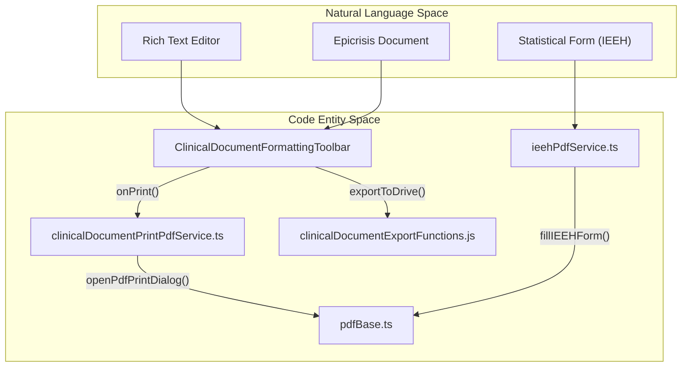
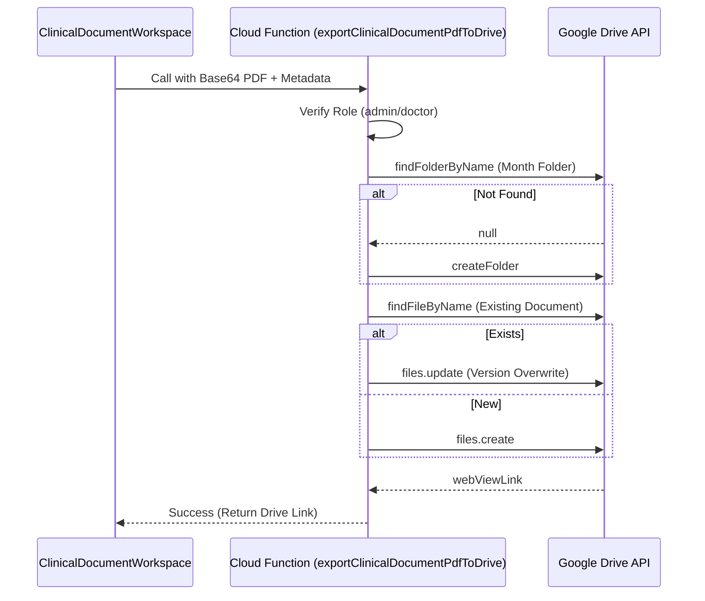

# Clinical Document Export (PDF, Drive, IEEH)

# Clinical Document Export (PDF, Drive, IEEH)

Relevant source files

The following files were used as context for generating this wiki page:

- [e2e/fixtures/auth.ts](e2e/fixtures/auth.ts)
- [functions/lib/clinicalDocumentExportFunctions.js](functions/lib/clinicalDocumentExportFunctions.js)
- [src/application/patient-flow/README.md](src/application/patient-flow/README.md)
- [src/application/patient-flow/clinicalEpisodeContracts.ts](src/application/patient-flow/clinicalEpisodeContracts.ts)
- [src/components/modals/imaging/types.ts](src/components/modals/imaging/types.ts)
- [src/features/census/components/IEEHFormDialog.tsx](src/features/census/components/IEEHFormDialog.tsx)
- [src/features/census/components/IEEHFormDialogSections.tsx](src/features/census/components/IEEHFormDialogSections.tsx)
- [src/features/census/hooks/useCensusActionContextValues.ts](src/features/census/hooks/useCensusActionContextValues.ts)
- [src/features/census/hooks/useIEEHForm.ts](src/features/census/hooks/useIEEHForm.ts)
- [src/features/clinical-documents/components/ClinicalDocumentFormattingToolbar.tsx](src/features/clinical-documents/components/ClinicalDocumentFormattingToolbar.tsx)
- [src/features/clinical-documents/components/ClinicalDocumentIeehPanel.tsx](src/features/clinical-documents/components/ClinicalDocumentIeehPanel.tsx)
- [src/features/clinical-documents/components/ClinicalDocumentPlanSection.tsx](src/features/clinical-documents/components/ClinicalDocumentPlanSection.tsx)
- [src/features/clinical-documents/components/ClinicalDocumentRichTextEditor.tsx](src/features/clinical-documents/components/ClinicalDocumentRichTextEditor.tsx)
- [src/features/clinical-documents/components/clinicalDocumentSectionRendererRegistry.tsx](src/features/clinical-documents/components/clinicalDocumentSectionRendererRegistry.tsx)
- [src/features/clinical-documents/controllers/clinicalDocumentEmptySectionTemplateController.ts](src/features/clinical-documents/controllers/clinicalDocumentEmptySectionTemplateController.ts)
- [src/features/clinical-documents/controllers/clinicalDocumentEpisodeController.ts](src/features/clinical-documents/controllers/clinicalDocumentEpisodeController.ts)
- [src/features/clinical-documents/controllers/clinicalDocumentHtmlSanitizer.ts](src/features/clinical-documents/controllers/clinicalDocumentHtmlSanitizer.ts)
- [src/features/clinical-documents/controllers/clinicalDocumentIeehController.ts](src/features/clinical-documents/controllers/clinicalDocumentIeehController.ts)
- [src/features/clinical-documents/controllers/clinicalDocumentIeehPrintController.ts](src/features/clinical-documents/controllers/clinicalDocumentIeehPrintController.ts)
- [src/features/clinical-documents/controllers/clinicalDocumentIndentationController.ts](src/features/clinical-documents/controllers/clinicalDocumentIndentationController.ts)
- [src/features/clinical-documents/controllers/clinicalDocumentMandatoryListShapeController.ts](src/features/clinical-documents/controllers/clinicalDocumentMandatoryListShapeController.ts)
- [src/features/clinical-documents/controllers/clinicalDocumentPlanSectionController.ts](src/features/clinical-documents/controllers/clinicalDocumentPlanSectionController.ts)
- [src/features/clinical-documents/controllers/clinicalDocumentRichTextController.ts](src/features/clinical-documents/controllers/clinicalDocumentRichTextController.ts)
- [src/features/clinical-documents/hooks/useClinicalDocumentRichTextEditorController.ts](src/features/clinical-documents/hooks/useClinicalDocumentRichTextEditorController.ts)
- [src/services/pdf/ieehPdfService.ts](src/services/pdf/ieehPdfService.ts)
- [src/services/pdf/pdfBase.ts](src/services/pdf/pdfBase.ts)
- [src/services/terminology/fonasaDatabase.json](src/services/terminology/fonasaDatabase.json)
- [src/tests/components/IEEHFormDialog.test.tsx](src/tests/components/IEEHFormDialog.test.tsx)
- [src/tests/features/clinical-documents/clinicalDocumentEpisodeController.test.ts](src/tests/features/clinical-documents/clinicalDocumentEpisodeController.test.ts)
- [src/tests/features/clinical-documents/clinicalDocumentIeehController.test.ts](src/tests/features/clinical-documents/clinicalDocumentIeehController.test.ts)
- [src/tests/features/clinical-documents/clinicalDocumentIeehPrintController.test.ts](src/tests/features/clinical-documents/clinicalDocumentIeehPrintController.test.ts)
- [src/tests/features/clinical-documents/clinicalDocumentPasteController.test.ts](src/tests/features/clinical-documents/clinicalDocumentPasteController.test.ts)
- [src/tests/features/clinical-documents/clinicalDocumentPlanSectionController.test.ts](src/tests/features/clinical-documents/clinicalDocumentPlanSectionController.test.ts)
- [src/tests/features/clinical-documents/clinicalDocumentRichTextController.test.ts](src/tests/features/clinical-documents/clinicalDocumentRichTextController.test.ts)
- [src/tests/features/clinical-documents/useClinicalDocumentRichTextEditorController.test.ts](src/tests/features/clinical-documents/useClinicalDocumentRichTextEditorController.test.ts)
- [src/tests/functions/clinicalDocumentExportFunctions.test.ts](src/tests/functions/clinicalDocumentExportFunctions.test.ts)
- [src/tests/services/pdf/ieehPdfCoordinates.test.ts](src/tests/services/pdf/ieehPdfCoordinates.test.ts)
- [src/tests/services/pdf/pdfBase.test.ts](src/tests/services/pdf/pdfBase.test.ts)
- [test-zod.ts](test-zod.ts)

The Clinical Document Export system provides three distinct paths for generating and distributing medical documentation: browser-native printing, structured PDF generation using `jsPDF` or `pdf-lib`, and automated archival to Google Drive. A specialized sub-system handles the **IEEH** (Informe Estadístico de Egreso Hospitalario), which automates the filling of official MINSAL (Ministry of Health) forms.

## Export Architecture and Data Flow

The system transitions from rich-text state (HTML) to portable formats through a series of specialized services. The following diagram illustrates the relationship between UI components, local PDF generation services, and the Cloud Function-based Drive export.

### Export Pipeline: UI to Destination

**Sources:** [src/features/clinical-documents/components/ClinicalDocumentFormattingToolbar.tsx:50-58](), [src/services/pdf/pdfBase.ts:122-126](), [src/services/pdf/ieehPdfService.ts:71-74]()

## PDF Generation and Printing (pdfBase)

The `pdfBase.ts` utility provides a unified interface for handling PDF binary data (`Uint8Array`) using `pdf-lib`.

### Key Functions

- **`injectPrintScript`**: Injects a JavaScript `OpenAction` into the PDF catalog to automatically trigger the print dialog upon opening [src/services/pdf/pdfBase.ts:57-68]().
- **`saveAndDownloadPdf`**: Attempts to use the **File System Access API** (`showSaveFilePicker`) for a "Save As" experience, falling back to a classic anchor-link download [src/services/pdf/pdfBase.ts:74-117]().
- **`openPdfPrintDialog`**: Creates a hidden `iframe` to host the PDF blob and invokes `window.print()`. It includes a fallback mechanism that triggers a download if the iframe fails to load within 4 seconds [src/services/pdf/pdfBase.ts:122-209]().

**Sources:** [src/services/pdf/pdfBase.ts:1-209]()

## IEEH (Statistical Discharge) Integration

The IEEH system automates the completion of the "Informe Estadístico de Egreso Hospitalario" by mapping clinical data onto a template of the official MINSAL form [src/services/pdf/ieehPdfService.ts:1-6]().

### Data Mapping and Calibration

The `ieehPdfService.ts` uses precise coordinates (`FIELD_COORDS`) calibrated for a 215 × 330mm (Oficio Chileno) PDF [src/services/pdf/ieehPdfService.ts:7-11]().

- **Source Data**: Data is pulled from the `ClinicalDocumentRecord` and an optional `ClinicalDocumentIeehDraft` [src/features/clinical-documents/controllers/clinicalDocumentIeehPrintController.ts:93-114]().
- **Field Logic**: Fields like Age (#8) and Days of Stay (#30) are calculated dynamically during the filling process [src/services/pdf/ieehPdfService.ts:181-188]().
- **Doctor Name Parsing**: The `parseDoctorName` utility splits the doctor's full name into first surname, second surname, and given names to match the form's structured inputs [src/features/clinical-documents/controllers/clinicalDocumentIeehPrintController.ts:37-53]().

### IEEH UI Components

- **`ClinicalDocumentIeehPanel`**: A collapsible section within the Epicrisis workspace that allows doctors to capture CIE-10 codes and discharge conditions while writing the note [src/features/clinical-documents/components/ClinicalDocumentIeehPanel.tsx:71-78]().
- **`IEEHFormDialog`**: A standalone modal used in the Census module for final statistical completion during the discharge flow [src/features/census/components/IEEHFormDialog.tsx:24-71]().

**Sources:** [src/services/pdf/ieehPdfService.ts:27-47](), [src/features/clinical-documents/controllers/clinicalDocumentIeehPrintController.ts:139-164](), [src/features/clinical-documents/components/ClinicalDocumentIeehPanel.tsx:1-11]()

## Google Drive Export (Cloud Function)

The `clinicalDocumentExportFunctions.js` handles the server-side logic for archiving clinical documents to a centralized Google Drive repository.

### Directory Structure and Naming

The function automatically organizes documents into a hierarchical folder structure:

1. **Root**: `CLINICAL_DRIVE_ROOT_FOLDER_ID`.
2. **Month/Year**: e.g., "Marzo 2026" [functions/lib/clinicalDocumentExportFunctions.js:105-108]().
3. **Document Type**: e.g., "Epicrisis", "Evoluciones" [functions/lib/clinicalDocumentExportFunctions.js:45-51]().
4. **Patient Folder**: Named using sanitized patient names and RUTs [functions/lib/clinicalDocumentExportFunctions.js:59-64]().

### Security and Permissions

- **RBAC**: Only users with `admin`, `doctor_urgency`, or `doctor_specialist` roles are permitted to export [functions/lib/clinicalDocumentExportFunctions.js:8-9]().
- **Identity Resolution**: The function re-verifies the caller's role against Firestore during the request to prevent stale token exploitation [functions/lib/clinicalDocumentExportFunctions.js:82-94]().
- **Audit**: Every successful export is logged to a Firestore audit collection [functions/lib/clinicalDocumentExportFunctions.js:135-147]().

### Drive Export Flow

**Sources:** [functions/lib/clinicalDocumentExportFunctions.js:148-241](), [src/tests/functions/clinicalDocumentExportFunctions.test.ts:120-180]()

## Technical Reference

### Coordinates Governance

The system includes a governance test `ieehPdfCoordinates.test.ts` to ensure that field positions remain within the physical page bounds and do not overlap [src/tests/services/pdf/ieehPdfCoordinates.test.ts:68-108]().

| Field Group      | Key Coordinates (X, Y) | Max Width |
| :--------------- | :--------------------- | :-------- |
| **Patient Name** | (50.84, 826.52)        | ~137.82   |
| **CIE-10 Code**  | (529.23, 281.38)       | 46.69     |
| **Admission**    | (102.35, 428.74)       | 22.68     |
| **Discharge**    | (91.68, 341.43)        | 21.33     |

**Sources:** [src/tests/services/pdf/ieehPdfCoordinates.test.ts:3-34]()

---
