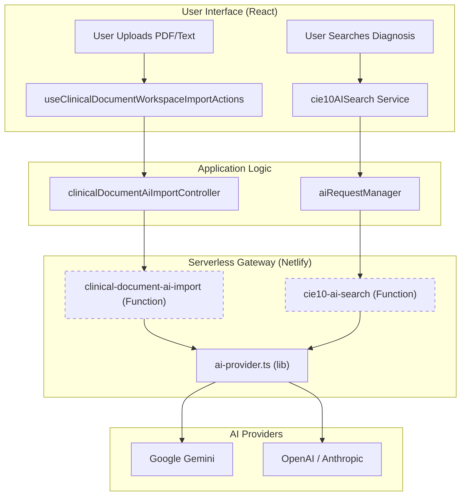
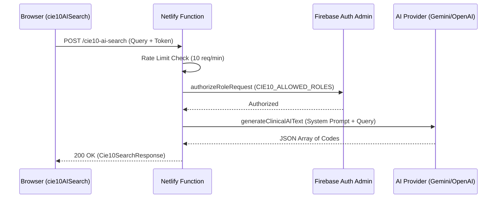

# AI Import & CIE-10 Search

# AI Import & CIE-10 Search

Relevant source files

The following files were used as context for generating this wiki page:

- [.env.example](.env.example)
- [.gitignore](.gitignore)
- [docs/superpowers/plans/2026-04-28-clinical-document-ai-import-mvp.md](docs/superpowers/plans/2026-04-28-clinical-document-ai-import-mvp.md)
- [netlify/functions/cie10-ai-search.ts](netlify/functions/cie10-ai-search.ts)
- [netlify/functions/clinical-ai-summary.ts](netlify/functions/clinical-ai-summary.ts)
- [netlify/functions/clinical-document-ai-import.ts](netlify/functions/clinical-document-ai-import.ts)
- [netlify/functions/lib/ai-provider.ts](netlify/functions/lib/ai-provider.ts)
- [netlify/functions/lib/clinical-ai-context.ts](netlify/functions/lib/clinical-ai-context.ts)
- [netlify/functions/lib/envValidator.ts](netlify/functions/lib/envValidator.ts)
- [netlify/functions/lib/http.ts](netlify/functions/lib/http.ts)
- [scripts/check-guardrail-governance.mjs](scripts/check-guardrail-governance.mjs)
- [scripts/check-secret-leaks.mjs](scripts/check-secret-leaks.mjs)
- [scripts/config/netlifyFunctionDevServer.ts](scripts/config/netlifyFunctionDevServer.ts)
- [scripts/guardrailGovernanceSupport.mjs](scripts/guardrailGovernanceSupport.mjs)
- [scripts/smoke-netlify-function-dev-module.mjs](scripts/smoke-netlify-function-dev-module.mjs)
- [src/contracts/serverless.ts](src/contracts/serverless.ts)
- [src/env.d.ts](src/env.d.ts)
- [src/features/clinical-documents/components/ClinicalDocumentVersionBadge.tsx](src/features/clinical-documents/components/ClinicalDocumentVersionBadge.tsx)
- [src/features/clinical-documents/contracts/clinicalDocumentAiImportContract.ts](src/features/clinical-documents/contracts/clinicalDocumentAiImportContract.ts)
- [src/features/clinical-documents/controllers/clinicalDocumentAiImportController.ts](src/features/clinical-documents/controllers/clinicalDocumentAiImportController.ts)
- [src/features/clinical-documents/hooks/useClinicalDocumentWorkspaceImportActions.ts](src/features/clinical-documents/hooks/useClinicalDocumentWorkspaceImportActions.ts)
- [src/services/ai/clinicalSummaryService.ts](src/services/ai/clinicalSummaryService.ts)
- [src/services/terminology/cie10AISearch.ts](src/services/terminology/cie10AISearch.ts)
- [src/tests/build/guardrailGovernanceSupport.test.ts](src/tests/build/guardrailGovernanceSupport.test.ts)
- [src/tests/config/netlifyFunctionDevServer.test.ts](src/tests/config/netlifyFunctionDevServer.test.ts)
- [src/tests/features/clinical-documents/clinicalDocumentAiImportContract.test.ts](src/tests/features/clinical-documents/clinicalDocumentAiImportContract.test.ts)
- [src/tests/features/clinical-documents/clinicalDocumentAiImportController.test.ts](src/tests/features/clinical-documents/clinicalDocumentAiImportController.test.ts)
- [src/tests/features/clinical-documents/useClinicalDocumentWorkspaceImportActions.test.ts](src/tests/features/clinical-documents/useClinicalDocumentWorkspaceImportActions.test.ts)
- [src/tests/netlify/cie10AiSearch.test.ts](src/tests/netlify/cie10AiSearch.test.ts)
- [src/tests/netlify/clinicalAiSummary.test.ts](src/tests/netlify/clinicalAiSummary.test.ts)
- [src/tests/netlify/clinicalDocumentAiImport.test.ts](src/tests/netlify/clinicalDocumentAiImport.test.ts)
- [src/tests/netlify/http.test.ts](src/tests/netlify/http.test.ts)
- [src/tests/netlify/sendCensusEmailFunction.test.ts](src/tests/netlify/sendCensusEmailFunction.test.ts)
- [src/tests/services/terminology/cie10AISearch.test.ts](src/tests/services/terminology/cie10AISearch.test.ts)

This section covers the integration of Large Language Models (LLMs) to enhance clinical workflows. The system utilizes AI for two primary purposes: importing unstructured clinical text (e.g., transfer reports) into structured document drafts and providing an intelligent search interface for CIE-10 diagnostic codes.

## System Architecture: AI Service Flow

The AI features follow a hybrid architecture. In production, requests are routed through **Netlify Functions** to protect API keys and enforce Role-Based Access Control (RBAC). In local development, a fallback mechanism allows direct calls to AI providers if configured.

### Natural Language to Code Entity Space

The following diagram maps the conceptual "Natural Language" intent to the specific code entities that handle the transformation.

**Clinical AI Import & Search Flow**

**Sources:** [src/features/clinical-documents/hooks/useClinicalDocumentWorkspaceImportActions.ts:97-108](), [src/services/terminology/cie10AISearch.ts:1-13](), [netlify/functions/cie10-ai-search.ts:36-41]().

## Clinical Document AI Import

The AI Import feature allows clinicians to upload external documents (like Transfer Reports) and automatically generate a structured **Epicrisis de Traslado**.

### Key Components

1.  **`useClinicalDocumentWorkspaceImportActions`**: The primary hook managing the import lifecycle, including file reading, calling the transformation service, and creating the resulting draft [src/features/clinical-documents/hooks/useClinicalDocumentWorkspaceImportActions.ts:97-108]().
2.  **`clinicalDocumentAiImportController`**: Responsible for sanitizing source text (removing PII), parsing AI-generated JSON, and building the `ClinicalDocumentRecord` entity [src/features/clinical-documents/controllers/clinicalDocumentAiImportController.ts:104-112]().
3.  **`clinical-document-ai-import` (Function)**: A serverless endpoint that receives sanitized text and interacts with the LLM using a specialized clinical prompt [scripts/config/netlifyFunctionDevServer.ts:32-37]().

### Data Sanitization & Safety

To ensure privacy, the system sanitizes administrative patient identifiers before sending data to the AI provider.

| Pattern Removed   | Implementation Detail                                                                                                                                 |
| :---------------- | :---------------------------------------------------------------------------------------------------------------------------------------------------- |
| **Names**         | Removes strings matching "Nombre completo" or "Paciente:" [src/tests/features/clinical-documents/clinicalDocumentAiImportController.test.ts:53-73](). |
| **IDs (RUT/RUN)** | Regex-based removal of Chilean national IDs [src/tests/features/clinical-documents/clinicalDocumentAiImportController.test.ts:57-58]().               |
| **Hospital IDs**  | Removes "Ficha" and "Identificacion" numbers [src/tests/features/clinical-documents/clinicalDocumentAiImportController.test.ts:59-60]().              |

**Sources:** [src/features/clinical-documents/controllers/clinicalDocumentAiImportController.ts:22-24](), [src/tests/features/clinical-documents/clinicalDocumentAiImportController.test.ts:35-51]().

## CIE-10 AI Search

The `cie10AISearch` service provides a semantic search layer over the standard CIE-10 database, allowing clinicians to use natural language or common Chilean medical abbreviations.

### Implementation Logic

The service implements a fallback chain to ensure availability across environments:

1.  **Serverless Call**: Attempts to reach `/.netlify/functions/cie10-ai-search` with the user's Auth Bearer token [src/services/terminology/cie10AISearch.ts:81-93]().
2.  **Local Fallback**: In `DEV` mode, if the serverless function is unavailable, it calls the AI provider (Gemini/OpenAI) directly using local environment variables like `VITE_LOCAL_GEMINI_API_KEY` [src/services/terminology/cie10AISearch.ts:147-153]().

### Prompt Engineering & Abbreviations

The AI is instructed to interpret specific Chilean clinical abbreviations:

- **NAC**: Neumonía adquirida en la comunidad (J18.9) [src/services/terminology/cie10AISearch.ts:118-118]().
- **IAM**: Infarto agudo del miocardio (I21.9) [src/services/terminology/cie10AISearch.ts:116-116]().
- **ACV / AVE**: Accidente cerebrovascular (I63.9) [src/services/terminology/cie10AISearch.ts:117-117]().

**Sources:** [src/services/terminology/cie10AISearch.ts:109-129](), [netlify/functions/cie10-ai-search.ts:129-146]().

## Serverless Function: `cie10-ai-search.ts`

This function acts as the secure bridge between the client and the AI model.

**Execution Flow**

**Sources:** [netlify/functions/cie10-ai-search.ts:36-67](), [netlify/functions/cie10-ai-search.ts:93-93](), [netlify/functions/cie10-ai-search.ts:148-168]().

## Configuration & Environment Variables

The AI subsystem relies on several environment variables defined in `.env.example` and `env.d.ts`.

| Variable                            | Scope  | Description                                                                                                    |
| :---------------------------------- | :----- | :------------------------------------------------------------------------------------------------------------- |
| `VITE_CLINICAL_AI_SUMMARY_ENDPOINT` | Client | Endpoint for the clinical summary function [src/env.d.ts:24-24]().                                             |
| `AI_PROVIDER`                       | Server | Explicitly sets the provider (gemini, openai, anthropic) [scripts/config/netlifyFunctionDevServer.ts:66-66](). |
| `VITE_LOCAL_GEMINI_API_KEY`         | Dev    | Used for direct local development fallback [src/services/terminology/cie10AISearch.ts:34-34]().                |
| `GEMINI_MODEL`                      | Server | Defines the specific model version (e.g., `gemini-3-flash-preview`) [.env.example:75-75]().                    |

**Sources:** [src/env.d.ts:17-24](), [scripts/config/netlifyFunctionDevServer.ts:62-74](), [.env.example:57-80]().

---
