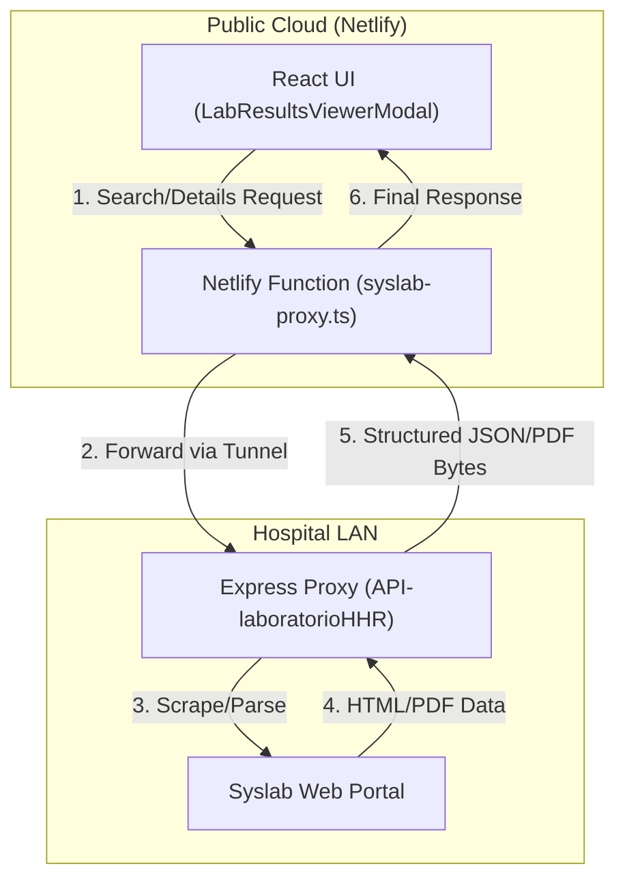
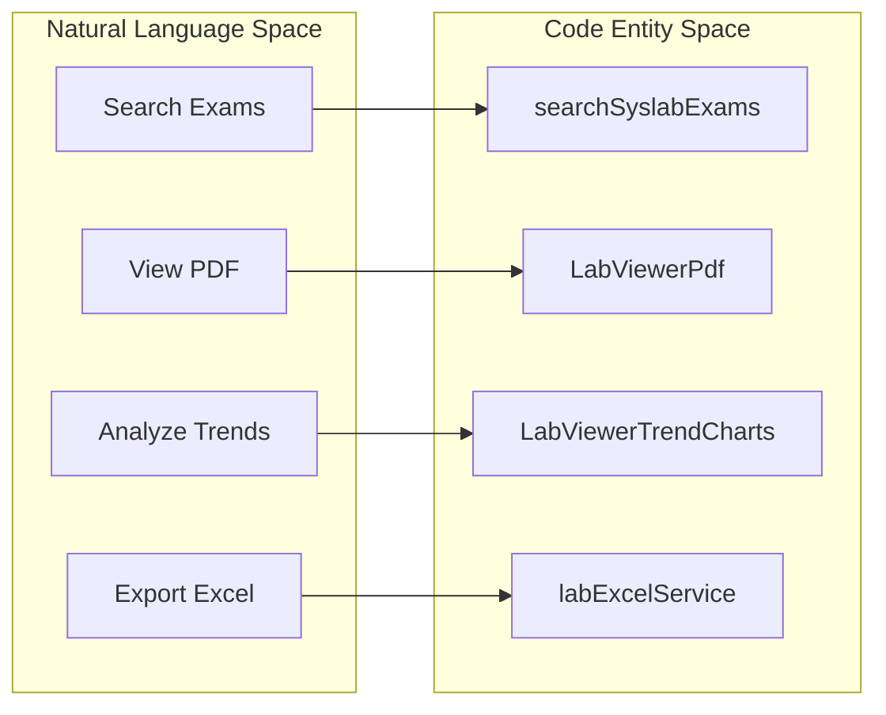

# Laboratory Module

# Laboratory Module

Relevant source files

The following files were used as context for generating this wiki page:

- [netlify/functions/syslab-proxy.ts](netlify/functions/syslab-proxy.ts)
- [src/features/laboratory/components/LabResultsViewerModal.tsx](src/features/laboratory/components/LabResultsViewerModal.tsx)
- [src/features/laboratory/components/LabViewerComparisonTable.tsx](src/features/laboratory/components/LabViewerComparisonTable.tsx)
- [src/features/laboratory/components/LabViewerExamList.tsx](src/features/laboratory/components/LabViewerExamList.tsx)
- [src/features/laboratory/components/LaboratoryQuickAction.tsx](src/features/laboratory/components/LaboratoryQuickAction.tsx)
- [src/features/laboratory/constants/labConstants.ts](src/features/laboratory/constants/labConstants.ts)
- [src/features/laboratory/controllers/labAnalyticsContracts.ts](src/features/laboratory/controllers/labAnalyticsContracts.ts)
- [src/features/laboratory/controllers/labDetailProcessingController.ts](src/features/laboratory/controllers/labDetailProcessingController.ts)
- [src/features/laboratory/controllers/labFindingCollectionController.ts](src/features/laboratory/controllers/labFindingCollectionController.ts)
- [src/features/laboratory/hooks/useLabViewer.ts](src/features/laboratory/hooks/useLabViewer.ts)
- [src/features/laboratory/services/labFirestoreService.ts](src/features/laboratory/services/labFirestoreService.ts)
- [src/services/laboratory/syslabService.ts](src/services/laboratory/syslabService.ts)
- [src/tests/components/laboratory/LabResultsViewerModal.test.tsx](src/tests/components/laboratory/LabResultsViewerModal.test.tsx)
- [src/tests/features/laboratory/labAnalysisResultController.test.ts](src/tests/features/laboratory/labAnalysisResultController.test.ts)
- [src/tests/features/laboratory/labFindingCollectionController.test.ts](src/tests/features/laboratory/labFindingCollectionController.test.ts)
- [src/tests/hooks/laboratory/labAnalyticsFormatting.test.ts](src/tests/hooks/laboratory/labAnalyticsFormatting.test.ts)
- [src/tests/hooks/laboratory/useLabViewer.test.ts](src/tests/hooks/laboratory/useLabViewer.test.ts)
- [src/tests/netlify/syslabProxy.test.ts](src/tests/netlify/syslabProxy.test.ts)
- [src/tests/services/laboratory/syslabService.test.ts](src/tests/services/laboratory/syslabService.test.ts)
- [src/types/domain/laboratory.ts](src/types/domain/laboratory.ts)

The **Laboratory Module** provides an integrated interface for querying, viewing, and analyzing patient laboratory results directly from the hospital's **Syslab** system. It bridges the gap between the hospital's internal LAN-based laboratory portal and the React-based HHR UI by utilizing a proxy architecture to overcome network isolation and CORS constraints.

## System Overview

The module operates as a read-only viewer that scrapes and parses data from the Syslab web portal. It allows clinicians to search for exams by patient RUT, view original PDF reports, and generate longitudinal analysis (trends and comparison tables) by parsing PDF text into structured data.

### Data Flow Architecture

The data flow involves three distinct layers: the **React UI**, a **Netlify Proxy Function**, and an **Internal Express Proxy** (API-laboratorioHHR) located within the hospital network.

#### Lab Data Request Pipeline

_Sources: [netlify/functions/syslab-proxy.ts:1-21](), [src/services/laboratory/syslabService.ts:1-20]()_

## Key Components

### Syslab Service

The `syslabService` is the primary interface for laboratory data. It handles environment-aware routing, ensuring that requests are sent to the correct proxy based on whether the application is running in production, Netlify dev, or a plain Vite local environment [src/services/laboratory/syslabService.ts:36-53]().

- **RUT Cleaning**: Syslab requires patient identifiers (RUT) to be stripped of dots and check digits before querying [src/services/laboratory/syslabService.ts:83-84]().
- **Health Checks**: The system periodically verifies connectivity to the upstream proxy to enable/disable UI entry points [src/services/laboratory/syslabService.ts:140-170]().
- **PDF Handling**: Provides utilities to fetch and build blob URLs for inline PDF viewing [src/services/laboratory/syslabService.ts:201-206]().

### Laboratory Orchestration

The module uses a specialized hook, `useLabViewer`, to coordinate complex states including search results, exam selection, and the analysis engine.

| Entity                  | Responsibility                                                                                                       |
| :---------------------- | :------------------------------------------------------------------------------------------------------------------- |
| `useLabViewer`          | Main orchestration hook that delegates to sub-hooks [src/features/laboratory/hooks/useLabViewer.ts:50-53]().         |
| `useLabViewerQuery`     | Manages data fetching, RUT selection, and PDF state [src/features/laboratory/hooks/useLabViewer.ts:69-72]().         |
| `useLabViewerSelection` | Handles filtering (by date/category) and checkbox selection [src/features/laboratory/hooks/useLabViewer.ts:74-86](). |
| `useLabViewerAnalysis`  | Orchestrates the PDF parsing pipeline and data aggregation [src/features/laboratory/hooks/useLabViewer.ts:88-104](). |

_Sources: [src/features/laboratory/hooks/useLabViewer.ts:1-48]()_

## Clinical Integration

The module is accessible via the `LaboratoryQuickAction` component, which is typically embedded in the patient census or medical indications views [src/features/laboratory/components/LaboratoryQuickAction.tsx:11-31](). It automatically detects if patients have a valid RUT and verifies the Syslab connection status before allowing the clinician to open the viewer [src/features/laboratory/components/LaboratoryQuickAction.tsx:46-56]().

### Logic to Code Mapping

_Sources: [src/services/laboratory/syslabService.ts:178](), [src/features/laboratory/components/LabResultsViewerModal.tsx:94](), [src/features/laboratory/components/LabResultsViewerModal.tsx:97](), [src/features/laboratory/components/LabViewerComparisonTable.tsx:23-24]()_

## Detailed Documentation

The Laboratory Module is divided into two primary functional areas:

### 8.1 Lab Results Viewer

Covers the core UI components for searching and viewing individual reports. This includes the `LabResultsViewerModal`, the query logic in `useLabViewerQuery`, and the server-side proxy implementation in Netlify.
For details, see [Lab Results Viewer](#8.1).

### 8.2 Lab Analytics, Microbiology & Export

Covers the "Analysis" feature which aggregates multiple exams. This includes PDF text extraction, trend charting via Recharts, microbiology finding extraction, and the generation of Excel/PDF summaries for clinical documentation.
For details, see [Lab Analytics, Microbiology & Export](#8.2).

---

**Sources:**

- [src/services/laboratory/syslabService.ts:1-210]()
- [src/features/laboratory/hooks/useLabViewer.ts:1-161]()
- [src/features/laboratory/components/LabResultsViewerModal.tsx:1-135]()
- [netlify/functions/syslab-proxy.ts:1-190]()
- [src/features/laboratory/components/LaboratoryQuickAction.tsx:1-92]()

---
