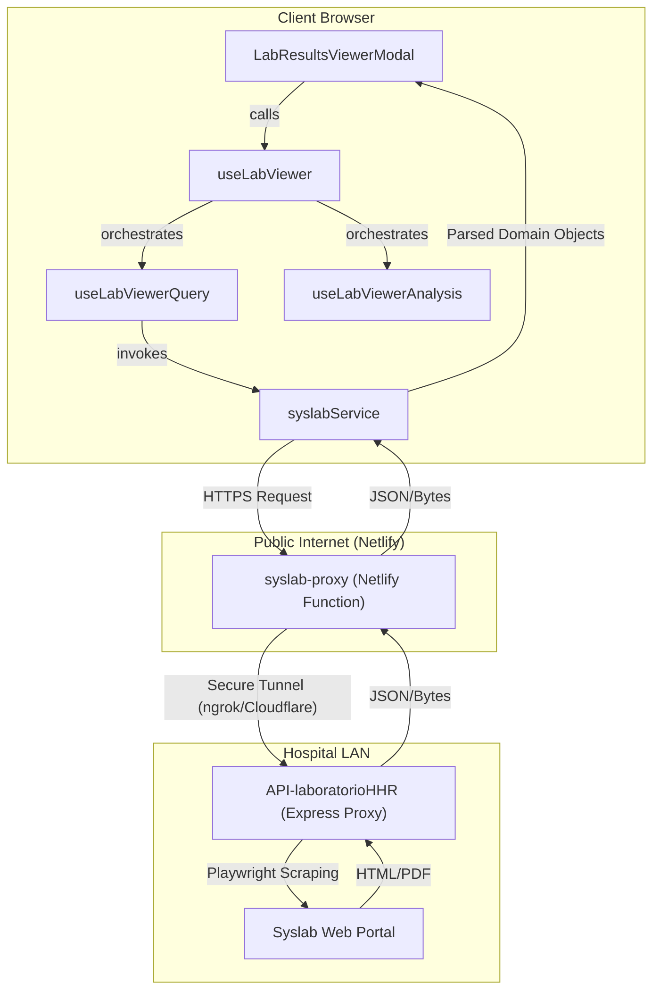
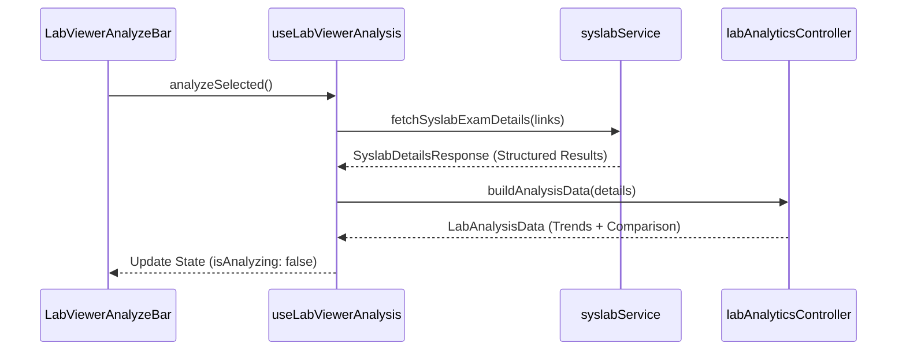

# Lab Results Viewer

# Lab Results Viewer

Relevant source files

The following files were used as context for generating this wiki page:

- [netlify/functions/syslab-proxy.ts](netlify/functions/syslab-proxy.ts)
- [src/features/laboratory/components/LabExportConfigDialog.tsx](src/features/laboratory/components/LabExportConfigDialog.tsx)
- [src/features/laboratory/components/LabResultsViewerModal.tsx](src/features/laboratory/components/LabResultsViewerModal.tsx)
- [src/features/laboratory/components/LabViewerAnalysis.tsx](src/features/laboratory/components/LabViewerAnalysis.tsx)
- [src/features/laboratory/components/LabViewerAnalyzeBar.tsx](src/features/laboratory/components/LabViewerAnalyzeBar.tsx)
- [src/features/laboratory/components/LabViewerComparisonTable.tsx](src/features/laboratory/components/LabViewerComparisonTable.tsx)
- [src/features/laboratory/components/LabViewerControls.tsx](src/features/laboratory/components/LabViewerControls.tsx)
- [src/features/laboratory/components/LabViewerEmptyState.tsx](src/features/laboratory/components/LabViewerEmptyState.tsx)
- [src/features/laboratory/components/LabViewerExamList.tsx](src/features/laboratory/components/LabViewerExamList.tsx)
- [src/features/laboratory/components/LabViewerPdf.tsx](src/features/laboratory/components/LabViewerPdf.tsx)
- [src/features/laboratory/components/LabViewerProgress.tsx](src/features/laboratory/components/LabViewerProgress.tsx)
- [src/features/laboratory/components/LabViewerTrendCharts.tsx](src/features/laboratory/components/LabViewerTrendCharts.tsx)
- [src/features/laboratory/components/LaboratoryQuickAction.tsx](src/features/laboratory/components/LaboratoryQuickAction.tsx)
- [src/features/laboratory/constants/labConstants.ts](src/features/laboratory/constants/labConstants.ts)
- [src/features/laboratory/controllers/labAnalyticsContracts.ts](src/features/laboratory/controllers/labAnalyticsContracts.ts)
- [src/features/laboratory/controllers/labDetailProcessingController.ts](src/features/laboratory/controllers/labDetailProcessingController.ts)
- [src/features/laboratory/controllers/labFindingCollectionController.ts](src/features/laboratory/controllers/labFindingCollectionController.ts)
- [src/features/laboratory/hooks/useLabViewer.ts](src/features/laboratory/hooks/useLabViewer.ts)
- [src/features/laboratory/services/labExcelService.ts](src/features/laboratory/services/labExcelService.ts)
- [src/features/laboratory/services/labFirestoreService.ts](src/features/laboratory/services/labFirestoreService.ts)
- [src/services/laboratory/syslabService.ts](src/services/laboratory/syslabService.ts)
- [src/tests/components/laboratory/LabResultsViewerModal.test.tsx](src/tests/components/laboratory/LabResultsViewerModal.test.tsx)
- [src/tests/components/laboratory/LabViewerComponents.test.tsx](src/tests/components/laboratory/LabViewerComponents.test.tsx)
- [src/tests/components/laboratory/LabViewerExamList.test.tsx](src/tests/components/laboratory/LabViewerExamList.test.tsx)
- [src/tests/features/laboratory/labAnalysisResultController.test.ts](src/tests/features/laboratory/labAnalysisResultController.test.ts)
- [src/tests/features/laboratory/labFindingCollectionController.test.ts](src/tests/features/laboratory/labFindingCollectionController.test.ts)
- [src/tests/hooks/laboratory/labAnalyticsFormatting.test.ts](src/tests/hooks/laboratory/labAnalyticsFormatting.test.ts)
- [src/tests/hooks/laboratory/useLabViewer.test.ts](src/tests/hooks/laboratory/useLabViewer.test.ts)
- [src/tests/netlify/syslabProxy.test.ts](src/tests/netlify/syslabProxy.test.ts)
- [src/tests/services/laboratory/syslabService.test.ts](src/tests/services/laboratory/syslabService.test.ts)
- [src/tests/utils/lazyWithRetry.test.ts](src/tests/utils/lazyWithRetry.test.ts)
- [src/types/domain/laboratory.ts](src/types/domain/laboratory.ts)
- [src/utils/lazyWithRetry.ts](src/utils/lazyWithRetry.ts)

The Lab Results Viewer provides a comprehensive interface for accessing and analyzing patient laboratory data from the hospital's **Syslab** system. It facilitates clinical decision-making by allowing users to view original PDF reports, generate longitudinal trend charts, and build comparison tables across multiple exam dates.

## System Architecture & Data Flow

The system operates via a multi-tier proxy architecture to securely bridge the hospital's internal LAN (where Syslab resides) with the public-facing React application.

### High-Level Lab Data Flow

"Natural Language Space" to "Code Entity Space" mapping.

**Sources:** [src/services/laboratory/syslabService.ts:1-20](), [netlify/functions/syslab-proxy.ts:1-21]()

---

## Core Service Layer

### syslabService

The `syslabService` is the primary client-side interface for laboratory operations. It handles environment detection to determine whether to call the local Express proxy or the Netlify function.

- **Environment Detection**: Uses `shouldUseNetlifyProxy` to switch between `VITE_SYSLAB_API_URL` (local) and `/.netlify/functions/syslab-proxy` (production) [src/services/laboratory/syslabService.ts:42-43]().
- **RUT Cleaning**: Implements `cleanRutForSyslab` to strip Chilean RUTs of dots and check digits, as required by the Syslab backend [src/services/laboratory/syslabService.ts:83-84]().
- **Resilience**: Implements `fetchWithRetry` with a default 30-second timeout to accommodate slow scraping operations [src/services/laboratory/syslabService.ts:29-32](), [src/services/laboratory/syslabService.ts:94-138]().

### syslab-proxy (Netlify Function)

A serverless function that acts as a secure gateway. It enforces **Role-Based Access Control (RBAC)** and prevents CORS/CSP issues.

- **Authorization**: Only users with specific roles (e.g., `doctor_specialist`, `nurse_hospital`) can access laboratory data [netlify/functions/syslab-proxy.ts:41-48]().
- **Telemetry**: Uses `invokeWithTelemetry` to track the performance of slow PDF parsing operations [netlify/functions/syslab-proxy.ts:25-26]().
- **Actions**:
  - `health`: Checks upstream proxy availability [netlify/functions/syslab-proxy.ts:87-114]().
  - `search`: Retrieves a list of `SyslabExamItem` for a patient RUT [netlify/functions/syslab-proxy.ts:118-129]().
  - `details`: Triggers server-side PDF parsing to return structured `SyslabExamDetail` [netlify/functions/syslab-proxy.ts:133-157]().
  - `pdf`: Proxies raw PDF bytes for inline viewing [netlify/functions/syslab-proxy.ts:161-188]().

**Sources:** [src/services/laboratory/syslabService.ts:26-193](), [netlify/functions/syslab-proxy.ts:41-190]()

---

## Orchestration Hooks

The UI logic is decomposed into specialized hooks coordinated by `useLabViewer`.

### useLabViewer

The entry point for the Lab Viewer feature. It maintains the external contract while delegating logic to internal hooks [src/features/laboratory/hooks/useLabViewer.ts:50-53]().

| Hook                    | Responsibility                                                                                                                                    |
| :---------------------- | :------------------------------------------------------------------------------------------------------------------------------------------------ |
| `useLabViewerQuery`     | Manages patient selection, exam searching, and PDF fetching [src/features/laboratory/hooks/useLabViewer.ts:69-72]().                              |
| `useLabViewerSelection` | Handles multi-select logic for exams, including "select by days" filters [src/features/laboratory/hooks/useLabViewer.ts:74-86]().                 |
| `useLabViewerAnalysis`  | Orchestrates the parsing of selected exams into longitudinal data for charts and tables [src/features/laboratory/hooks/useLabViewer.ts:88-104](). |

### Analysis Logic Flow

The analysis pipeline transforms raw exam links into clinical insights.

**Sources:** [src/features/laboratory/hooks/useLabViewer.ts:1-160](), [src/features/laboratory/components/LabResultsViewerModal.tsx:122-127]()

---

## UI Components

### LabResultsViewerModal

The main container component. It uses a "Shell Model" pattern to determine which sub-components to render based on the current state (searching, viewing PDF, or analyzing) [src/features/laboratory/components/LabResultsViewerModal.tsx:46-53]().

- **Controls**: `LabViewerControls` allows switching between patients in the current census and triggering searches [src/features/laboratory/components/LabResultsViewerModal.tsx:76-84]().
- **Exam List**: `LabViewerExamList` displays the results of a search with options to view PDFs or select for analysis [src/features/laboratory/components/LabResultsViewerModal.tsx:109-121]().
- **Progress**: `LabViewerProgress` provides visual feedback during long-running batch detail fetches [src/features/laboratory/components/LabResultsViewerModal.tsx:86]().

### Analysis Views

When analysis is active, the modal switches to `LabViewerAnalysis`, which provides two main views:

1.  **Trends (`LabViewerTrendCharts`)**: Renders `recharts` line graphs grouped by clinical category (e.g., Hemogram, Electrolytes) [src/features/laboratory/components/LabViewerTrendCharts.tsx:15-29](). It includes a feature to export these charts as PNG images [src/features/laboratory/components/LabViewerTrendCharts.tsx:37-54]().
2.  **Comparison (`LabViewerComparisonTable`)**: A matrix with dates as columns and variables as rows. It supports pinning specific variables and clinical grouping [src/features/laboratory/components/LabViewerComparisonTable.tsx:26-51]().

**Sources:** [src/features/laboratory/components/LabResultsViewerModal.tsx:27-134](), [src/features/laboratory/components/LabViewerTrendCharts.tsx:1-70](), [src/features/laboratory/components/LabViewerComparisonTable.tsx:1-90]()

---

## Data Structures

### Syslab Domain Types

Key types defined in `labExamTypes.ts` and `labAnalyticsTypes.ts`.

| Type               | Description                                                                                                                        |
| :----------------- | :--------------------------------------------------------------------------------------------------------------------------------- |
| `SyslabExamItem`   | Metadata for an exam entry (date, time, list of requested tests) [src/types/domain/labExamTypes.ts]().                             |
| `SyslabExamDetail` | Structured result for a specific analyte (name, value, unit, reference range) [src/types/domain/labExamTypes.ts]().                |
| `LabAnalysisData`  | The output of the analysis pipeline, containing `trendGroups` and a `comparison` matrix [src/types/domain/labAnalyticsTypes.ts](). |

**Sources:** [src/types/domain/laboratory.ts:1-3](), [src/features/laboratory/hooks/useLabViewer.ts:9-11]()

---
