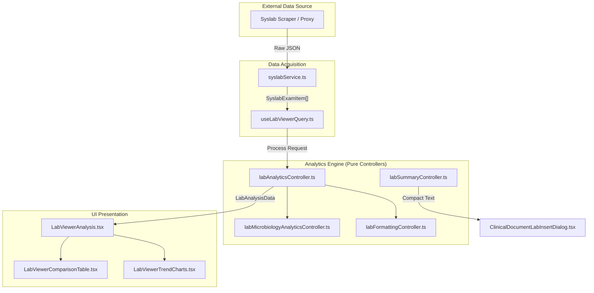
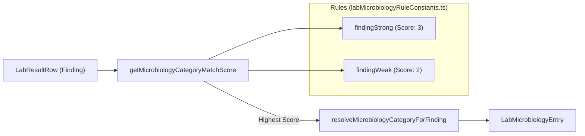

# Lab Analytics, Microbiology & Export

# Lab Analytics, Microbiology & Export

Relevant source files

The following files were used as context for generating this wiki page:

- [docs/FUNCTIONS_DEPENDENCY_ACCEPTANCE.md](docs/FUNCTIONS_DEPENDENCY_ACCEPTANCE.md)
- [src/features/clinical-documents/components/ClinicalDocumentAnnexPage.tsx](src/features/clinical-documents/components/ClinicalDocumentAnnexPage.tsx)
- [src/features/clinical-documents/components/ClinicalDocumentLabInsertDialog.tsx](src/features/clinical-documents/components/ClinicalDocumentLabInsertDialog.tsx)
- [src/features/clinical-documents/hooks/useClinicalDocumentSheetState.ts](src/features/clinical-documents/hooks/useClinicalDocumentSheetState.ts)
- [src/features/clinical-documents/services/clinicalDocumentPrintSupport.ts](src/features/clinical-documents/services/clinicalDocumentPrintSupport.ts)
- [src/features/laboratory/README.md](src/features/laboratory/README.md)
- [src/features/laboratory/components/LabResultsViewerModal.tsx](src/features/laboratory/components/LabResultsViewerModal.tsx)
- [src/features/laboratory/components/LabViewerComparisonTable.tsx](src/features/laboratory/components/LabViewerComparisonTable.tsx)
- [src/features/laboratory/components/LabViewerExamList.tsx](src/features/laboratory/components/LabViewerExamList.tsx)
- [src/features/laboratory/constants/labComparisonCatalogConstants.ts](src/features/laboratory/constants/labComparisonCatalogConstants.ts)
- [src/features/laboratory/constants/labComparisonGroupingConstants.ts](src/features/laboratory/constants/labComparisonGroupingConstants.ts)
- [src/features/laboratory/constants/labConstants.ts](src/features/laboratory/constants/labConstants.ts)
- [src/features/laboratory/constants/labMicrobiologyRuleConstants.ts](src/features/laboratory/constants/labMicrobiologyRuleConstants.ts)
- [src/features/laboratory/constants/labNormalizationConstants.ts](src/features/laboratory/constants/labNormalizationConstants.ts)
- [src/features/laboratory/constants/labTrendConstants.ts](src/features/laboratory/constants/labTrendConstants.ts)
- [src/features/laboratory/controllers/labAnalyticsContracts.ts](src/features/laboratory/controllers/labAnalyticsContracts.ts)
- [src/features/laboratory/controllers/labDetailProcessingController.ts](src/features/laboratory/controllers/labDetailProcessingController.ts)
- [src/features/laboratory/controllers/labFindingCollectionController.ts](src/features/laboratory/controllers/labFindingCollectionController.ts)
- [src/features/laboratory/controllers/labFormattingController.ts](src/features/laboratory/controllers/labFormattingController.ts)
- [src/features/laboratory/controllers/labMicrobiologyAnalyticsController.ts](src/features/laboratory/controllers/labMicrobiologyAnalyticsController.ts)
- [src/features/laboratory/controllers/labSummaryController.ts](src/features/laboratory/controllers/labSummaryController.ts)
- [src/features/laboratory/hooks/useLabViewer.ts](src/features/laboratory/hooks/useLabViewer.ts)
- [src/features/laboratory/public.ts](src/features/laboratory/public.ts)
- [src/features/laboratory/services/labMicrobiologyPdfService.ts](src/features/laboratory/services/labMicrobiologyPdfService.ts)
- [src/tests/features/clinical-documents/ClinicalDocumentFormattingToolbar.test.tsx](src/tests/features/clinical-documents/ClinicalDocumentFormattingToolbar.test.tsx)
- [src/tests/features/clinical-documents/ClinicalDocumentIeehPanel.test.tsx](src/tests/features/clinical-documents/ClinicalDocumentIeehPanel.test.tsx)
- [src/tests/features/clinical-documents/ClinicalDocumentLabInsertDialog.test.tsx](src/tests/features/clinical-documents/ClinicalDocumentLabInsertDialog.test.tsx)
- [src/tests/features/clinical-documents/clinicalDocumentPrintSupport.test.ts](src/tests/features/clinical-documents/clinicalDocumentPrintSupport.test.ts)
- [src/tests/features/laboratory/fixtures/syslabGoldenLabFixtures.ts](src/tests/features/laboratory/fixtures/syslabGoldenLabFixtures.ts)
- [src/tests/features/laboratory/labAnalysisResultController.test.ts](src/tests/features/laboratory/labAnalysisResultController.test.ts)
- [src/tests/features/laboratory/labAnalyticsController.comparison.test.ts](src/tests/features/laboratory/labAnalyticsController.comparison.test.ts)
- [src/tests/features/laboratory/labAnalyticsController.microbiology.test.ts](src/tests/features/laboratory/labAnalyticsController.microbiology.test.ts)
- [src/tests/features/laboratory/labComparisonTableController.test.ts](src/tests/features/laboratory/labComparisonTableController.test.ts)
- [src/tests/features/laboratory/labFindingCollectionController.test.ts](src/tests/features/laboratory/labFindingCollectionController.test.ts)
- [src/tests/features/laboratory/labFormattingController.test.ts](src/tests/features/laboratory/labFormattingController.test.ts)
- [src/tests/features/laboratory/labMicrobiologyPdfService.test.ts](src/tests/features/laboratory/labMicrobiologyPdfService.test.ts)
- [src/tests/features/laboratory/labSummaryController.test.ts](src/tests/features/laboratory/labSummaryController.test.ts)
- [src/tests/hooks/laboratory/labAnalyticsFormatting.test.ts](src/tests/hooks/laboratory/labAnalyticsFormatting.test.ts)

The Laboratory module provides a sophisticated analysis layer over raw Syslab results. It transforms scraped laboratory data into clinical insights through longitudinal trend charts, cross-sectional comparison tables, and specialized microbiology tracking.

## Overview and Data Flow

The analytics engine operates as a pure transformation pipeline. It takes raw `SyslabExamItem` arrays and their corresponding `findings` (details) and produces a structured `LabAnalysisData` object.

### Data Processing Pipeline

The system bridges the "Natural Language Space" of clinical reports to a "Code Entity Space" using normalization and categorization rules.

Title: Lab Analytics Data Flow

**Sources:** [src/features/laboratory/README.md:76-90](), [src/features/laboratory/hooks/useLabViewer.ts:88-104]()

---

## Lab Analytics & Normalization

The `labAnalyticsController` is responsible for building the comparison matrix and trend data. A critical step in this process is **Normalization**, which ensures that variations in naming (e.g., "HCO3 ACTUAL" vs "HCO3") are collapsed into a single clinical variable.

### Key Controllers & Functions

| Entity                  | File Path                                                                  | Responsibility                                                                                   |
| :---------------------- | :------------------------------------------------------------------------- | :----------------------------------------------------------------------------------------------- |
| `buildAnalysisData`     | [src/features/laboratory/controllers/labAnalyticsController.ts]()          | Orchestrates the transformation of raw exams into the analysis model.                            |
| `normalizeAnalysisName` | [src/features/laboratory/controllers/labFormattingController.ts:153-172]() | Maps heterogeneous Syslab names to canonical clinical labels using `ANALYSIS_NAME_REPLACEMENTS`. |
| `formatLabResult`       | [src/features/laboratory/controllers/labFormattingController.ts:179-189]() | Handles scientific notation (x10^3, x10^6) and localizes numeric strings.                        |
| `parseRefRange`         | [src/features/laboratory/controllers/labFormattingController.ts:41-48]()   | Extracts min/max bounds from strings like "12.0-16.0" for out-of-range detection.                |

### Normalization Logic

The `normalizeAnalysisName` function uses specialized rules for different clinical contexts:

1.  **Urine Ratios:** Detects Proteinuria/Creatininuria ratios to produce "RPC" or "RAC" labels [src/features/laboratory/controllers/labFormattingController.ts:95-124]().
2.  **Urinary Sediment:** Standardizes terms like "Leucocitos" specifically when within a urinary section [src/features/laboratory/controllers/labFormattingController.ts:126-151]().
3.  **General Replacements:** Uses a catalog of regex patterns to clean common clinical suffixes [src/features/laboratory/controllers/labFormattingController.ts:168-170]().

**Sources:** [src/features/laboratory/controllers/labFormattingController.ts:1-190](), [src/features/laboratory/controllers/labAnalyticsController.ts]()

---

## Microbiology Analytics

Microbiology results are treated as "qualitative findings" and are routed to a specialized view rather than the numeric comparison table.

### Classification Engine

The `labMicrobiologyAnalyticsController` uses a scoring system to categorize findings into specific buckets (e.g., Urocultivo, Hemocultivo, PCR virus).

Title: Microbiology Classification Logic

### Key Features:

- **Alert Detection:** Results containing terms like "positivo", "resistente", or "aislado" are flagged as alert findings [src/features/laboratory/controllers/labMicrobiologyAnalyticsController.ts:14-15]().
- **Multi-Category Support:** A single lab order (e.g., a combined PCR panel) can be split into multiple microbiology cards (e.g., SARS-CoV-2 and Influenza) [src/tests/features/laboratory/labAnalyticsController.microbiology.test.ts:10-74]().

**Sources:** [src/features/laboratory/controllers/labMicrobiologyAnalyticsController.ts:1-147](), [src/features/laboratory/constants/labMicrobiologyRuleConstants.ts]()

---

## Clinical Document Integration

The system allows clinicians to insert a compact, formatted summary of lab results directly into medical notes (Epicrisis or Evolutions).

### Lab Summary Controller

The `labSummaryController` generates a single-line string using clinical abbreviations. It prioritizes common variables (Hemograma, Electrolytes, Gases) in a specific clinical order [src/features/laboratory/controllers/labSummaryController.ts:45-93]().

**Formatting Rules:**

- **Abbreviations:** "Hemoglobina" becomes "Hb", "Segmentados" becomes "PMN" [src/features/laboratory/controllers/labSummaryController.ts:47-52]().
- **Unit Suppression:** Units are omitted for universally understood variables (e.g., Na, K) but kept for variable-unit exams like PCR or Troponina [src/features/laboratory/controllers/labSummaryController.ts:123-126]().
- **Scaling:** Values in x10^3 (Leucocitos, Plaquetas) are multiplied to show integers (e.g., "RGB 7.500") [src/features/laboratory/controllers/labSummaryController.ts:107-112]().

### Insertion Dialog

The `ClinicalDocumentLabInsertDialog` component manages the UI for this feature:

1.  Queries results from both Firestore cache and live Syslab [src/features/clinical-documents/components/ClinicalDocumentLabInsertDialog.tsx:82-118]().
2.  Merges results, identifying which exams need a fresh fetch [src/features/clinical-documents/components/ClinicalDocumentLabInsertDialog.tsx:51-69]().
3.  Calls `buildLabSummaryText` to generate the final string for the rich text editor [src/features/clinical-documents/components/ClinicalDocumentLabInsertDialog.tsx:146-148]().

**Sources:** [src/features/laboratory/controllers/labSummaryController.ts:1-196](), [src/features/clinical-documents/components/ClinicalDocumentLabInsertDialog.tsx:1-209]()

---

## Export Services

The module provides two primary export paths: Excel for data analysis and PDF for microbiology reports.

### Lab Excel Service

The `labExcelService` generates a multi-column workbook containing the comparison table.

- **Configuration:** Users can choose which dates and variables to include via `LabExportConfigDialog` [src/features/laboratory/components/LabViewerComparisonTable.tsx:105-115]().
- **Content:** Includes patient metadata (RUT, Name, DOB) and the full comparison matrix [src/features/laboratory/README.md:58-67]().

### Lab Microbiology PDF Service

The `labMicrobiologyPdfService` handles the generation of structured PDF reports for cultures and PCR results. This is particularly useful when the raw Syslab detail view is fragmented or incomplete [src/features/laboratory/README.md:71-74]().

**Sources:** [src/features/laboratory/services/labExcelService.ts](), [src/features/laboratory/services/labMicrobiologyPdfService.ts](), [src/features/laboratory/components/LabViewerComparisonTable.tsx:23-24]()

---
