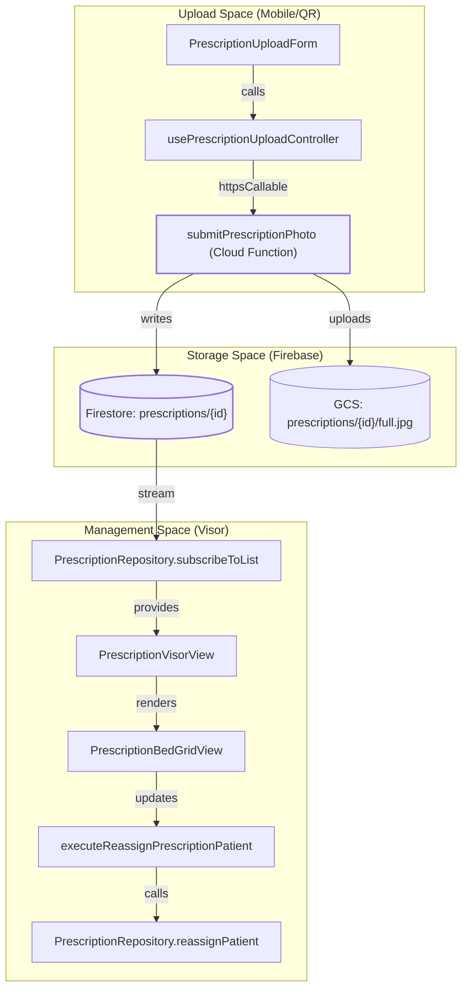
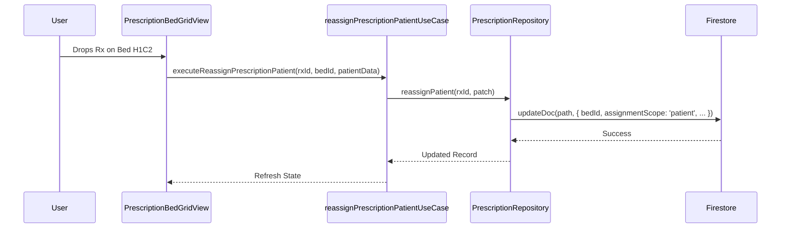

# Prescriptions Module

# Prescriptions Module

Relevant source files

The following files were used as context for generating this wiki page:

- [functions/lib/prescriptionAccessFunctions.js](functions/lib/prescriptionAccessFunctions.js)
- [public/startup-surface.js](public/startup-surface.js)
- [src/application/ports/prescriptionPort.ts](src/application/ports/prescriptionPort.ts)
- [src/application/prescriptions/reassignPrescriptionPatientUseCase.ts](src/application/prescriptions/reassignPrescriptionPatientUseCase.ts)
- [src/application/prescriptions/updatePrescriptionTypeUseCase.ts](src/application/prescriptions/updatePrescriptionTypeUseCase.ts)
- [src/features/prescriptions/components/PrescriptionBedGridView.tsx](src/features/prescriptions/components/PrescriptionBedGridView.tsx)
- [src/features/prescriptions/components/PrescriptionBedRow.tsx](src/features/prescriptions/components/PrescriptionBedRow.tsx)
- [src/features/prescriptions/components/PrescriptionDetailModal.tsx](src/features/prescriptions/components/PrescriptionDetailModal.tsx)
- [src/features/prescriptions/components/PrescriptionImageLightbox.tsx](src/features/prescriptions/components/PrescriptionImageLightbox.tsx)
- [src/features/prescriptions/components/PrescriptionListItem.tsx](src/features/prescriptions/components/PrescriptionListItem.tsx)
- [src/features/prescriptions/components/PrescriptionPatientLightbox.tsx](src/features/prescriptions/components/PrescriptionPatientLightbox.tsx)
- [src/features/prescriptions/components/PrescriptionQuickTypeButton.tsx](src/features/prescriptions/components/PrescriptionQuickTypeButton.tsx)
- [src/features/prescriptions/components/PrescriptionThumbnail.tsx](src/features/prescriptions/components/PrescriptionThumbnail.tsx)
- [src/features/prescriptions/components/PrescriptionUnassignedTray.tsx](src/features/prescriptions/components/PrescriptionUnassignedTray.tsx)
- [src/features/prescriptions/components/PrescriptionUploadForm.tsx](src/features/prescriptions/components/PrescriptionUploadForm.tsx)
- [src/features/prescriptions/components/PrescriptionVisorView.tsx](src/features/prescriptions/components/PrescriptionVisorView.tsx)
- [src/features/prescriptions/hooks/usePrescriptionListController.ts](src/features/prescriptions/hooks/usePrescriptionListController.ts)
- [src/features/prescriptions/hooks/usePrescriptionUploadController.ts](src/features/prescriptions/hooks/usePrescriptionUploadController.ts)
- [src/features/prescriptions/services/prescriptionAccessService.ts](src/features/prescriptions/services/prescriptionAccessService.ts)
- [src/schemas/prescriptionSchemas.ts](src/schemas/prescriptionSchemas.ts)
- [src/services/repositories/PrescriptionRepository.ts](src/services/repositories/PrescriptionRepository.ts)
- [src/tests/features/prescriptions/PrescriptionBedGridView.test.tsx](src/tests/features/prescriptions/PrescriptionBedGridView.test.tsx)
- [src/tests/features/prescriptions/PrescriptionQuickTypeButton.test.tsx](src/tests/features/prescriptions/PrescriptionQuickTypeButton.test.tsx)
- [src/tests/features/prescriptions/PrescriptionUploadForm.test.tsx](src/tests/features/prescriptions/PrescriptionUploadForm.test.tsx)
- [src/tests/features/prescriptions/PrescriptionVisorView.test.tsx](src/tests/features/prescriptions/PrescriptionVisorView.test.tsx)
- [src/tests/features/prescriptions/prescriptionRuntimeContracts.test.ts](src/tests/features/prescriptions/prescriptionRuntimeContracts.test.ts)
- [src/tests/features/prescriptions/usePrescriptionListController.test.tsx](src/tests/features/prescriptions/usePrescriptionListController.test.tsx)
- [src/tests/features/prescriptions/usePrescriptionUploadController.test.tsx](src/tests/features/prescriptions/usePrescriptionUploadController.test.tsx)
- [src/tests/functions/prescriptionAccessFunctions.test.ts](src/tests/functions/prescriptionAccessFunctions.test.ts)
- [src/tests/security/prescriptionConstantsDriftStatic.test.ts](src/tests/security/prescriptionConstantsDriftStatic.test.ts)
- [src/tests/services/repositories/PrescriptionRepository.test.ts](src/tests/services/repositories/PrescriptionRepository.test.ts)
- [src/types/prescriptionTypes.ts](src/types/prescriptionTypes.ts)

The **Prescriptions Module** provides a digital backup system for physical medical prescriptions. Its primary goal is to maintain a transient visual record (30-day retention) of prescriptions (Common, White/Psychotropic, and Green/Benzodiazepine) to bridge the gap between clinical floors and the pharmacy.

The module supports two primary workflows:

1.  **QR-PIN Upload**: Anonymous mobile upload via scanning a QR code in the ward and entering a rotating PIN.
2.  **Clinical Visor**: A management interface for nurses and admins to assign uploaded photos to specific patients or beds using a drag-and-drop grid.

## System Overview

The module is partitioned into a high-security upload path (Cloud Functions) and a management interface (React).

### Prescription Lifecycle

1.  **Capture**: A staff member captures a photo via `PrescriptionUploadForm` [src/features/prescriptions/components/PrescriptionUploadForm.tsx:137-147]().
2.  **Ingestion**: The `submitPrescriptionPhoto` Cloud Function validates the PIN, compresses the image, and writes to Firestore [functions/lib/prescriptionAccessFunctions.js]().
3.  **Classification**: The prescription appears in the `PrescriptionUnassignedTray` [src/features/prescriptions/components/PrescriptionUnassignedTray.tsx:62-74]().
4.  **Assignment**: Users drag the prescription onto the `PrescriptionBedGridView` to associate it with a patient [src/features/prescriptions/components/PrescriptionBedGridView.tsx:166-187]().
5.  **Expiration**: `prescriptionCleanupFunctions` automatically delete records and storage artifacts after 30 days [functions/index.js]().

### Code Entity Map: Upload to Visor

Sources: [src/features/prescriptions/components/PrescriptionVisorView.tsx:16-40](), [src/services/repositories/PrescriptionRepository.ts:41-55](), [src/features/prescriptions/components/PrescriptionUploadForm.tsx:77-96]()

## Key Components

### 1. Prescription Visor & Bed Grid

The management interface allows switching between a standard list view and a bed-grid view. The bed-grid view is the primary tool for clinical reconciliation, mapping the current (or previous day's) census to uploaded prescriptions.

- **Census Fallback**: If the current day has no census data, the grid automatically attempts to load the previous day's record to provide bed/patient context [src/features/prescriptions/components/PrescriptionBedGridView.tsx:109-127]().
- **Drag-and-Drop**: Prescriptions can be dragged from the "Unassigned Tray" into specific cells (Bed x Prescription Type) [src/features/prescriptions/components/PrescriptionBedRow.tsx:76-91]().

For details, see **[Prescription Visor & Bed Grid](#9.1)**.

### 2. Prescription Repository & Backend

All data access is governed by the `PrescriptionRepository`, which provides methods for listing, reassigning, and updating types.

- **Validation**: Data integrity is enforced using Zod schemas (`prescriptionRecordSchema`) at the Firestore read boundary to prevent malformed documents from crashing the UI [src/schemas/prescriptionSchemas.ts:54-71]().
- **Security**: Uploads are restricted to the `submitPrescriptionPhoto` Cloud Function to ensure that even anonymous PIN-based uploads are audited and validated [src/services/repositories/PrescriptionRepository.ts:5-9]().

For details, see **[Prescription Repository & Cloud Functions](#9.2)**.

## Domain Models

The system categorizes prescriptions into three specific types and three assignment scopes.

### Prescription Types

| Type           | Code Identifier   | Label                          |
| :------------- | :---------------- | :----------------------------- |
| Common         | `comun`           | Receta Común                   |
| Psychotropic   | `psicotropicos`   | Receta Blanca (Psicotrópicos)  |
| Benzodiazepine | `benzodiazepinas` | Receta Verde (Benzodiazepinas) |

Sources: [src/types/prescriptionTypes.ts]()

### Assignment Scopes

| Scope      | Code Identifier      | Description                                                |
| :--------- | :------------------- | :--------------------------------------------------------- |
| Patient    | `patient`            | Linked to a specific bed and patient RUT.                  |
| Unassigned | `unassigned`         | Uploaded but not yet matched to a patient.                 |
| Stock      | `hospitalized_stock` | General ward stock, not assigned to a specific individual. |

Sources: [src/schemas/prescriptionSchemas.ts:25-31](), [src/tests/features/prescriptions/prescriptionRuntimeContracts.test.ts:54-65]()

## Data Flow: Reassignment Logic

Sources: [src/features/prescriptions/components/PrescriptionBedGridView.tsx:166-187](), [src/application/prescriptions/reassignPrescriptionPatientUseCase.ts](), [src/services/repositories/PrescriptionRepository.ts:95-127]()

## Child Pages

- **[Prescription Visor & Bed Grid](#9.1)**: Detailed documentation on the React components, drag-and-drop implementation, and the lightbox viewer.
- **[Prescription Repository & Cloud Functions](#9.2)**: Technical details on the Firestore schema, Zod validation, and the PIN-protected upload backend.

---
