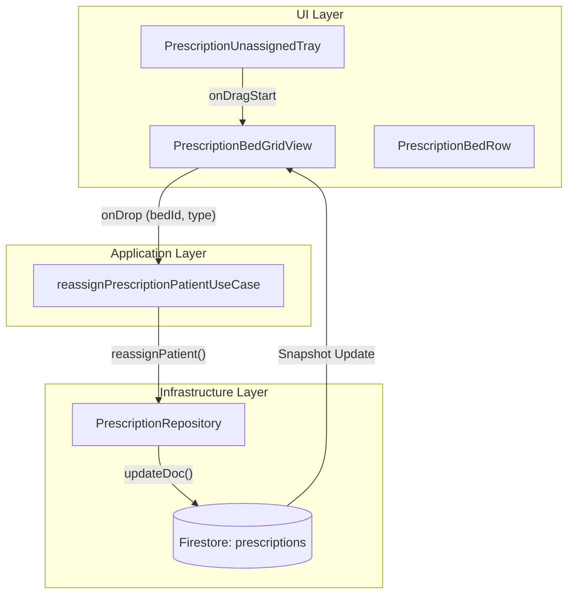
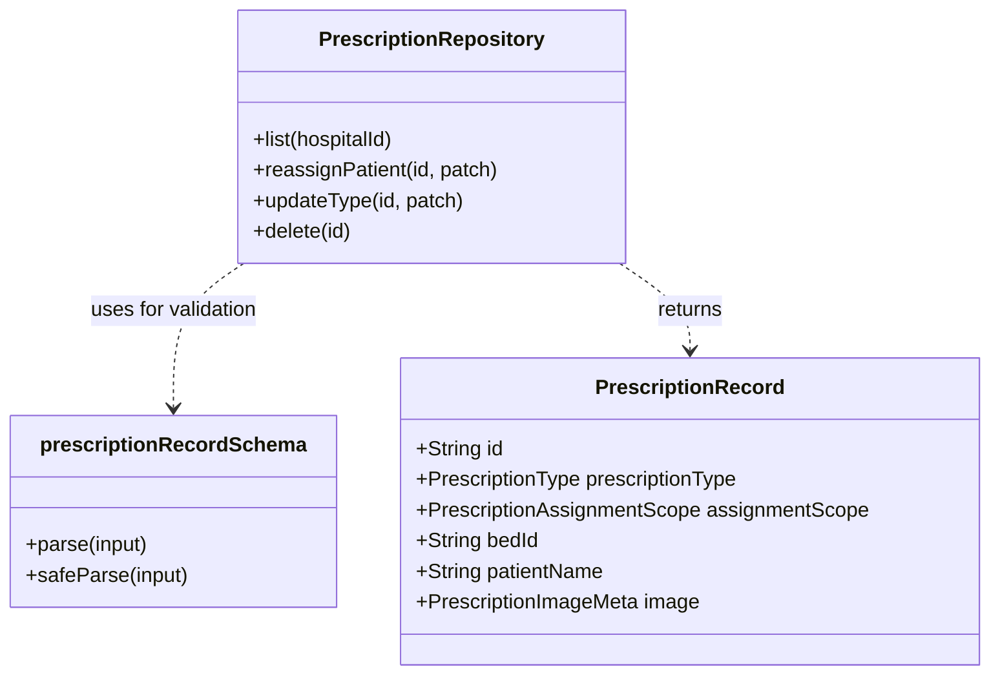

# Prescription Visor & Bed Grid

# Prescription Visor & Bed Grid

Relevant source files

The following files were used as context for generating this wiki page:

- [public/startup-surface.js](public/startup-surface.js)
- [src/application/ports/prescriptionPort.ts](src/application/ports/prescriptionPort.ts)
- [src/application/prescriptions/reassignPrescriptionPatientUseCase.ts](src/application/prescriptions/reassignPrescriptionPatientUseCase.ts)
- [src/application/prescriptions/updatePrescriptionTypeUseCase.ts](src/application/prescriptions/updatePrescriptionTypeUseCase.ts)
- [src/features/prescriptions/components/PrescriptionBedGridView.tsx](src/features/prescriptions/components/PrescriptionBedGridView.tsx)
- [src/features/prescriptions/components/PrescriptionBedRow.tsx](src/features/prescriptions/components/PrescriptionBedRow.tsx)
- [src/features/prescriptions/components/PrescriptionImageLightbox.tsx](src/features/prescriptions/components/PrescriptionImageLightbox.tsx)
- [src/features/prescriptions/components/PrescriptionPatientLightbox.tsx](src/features/prescriptions/components/PrescriptionPatientLightbox.tsx)
- [src/features/prescriptions/components/PrescriptionQuickTypeButton.tsx](src/features/prescriptions/components/PrescriptionQuickTypeButton.tsx)
- [src/features/prescriptions/components/PrescriptionThumbnail.tsx](src/features/prescriptions/components/PrescriptionThumbnail.tsx)
- [src/features/prescriptions/components/PrescriptionUnassignedTray.tsx](src/features/prescriptions/components/PrescriptionUnassignedTray.tsx)
- [src/features/prescriptions/components/PrescriptionVisorView.tsx](src/features/prescriptions/components/PrescriptionVisorView.tsx)
- [src/schemas/prescriptionSchemas.ts](src/schemas/prescriptionSchemas.ts)
- [src/services/repositories/PrescriptionRepository.ts](src/services/repositories/PrescriptionRepository.ts)
- [src/tests/features/prescriptions/PrescriptionBedGridView.test.tsx](src/tests/features/prescriptions/PrescriptionBedGridView.test.tsx)
- [src/tests/features/prescriptions/PrescriptionQuickTypeButton.test.tsx](src/tests/features/prescriptions/PrescriptionQuickTypeButton.test.tsx)
- [src/tests/features/prescriptions/PrescriptionVisorView.test.tsx](src/tests/features/prescriptions/PrescriptionVisorView.test.tsx)
- [src/tests/features/prescriptions/prescriptionRuntimeContracts.test.ts](src/tests/features/prescriptions/prescriptionRuntimeContracts.test.ts)
- [src/tests/security/prescriptionConstantsDriftStatic.test.ts](src/tests/security/prescriptionConstantsDriftStatic.test.ts)
- [src/tests/services/repositories/PrescriptionRepository.test.ts](src/tests/services/repositories/PrescriptionRepository.test.ts)

The **Prescription Visor** is a clinical administrative interface designed to manage digital backups of medical prescriptions. It facilitates the association of prescription images (uploaded via QR-PIN or authenticated flows) with specific patients in the hospital census.

## Overview & Architecture

The system operates on a dual-view model: a standard list view and a **Bed Grid** view. The Bed Grid is the primary interface for administrative nurses to reconcile unassigned prescriptions with the current hospital state.

### Key Components and Data Flow

The `PrescriptionVisorView` [src/features/prescriptions/components/PrescriptionVisorView.tsx:16-115]() acts as the orchestrator, managing state for the selected view mode (`list` or `bed-grid`) and providing callbacks for domain use cases such as reassignment and type updates.

| Component                    | Responsibility                                                                     |
| :--------------------------- | :--------------------------------------------------------------------------------- |
| `PrescriptionBedGridView`    | Renders the matrix of beds vs. prescription types.                                 |
| `PrescriptionBedRow`         | A single row in the grid representing a bed/patient and their assigned thumbnails. |
| `PrescriptionUnassignedTray` | A container for prescriptions that haven't been linked to a patient yet.           |
| `PrescriptionRepository`     | Interface for Firestore operations (list, reassign, delete).                       |
| `PrescriptionImageLightbox`  | High-resolution viewer with zoom, rotation, and deletion capabilities.             |

### Data Flow Diagram: Prescription Assignment

This diagram illustrates how an unassigned prescription is moved from the "Tray" to a specific patient bed using the `reassignPrescriptionPatient` use case.

**Sources:** [src/features/prescriptions/components/PrescriptionBedGridView.tsx:166-187](), [src/services/repositories/PrescriptionRepository.ts:95-127](), [src/application/prescriptions/reassignPrescriptionPatientUseCase.ts:1-20]()

## The Bed Grid Matrix

The `PrescriptionBedGridView` [src/features/prescriptions/components/PrescriptionBedGridView.tsx:55-62]() builds a visual matrix where rows are derived from the `DailyRecord` (census) and columns represent `PrescriptionType` (Común, Blanca, Verde).

### Fallback to Previous Day Census

If the user views the visor for a date where no census has been initialized yet, the component automatically attempts to fetch the previous day's record to provide a valid bed list for assignments.

- **Logic:** If `buildBedRows` for `effectiveDay` returns 0 rows, it calls `getRecordFromFirestore(previousIsoDay(effectiveDay))` [src/features/prescriptions/components/PrescriptionBedGridView.tsx:95-121]().
- **Visual Cue:** A "censo del día previo" label is displayed to warn the user that they are assigning to a historical/estimated bed map [src/tests/features/prescriptions/PrescriptionBedGridView.test.tsx:108-121]().

### Assignment Workflow

The grid supports two methods for assigning "Unassigned" prescriptions:

1.  **Drag and Drop:** Users drag a thumbnail from the `PrescriptionUnassignedTray` and drop it into a cell. The grid enforces type-matching; dropping a "Verde" prescription into a "Común" column is visually discouraged via opacity changes [src/features/prescriptions/components/PrescriptionBedRow.tsx:71-90]().
2.  **Picker Mode:** Clicking "Asignar" on a tray card enters "Picker" mode. Each valid cell in the grid then displays an "Asignar aquí" button [src/features/prescriptions/components/PrescriptionBedRow.tsx:124-138]().

**Sources:** [src/features/prescriptions/components/PrescriptionBedGridView.tsx:166-187](), [src/features/prescriptions/components/PrescriptionBedRow.tsx:71-90](), [src/features/prescriptions/components/PrescriptionUnassignedTray.tsx:111-123]()

## Prescription Records & Validation

Prescription data is strictly validated using Zod schemas at the repository boundary to prevent malformed documents from crashing the visor.

### Entity Mapping

| Field              | Description                                                 | Source                                       |
| :----------------- | :---------------------------------------------------------- | :------------------------------------------- |
| `assignmentScope`  | `patient`, `unassigned`, or `hospitalized_stock`            | [src/schemas/prescriptionSchemas.ts:25-31]() |
| `prescriptionType` | `comun`, `psicotropicos`, `benzodiazepinas`                 | [src/schemas/prescriptionSchemas.ts:17-23]() |
| `image`            | Metadata including `storagePath` and `thumbnailStoragePath` | [src/schemas/prescriptionSchemas.ts:33-40]() |
| `uploader`         | Source of upload (`authenticated` or `qr_pin`)              | [src/schemas/prescriptionSchemas.ts:42-47]() |

### Code-to-Domain Mapping

**Sources:** [src/schemas/prescriptionSchemas.ts:54-71](), [src/services/repositories/PrescriptionRepository.ts:41-158](), [src/types/prescriptionTypes.ts:1-30]()

## Visual Interaction Components

### PrescriptionUnassignedTray

Displays two categories of non-patient prescriptions:

1.  **Pending:** Truly unassigned images waiting for a bed [src/features/prescriptions/components/PrescriptionUnassignedTray.tsx:39-41]().
2.  **Stock de Hospitalizados:** Prescriptions for general ward stock, handled separately from patient-specific medication [src/tests/features/prescriptions/PrescriptionBedGridView.test.tsx:123-149]().

### PrescriptionQuickTypeButton

Allows users to change the `prescriptionType` (e.g., changing a misidentified "Común" to "Blanca") without leaving the grid. It uses `createPortal` to render the dropdown menu over the fixed-layout table [src/features/prescriptions/components/PrescriptionQuickTypeButton.tsx:124-170]().

### PrescriptionImageLightbox

A full-screen modal [src/features/prescriptions/components/PrescriptionImageLightbox.tsx:129-135]() for clinical review.

- **Zoom/Pan:** Supports scaling from 1x to 5x with mouse wheel or button controls [src/features/prescriptions/components/PrescriptionImageLightbox.tsx:28-30]().
- **Manipulation:** Supports 90-degree rotations for sideways-uploaded photos [src/features/prescriptions/components/PrescriptionImageLightbox.tsx:160-167]().
- **Deletion:** Authorized users (admin/nurse) can delete the photo directly from the lightbox [src/features/prescriptions/components/PrescriptionImageLightbox.tsx:176-190]().

**Sources:** [src/features/prescriptions/components/PrescriptionUnassignedTray.tsx:62-150](), [src/features/prescriptions/components/PrescriptionQuickTypeButton.tsx:30-104](), [src/features/prescriptions/components/PrescriptionImageLightbox.tsx:32-127]()

---
