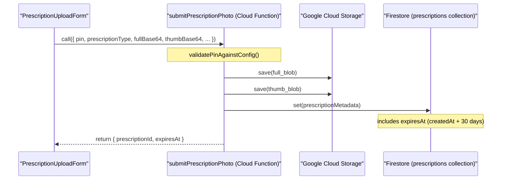
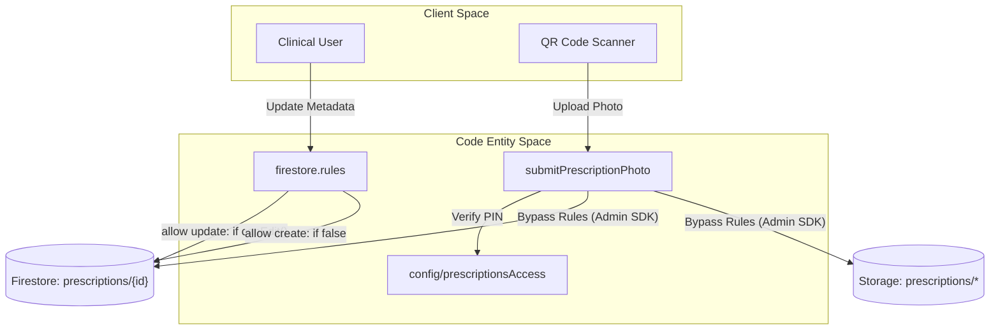

# Prescription Repository & Cloud Functions

# Prescription Repository & Cloud Functions

Relevant source files

The following files were used as context for generating this wiki page:

- [docs/RUNBOOK_SECRET_ROTATION.md](docs/RUNBOOK_SECRET_ROTATION.md)
- [functions/lib/prescriptionAccessFunctions.js](functions/lib/prescriptionAccessFunctions.js)
- [functions/lib/prescriptionCleanupFunctions.js](functions/lib/prescriptionCleanupFunctions.js)
- [rules/README.md](rules/README.md)
- [rules/firestore/00-auth-and-role-helpers.rules](rules/firestore/00-auth-and-role-helpers.rules)
- [rules/firestore/30-daily-record-write-helpers.rules](rules/firestore/30-daily-record-write-helpers.rules)
- [rules/firestore/40-hospitals.rules](rules/firestore/40-hospitals.rules)
- [rules/firestore/50-global-rules.rules](rules/firestore/50-global-rules.rules)
- [rules/storage/10-storage-paths.rules](rules/storage/10-storage-paths.rules)
- [scripts/check-firestore-rules-governance.mjs](scripts/check-firestore-rules-governance.mjs)
- [scripts/config/firestore-rules-governance.json](scripts/config/firestore-rules-governance.json)
- [scripts/firestoreRulesCriticalAccessMatrixSupport.mjs](scripts/firestoreRulesCriticalAccessMatrixSupport.mjs)
- [scripts/firestoreRulesGovernanceSupport.mjs](scripts/firestoreRulesGovernanceSupport.mjs)
- [scripts/hook-hotspots-limits.json](scripts/hook-hotspots-limits.json)
- [scripts/maintenanceDebtScorecardSupport.mjs](scripts/maintenanceDebtScorecardSupport.mjs)
- [scripts/report-maintenance-debt-scorecard.mjs](scripts/report-maintenance-debt-scorecard.mjs)
- [scripts/rulesSourceSupport.mjs](scripts/rulesSourceSupport.mjs)
- [src/application/audit/auditActorPolicy.ts](src/application/audit/auditActorPolicy.ts)
- [src/application/prescriptions/deletePrescriptionUseCase.ts](src/application/prescriptions/deletePrescriptionUseCase.ts)
- [src/features/admin/components/internal/audit/auditUIUtils.ts](src/features/admin/components/internal/audit/auditUIUtils.ts)
- [src/features/prescriptions/components/PrescriptionDetailModal.tsx](src/features/prescriptions/components/PrescriptionDetailModal.tsx)
- [src/features/prescriptions/components/PrescriptionListItem.tsx](src/features/prescriptions/components/PrescriptionListItem.tsx)
- [src/features/prescriptions/components/PrescriptionUploadForm.tsx](src/features/prescriptions/components/PrescriptionUploadForm.tsx)
- [src/features/prescriptions/hooks/usePrescriptionListController.ts](src/features/prescriptions/hooks/usePrescriptionListController.ts)
- [src/features/prescriptions/hooks/usePrescriptionUploadController.ts](src/features/prescriptions/hooks/usePrescriptionUploadController.ts)
- [src/features/prescriptions/index.ts](src/features/prescriptions/index.ts)
- [src/features/prescriptions/services/prescriptionAccessService.ts](src/features/prescriptions/services/prescriptionAccessService.ts)
- [src/services/admin/auditConstants.ts](src/services/admin/auditConstants.ts)
- [src/services/admin/utils/auditSummaryGenerator.ts](src/services/admin/utils/auditSummaryGenerator.ts)
- [src/services/storage/indexeddb/indexedDbOpenHealthController.ts](src/services/storage/indexeddb/indexedDbOpenHealthController.ts)
- [src/tests/application/audit/auditActorPolicy.test.ts](src/tests/application/audit/auditActorPolicy.test.ts)
- [src/tests/application/prescriptions/prescriptionUseCases.test.ts](src/tests/application/prescriptions/prescriptionUseCases.test.ts)
- [src/tests/build/firestoreRulesGovernanceSupport.test.ts](src/tests/build/firestoreRulesGovernanceSupport.test.ts)
- [src/tests/build/maintenanceDebtScorecardSupport.test.ts](src/tests/build/maintenanceDebtScorecardSupport.test.ts)
- [src/tests/build/rulesSourceGovernance.test.ts](src/tests/build/rulesSourceGovernance.test.ts)
- [src/tests/build/rulesSourceSupport.test.ts](src/tests/build/rulesSourceSupport.test.ts)
- [src/tests/features/prescriptions/PrescriptionUploadForm.test.tsx](src/tests/features/prescriptions/PrescriptionUploadForm.test.tsx)
- [src/tests/features/prescriptions/usePrescriptionListController.test.tsx](src/tests/features/prescriptions/usePrescriptionListController.test.tsx)
- [src/tests/features/prescriptions/usePrescriptionUploadController.test.tsx](src/tests/features/prescriptions/usePrescriptionUploadController.test.tsx)
- [src/tests/functions/prescriptionAccessFunctions.test.ts](src/tests/functions/prescriptionAccessFunctions.test.ts)
- [src/tests/functions/prescriptionCleanupFunctions.test.ts](src/tests/functions/prescriptionCleanupFunctions.test.ts)
- [src/tests/security/rulesHardeningStatic.test.ts](src/tests/security/rulesHardeningStatic.test.ts)
- [src/tests/services/admin/admissionDateBackfillService.test.ts](src/tests/services/admin/admissionDateBackfillService.test.ts)
- [src/tests/services/admin/utils/auditSummaryGenerator.test.ts](src/tests/services/admin/utils/auditSummaryGenerator.test.ts)
- [src/tests/services/storage/indexedDbOpenHealthController.test.ts](src/tests/services/storage/indexedDbOpenHealthController.test.ts)
- [src/tests/types/audit.test.ts](src/tests/types/audit.test.ts)
- [src/types/audit.ts](src/types/audit.ts)
- [src/types/auditActionTypes.ts](src/types/auditActionTypes.ts)
- [src/types/auditLogTypes.ts](src/types/auditLogTypes.ts)
- [src/types/prescriptionTypes.ts](src/types/prescriptionTypes.ts)

The Prescriptions module provides a transient, 30-day backup system for medical prescriptions. It bypasses the standard offline-first sync pipeline used by the Census, instead utilizing **Cloud Functions** as the single canonical write path for security and brute-force protection.

## Implementation Architecture

The system is designed around a "QR-to-Cloud" flow where users (nurses/physicians) can upload prescription photos via a mobile device by scanning a QR code and entering a rotating PIN.

### Data Flow: Prescription Upload

The following diagram illustrates the path from the UI to storage, highlighting the server-mediated write path.

**Prescription Upload Sequence**

Sources: [functions/lib/prescriptionAccessFunctions.js:12-18](), [src/features/prescriptions/components/PrescriptionUploadForm.tsx:108-111]()

## Prescription Repository & Use Cases

The application layer interacts with prescriptions through the `PrescriptionPort`, implemented by a repository that manages Firestore interactions.

### Key Use Cases

1.  **Reassign Patient**: Updates the link between a prescription and a specific bed or patient identity. Stays within the current day's context by default [src/application/prescriptions/reassignPrescriptionPatientUseCase.ts:5-8]().
2.  **Update Type**: Changes the categorization (e.g., from `comun` to `psicotropicos`) which may affect clinical visibility [src/application/prescriptions/updatePrescriptionTypeUseCase.ts:5-7]().
3.  **Delete**: Performs a manual deletion. This action is audited before the record is removed [src/application/prescriptions/deletePrescriptionUseCase.ts:189-192]().

### Repository Operations

| Function          | Description                                          | Security Requirement    |
| :---------------- | :--------------------------------------------------- | :---------------------- |
| `list`            | Fetches all prescriptions for a hospital.            | `canReadClinicalData()` |
| `reassignPatient` | Patches `bedId`, `patientName`, and `patientRut`.    | `canEdit()`             |
| `updateType`      | Updates `prescriptionType` and `updatedAt`.          | `canEdit()`             |
| `delete`          | Removes the Firestore document and associated blobs. | `canEdit()`             |

Sources: [src/tests/application/prescriptions/prescriptionUseCases.test.ts:10-19](), [rules/firestore/40-hospitals.rules:53-58]()

## Prescription Cloud Functions

Located in `functions/lib/prescriptionAccessFunctions.js`, these functions handle sensitive operations that cannot be trusted to the client.

### `submitPrescriptionPhoto`

The single entry point for creating prescriptions.

- **Validation**: Enforces `MAX_BASE64_BYTES` (4MB) and validates dimensions [functions/lib/prescriptionAccessFunctions.js:42-46]().
- **Retention**: Automatically calculates `expiresAt` based on `RETENTION_DAYS_BY_TYPE` (default 30 days) [functions/lib/prescriptionAccessFunctions.js:36-41]().
- **Auth**: Supports both Firebase Auth (for logged-in clinicians) and PIN-based access (for QR flow) [functions/lib/prescriptionAccessFunctions.js:62-67]().

### PIN Access & Brute-force Protection

The system protects the PIN-gated upload via:

- **Scrypt Hashing**: Uses `scrypt` with per-record salts for PIN storage [functions/lib/prescriptionAccessFunctions.js:52-59]().
- **Lockout Policy**: After 5 failed attempts, the PIN endpoint is locked for 15 minutes (`PIN_LOCKOUT_MINUTES`) [functions/lib/prescriptionAccessFunctions.js:49-51]().

Sources: [functions/lib/prescriptionAccessFunctions.js:76-84](), [functions/lib/prescriptionAccessFunctions.js:192-209]()

## Cleanup & Retention

Prescriptions are transient. A scheduled function, `prescriptionCleanupFunctions`, runs periodically to remove expired records.

- **Query**: Finds documents where `expiresAt` is less than the current time.
- **Atomic Cleanup**: Deletes the Firestore metadata document and the two associated blobs (full image and thumbnail) in Cloud Storage.
- **Audit**: Records a `PRESCRIPTION_RETENTION_DELETED` event [src/services/admin/auditConstants.ts:28]().

Sources: [functions/lib/prescriptionCleanupFunctions.js:1-10](), [src/types/auditActionTypes.ts:40]()

## Security Guards

The module employs strict Firestore and Storage rules to prevent unauthorized access.

**Prescription Security Mapping**

### Static Protections

- **Direct Create Forbidden**: Clients are explicitly forbidden from creating prescription documents in Firestore; they must use the Cloud Function [src/tests/security/rulesHardeningStatic.test.ts:94-99]().
- **Storage Access**: Blobs are readable by clinical staff (`canReadClinicalStorage()`) but never client-writable [src/tests/security/rulesHardeningStatic.test.ts:122-130]().
- **PIN Config**: The `prescriptionsAccess` configuration is readable only by admins [src/tests/security/rulesHardeningStatic.test.ts:114-120]().

Sources: [rules/firestore/40-hospitals.rules:53-58](), [scripts/firestoreRulesCriticalAccessMatrixSupport.mjs:59-65]()

---
