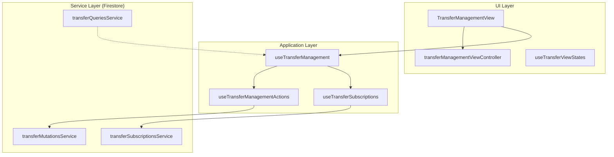

# Transfers Module

# Transfers Module

Relevant source files

The following files were used as context for generating this wiki page:

- [src/features/transfers/README.md](src/features/transfers/README.md)
- [src/features/transfers/components/TransferManagementView.tsx](src/features/transfers/components/TransferManagementView.tsx)
- [src/features/transfers/components/controllers/transferManagementViewContracts.ts](src/features/transfers/components/controllers/transferManagementViewContracts.ts)
- [src/features/transfers/components/controllers/transferManagementViewController.ts](src/features/transfers/components/controllers/transferManagementViewController.ts)
- [src/features/transfers/components/controllers/transferPeriodSelection.ts](src/features/transfers/components/controllers/transferPeriodSelection.ts)
- [src/features/transfers/hooks/useTransferSubscriptions.ts](src/features/transfers/hooks/useTransferSubscriptions.ts)
- [src/hooks/controllers/transferManagementController.ts](src/hooks/controllers/transferManagementController.ts)
- [src/hooks/controllers/transferViewStatesController.ts](src/hooks/controllers/transferViewStatesController.ts)
- [src/hooks/useTransferManagement.ts](src/hooks/useTransferManagement.ts)
- [src/hooks/useTransferViewStates.ts](src/hooks/useTransferViewStates.ts)
- [src/services/transfers/transferFirestoreCollections.ts](src/services/transfers/transferFirestoreCollections.ts)
- [src/services/transfers/transferMutationsService.ts](src/services/transfers/transferMutationsService.ts)
- [src/services/transfers/transferQueriesService.ts](src/services/transfers/transferQueriesService.ts)
- [src/services/transfers/transferSerializationController.ts](src/services/transfers/transferSerializationController.ts)
- [src/services/transfers/transferSubscriptionsService.ts](src/services/transfers/transferSubscriptionsService.ts)
- [src/shared/transfers/transferOperationalPeriod.ts](src/shared/transfers/transferOperationalPeriod.ts)
- [src/tests/features/transfers/transferManagementViewController.test.ts](src/tests/features/transfers/transferManagementViewController.test.ts)
- [src/tests/features/transfers/transferPeriodSelection.test.ts](src/tests/features/transfers/transferPeriodSelection.test.ts)
- [src/tests/hooks/controllers/transferViewStatesController.test.ts](src/tests/hooks/controllers/transferViewStatesController.test.ts)
- [src/tests/services/transfers/transferService.queries.test.ts](src/tests/services/transfers/transferService.queries.test.ts)

The **Transfers Module** manages the clinical lifecycle of patient transfer requests between units or to external healthcare facilities. It provides a real-time operational log for nursing and medical staff, tracking requests from initial creation through status changes (e.g., `RECEIVED`, `ACCEPTED`) to finalization (`TRANSFERRED`, `CANCELLED`).

## Lifecycle & Workflow

The module tracks `TransferRequest` entities through a defined state machine. Requests are categorized into **Active** and **Finalized** states to maintain a clean operational view while preserving historical data.

### Transfer States

- **Active States**: `REQUESTED`, `RECEIVED`, `ACCEPTED`. These appear in the primary management table [src/features/transfers/README.md:20-24]().
- **Finalized States**: `TRANSFERRED`, `REJECTED`, `CANCELLED`, `NO_RESPONSE`. These are moved to a collapsible history section [src/features/transfers/README.md:32-37]().

### Request Logic

- **Temporal Scoping**: Active requests are scoped to their request month. A request created in March does not automatically roll over to April in the UI to prevent "ghost" pending tasks from accumulating [src/features/transfers/README.md:26-28]().
- **Census Integration**: If a patient is transferred via the Daily Census without a pre-existing request, the system automatically creates a finalized `TRANSFERRED` request to maintain the audit trail [src/features/transfers/README.md:39-43]().

### Natural Language to Code Entity Mapping: Transfer Flow

| Clinical Concept       | Code Entity                         | File Path                                                                          |
| :--------------------- | :---------------------------------- | :--------------------------------------------------------------------------------- |
| **Transfer Request**   | `TransferRequest`                   | [src/types/transferRequestTypes.ts]()                                              |
| **Status Change**      | `advanceStatus`                     | [src/hooks/useTransferViewStates.ts:24]()                                          |
| **Effective Transfer** | `markAsTransferred`                 | [src/hooks/useTransferViewStates.ts:25]()                                          |
| **Document Package**   | `GeneratedDocument`                 | [src/types/transferDocuments.ts]()                                                 |
| **Monthly Filtering**  | `isTransferVisibleInSelectedPeriod` | [src/features/transfers/components/controllers/transferPeriodSelection.ts:32-61]() |

**Sources:** [src/features/transfers/README.md:5-43](), [src/hooks/useTransferViewStates.ts:20-27](), [src/features/transfers/components/controllers/transferManagementViewController.ts:67-108]()

## System Architecture

The module follows a controller-service pattern, separating UI state management from the Firestore persistence layer.

### Management Diagram: UI to Persistence

**Sources:** [src/features/transfers/components/TransferManagementView.tsx:43-56](), [src/hooks/useTransferManagement.ts:47-77](), [src/services/transfers/transferMutationsService.ts:50-52]()

## Data Access & Real-time Sync

The module uses dual Firestore collections to optimize performance and query costs:

1.  **Active Collection**: Stores pending requests (`transfers`).
2.  **History Collection**: Stores finalized requests (`transferHistory`).

### Queries and Subscriptions

- **Real-time Updates**: `subscribeToTransfersRealtime` merges snapshots from both collections into a single stream for the UI [src/services/transfers/transferSubscriptionsService.ts:24-97]().
- **Conflict Handling**: When finalizing a transfer, the system performs an atomic move: creating the record in `transferHistory` and deleting it from the active `transfers` collection [src/services/transfers/transferMutationsService.ts:178-189]().

**Sources:** [src/services/transfers/transferQueriesService.ts:22-44](), [src/services/transfers/transferSubscriptionsService.ts:63-85](), [src/services/transfers/transferMutationsService.ts:182-187]()

## Document Generation

For specific destinations (e.g., **Hospital Salvador**), the module supports generating a "Document Package" including clinical summaries and transfer forms.

- **Workflow**: The system resolves a `workflowPlan` based on the destination hospital [src/hooks/useTransferViewStates.ts:158-161]().
- **Questionnaires**: If required, a modal collects additional clinical data (`QuestionnaireResponse`) before generation [src/hooks/useTransferViewStates.ts:185-193]().
- **Caching**: Generated packages are cached in-memory via `generatedPackageCacheRef` to avoid redundant processing [src/hooks/useTransferViewStates.ts:28-30]().

**Sources:** [src/hooks/useTransferViewStates.ts:49-91](), [src/hooks/useTransferViewStates.ts:156-178]()

## Sub-Pages

### [Transfer Management View & Controllers](#10.1)

Details the React components and UI controllers. Covers the `TransferManagementView`, monthly period selection logic, and the modals for editing, status changes, and cancellations.

### [Transfer Service Layer & Document Generation](#10.2)

Deep dive into the persistence logic, Firestore collection structure, and the technical implementation of the DOCX/Excel template generation engine for clinical documents.

---
