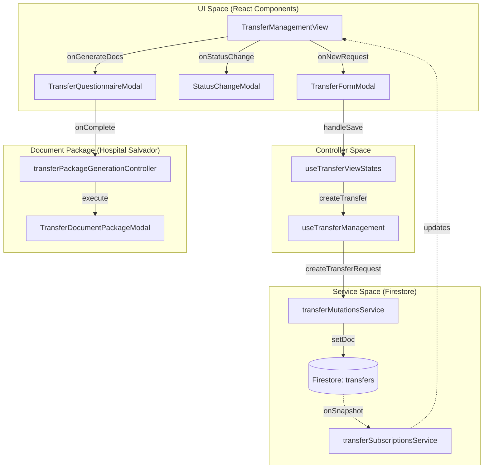
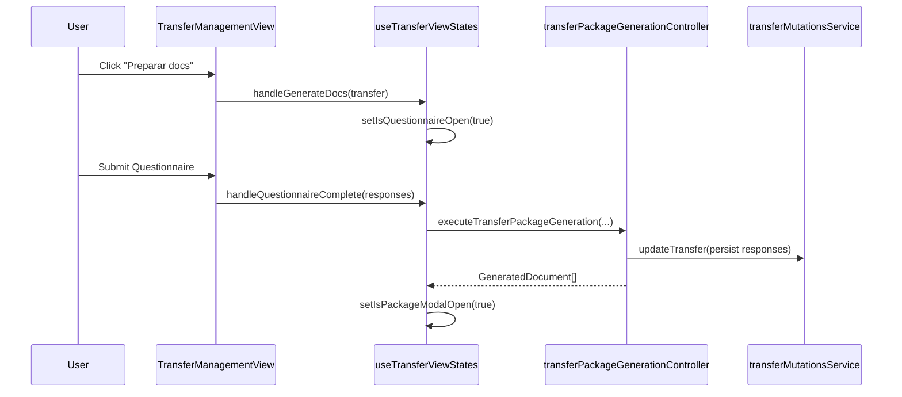

# Transfer Management View & Controllers

# Transfer Management View & Controllers

Relevant source files

The following files were used as context for generating this wiki page:

- [src/features/transfers/README.md](src/features/transfers/README.md)
- [src/features/transfers/components/TransferManagementView.tsx](src/features/transfers/components/TransferManagementView.tsx)
- [src/features/transfers/components/controllers/transferManagementViewContracts.ts](src/features/transfers/components/controllers/transferManagementViewContracts.ts)
- [src/features/transfers/components/controllers/transferManagementViewController.ts](src/features/transfers/components/controllers/transferManagementViewController.ts)
- [src/features/transfers/components/controllers/transferPeriodSelection.ts](src/features/transfers/components/controllers/transferPeriodSelection.ts)
- [src/features/transfers/hooks/useTransferSubscriptions.ts](src/features/transfers/hooks/useTransferSubscriptions.ts)
- [src/hooks/controllers/transferManagementController.ts](src/hooks/controllers/transferManagementController.ts)
- [src/hooks/controllers/transferViewStatesController.ts](src/hooks/controllers/transferViewStatesController.ts)
- [src/hooks/useTransferManagement.ts](src/hooks/useTransferManagement.ts)
- [src/hooks/useTransferViewStates.ts](src/hooks/useTransferViewStates.ts)
- [src/services/transfers/transferFirestoreCollections.ts](src/services/transfers/transferFirestoreCollections.ts)
- [src/services/transfers/transferMutationsService.ts](src/services/transfers/transferMutationsService.ts)
- [src/services/transfers/transferQueriesService.ts](src/services/transfers/transferQueriesService.ts)
- [src/services/transfers/transferSerializationController.ts](src/services/transfers/transferSerializationController.ts)
- [src/services/transfers/transferSubscriptionsService.ts](src/services/transfers/transferSubscriptionsService.ts)
- [src/shared/transfers/transferOperationalPeriod.ts](src/shared/transfers/transferOperationalPeriod.ts)
- [src/tests/features/transfers/transferManagementViewController.test.ts](src/tests/features/transfers/transferManagementViewController.test.ts)
- [src/tests/features/transfers/transferPeriodSelection.test.ts](src/tests/features/transfers/transferPeriodSelection.test.ts)
- [src/tests/hooks/controllers/transferViewStatesController.test.ts](src/tests/hooks/controllers/transferViewStatesController.test.ts)
- [src/tests/services/transfers/transferService.queries.test.ts](src/tests/services/transfers/transferService.queries.test.ts)

The Transfer Management module provides a clinical log for patient transfer requests, covering the lifecycle from initial request to effective transfer or cancellation. It serves as an operational nursing log for real-time tracking, distinct from the administrative census movements [src/features/transfers/README.md:1-14]().

## Architectural Overview

The module follows a controller-view pattern where complex UI logic is extracted into pure controller functions, and state management is handled by specialized hooks.

### Component & Controller Relationship

| Code Entity                        | Responsibility                                                                                                                                                       |
| :--------------------------------- | :------------------------------------------------------------------------------------------------------------------------------------------------------------------- |
| `TransferManagementView`           | Main entry point; orchestrates modals and layout [src/features/transfers/components/TransferManagementView.tsx:43-113]().                                            |
| `transferManagementViewController` | Builds view models for the shell, period selectors, and table bindings [src/features/transfers/components/controllers/transferManagementViewController.ts:67-158](). |
| `useTransferViewStates`            | Manages the complex modal state machine (Form, Status, Package, Questionnaire) [src/hooks/useTransferViewStates.ts:20-42]().                                         |
| `useTransferManagement`            | Facade hook connecting the UI to persistence and global record context [src/hooks/useTransferManagement.ts:47-101]().                                                |

### Data Flow Diagram: Transfer Request Lifecycle

This diagram illustrates how a transfer request moves through the system, from user interaction to Firestore persistence.

**Transfer State Flow**

Sources: [src/features/transfers/components/TransferManagementView.tsx:43-113](), [src/hooks/useTransferViewStates.ts:108-115](), [src/services/transfers/transferMutationsService.ts:53-73](), [src/services/transfers/transferSubscriptionsService.ts:24-35]().

## Period Management & Visibility

Transfers are scoped to operational months. A request created in March remains visible in the March view even if it is not closed [src/features/transfers/README.md:25-28]().

### Period Filtering Logic

The `buildTransferManagementPeriodModel` function calculates which transfers to display based on the selected year and month [src/features/transfers/components/controllers/transferManagementViewController.ts:67-108]().

- **Active Transfers**: Visible if the `requestDate` falls within the selected month [src/features/transfers/components/controllers/transferPeriodSelection.ts:49-52]().
- **Finalized Transfers**: Visible if either the `requestDate` is in the period OR the last status update (e.g., `TRANSFERRED`, `CANCELLED`) occurred within that period [src/features/transfers/components/controllers/transferPeriodSelection.ts:55-60]().

Sources: [src/features/transfers/components/controllers/transferManagementViewController.ts:67-108](), [src/features/transfers/components/controllers/transferPeriodSelection.ts:32-61]().

## Document Package Management

The system supports generating a "Document Package" specifically for transfers to **Hospital Salvador**. This involves a multi-step workflow managed by `useTransferViewStates` [src/hooks/useTransferViewStates.ts:49-91]().

### Workflow Steps:

1.  **Workflow Resolution**: `resolveTransferDocumentWorkflowPlan` determines if a hospital supports documents [src/hooks/useTransferViewStates.ts:158-161]().
2.  **Questionnaire**: If required, `TransferQuestionnaireModal` collects clinical data [src/hooks/useTransferViewStates.ts:185-193]().
3.  **Generation**: `executeTransferPackageGeneration` creates the DOCX/Excel files and caches them in `generatedPackageCacheRef` [src/hooks/useTransferViewStates.ts:59-67]().
4.  **Display**: `TransferDocumentPackageModal` presents the generated files for download [src/hooks/useTransferViewStates.ts:85]().

**Document Generation Logic**

Sources: [src/hooks/useTransferViewStates.ts:49-91](), [src/hooks/useTransferViewStates.ts:156-178](), [src/hooks/useTransferViewStates.ts:185-193]().

## Key Controllers

### `transferTableController`

Defines the status groups used for UI segmentation [src/features/transfers/components/controllers/transferTableController.ts]():

- **Active**: `REQUESTED`, `RECEIVED`, `ACCEPTED`.
- **Finalized**: `TRANSFERRED`, `REJECTED`, `CANCELLED`, `NO_RESPONSE`.

### `transferFormController`

Handles the logic for the `TransferFormModal`. It is responsible for:

- Mapping `DailyRecord` patient data into the transfer request [src/features/transfers/components/controllers/transferManagementViewController.ts:223-240]().
- Validating the `TransferFormData` payload before submission [src/features/transfers/README.md:114-117]().

### `transferNotesController`

Manages inline editing of clinical notes within the `TransferTable`. It isolates the permission logic (who can edit notes) and the update cycle to prevent full table re-renders [src/features/transfers/README.md:104-107]().

## Service Layer Integration

The view interacts with Firestore through specialized services:

- **`transferQueriesService`**: Provides methods for fetching active transfers, lookups by Bed ID, or lookups by Patient RUT [src/services/transfers/transferQueriesService.ts:22-115]().
- **`transferMutationsService`**: Handles atomic writes. When a transfer is marked as `TRANSFERRED`, it moves the document from the `transfers` collection to `transferHistory` [src/services/transfers/transferMutationsService.ts:178-201]().
- **`transferSubscriptionsService`**: Manages real-time listeners for both active and history collections, merging them into a single stream for the UI [src/services/transfers/transferSubscriptionsService.ts:24-97]().

Sources: [src/services/transfers/transferQueriesService.ts:22-115](), [src/services/transfers/transferMutationsService.ts:178-201](), [src/services/transfers/transferSubscriptionsService.ts:24-97]().

---
