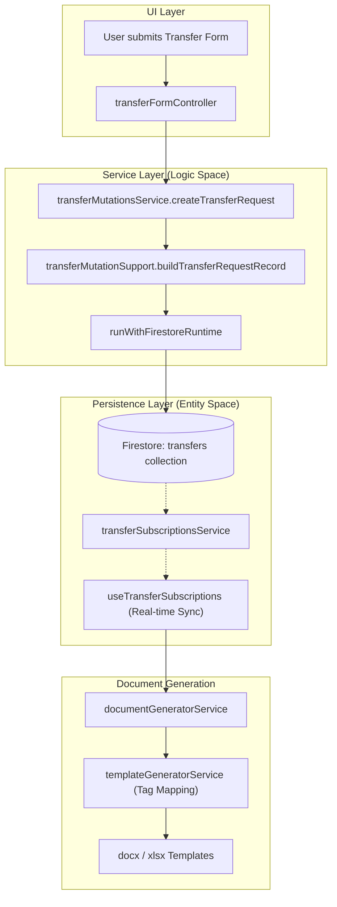
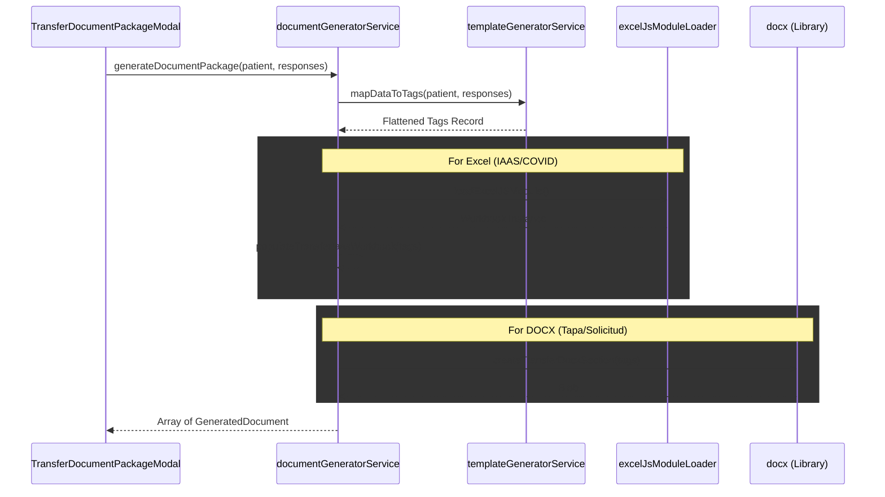

# Transfer Service Layer & Document Generation

# Transfer Service Layer & Document Generation

Relevant source files

The following files were used as context for generating this wiki page:

- [cors.json](cors.json)
- [netlify/functions/fhir-api.ts](netlify/functions/fhir-api.ts)
- [netlify/functions/firebase-config.js](netlify/functions/firebase-config.js)
- [netlify/functions/lib/firebase-server.ts](netlify/functions/lib/firebase-server.ts)
- [netlify/functions/send-census-email.ts](netlify/functions/send-census-email.ts)
- [public/sw.js](public/sw.js)
- [src/features/transfers/README.md](src/features/transfers/README.md)
- [src/features/transfers/components/controllers/transferPeriodSelection.ts](src/features/transfers/components/controllers/transferPeriodSelection.ts)
- [src/features/transfers/hooks/useTransferSubscriptions.ts](src/features/transfers/hooks/useTransferSubscriptions.ts)
- [src/hooks/controllers/transferManagementController.ts](src/hooks/controllers/transferManagementController.ts)
- [src/hooks/useTransferManagement.ts](src/hooks/useTransferManagement.ts)
- [src/services/exporters/excelJsModuleLoader.ts](src/services/exporters/excelJsModuleLoader.ts)
- [src/services/exporters/excelUtils.ts](src/services/exporters/excelUtils.ts)
- [src/services/transfers/documentFallbacks.ts](src/services/transfers/documentFallbacks.ts)
- [src/services/transfers/documentGeneratorService.ts](src/services/transfers/documentGeneratorService.ts)
- [src/services/transfers/templateGeneratorService.ts](src/services/transfers/templateGeneratorService.ts)
- [src/services/transfers/transferDocumentFallbackRegistry.ts](src/services/transfers/transferDocumentFallbackRegistry.ts)
- [src/services/transfers/transferFirestoreCollections.ts](src/services/transfers/transferFirestoreCollections.ts)
- [src/services/transfers/transferMutationsService.ts](src/services/transfers/transferMutationsService.ts)
- [src/services/transfers/transferQueriesService.ts](src/services/transfers/transferQueriesService.ts)
- [src/services/transfers/transferSerializationController.ts](src/services/transfers/transferSerializationController.ts)
- [src/services/transfers/transferSubscriptionsService.ts](src/services/transfers/transferSubscriptionsService.ts)
- [src/shared/transfers/transferOperationalPeriod.ts](src/shared/transfers/transferOperationalPeriod.ts)
- [src/tests/features/transfers/transferPeriodSelection.test.ts](src/tests/features/transfers/transferPeriodSelection.test.ts)
- [src/tests/netlify/fhirApi.test.ts](src/tests/netlify/fhirApi.test.ts)
- [src/tests/services/exporters/excelUtils.test.ts](src/tests/services/exporters/excelUtils.test.ts)
- [src/tests/services/transfers/templateGenerator.test.ts](src/tests/services/transfers/templateGenerator.test.ts)
- [src/tests/services/transfers/transferService.queries.test.ts](src/tests/services/transfers/transferService.queries.test.ts)
- [src/types/exceljs-browser.d.ts](src/types/exceljs-browser.d.ts)

The Transfer Service Layer provides the clinical and operational backbone for managing patient movements between health facilities. It handles the lifecycle of transfer requests (from `REQUESTED` to `TRANSFERRED`), real-time synchronization across devices, and the automated generation of complex document packages required by destination hospitals (e.g., Hospital del Salvador).

## Transfer Service Architecture

The transfer system is partitioned into specialized services to ensure scalability and maintainability, moving away from a single monolithic service towards a decoupled architecture.

### Data Flow & Logic Space

The following diagram illustrates how clinical intent (creating a transfer) moves from the UI through the service layer into Firestore.

**Diagram: Transfer Request Lifecycle (Natural Language to Code)**

**Sources:** [src/features/transfers/README.md:47-80](), [src/services/transfers/transferMutationsService.ts:50-81](), [src/services/transfers/transferSubscriptionsService.ts:21-55]()

### Key Service Components

| Component                         | Responsibility                                                                 | File Reference                                                |
| :-------------------------------- | :----------------------------------------------------------------------------- | :------------------------------------------------------------ |
| `transferMutationsService`        | Handles writes, status changes, and completion logic.                          | [src/services/transfers/transferMutationsService.ts]()        |
| `transferQueriesService`          | Manages complex lookups (by Bed ID, Patient RUT) and period-based filtering.   | [src/services/transfers/transferQueriesService.ts]()          |
| `transferSubscriptionsService`    | Orchestrates real-time Firestore listeners for active and history collections. | [src/services/transfers/transferSubscriptionsService.ts]()    |
| `transferSerializationController` | Converts Firestore raw data into domain entities and handles snapshot mapping. | [src/services/transfers/transferSerializationController.ts]() |

**Sources:** [src/features/transfers/README.md:72-81](), [src/services/transfers/transferQueriesService.ts:22-44](), [src/services/transfers/transferSubscriptionsService.ts:21-23]()

---

## Document Generation Pipeline

The system generates clinical document packages (DOCX and Excel) using a "Template-Tag" strategy. This allows the system to support specific hospital requirements (like the IAAS survey for Hospital Salvador) without hardcoding layouts in the business logic.

### Template Mapping & Tagging

The `templateGeneratorService` acts as a bridge between clinical domain data and document placeholders. It maps `TransferPatientData` and `QuestionnaireResponse` to a flat dictionary of tags.

**Mapping Logic Examples:**

- **Patient Identity:** `paciente_nombre`, `paciente_rut`, `paciente_edad`.
- **Clinical Context:** `iaas_fecha_ingreso`, `covid_sintomas_presenta`.
- **Boolean Transformation:** Converts `true/false` to "Sí/No" or "X" for checkbox placeholders (e.g., `iaas_carbapenemasas_si`).

**Sources:** [src/services/transfers/templateGeneratorService.ts:13-89](), [src/services/transfers/templateGeneratorService.ts:91-110]()

### Generation Flow

The `documentGeneratorService` orchestrates the fetching of templates and the application of data.

**Diagram: Document Generation Sequence**

**Sources:** [src/services/transfers/templateGeneratorService.ts:13-110](), [src/services/transfers/documentFallbacks.ts:42-89](), [src/services/exporters/excelJsModuleLoader.ts:82-88]()

---

## Technical Implementation Details

### Mutation Support & State Transitions

Mutations are wrapped in `runWithFirestoreRuntime` to ensure environment-aware execution. When a transfer is completed, the service performs an atomic move:

1. Builds a `completedTransferRecord`.
2. Writes to the `transferHistory` collection.
3. Deletes the document from the active `transfers` collection.

**Sources:** [src/services/transfers/transferMutationsService.ts:178-192](), [src/services/transfers/transferMutationSupport.ts:14-24]()

### Real-time Subscription Strategy

The `subscribeToTransfers` function maintains two simultaneous listeners to provide a unified view of the clinical dashboard:

- **Active Transfers:** Real-time updates for `REQUESTED`, `RECEIVED`, and `ACCEPTED` states.
- **History Transfers:** Updates for recently finalized transfers in the current operational period.

**Sources:** [src/services/transfers/transferSubscriptionsService.ts:63-85](), [src/features/transfers/README.md:18-37]()

### Excel and DOCX Handling

- **ExcelJS Loader:** Uses a dynamic loader (`loadExcelJSModule`) to handle both browser environments (via runtime assets) and Node.js environments (for testing/server-side).
- **Docx Generation:** Utilizes `docx` library with a custom factory (`transferDocxSectionFactory`) to create standardized headers and patient identification tables.

**Sources:** [src/services/exporters/excelJsModuleLoader.ts:29-81](), [src/services/transfers/documentFallbacks.ts:46-88]()

### Integration with Census

While transfers are managed in this module for real-time tracking, the system ensures data integrity with the Daily Census. If a movement is registered in the Census without a prior transfer request, the system automatically creates and finalizes a `TRANSFERRED` record to maintain the operational log.

**Sources:** [src/features/transfers/README.md:39-44]()

---
