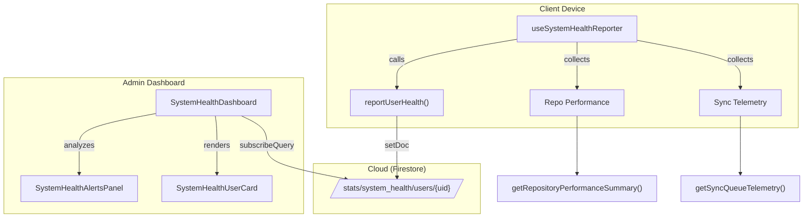
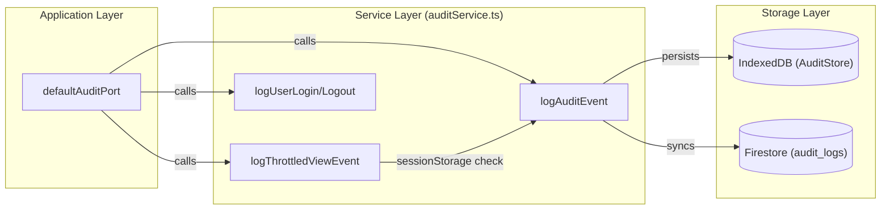

# Admin, Analytics & Observability

# Admin, Analytics & Observability

Relevant source files

The following files were used as context for generating this wiki page:

- [functions/lib/minsal/minsalEpisodeTracker.js](functions/lib/minsal/minsalEpisodeTracker.js)
- [functions/lib/minsal/minsalSpecialty.js](functions/lib/minsal/minsalSpecialty.js)
- [functions/lib/minsal/minsalStatsCalculator.js](functions/lib/minsal/minsalStatsCalculator.js)
- [scripts/check-source-any.mjs](scripts/check-source-any.mjs)
- [src/application/ports/auditPort.ts](src/application/ports/auditPort.ts)
- [src/features/admin/components/SystemHealthDashboard.tsx](src/features/admin/components/SystemHealthDashboard.tsx)
- [src/features/admin/components/SystemHealthUserCard.tsx](src/features/admin/components/SystemHealthUserCard.tsx)
- [src/features/admin/components/systemHealthDashboardUtils.ts](src/features/admin/components/systemHealthDashboardUtils.ts)
- [src/features/admin/components/systemHealthOperationalAlerts.ts](src/features/admin/components/systemHealthOperationalAlerts.ts)
- [src/features/admin/components/systemHealthStatusPolicy.ts](src/features/admin/components/systemHealthStatusPolicy.ts)
- [src/features/analytics/components/AnalyticsView.tsx](src/features/analytics/components/AnalyticsView.tsx)
- [src/hooks/admin/useSystemHealthReporter.ts](src/hooks/admin/useSystemHealthReporter.ts)
- [src/hooks/controllers/systemHealthReporterController.ts](src/hooks/controllers/systemHealthReporterController.ts)
- [src/services/admin/README.md](src/services/admin/README.md)
- [src/services/admin/admissionDateBackfillPlanner.ts](src/services/admin/admissionDateBackfillPlanner.ts)
- [src/services/admin/admissionDateBackfillService.ts](src/services/admin/admissionDateBackfillService.ts)
- [src/services/admin/admissionDateBackfillTypes.ts](src/services/admin/admissionDateBackfillTypes.ts)
- [src/services/admin/auditService.ts](src/services/admin/auditService.ts)
- [src/services/admin/healthService.ts](src/services/admin/healthService.ts)
- [src/services/calculations/minsal/README.md](src/services/calculations/minsal/README.md)
- [src/services/calculations/minsal/calculator.ts](src/services/calculations/minsal/calculator.ts)
- [src/services/calculations/minsal/episodeTracker.ts](src/services/calculations/minsal/episodeTracker.ts)
- [src/services/calculations/minsal/traceability.ts](src/services/calculations/minsal/traceability.ts)
- [src/services/email/emailRecipientListSupport.ts](src/services/email/emailRecipientListSupport.ts)
- [src/services/observability/operationalTelemetryService.ts](src/services/observability/operationalTelemetryService.ts)
- [src/services/repositories/ports/repositoryAuditPort.ts](src/services/repositories/ports/repositoryAuditPort.ts)
- [src/tests/application/ports/auditPort.test.ts](src/tests/application/ports/auditPort.test.ts)
- [src/tests/features/admin/systemHealthDashboardUtils.test.ts](src/tests/features/admin/systemHealthDashboardUtils.test.ts)
- [src/tests/features/admin/systemHealthOperationalAlerts.test.ts](src/tests/features/admin/systemHealthOperationalAlerts.test.ts)
- [src/tests/features/admin/systemHealthStatusPolicy.test.ts](src/tests/features/admin/systemHealthStatusPolicy.test.ts)
- [src/tests/features/analytics/SpecialtyBreakdownTable.test.tsx](src/tests/features/analytics/SpecialtyBreakdownTable.test.tsx)
- [src/tests/functions/minsalStatsCalculator.test.ts](src/tests/functions/minsalStatsCalculator.test.ts)
- [src/tests/hooks/controllers/systemHealthReporterController.test.ts](src/tests/hooks/controllers/systemHealthReporterController.test.ts)
- [src/tests/hooks/useBedOperations.test.ts](src/tests/hooks/useBedOperations.test.ts)
- [src/tests/integration/admissionEpisodeConsistency.test.ts](src/tests/integration/admissionEpisodeConsistency.test.ts)
- [src/tests/integration/audit-flow.test.ts](src/tests/integration/audit-flow.test.ts)
- [src/tests/services/admin/healthService.test.ts](src/tests/services/admin/healthService.test.ts)
- [src/tests/services/auditService.test.ts](src/tests/services/auditService.test.ts)
- [src/tests/services/auditServiceCoverage.test.ts](src/tests/services/auditServiceCoverage.test.ts)
- [src/tests/services/repositories/repositoryAuditPort.test.ts](src/tests/services/repositories/repositoryAuditPort.test.ts)
- [src/types/minsalTypes.ts](src/types/minsalTypes.ts)

The **Admin, Analytics & Observability** module provides the infrastructure required to monitor system health, track clinical indicators for the Ministry of Health (MINSAL), and maintain a tamper-evident audit trail of user actions. It bridges the gap between clinical operations and technical oversight by exposing real-time telemetry from the offline-first sync engine and generating high-fidelity statistics from distributed `DailyRecord` data.

## System Health & Operational Telemetry

The system employs a background reporting mechanism that periodically snapshots the client's operational state. This telemetry is aggregated in the **System Health Dashboard**, allowing administrators to monitor the health of the distributed fleet of devices, specifically focusing on synchronization lag and local persistence integrity.

- **Telemetry Collection**: The `useSystemHealthReporter` hook runs every 2 minutes [src/hooks/admin/useSystemHealthReporter.ts:19-19](), collecting metrics including pending mutations, failed sync tasks, oldest pending task age, and repository performance [src/hooks/admin/useSystemHealthReporter.ts:44-101]().
- **Health Policy**: The `evaluateSystemHealthState` function applies thresholds (e.g., `warningPendingMutations`, `criticalOldestPendingAgeMs`) to categorize clients as `SALUDABLE`, `ADVERTENCIA`, or `CRITICO` [src/features/admin/components/systemHealthStatusPolicy.ts:17-58]().
- **Real-time Monitoring**: The `SystemHealthDashboard` uses `subscribeToSystemHealth` to provide a live view of all active users and their device status [src/features/admin/components/SystemHealthDashboard.tsx:20-23]().

### Telemetry Data Flow

The following diagram illustrates how local operational metrics are promoted to the administrative dashboard.

**Operational Telemetry to Admin Dashboard**

Sources: [src/hooks/admin/useSystemHealthReporter.ts:44-101](), [src/services/admin/healthService.ts:24-37](), [src/features/admin/components/SystemHealthDashboard.tsx:14-35]()

For details on sync resilience and health thresholds, see [System Health Dashboard](#11.1).

## MINSAL Analytics & Statistics

The analytics engine calculates hospital indicators following the **DEIS (Departamento de Estadísticas e Información de Salud)** standards. It processes the history of patient movements to derive KPIs such as occupancy rates, average length of stay, and mortality.

- **KPI Calculation**: The system calculates `diasCamaOcupados` (Occupied bed-days), `tasaOcupacion` (Occupancy rate), and `promedioDiasEstada` (Average stay) [src/types/minsalTypes.ts:109-142]().
- **Specialty Breakdown**: Statistics are segmented by medical specialty, tracking discharges, deaths, and relative contribution to bed-day usage [src/types/minsalTypes.ts:46-78]().
- **Data Aggregation**: The `useMinsalStats` hook orchestrates the retrieval and calculation of these metrics for various date range presets (e.g., `lastMonth`, `yearToDate`) [src/features/analytics/components/AnalyticsView.tsx:27-38]().

For details on the calculation logic and backfill services, see [MINSAL Analytics & Statistics](#11.2).

## Audit Trail

The audit system provides a comprehensive log of all clinical and administrative actions. It utilizes a dual-storage strategy: logging to Firestore for centralized review and IndexedDB for offline resilience.

- **Event Capture**: The `defaultAuditPort` exposes methods like `logPatientAdmission`, `logPatientDischarge`, and `logPatientTransfer` [src/application/ports/auditPort.ts:55-102]().
- **Privacy & Security**: Sensitive data like Patient RUTs are masked before being saved to the log (e.g., `12345678-9` becomes `12345***-*`) [src/tests/services/auditService.test.ts:103-105]().
- **Throttling**: High-frequency events like `VIEW_PATIENT` are throttled via `logThrottledViewEvent` to prevent log flooding [src/services/admin/auditService.ts:74-74]().
- **Institutional Filtering**: Certain shared accounts (e.g., `hospitalizados@hospitalhangaroa.cl`) are excluded from view-event logging to maintain focus on individual accountability [src/tests/integration/audit-flow.test.ts:103-117]().

### Audit System Architecture

The diagram below maps the audit port to the underlying service implementation.

**Audit Port to Service Mapping**

Sources: [src/application/ports/auditPort.ts:55-102](), [src/services/admin/auditService.ts:24-37](), [src/tests/services/auditServiceCoverage.test.ts:72-91]()

For details on the audit log UI and actor policies, see [Audit Trail](#11.3).

## Subsystems Reference

| Subsystem         | Primary Code Entities                      | Responsibility                                        |
| :---------------- | :----------------------------------------- | :---------------------------------------------------- |
| **System Health** | `healthService`, `useSystemHealthReporter` | Monitoring device sync state and persistence health.  |
| **Analytics**     | `AnalyticsView`, `minsalStatsCalculator`   | Generating DEIS-compliant hospital statistics.        |
| **Audit Trail**   | `auditPort`, `auditService`, `AuditTable`  | Tracking user actions and patient data access.        |
| **Observability** | `operationalTelemetryService`              | Recording low-level operational failures and retries. |

---

**Child Pages:**

- [System Health Dashboard](#11.1)
- [MINSAL Analytics & Statistics](#11.2)
- [Audit Trail](#11.3)

---
