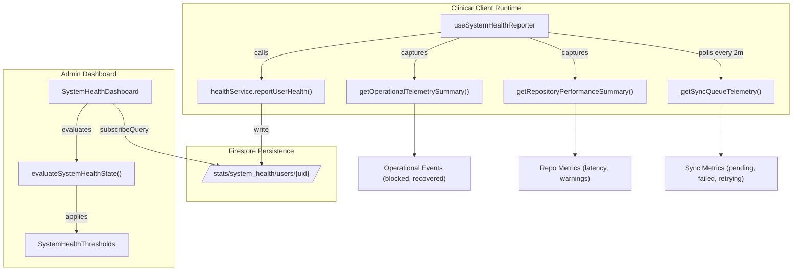
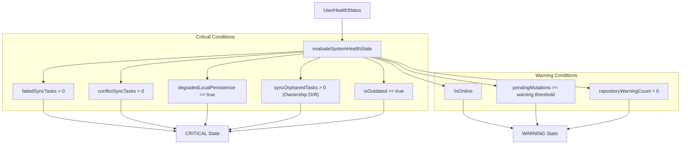

# System Health Dashboard

# System Health Dashboard

Relevant source files

The following files were used as context for generating this wiki page:

- [src/features/admin/components/SystemHealthDashboard.tsx](src/features/admin/components/SystemHealthDashboard.tsx)
- [src/features/admin/components/SystemHealthUserCard.tsx](src/features/admin/components/SystemHealthUserCard.tsx)
- [src/features/admin/components/systemHealthDashboardUtils.ts](src/features/admin/components/systemHealthDashboardUtils.ts)
- [src/features/admin/components/systemHealthOperationalAlerts.ts](src/features/admin/components/systemHealthOperationalAlerts.ts)
- [src/features/admin/components/systemHealthStatusPolicy.ts](src/features/admin/components/systemHealthStatusPolicy.ts)
- [src/hooks/admin/useSystemHealthReporter.ts](src/hooks/admin/useSystemHealthReporter.ts)
- [src/hooks/controllers/systemHealthReporterController.ts](src/hooks/controllers/systemHealthReporterController.ts)
- [src/services/admin/healthService.ts](src/services/admin/healthService.ts)
- [src/services/observability/operationalTelemetryService.ts](src/services/observability/operationalTelemetryService.ts)
- [src/tests/features/admin/systemHealthDashboardUtils.test.ts](src/tests/features/admin/systemHealthDashboardUtils.test.ts)
- [src/tests/features/admin/systemHealthOperationalAlerts.test.ts](src/tests/features/admin/systemHealthOperationalAlerts.test.ts)
- [src/tests/features/admin/systemHealthStatusPolicy.test.ts](src/tests/features/admin/systemHealthStatusPolicy.test.ts)
- [src/tests/hooks/controllers/systemHealthReporterController.test.ts](src/tests/hooks/controllers/systemHealthReporterController.test.ts)
- [src/tests/services/admin/healthService.test.ts](src/tests/services/admin/healthService.test.ts)

The **System Health Dashboard** is a real-time observability and administrative tool designed to monitor the operational integrity of the HHR (Hospital Hanga Roa) ecosystem. It provides visibility into client-side synchronization status, IndexedDB persistence health, repository performance, and runtime contract consistency across all active clinical sessions.

## 1. System Health Data Flow

The health monitoring system operates on a decentralized reporting model where clinical clients periodically push telemetry to Firestore, and the administrative dashboard subscribes to these updates for real-time visualization.

### Telemetry Pipeline

1.  **Collection**: The `useSystemHealthReporter` hook gathers metrics from various subsystems (Sync Queue, IndexedDB, Auth, and Repositories) [src/hooks/admin/useSystemHealthReporter.ts:44-71]().
2.  **Reporting**: Data is normalized and sent to the `system_health/stats/users/{uid}` document in Firestore via `healthService.reportUserHealth` [src/services/admin/healthService.ts:24-37]().
3.  **Aggregation**: The `SystemHealthDashboard` component uses `subscribeToSystemHealth` to listen for updates from the last 50 active users [src/features/admin/components/SystemHealthDashboard.tsx:19-25]().
4.  **Evaluation**: Each user's status is processed through the `systemHealthStatusPolicy` to determine their operational health level (Healthy, Warning, or Critical) [src/features/admin/components/systemHealthStatusPolicy.ts:17-20]().

### Code Entity Space: Data Flow

The following diagram maps clinical runtime entities to the administrative monitoring entities.

Sources: `[src/hooks/admin/useSystemHealthReporter.ts:19-105]()`, `[src/services/admin/healthService.ts:24-51]()`, `[src/features/admin/components/systemHealthStatusPolicy.ts:17-58]()`

## 2. Health Reporting Controller

The reporting logic is gated by user roles and runtime readiness. Only `admin` and `nurse_hospital` roles contribute to the system health telemetry to ensure data comes from primary clinical workstations [src/hooks/controllers/systemHealthReporterController.ts:33-36]().

### Key Metrics Reported

| Metric Category | Source Entity                  | Key Indicators                                                                                                                                                                  |
| :-------------- | :----------------------------- | :------------------------------------------------------------------------------------------------------------------------------------------------------------------------------ |
| **Sync Health** | `SyncQueueTelemetry`           | `pending`, `failed`, `conflict`, `retrying`, `oldestPendingAgeMs`, `syncOrphanedTasks` [src/hooks/controllers/systemHealthReporterController.ts:50-56]()                        |
| **Performance** | `RepositoryPerformanceSummary` | `warningCount`, `slowestOperationMs` [src/hooks/controllers/systemHealthReporterController.ts:61-62]()                                                                          |
| **Operational** | `OperationalTelemetrySummary`  | `recentFailedCount`, `blockedCount`, `syncReadUnavailableCount`, `authBootstrapTimeoutCount` [src/hooks/controllers/systemHealthReporterController.ts:63-84]()                  |
| **Environment** | `Navigator` / `Version`        | `isOnline`, `isOutdated`, `platform`, `appVersion` (includes sync-batch and backend-contract versions) [src/hooks/controllers/systemHealthReporterController.ts:48-49, 90-92]() |

Sources: `[src/hooks/controllers/systemHealthReporterController.ts:33-93]()`, `[src/hooks/admin/useSystemHealthReporter.ts:44-101]()`

## 3. Health Status Policy & Thresholds

The `systemHealthStatusPolicy` evaluates a `UserHealthStatus` against `SystemHealthThresholds` to assign a severity level.

### Threshold Configuration (`SystemHealthThresholds`)

The system uses the following critical thresholds to trigger alerts:

- **Pending Mutations**: Warning at 10, Critical at 50 [src/features/admin/components/systemHealthStatusPolicy.ts:34-35, 49-50]().
- **Oldest Pending Age**: Warning at 5 minutes, Critical at 15 minutes [src/features/admin/components/systemHealthStatusPolicy.ts:32-33, 47-48]().
- **Sync Failures**: Any value > 0 triggers **Critical** status [src/features/admin/components/systemHealthStatusPolicy.ts:27, 45]().
- **Retrying Tasks**: Warning at 5, Critical at 20 [src/features/admin/components/systemHealthStatusPolicy.ts:30-31, 47]().

### Logic: Code Entity Mapping

Sources: `[src/features/admin/components/systemHealthStatusPolicy.ts:17-100]()`, `[src/tests/features/admin/systemHealthStatusPolicy.test.ts:51-116]()`

## 4. Operational Alerts & Sync Resilience

The dashboard includes a `SystemHealthAlertsPanel` that aggregates issues across the entire fleet of users into actionable alerts [src/features/admin/components/SystemHealthDashboard.tsx:33]().

### Sync Resilience Runbook

When a **Critical** alert is triggered (e.g., `failed-sync`, `sync-ownership-drift`, or `stale-queue`), the dashboard provides recommended actions based on the `OperationalAlert` definition:

1.  **Ownership Drift (`sync-ownership-drift`)**: Occurs when a client has tasks in the outbox that do not belong to the current session user. **Action**: Force manual logout and local cleanup [src/features/admin/components/systemHealthOperationalAlerts.ts:164-172]().
2.  **Stale Queue (`stale-queue`)**: Triggered when the oldest pending mutation exceeds 15 minutes. **Action**: Validate network connectivity and request manual retry [src/features/admin/components/systemHealthOperationalAlerts.ts:136-148]().
3.  **Runtime Mismatch (`runtime-contract-mismatch`)**: Frontend/Backend versions are incompatible. **Action**: Immediate browser reload [src/features/admin/components/systemHealthOperationalAlerts.ts:178-186]().
4.  **Sync Unreadable (`sync-runtime-unavailable`)**: Telemetry from IndexedDB is blocked. **Action**: Inspect local IndexedDB state before continuing [src/features/admin/components/systemHealthOperationalAlerts.ts:150-162]().

### Alert Aggregation

The `buildOperationalAlerts` function groups users by failure type:

- `failedSyncUsers`: Users with `failedSyncTasks > 0` [src/features/admin/components/systemHealthOperationalAlerts.ts:60]().
- `prolongedOfflineUsers`: Users offline for more than `PROLONGED_OFFLINE_USER_AGE_MS` [src/features/admin/components/systemHealthOperationalAlerts.ts:86-90]().
- `recoveredNullRealtimeUsers`: Detects data integrity issues where a `DailyRecord` was recovered as `null` during a sync [src/features/admin/components/systemHealthOperationalAlerts.ts:67-69]().

Sources: `[src/features/admin/components/systemHealthOperationalAlerts.ts:50-186]()`, `[src/features/admin/components/systemHealthDashboardUtils.ts:39-113]()`

## 5. Operational Telemetry Service

The `operationalTelemetryService` acts as the underlying engine for recording client-side events that don't necessarily crash the app but indicate degraded performance or transient failures.

- **Observed Categories**: Tracks events in `sync`, `indexeddb`, `clinical_document`, `handoff`, and `backup` [src/features/admin/components/systemHealthDashboardUtils.ts:81-85]().
- **Outcome Recording**: Captures whether operations were `blocked`, `recovered`, or `unauthorized` [src/features/admin/components/systemHealthDashboardUtils.ts:75-79]().
- **Incident Summary**: The dashboard summarizes these in the "Incidentes runtime" card, specifically tracking `Auth timeout` and `IndexedDB fallback` counts [src/features/admin/components/systemHealthDashboardUtils.ts:87-98]().

Sources: `[src/services/observability/operationalTelemetryService.ts:1-3]()`, `[src/hooks/controllers/systemHealthReporterController.ts:63-89]()`, `[src/features/admin/components/systemHealthDashboardUtils.ts:75-113]()`

---
