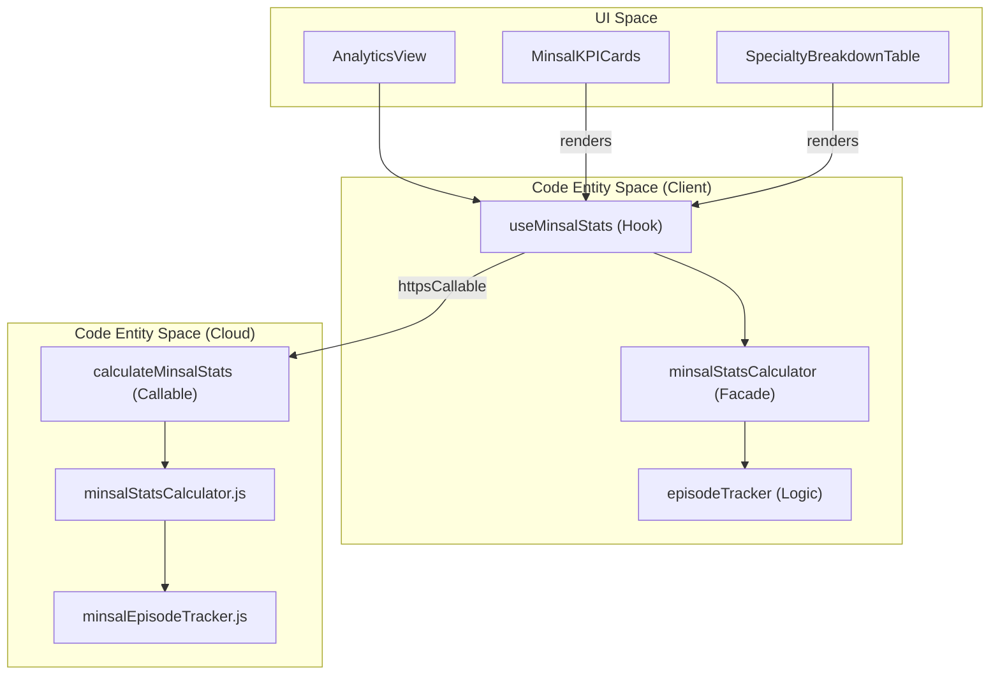
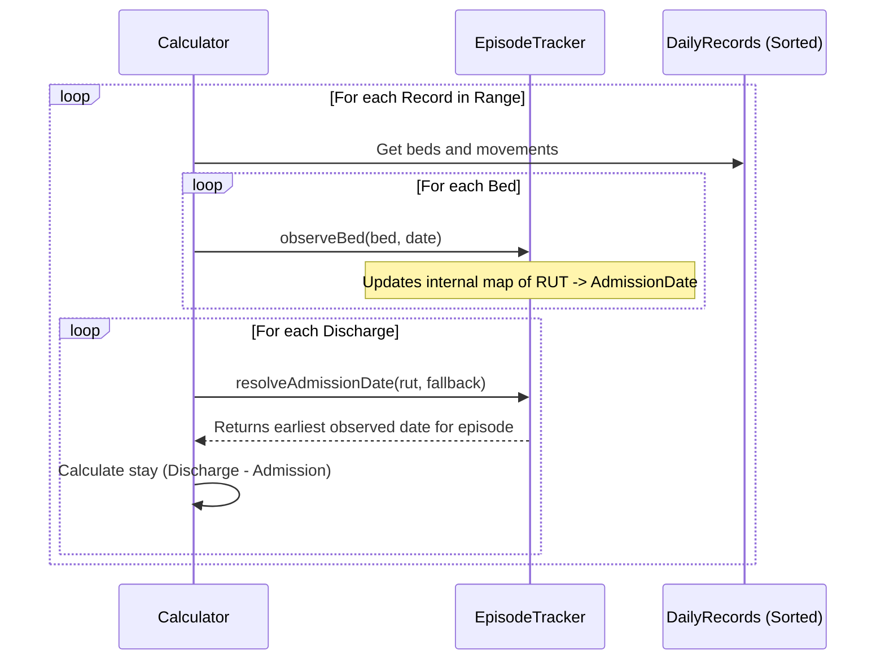

# MINSAL Analytics & Statistics

# MINSAL Analytics & Statistics

Relevant source files

The following files were used as context for generating this wiki page:

- [functions/lib/minsal/minsalEpisodeTracker.js](functions/lib/minsal/minsalEpisodeTracker.js)
- [functions/lib/minsal/minsalSpecialty.js](functions/lib/minsal/minsalSpecialty.js)
- [functions/lib/minsal/minsalStatsCalculator.js](functions/lib/minsal/minsalStatsCalculator.js)
- [src/config/queryClient.ts](src/config/queryClient.ts)
- [src/constants/firestorePaths.ts](src/constants/firestorePaths.ts)
- [src/features/analytics/components/AnalyticsView.tsx](src/features/analytics/components/AnalyticsView.tsx)
- [src/hooks/controllers/minsalStatsPresentationController.ts](src/hooks/controllers/minsalStatsPresentationController.ts)
- [src/hooks/useExcelParser.ts](src/hooks/useExcelParser.ts)
- [src/hooks/useExistingDays.ts](src/hooks/useExistingDays.ts)
- [src/hooks/useExistingDaysQuery.ts](src/hooks/useExistingDaysQuery.ts)
- [src/hooks/useMinsalStats.ts](src/hooks/useMinsalStats.ts)
- [src/services/ExcelParsingService.ts](src/services/ExcelParsingService.ts)
- [src/services/admin/README.md](src/services/admin/README.md)
- [src/services/admin/admissionDateBackfillPlanner.ts](src/services/admin/admissionDateBackfillPlanner.ts)
- [src/services/admin/admissionDateBackfillService.ts](src/services/admin/admissionDateBackfillService.ts)
- [src/services/admin/admissionDateBackfillTypes.ts](src/services/admin/admissionDateBackfillTypes.ts)
- [src/services/calculations/minsal/README.md](src/services/calculations/minsal/README.md)
- [src/services/calculations/minsal/calculator.ts](src/services/calculations/minsal/calculator.ts)
- [src/services/calculations/minsal/episodeTracker.ts](src/services/calculations/minsal/episodeTracker.ts)
- [src/services/calculations/minsal/traceability.ts](src/services/calculations/minsal/traceability.ts)
- [src/services/calculations/minsalStatsCalculator.ts](src/services/calculations/minsalStatsCalculator.ts)
- [src/services/email/emailRecipientListSupport.ts](src/services/email/emailRecipientListSupport.ts)
- [src/services/storage/indexeddb/indexedDbRecordEvents.ts](src/services/storage/indexeddb/indexedDbRecordEvents.ts)
- [src/tests/features/analytics/MinsalKPICards.test.tsx](src/tests/features/analytics/MinsalKPICards.test.tsx)
- [src/tests/features/analytics/SpecialtyBreakdownTable.test.tsx](src/tests/features/analytics/SpecialtyBreakdownTable.test.tsx)
- [src/tests/functions/minsalStatsCalculator.test.ts](src/tests/functions/minsalStatsCalculator.test.ts)
- [src/tests/hooks/controllers/minsalStatsPresentationController.test.ts](src/tests/hooks/controllers/minsalStatsPresentationController.test.ts)
- [src/tests/hooks/useExistingDaysQuery.test.tsx](src/tests/hooks/useExistingDaysQuery.test.tsx)
- [src/tests/hooks/useMinsalStats.test.tsx](src/tests/hooks/useMinsalStats.test.tsx)
- [src/tests/integration/admissionEpisodeConsistency.test.ts](src/tests/integration/admissionEpisodeConsistency.test.ts)
- [src/types/minsalTypes.ts](src/types/minsalTypes.ts)

The **MINSAL Analytics & Statistics** module provides a comprehensive dashboard for hospital performance indicators, adhering to the standards set by the Chilean Ministry of Health (MINSAL) and the Department of Health Statistics and Information (DEIS). It calculates clinical KPIs such as occupancy rates, average length of stay (ALOS), and mortality, with high-fidelity traceability back to individual patient episodes.

## Data Flow & Architecture

The system utilizes a dual-calculation strategy: local calculation for immediate feedback and remote Cloud Function execution for heavy processing or cross-record analysis.

### Analytics Data Flow

1.  **Request**: `AnalyticsView` [src/features/analytics/components/AnalyticsView.tsx:24-38]() invokes `useMinsalStats`.
2.  **Local Hydration**: `useMinsalStats` fetches `DailyRecord` entities from IndexedDB via `fetchRecordsRangeSorted` [src/hooks/useMinsalStats.ts:110]().
3.  **Remote Fetch**: Simultaneously, it triggers a Firebase Callable function `calculateMinsalStats` [src/hooks/useMinsalStats.ts:132-138]() to retrieve server-side calculated statistics.
4.  **Reconciliation**: `resolveDisplayedMinsalStats` merges local and remote data, prioritizing remote stats while using local ones as a fallback [src/hooks/useMinsalStats.ts:167-172]().
5.  **Reactive Updates**: The UI listens for `DAILY_RECORD_STORE_CHANGED_EVENT` to invalidate queries if data within the selected range changes [src/hooks/useMinsalStats.ts:91-105]().

### System Entity Mapping

The following diagram bridges the UI components to the underlying calculation logic.

**Analytics Logic Mapping**

Sources: [src/features/analytics/components/AnalyticsView.tsx:8-15](), [src/hooks/useMinsalStats.ts:6-26](), [functions/lib/minsal/minsalStatsCalculator.js:1-12]()

## Core Statistics Calculation

Statistics are calculated based on the `MinsalStatistics` interface [src/types/minsalTypes.ts:98-185](). Key formulas implemented in both `minsalStatsCalculator.ts` and `minsalStatsCalculator.js` include:

| Indicator                 | Formula / Logic                                                               | Code Reference                                             |
| :------------------------ | :---------------------------------------------------------------------------- | :--------------------------------------------------------- |
| **Días Cama Disponibles** | $\sum (\text{Hospital Capacity} - \text{Blocked Beds})$                       | [src/services/calculations/minsal/calculator.ts:146-147]() |
| **Días Cama Ocupados**    | $\sum (\text{Occupied Beds per day})$                                         | [src/services/calculations/minsal/calculator.ts:147]()     |
| **Tasa de Ocupación**     | $(\text{Ocupados} / \text{Disponibles}) \times 100$                           | [src/types/minsalTypes.ts:125-129]()                       |
| **Promedio Días Estada**  | $\sum (\text{Discharge Date} - \text{Admission Date}) / \text{Total Egresos}$ | [functions/lib/minsal/minsalStatsCalculator.js:41-53]()    |
| **Mortalidad**            | $(\text{Fallecidos} / \text{Egresos Totales}) \times 100$                     | [src/types/minsalTypes.ts:155-159]()                       |

### Episode Tracking Logic

To accurately calculate the Average Length of Stay (ALOS), the system uses `minsalEpisodeTracker.js` [functions/lib/minsal/minsalEpisodeTracker.js]() to reconstruct patient journeys. It observes beds across consecutive days to resolve the "true" admission date, even if the user manually entered an incorrect one in a specific daily record [functions/lib/minsal/minsalStatsCalculator.js:113-115]().

**Episode Reconstruction Flow**

Sources: [functions/lib/minsal/minsalStatsCalculator.js:98-120](), [src/services/calculations/minsal/calculator.ts:73-74]()

## Data Integrity Services

### Admission Date Backfill

Because historical records might contain inconsistent admission dates, the `admissionDateBackfillService` provides tools to audit and repair these records.

- **Audit**: `auditAdmissionDateBackfill` scans historical records and identifies inconsistencies [src/services/admin/admissionDateBackfillService.ts:24-43]().
- **Apply**: `applyAdmissionDateBackfill` iterates through the generated plan and updates `DailyRecord` entities with corrected dates [src/services/admin/admissionDateBackfillService.ts:65-89]().

### Specialty Normalization

The system normalizes diverse clinical entries into standard MINSAL specialties (e.g., mapping various obstetric terms to "Ginecobstetricia") using `normalizeSpecialty` [src/services/calculations/minsal/normalization.ts:5]().

## UI Components

### AnalyticsView

The primary container [src/features/analytics/components/AnalyticsView.tsx]() which manages the state for:

- **Date Range Selection**: Supports presets like `lastMonth`, `yearToDate`, and custom ranges [src/features/analytics/components/AnalyticsView.tsx:127-135]().
- **KPI Cards**: Displays high-level summaries using `MinsalKPICards` [src/features/analytics/components/AnalyticsView.tsx:155]().
- **Visualizations**: Includes `OccupancyTrendChart` for temporal analysis [src/features/analytics/components/AnalyticsView.tsx:165]().
- **Export**: Triggers `minsalExcelExporter` to generate DEIS-compliant Excel workbooks [src/features/analytics/components/AnalyticsView.tsx:40-56]().

### SpecialtyBreakdownTable

Renders a detailed grid of indicators per medical specialty, including `egresos`, `diasOcupados`, and `tasaMortalidad` [src/types/minsalTypes.ts:46-77](). It provides traceability lists that allow users to see exactly which patients contributed to a specific metric [src/types/minsalTypes.ts:79-92]().

Sources: [src/features/analytics/components/AnalyticsView.tsx:1-124](), [src/hooks/useMinsalStats.ts:62-185](), [src/services/admin/admissionDateBackfillService.ts:1-153](), [functions/lib/minsal/minsalStatsCalculator.js:69-210]()

---
