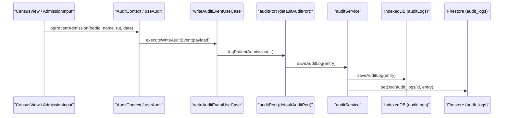
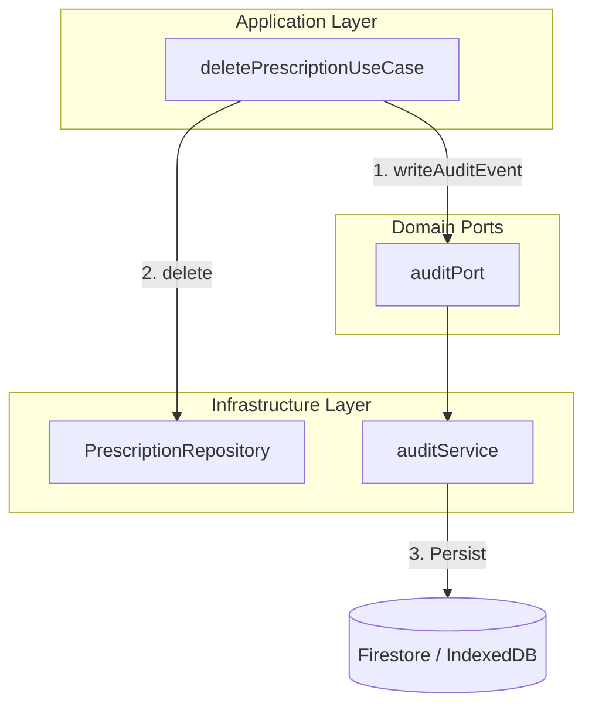

# Audit Trail

# Audit Trail

Relevant source files

The following files were used as context for generating this wiki page:

- [scripts/check-source-any.mjs](scripts/check-source-any.mjs)
- [scripts/config/compatibility-governance.json](scripts/config/compatibility-governance.json)
- [src/application/audit/auditActorPolicy.ts](src/application/audit/auditActorPolicy.ts)
- [src/application/ports/auditPort.ts](src/application/ports/auditPort.ts)
- [src/application/prescriptions/deletePrescriptionUseCase.ts](src/application/prescriptions/deletePrescriptionUseCase.ts)
- [src/context/AuditContext.tsx](src/context/AuditContext.tsx)
- [src/features/admin/components/internal/audit/auditUIUtils.ts](src/features/admin/components/internal/audit/auditUIUtils.ts)
- [src/hooks/controllers/useHandoffAuditLoggers.ts](src/hooks/controllers/useHandoffAuditLoggers.ts)
- [src/hooks/useAudit.ts](src/hooks/useAudit.ts)
- [src/services/admin/auditConstants.ts](src/services/admin/auditConstants.ts)
- [src/services/admin/auditService.ts](src/services/admin/auditService.ts)
- [src/services/admin/utils/auditSummaryGenerator.ts](src/services/admin/utils/auditSummaryGenerator.ts)
- [src/services/repositories/ports/repositoryAuditPort.ts](src/services/repositories/ports/repositoryAuditPort.ts)
- [src/tests/application/audit/auditActorPolicy.test.ts](src/tests/application/audit/auditActorPolicy.test.ts)
- [src/tests/application/ports/auditPort.test.ts](src/tests/application/ports/auditPort.test.ts)
- [src/tests/application/prescriptions/prescriptionUseCases.test.ts](src/tests/application/prescriptions/prescriptionUseCases.test.ts)
- [src/tests/build/testSetupConsoleNoiseFilter.test.ts](src/tests/build/testSetupConsoleNoiseFilter.test.ts)
- [src/tests/hooks/useAudit.handoff.test.ts](src/tests/hooks/useAudit.handoff.test.ts)
- [src/tests/hooks/useAudit.test.ts](src/tests/hooks/useAudit.test.ts)
- [src/tests/hooks/useBedOperations.test.ts](src/tests/hooks/useBedOperations.test.ts)
- [src/tests/integration/audit-flow.test.ts](src/tests/integration/audit-flow.test.ts)
- [src/tests/services/admin/admissionDateBackfillService.test.ts](src/tests/services/admin/admissionDateBackfillService.test.ts)
- [src/tests/services/admin/utils/auditSummaryGenerator.test.ts](src/tests/services/admin/utils/auditSummaryGenerator.test.ts)
- [src/tests/services/auditLegacyDomainService.test.ts](src/tests/services/auditLegacyDomainService.test.ts)
- [src/tests/services/auditService.test.ts](src/tests/services/auditService.test.ts)
- [src/tests/services/auditServiceCoverage.test.ts](src/tests/services/auditServiceCoverage.test.ts)
- [src/tests/services/repositories/repositoryAuditPort.test.ts](src/tests/services/repositories/repositoryAuditPort.test.ts)
- [src/tests/setup.ts](src/tests/setup.ts)
- [src/tests/types/audit.test.ts](src/tests/types/audit.test.ts)
- [src/types/audit.ts](src/types/audit.ts)
- [src/types/auditActionTypes.ts](src/types/auditActionTypes.ts)
- [src/types/auditLogTypes.ts](src/types/auditLogTypes.ts)

The Audit Trail system provides a comprehensive, traceable record of all clinical and administrative actions within the HHR ServicioHospitalizados platform. It implements a dual-persistence strategy (Local IndexedDB + Remote Firestore) to ensure traceability even during offline operations, following the system's offline-first architecture.

## Architecture Overview

The audit system is structured around a port-and-adapter pattern, decoupling the UI and business logic from the specific persistence implementation.

### Code Entity Space Mapping

| System Concept       | Code Entity           | Role                                                                                                                        |
| :------------------- | :-------------------- | :-------------------------------------------------------------------------------------------------------------------------- |
| **UI Hook**          | `useAudit`            | Provides logging functions to React components [src/hooks/useAudit.ts:172-172]().                                           |
| **Context Provider** | `AuditContext`        | Injects the current user identity into all audit logs [src/context/AuditContext.tsx:141-141]().                             |
| **Domain Port**      | `auditPort`           | Interface for system-wide clinical event logging [src/application/ports/auditPort.ts:1-1]().                                |
| **Repository Port**  | `repositoryAuditPort` | Interface for data-layer specific logging (e.g., deletions) [src/services/repositories/ports/repositoryAuditPort.ts:1-1](). |
| **Service Layer**    | `auditService`        | Orchestrates writing to local and remote storage [src/services/admin/auditService.ts:1-1]().                                |
| **Policy Engine**    | `auditActorPolicy`    | Resolves the string identifier for the person performing an action [src/application/audit/auditActorPolicy.ts:1-1]().       |

### Audit Data Flow

The following diagram illustrates how a clinical action (e.g., admitting a patient) propagates through the audit layers.

**Audit Event Propagation**

Sources: [src/hooks/useAudit.ts:176-207](), [src/context/AuditContext.tsx:147-154](), [src/services/admin/auditService.ts:72-78]()

## Core Components

### useAudit Hook & AuditContext

The `useAudit` hook is the primary interface for developers. It wraps specific use cases like `executeWriteAuditEvent` and `executeFetchAuditLogs` [src/hooks/useAudit.ts:32-33](). The `AuditContext` ensures that every log entry is automatically stamped with the current user's email or UID using the `resolveAuditActor` utility [src/context/AuditContext.tsx:15-20]().

Key capabilities include:

- **Standard Loggers**: Specialized functions for common actions like `logPatientAdmission`, `logCudyrModified`, and `logClinicalDocumentCreated` [src/hooks/useAudit.ts:52-136]().
- **Debounced Logging**: The `logDebouncedEvent` function allows merging multiple rapid changes (e.g., typing in a handoff note) into a single audit entry after a 5-minute quiet period [src/hooks/useAudit.ts:210-230]().
- **Throttling**: View events (`VIEW_PATIENT`) are throttled via `sessionStorage` to prevent log flooding during navigation [src/hooks/useAudit.ts:35-48]().

### Audit Actor Policy

The `auditActorPolicy` defines how users are identified in the logs. If no user is authenticated, it defaults to `ANONYMOUS_AUDIT_ACTOR` ("anonymous") [src/application/audit/auditActorPolicy.ts:1-1](). It primarily uses the `currentUser.email` as the canonical actor ID [src/context/AuditContext.tsx:15-20]().

### Audit Action Types

Actions are categorized by severity to help with filtering and monitoring:

- **CRITICAL_ACTIONS**: `PATIENT_ADMITTED`, `PATIENT_DISCHARGED`, `PATIENT_TRANSFERRED`, `DAILY_RECORD_DELETED` [src/services/admin/auditConstants.ts:3-8]().
- **IMPORTANT_ACTIONS**: Clinical modifications such as `CUDYR_MODIFIED` or `MEDICAL_HANDOFF_MODIFIED` [src/services/admin/auditConstants.ts:10-17]().

## UI Components

The audit trail is exposed to administrators through two main views located in the Admin module.

### AuditTable & AuditTimeline

These components use `auditUIUtils.ts` to render technical log data into human-readable formats.

- **Action Icons**: Maps `AuditAction` types to Lucide icons (e.g., `PATIENT_ADMITTED` -> `CheckCircle2`) [src/features/admin/components/internal/audit/auditUIUtils.ts:46-88]().
- **Semantic Coloring**: Provides background and text colors based on the action (e.g., Rose for deletions, Emerald for admissions) [src/features/admin/components/internal/audit/auditUIUtils.ts:91-133]().
- **Human Details**: The `renderHumanDetails` function transforms raw JSON details into natural language descriptions [src/features/admin/components/internal/audit/auditUIUtils.ts:135-143]().

## Implementation Details

### Data Privacy & Masking

To comply with clinical data standards while maintaining traceability, the `auditService` masks sensitive identifiers. For example, when logging a patient admission, the RUT (National ID) is masked before storage [src/services/admin/auditService.test.ts:94-106]().

### Handoff Audit Loggers

Handoff modifications use a specialized controller `useHandoffAuditLoggers` to track changes in shift reports [src/hooks/controllers/useHandoffAuditLoggers.ts:1-1](). These loggers capture both the new content and the `oldContent` to allow for delta analysis in the audit log [src/hooks/useAudit.ts:85-108]().

### Repository Audit Port

The `repositoryAuditPort` is used within the data layer to log low-level operations that might not originate from a direct UI action, such as automated cleanups or conflict resolutions [src/services/repositories/ports/repositoryAuditPort.ts:1-1]().

**Repository Audit Integration**

Sources: [src/application/prescriptions/deletePrescriptionUseCase.ts:172-185](), [src/tests/application/prescriptions/prescriptionUseCases.test.ts:172-187]()

## Testing & Governance

Audit integrity is enforced through multiple test layers:

1.  **Unit Tests**: Validate logic for debouncing and actor resolution [src/tests/hooks/useAudit.test.ts:1-1]().
2.  **Integration Tests**: Ensure the `auditPort` correctly communicates with the `auditService` and Firestore [src/tests/integration/audit-flow.test.ts:57-139]().
3.  **Console Noise Filtering**: The test suite explicitly filters out expected audit-related logs to keep CI output clean [src/tests/setup.ts:10-74](), [src/tests/build/testSetupConsoleNoiseFilter.test.ts:7-71]().

Sources:

- [src/hooks/useAudit.ts:1-230]()
- [src/context/AuditContext.tsx:1-163]()
- [src/services/admin/auditService.ts:1-136]()
- [src/services/admin/auditConstants.ts:1-56]()
- [src/features/admin/components/internal/audit/auditUIUtils.ts:1-143]()
- [src/application/ports/auditPort.ts:1-1]()
- [src/services/repositories/ports/repositoryAuditPort.ts:1-1]()

---
