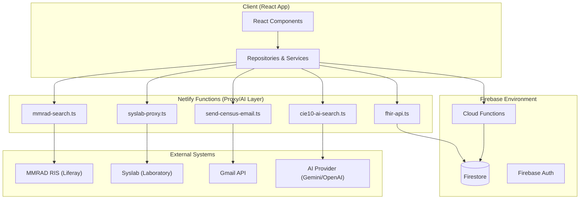

# Integrations & Serverless Functions

# Integrations & Serverless Functions

Relevant source files

The following files were used as context for generating this wiki page:

- [.env.example](.env.example)
- [.gitignore](.gitignore)
- [cors.json](cors.json)
- [docs/superpowers/plans/2026-04-28-clinical-document-ai-import-mvp.md](docs/superpowers/plans/2026-04-28-clinical-document-ai-import-mvp.md)
- [netlify/functions/cie10-ai-search.ts](netlify/functions/cie10-ai-search.ts)
- [netlify/functions/clinical-ai-summary.ts](netlify/functions/clinical-ai-summary.ts)
- [netlify/functions/fhir-api.ts](netlify/functions/fhir-api.ts)
- [netlify/functions/firebase-config.js](netlify/functions/firebase-config.js)
- [netlify/functions/lib/ai-provider.ts](netlify/functions/lib/ai-provider.ts)
- [netlify/functions/lib/clinical-ai-context.ts](netlify/functions/lib/clinical-ai-context.ts)
- [netlify/functions/lib/envValidator.ts](netlify/functions/lib/envValidator.ts)
- [netlify/functions/lib/firebase-server.ts](netlify/functions/lib/firebase-server.ts)
- [netlify/functions/mmrad-search.ts](netlify/functions/mmrad-search.ts)
- [netlify/functions/send-census-email.ts](netlify/functions/send-census-email.ts)
- [public/sw.js](public/sw.js)
- [scripts/check-secret-leaks.mjs](scripts/check-secret-leaks.mjs)
- [src/components/modals/RadiologyPortalReceiptPreview.tsx](src/components/modals/RadiologyPortalReceiptPreview.tsx)
- [src/components/modals/RadiologyViewerModal.tsx](src/components/modals/RadiologyViewerModal.tsx)
- [src/components/modals/RadiologyViewerModalContent.tsx](src/components/modals/RadiologyViewerModalContent.tsx)
- [src/contracts/serverless.ts](src/contracts/serverless.ts)
- [src/env.d.ts](src/env.d.ts)
- [src/features/clinical-documents/components/ClinicalDocumentMMRADCopyDialog.tsx](src/features/clinical-documents/components/ClinicalDocumentMMRADCopyDialog.tsx)
- [src/services/ai/clinicalSummaryService.ts](src/services/ai/clinicalSummaryService.ts)
- [src/services/exporters/excelJsModuleLoader.ts](src/services/exporters/excelJsModuleLoader.ts)
- [src/services/exporters/excelUtils.ts](src/services/exporters/excelUtils.ts)
- [src/services/radiology/mmradReportSupport.ts](src/services/radiology/mmradReportSupport.ts)
- [src/services/radiology/mmradService.ts](src/services/radiology/mmradService.ts)
- [src/services/terminology/cie10AISearch.ts](src/services/terminology/cie10AISearch.ts)
- [src/services/transfers/documentFallbacks.ts](src/services/transfers/documentFallbacks.ts)
- [src/services/transfers/documentGeneratorService.ts](src/services/transfers/documentGeneratorService.ts)
- [src/services/transfers/templateGeneratorService.ts](src/services/transfers/templateGeneratorService.ts)
- [src/services/transfers/transferDocumentFallbackRegistry.ts](src/services/transfers/transferDocumentFallbackRegistry.ts)
- [src/tests/components/modals/RadiologyViewerModalContent.test.tsx](src/tests/components/modals/RadiologyViewerModalContent.test.tsx)
- [src/tests/netlify/cie10AiSearch.test.ts](src/tests/netlify/cie10AiSearch.test.ts)
- [src/tests/netlify/clinicalAiSummary.test.ts](src/tests/netlify/clinicalAiSummary.test.ts)
- [src/tests/netlify/fhirApi.test.ts](src/tests/netlify/fhirApi.test.ts)
- [src/tests/netlify/mmradPortalReceipt.test.ts](src/tests/netlify/mmradPortalReceipt.test.ts)
- [src/tests/netlify/mmradSearch.test.ts](src/tests/netlify/mmradSearch.test.ts)
- [src/tests/netlify/sendCensusEmailFunction.test.ts](src/tests/netlify/sendCensusEmailFunction.test.ts)
- [src/tests/services/exporters/excelUtils.test.ts](src/tests/services/exporters/excelUtils.test.ts)
- [src/tests/services/radiology/mmradReportSupport.test.ts](src/tests/services/radiology/mmradReportSupport.test.ts)
- [src/tests/services/radiology/mmradService.test.ts](src/tests/services/radiology/mmradService.test.ts)
- [src/tests/services/terminology/cie10AISearch.test.ts](src/tests/services/terminology/cie10AISearch.test.ts)
- [src/tests/services/transfers/templateGenerator.test.ts](src/tests/services/transfers/templateGenerator.test.ts)
- [src/types/exceljs-browser.d.ts](src/types/exceljs-browser.d.ts)

The HHR system extends its clinical capabilities beyond the browser by leveraging serverless compute and external integrations. These integrations facilitate communication with hospital legacy systems (Radiology, Lab), automate clinical notifications via WhatsApp, and handle resource-intensive tasks like AI-assisted document parsing and encrypted Excel generation.

The architecture splits these concerns between **Netlify Functions** (primarily for proxying external APIs and AI) and **Firebase Cloud Functions** (for Firestore-triggered background tasks and administrative operations).

## Integration Architecture

The following diagram illustrates how the frontend interacts with external services through the serverless middleware layer.

### System Integration Map

Sources: [netlify/functions/mmrad-search.ts:1-14](), [src/services/radiology/mmradService.ts:38-52](), [netlify/functions/send-census-email.ts:1-15](), [netlify/functions/fhir-api.ts:23-42]()

## Key Integration Areas

### 1. Radiology Viewer (MMRAD)

The system integrates with the **MMRAD RIS** (Radiology Information System) via a Liferay portal proxy. It allows clinicians to search for exams by RUT, view PDF reports, and access DICOM images. A specialized parser extracts "Findings" and "Impression" sections from HTML reports to allow one-click copying into clinical progress notes.

- **Key Components:** `RadiologyViewerModal`, `mmrad-search` Netlify function, and `mmradService`.
- **For details, see [Radiology Viewer (MMRAD)](#12.1)**.

Sources: [src/components/modals/RadiologyViewerModal.tsx:4-31](), [src/services/radiology/mmradReportSupport.ts:60-108]()

### 2. WhatsApp & Notifications

Automated notifications are sent when patients are admitted or transferred to critical units (UPC). This is handled via the `whatsapp-proxy` and a dedicated WhatsApp bot. The system also supports "Staff Cards" which allow quick contact with on-call personnel via WhatsApp.

- **Key Components:** `fugaNotificationService`, `whatsapp-proxy` function, and `FugaNotificationModal`.
- **For details, see [WhatsApp & Notification Integrations](#12.2)**.

Sources: [src/env.d.ts:34-34]()

### 3. Firebase Cloud Functions

Background logic and administrative tasks that require full access to the Firestore database reside in Firebase Cloud Functions. This includes the MINSAL statistics calculator, clinical document exports to Google Drive, and specialized medical handoff write paths for specialists.

- **Key Components:** `functions/index.js`, `createMinsalFunctions`, and `prescriptionAccessFunctions`.
- **For details, see [Firebase Cloud Functions](#12.3)**.

Sources: [netlify/functions/fhir-api.ts:1-5]()

### 4. AI & Terminology Services

The system uses LLMs (Gemini/OpenAI) to assist in clinical workflows. This includes searching for **CIE-10** codes from natural language descriptions and generating summaries for clinical documents.

- **Netlify Functions:** `cie10-ai-search.ts` and `clinical-ai-summary.ts`.
- **Logic:** The `cie10-ai-search` function uses a structured prompt to return valid JSON arrays of ICD-10 codes [netlify/functions/cie10-ai-search.ts:129-146]().

Sources: [netlify/functions/cie10-ai-search.ts:1-20](), [src/services/terminology/cie10AISearch.ts:1-10]()

### 5. FHIR API

A read-only **FHIR R4** compliant API is exposed via serverless functions to allow standardized access to patient and encounter data. It maps internal Firestore schemas to `Patient` and `Encounter` resources.

- **Endpoint:** `/.netlify/functions/fhir-api`
- **Mappers:** Uses `mapMasterPatientToFhir` and `mapEncounterToFhir` [netlify/functions/fhir-api.ts:3-5]().

Sources: [netlify/functions/fhir-api.ts:76-92](), [netlify/functions/fhir-api.ts:150-175]()

## Serverless Infrastructure Table

| Function            | Provider | Purpose                                     | Key Files                                         |
| :------------------ | :------- | :------------------------------------------ | :------------------------------------------------ |
| `mmrad-search`      | Netlify  | Proxy for RIS MMRAD (Liferay)               | `mmrad-search.ts`, `mmradService.ts`              |
| `send-census-email` | Netlify  | Generates encrypted Excel & sends via Gmail | `send-census-email.ts`, `censusMasterWorkbook.ts` |
| `cie10-ai-search`   | Netlify  | LLM-powered ICD-10 code lookup              | `cie10-ai-search.ts`, `ai-provider.ts`            |
| `fhir-api`          | Netlify  | FHIR R4 Patient/Encounter read API          | `fhir-api.ts`, `fhirMappers.ts`                   |
| `minsalStats`       | Firebase | Background KPI calculation for DEIS         | `functions/index.js`                              |

## Security & Authentication

All serverless functions enforce strict security:

1.  **CORS Validation:** Origins are checked against allowed domains [netlify/functions/lib/http.ts:17-27]().
2.  **Bearer Token Verification:** The function extracts the Firebase Auth ID Token from the `Authorization` header [netlify/functions/lib/firebase-auth.ts:28-28]().
3.  **Role-Based Access (RBAC):** Functions verify the user's role in the `config/roles` collection before executing sensitive logic [netlify/functions/mmrad-search.ts:33-40]().

Sources: [netlify/functions/mmrad-search.ts:16-28](), [netlify/functions/send-census-email.ts:35-46](), [netlify/functions/fhir-api.ts:24-29]()

---
