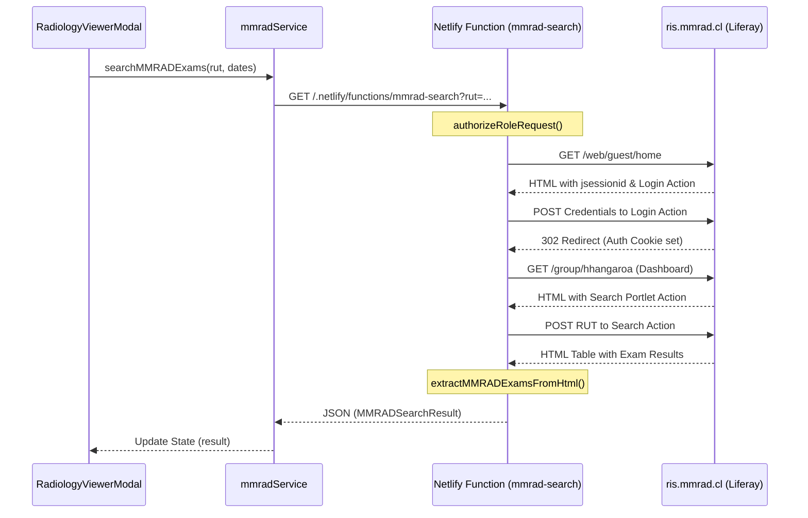
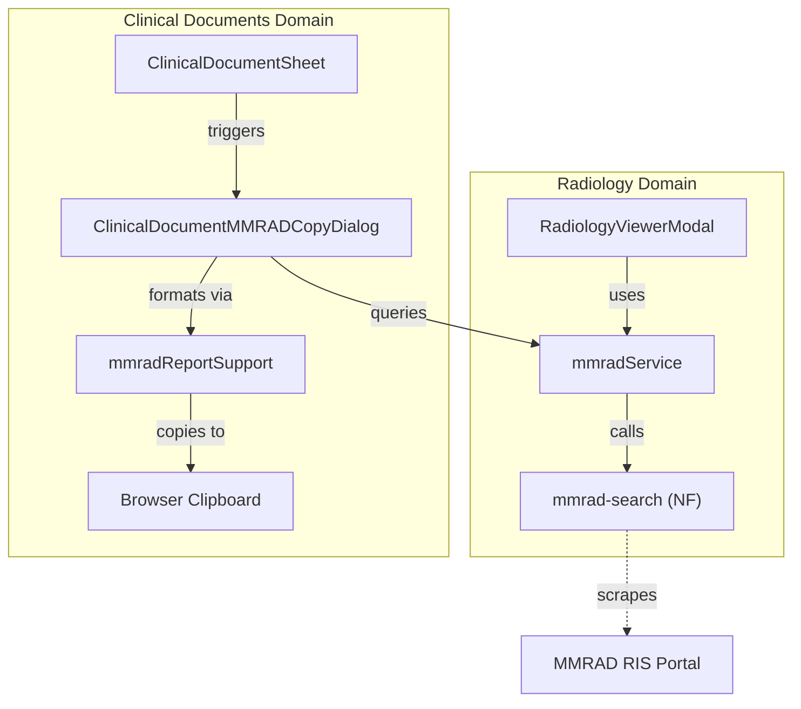

# Radiology Viewer (MMRAD)

# Radiology Viewer (MMRAD)

Relevant source files

The following files were used as context for generating this wiki page:

- [netlify/functions/mmrad-search.ts](netlify/functions/mmrad-search.ts)
- [src/components/modals/RadiologyPortalReceiptPreview.tsx](src/components/modals/RadiologyPortalReceiptPreview.tsx)
- [src/components/modals/RadiologyViewerModal.tsx](src/components/modals/RadiologyViewerModal.tsx)
- [src/components/modals/RadiologyViewerModalContent.tsx](src/components/modals/RadiologyViewerModalContent.tsx)
- [src/features/clinical-documents/components/ClinicalDocumentMMRADCopyDialog.tsx](src/features/clinical-documents/components/ClinicalDocumentMMRADCopyDialog.tsx)
- [src/services/radiology/mmradReportSupport.ts](src/services/radiology/mmradReportSupport.ts)
- [src/services/radiology/mmradService.ts](src/services/radiology/mmradService.ts)
- [src/tests/components/modals/RadiologyViewerModalContent.test.tsx](src/tests/components/modals/RadiologyViewerModalContent.test.tsx)
- [src/tests/netlify/mmradPortalReceipt.test.ts](src/tests/netlify/mmradPortalReceipt.test.ts)
- [src/tests/netlify/mmradSearch.test.ts](src/tests/netlify/mmradSearch.test.ts)
- [src/tests/services/radiology/mmradReportSupport.test.ts](src/tests/services/radiology/mmradReportSupport.test.ts)
- [src/tests/services/radiology/mmradService.test.ts](src/tests/services/radiology/mmradService.test.ts)

The Radiology Viewer module provides an integrated interface for accessing clinical imaging reports and documents from the **MMRAD RIS** (Radiology Information System) used by Hospital Hanga Roa. It utilizes a secure proxy architecture to authenticate with the external RIS, parse unstructured HTML reports into clinical sections, and provide direct access to PDF reports and patient portal credentials.

## System Integration Architecture

The integration follows a "Proxy-Parser" pattern to bridge the legacy RIS portal with the modern React frontend.

### Data Flow Overview

1.  **Request**: The frontend `mmradService` calls the `mmrad-search` Netlify Function with a patient RUT and optional date range [src/services/radiology/mmradService.ts:89-102]().
2.  **Authentication**: The Netlify Function performs a multi-stage Liferay portal login using service credentials (`MMRAD_USERNAME`, `MMRAD_PASSWORD`) [netlify/functions/mmrad-search.ts:8-14]().
3.  **Extraction**: The function navigates the RIS dashboard, submits the search form, and scrapes the resulting HTML table to build structured `MMRADExam` objects [netlify/functions/mmrad-search.ts:155-171]().
4.  **Parsing**: HTML reports are processed by `mmradReportSupport` to identify sections like "Findings" and "Impression" [src/services/radiology/mmradReportSupport.ts:60-108]().
5.  **Delivery**: The frontend renders the results in `RadiologyViewerModal`, allowing for PDF viewing, report copying, or portal receipt generation [src/components/modals/RadiologyViewerModal.tsx:48-53]().

### Code Entity Map: Search & Proxy

| System Name         | Code Entity                | Responsibility                                                                                                                          |
| :------------------ | :------------------------- | :-------------------------------------------------------------------------------------------------------------------------------------- |
| **Search Function** | `mmrad-search.ts`          | Serverless entry point; handles Liferay session management and scraping [netlify/functions/mmrad-search.ts:1-14]().                     |
| **RIS Service**     | `mmradService.ts`          | Frontend client for the Netlify function; handles auth headers and blob URL creation [src/services/radiology/mmradService.ts:1-10]().   |
| **Report Parser**   | `mmradReportSupport.ts`    | Regex-based parser that converts raw RIS HTML into structured clinical sections [src/services/radiology/mmradReportSupport.ts:60-69](). |
| **Viewer Modal**    | `RadiologyViewerModal.tsx` | Main UI container for patient selection, search controls, and result display [src/components/modals/RadiologyViewerModal.tsx:48-53]().  |

### Logic Flow: MMRAD Search & Authentication

This diagram illustrates the multi-step authentication and scraping process performed by the `mmrad-search` function.

Sources: [netlify/functions/mmrad-search.ts:8-14](), [src/services/radiology/mmradService.ts:89-127](), [src/components/modals/RadiologyViewerModal.tsx:126-144]().

## Implementation Details

### Report Parsing (`mmradReportSupport`)

The RIS provides reports as raw HTML fragments. The `parseMMRADReportSections` function uses a set of stop patterns and labels to segment the text into a `MMRADReportSections` interface [src/services/radiology/mmradReportSupport.ts:1-7]().

- **Labels**: It looks for keys like `TECNICA`, `HALLAZGOS`, and `IMPRESION` [src/services/radiology/mmradReportSupport.ts:69-70]().
- **Stop Patterns**: To avoid including signatures or UI elements, it stops parsing when encountering patterns like `SALUDA ATENTAMENTE` or `IMPRIMIR` [src/services/radiology/mmradReportSupport.ts:17-27]().
- **Normalization**: Strips HTML tags and normalizes whitespace for clean display in clinical documents [src/services/radiology/mmradReportSupport.ts:29-45]().

### Clinical Document Integration

The `ClinicalDocumentMMRADCopyDialog` allows doctors to quickly import radiology findings into medical notes (e.g., Epicrisis).

- **Filtering**: Automatically filters for "CT" (Computed Tomography) exams from the last 30 days [src/features/clinical-documents/components/ClinicalDocumentMMRADCopyDialog.tsx:52-57]().
- **Formatting**: Uses `buildMMRADReportClipboardText` to create a concise text block: `[Study Name] ([Date]). Hallazgos: [Text] Impresión: [Text]` [src/services/radiology/mmradReportSupport.ts:146-164]().
- **Clipboard**: Utilizes `writeClipboardText` for one-click insertion [src/features/clinical-documents/components/ClinicalDocumentMMRADCopyDialog.tsx:95-96]().

### Portal Receipt Preview

The RIS generates a patient portal receipt containing access keys. Since these often include broken scripts or complex layouts, the system uses `RadiologyPortalReceiptPreview`.

- **Sanitization**: `buildMMRADPortalReceiptPrintHtml` removes native print buttons and inline scripts from the RIS HTML to prevent execution errors in the app [src/services/radiology/mmradReportSupport.ts:211-222]().
- **Iframe Sandbox**: The sanitized HTML is rendered via `srcDoc` in an iframe [src/components/modals/RadiologyPortalReceiptPreview.tsx:45-50]().
- **Print Control**: A custom React button triggers the print dialog directly on the iframe's `contentWindow` [src/components/modals/RadiologyPortalReceiptPreview.tsx:18-22]().

## Key Components and Services

### Frontend Entities

| Component/Service         | Role                                                                                                                                         |
| :------------------------ | :------------------------------------------------------------------------------------------------------------------------------------------- |
| `RadiologyViewerModal`    | Manages modal state, search lifecycle, and progress simulation [src/components/modals/RadiologyViewerModal.tsx:48-66]().                     |
| `RadiologyViewerControls` | UI for patient selection and date range presets (Last month, year, 5 years) [src/components/modals/RadiologyViewerModalContent.tsx:45-57](). |
| `RadiologyViewerResults`  | Renders the list of exams grouped by modality (CT, RX, US, etc.) [src/components/modals/RadiologyViewerModalContent.tsx:210-222]().          |
| `mmradService`            | Handles binary PDF fetching and HTML receipt proxying [src/services/radiology/mmradService.ts:54-87]().                                      |

### Backend Entities (Netlify Functions)

| Function                          | Role                                                                                                                                             |
| :-------------------------------- | :----------------------------------------------------------------------------------------------------------------------------------------------- |
| `mmrad-search`                    | The primary orchestrator for RIS interactions [netlify/functions/mmrad-search.ts:1-7]().                                                         |
| `buildPdfProxyResponse`           | Fetches binary PDF data from MMRAD and returns it as a Base64 encoded response with proper headers [netlify/functions/mmrad-search.ts:74-111](). |
| `buildPortalReceiptProxyResponse` | Fetches and decodes (Latin1 to UTF-8) the portal receipt HTML [netlify/functions/mmrad-search.ts:114-153]().                                     |

### Integration Diagram: UI to Clinical Documents

This diagram shows how MMRAD data is consumed by the Clinical Documents feature.

Sources: [src/features/clinical-documents/components/ClinicalDocumentMMRADCopyDialog.tsx:53-62](), [src/services/radiology/mmradReportSupport.ts:146-152](), [src/components/modals/RadiologyViewerModal.tsx:146-170]().

## Security and Access Control

- **Role Validation**: Access to MMRAD is restricted to specific roles: `admin`, `nurse_hospital`, `doctor_urgency`, `doctor_specialist`, `editor`, and `viewer` [netlify/functions/mmrad-search.ts:33-40]().
- **Auth Enforcement**: Every request to the Netlify function requires a valid Firebase ID Token passed in the `Authorization` header [src/services/radiology/mmradService.ts:55-58]().
- **CORS**: The Netlify function enforces strict origin checks to ensure only the authorized HHR application can invoke the proxy [netlify/functions/mmrad-search.ts:20-28]().

Sources:

- `src/components/modals/RadiologyViewerModal.tsx`
- `netlify/functions/mmrad-search.ts`
- `src/services/radiology/mmradService.ts`
- `src/services/radiology/mmradReportSupport.ts`
- `src/components/modals/RadiologyViewerModalContent.tsx`
- `src/features/clinical-documents/components/ClinicalDocumentMMRADCopyDialog.tsx`
- `src/components/modals/RadiologyPortalReceiptPreview.tsx`

---
