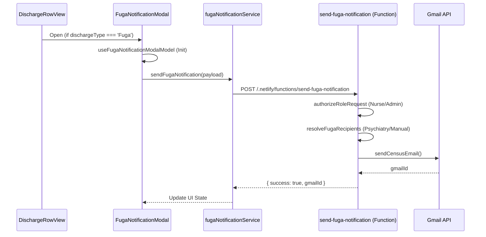
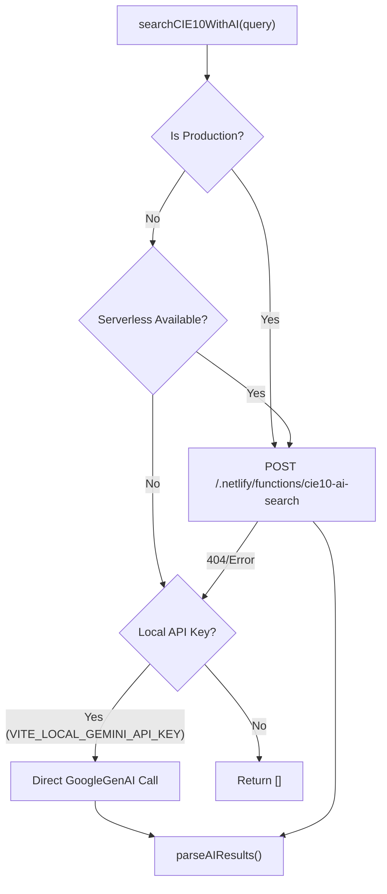

# WhatsApp & Notification Integrations

# WhatsApp & Notification Integrations

Relevant source files

The following files were used as context for generating this wiki page:

- [.env.example](.env.example)
- [.gitignore](.gitignore)
- [docs/estadistico-egreso.pdf](docs/estadistico-egreso.pdf)
- [docs/ieeh-test.pdf](docs/ieeh-test.pdf)
- [docs/superpowers/plans/2026-04-28-clinical-document-ai-import-mvp.md](docs/superpowers/plans/2026-04-28-clinical-document-ai-import-mvp.md)
- [netlify/functions/cie10-ai-search.ts](netlify/functions/cie10-ai-search.ts)
- [netlify/functions/clinical-ai-summary.ts](netlify/functions/clinical-ai-summary.ts)
- [netlify/functions/lib/ai-provider.ts](netlify/functions/lib/ai-provider.ts)
- [netlify/functions/lib/clinical-ai-context.ts](netlify/functions/lib/clinical-ai-context.ts)
- [netlify/functions/lib/envValidator.ts](netlify/functions/lib/envValidator.ts)
- [netlify/functions/send-fuga-notification.ts](netlify/functions/send-fuga-notification.ts)
- [public/docs/estadistico-egreso.pdf](public/docs/estadistico-egreso.pdf)
- [scripts/check-secret-leaks.mjs](scripts/check-secret-leaks.mjs)
- [src/contracts/serverless.ts](src/contracts/serverless.ts)
- [src/env.d.ts](src/env.d.ts)
- [src/features/census/components/DischargeRow.tsx](src/features/census/components/DischargeRow.tsx)
- [src/features/census/components/DischargeRowView.tsx](src/features/census/components/DischargeRowView.tsx)
- [src/features/census/components/FugaNotificationModal.tsx](src/features/census/components/FugaNotificationModal.tsx)
- [src/features/census/controllers/fugaNotificationPolicyController.ts](src/features/census/controllers/fugaNotificationPolicyController.ts)
- [src/features/census/hooks/useFugaNotificationModalModel.ts](src/features/census/hooks/useFugaNotificationModalModel.ts)
- [src/services/ai/clinicalSummaryService.ts](src/services/ai/clinicalSummaryService.ts)
- [src/services/email/gmailClient.ts](src/services/email/gmailClient.ts)
- [src/services/integrations/fugaNotificationService.ts](src/services/integrations/fugaNotificationService.ts)
- [src/services/terminology/cie10AISearch.ts](src/services/terminology/cie10AISearch.ts)
- [src/tests/features/census/FugaNotificationModal.test.tsx](src/tests/features/census/FugaNotificationModal.test.tsx)
- [src/tests/netlify/cie10AiSearch.test.ts](src/tests/netlify/cie10AiSearch.test.ts)
- [src/tests/netlify/clinicalAiSummary.test.ts](src/tests/netlify/clinicalAiSummary.test.ts)
- [src/tests/netlify/sendCensusEmailFunction.test.ts](src/tests/netlify/sendCensusEmailFunction.test.ts)
- [src/tests/netlify/sendFugaNotificationFunction.test.ts](src/tests/netlify/sendFugaNotificationFunction.test.ts)
- [src/tests/services/terminology/cie10AISearch.test.ts](src/tests/services/terminology/cie10AISearch.test.ts)
- [src/tests/views/census/DischargeRow.test.tsx](src/tests/views/census/DischargeRow.test.tsx)

The HHR ServicioHospitalizados system integrates with external communication channels to ensure clinical safety and operational efficiency. This includes a specialized email notification system for patient "Fuga" (unauthorized discharge) events and a WhatsApp proxy for staff communication.

## 1. Fuga Notification System

The "Fuga" notification system is a critical clinical safety feature. When a patient is discharged with the status "Fuga", the system triggers a workflow to notify relevant administrative and clinical authorities via email.

### 1.1 Data Flow: Fuga Notification

The flow starts in the `DischargeRowView` when a user identifies a "Fuga" event and clicks the notification button.

### 1.2 Key Components & Logic

- **DischargeRowView**: Detects if a discharge is a "Fuga" and renders the trigger button [src/features/census/components/DischargeRowView.tsx:37-71]().
- **FugaNotificationModal**: Provides an interface to review the automatic message, add notes, and manage recipients [src/features/census/components/FugaNotificationModal.tsx:44-174]().
- **fugaNotificationPolicyController**: Contains the business logic for resolving recipients (e.g., special handling for Psychiatry) and building the email body [netlify/functions/send-fuga-notification.ts:19-24]().
- **send-fuga-notification**: A Netlify serverless function that enforces RBAC (restricted to `nurse_hospital` and `admin`) and executes the email dispatch via the Gmail API [netlify/functions/send-fuga-notification.ts:26-42]().

### 1.3 Recipient Resolution

The system uses a tiered recipient strategy:

1.  **Psychiatry**: Automatically uses recipients defined in the `FUGA_PSYCHIATRY_RECIPIENTS` environment variable [netlify/functions/send-fuga-notification.ts:44-45]().
2.  **Manual**: Allows nurses to input semicolon-separated emails [src/features/census/components/FugaNotificationModal.tsx:116-123]().
3.  **Test Mode**: Admin-only feature to redirect notifications to a specific test address [src/features/census/components/FugaNotificationModal.tsx:60-88]().

**Sources:** [src/features/census/components/DischargeRowView.tsx](), [src/features/census/components/FugaNotificationModal.tsx](), [netlify/functions/send-fuga-notification.ts](), [src/services/integrations/fugaNotificationService.ts]().

---

## 2. WhatsApp Integration

The system supports WhatsApp interactions through a proxy architecture. This is primarily used for staff communication and potentially automated alerts.

### 2.1 WhatsApp Proxy Architecture

The integration relies on an external bot proxy (often hosted on Railway) and a local Netlify function to bridge the frontend with the WhatsApp API.

| Entity                  | Role                                                           | Configuration                       |
| :---------------------- | :------------------------------------------------------------- | :---------------------------------- |
| `VITE_WHATSAPP_BOT_URL` | Endpoint for the WhatsApp bot proxy.                           | [src/env.d.ts:34]()                 |
| `whatsapp-proxy`        | Netlify function to handle requests to the bot.                | (Referenced in system architecture) |
| `StaffCard`             | UI component that triggers WhatsApp messages to staff members. | (Referenced in system architecture) |

### 2.2 Configuration

The connection is established via the `VITE_WHATSAPP_BOT_URL` environment variable [.env.example:95](). This allows the client to send messages without exposing sensitive bot credentials directly in the browser.

**Sources:** [src/env.d.ts](), [.env.example]().

---

## 3. AI-Enhanced Clinical Services

While primarily used for terminology, the AI integration serves as a notification-adjacent service by providing clinical summaries and CIE-10 search capabilities.

### 3.1 CIE-10 AI Search Flow

The `cie10AISearch` service provides a fallback mechanism to ensure availability even if the serverless infrastructure is down during local development.

### 3.2 Security & Rate Limiting

- **RBAC**: AI functions like `cie10-ai-search` require a valid session and specific roles (`admin`, `nurse_hospital`, `doctor_*`, `viewer`) [netlify/functions/cie10-ai-search.ts:27-34]().
- **Rate Limiting**: Implemented via `isRateLimited` to prevent abuse (e.g., 10 requests per minute for CIE-10 search) [netlify/functions/cie10-ai-search.ts:65-67]().
- **Telemetry**: Every AI operation is tracked via `invokeWithTelemetry` to monitor performance and cost [netlify/functions/cie10-ai-search.ts:148-154]().

**Sources:** [src/services/terminology/cie10AISearch.ts](), [netlify/functions/cie10-ai-search.ts](), [src/contracts/serverless.ts]().

---

## 4. Integration Environment Summary

The following environment variables govern the notification and integration ecosystem:

| Variable                     | Scope  | Purpose                                                   |
| :--------------------------- | :----- | :-------------------------------------------------------- |
| `VITE_WHATSAPP_BOT_URL`      | Client | URL for the WhatsApp bot proxy.                           |
| `VITE_FUGA_EMAIL_ENDPOINT`   | Client | Override for the fuga notification function.              |
| `FUGA_PSYCHIATRY_RECIPIENTS` | Server | CSV list of emails for psychiatric fuga events.           |
| `GMAIL_REFRESH_TOKEN`        | Server | OAuth2 token for sending emails via Gmail.                |
| `VITE_LOCAL_GEMINI_API_KEY`  | Dev    | Local key for bypassing Netlify functions in development. |

**Sources:** [.env.example:40-95](), [src/env.d.ts:3-37]().

---
