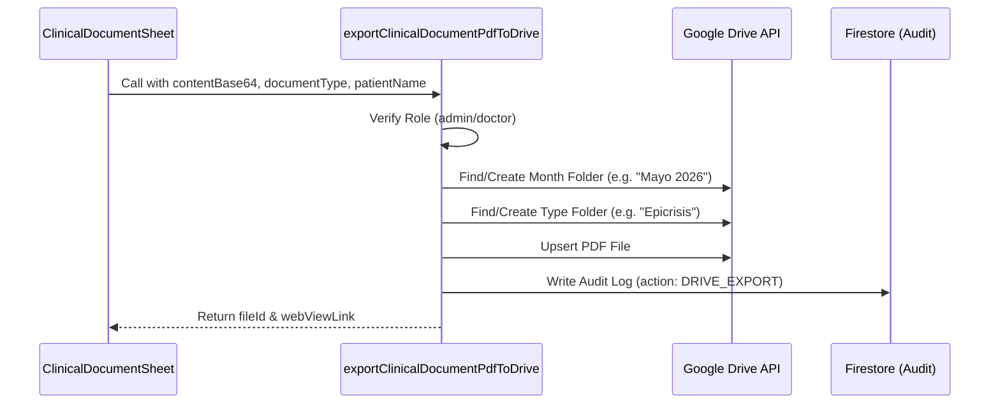
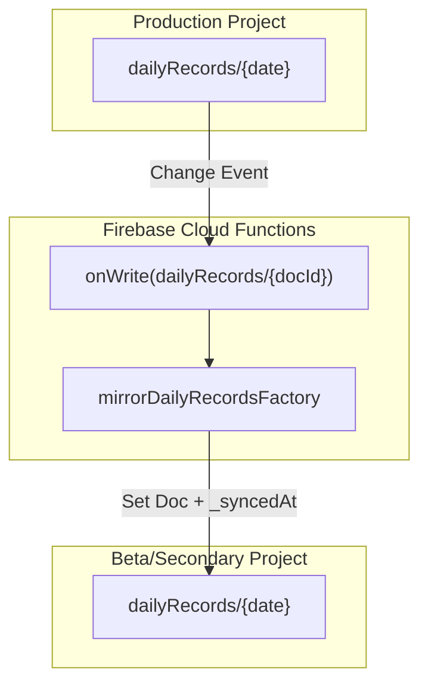

# Firebase Cloud Functions

# Firebase Cloud Functions

Relevant source files

The following files were used as context for generating this wiki page:

- [docs/AUTH_ACCESS_MODEL.md](docs/AUTH_ACCESS_MODEL.md)
- [docs/RUNBOOK_AUTH_ACCESS_INCIDENTS.md](docs/RUNBOOK_AUTH_ACCESS_INCIDENTS.md)
- [functions/lib/auth/authConfig.js](functions/lib/auth/authConfig.js)
- [functions/lib/auth/authEmailUtils.js](functions/lib/auth/authEmailUtils.js)
- [functions/lib/auth/authFunctionsFactory.js](functions/lib/auth/authFunctionsFactory.js)
- [functions/lib/auth/authHelpersFactory.js](functions/lib/auth/authHelpersFactory.js)
- [functions/lib/auth/authPolicies.js](functions/lib/auth/authPolicies.js)
- [functions/lib/clinicalDocumentExportFunctions.js](functions/lib/clinicalDocumentExportFunctions.js)
- [functions/lib/logging/redaction.js](functions/lib/logging/redaction.js)
- [functions/lib/mirror/mirrorDailyRecordsFactory.js](functions/lib/mirror/mirrorDailyRecordsFactory.js)
- [functions/lib/mirror/mirrorSecondaryFirestoreFactory.js](functions/lib/mirror/mirrorSecondaryFirestoreFactory.js)
- [functions/lib/mirror/mirrorWriteHandlerFactory.js](functions/lib/mirror/mirrorWriteHandlerFactory.js)
- [functions/lib/prescriptionAccessFunctions.js](functions/lib/prescriptionAccessFunctions.js)
- [netlify/functions/lib/firebase-auth.ts](netlify/functions/lib/firebase-auth.ts)
- [src/features/admin/index.ts](src/features/admin/index.ts)
- [src/features/admin/public.ts](src/features/admin/public.ts)
- [src/features/census/components/TransferRow.tsx](src/features/census/components/TransferRow.tsx)
- [src/features/census/components/TransferRowView.tsx](src/features/census/components/TransferRowView.tsx)
- [src/features/clinical-documents/components/ClinicalDocumentFormattingToolbar.tsx](src/features/clinical-documents/components/ClinicalDocumentFormattingToolbar.tsx)
- [src/features/clinical-documents/components/ClinicalDocumentPlanSection.tsx](src/features/clinical-documents/components/ClinicalDocumentPlanSection.tsx)
- [src/features/clinical-documents/components/ClinicalDocumentRichTextEditor.tsx](src/features/clinical-documents/components/ClinicalDocumentRichTextEditor.tsx)
- [src/features/clinical-documents/components/clinicalDocumentSectionRendererRegistry.tsx](src/features/clinical-documents/components/clinicalDocumentSectionRendererRegistry.tsx)
- [src/features/clinical-documents/controllers/clinicalDocumentEmptySectionTemplateController.ts](src/features/clinical-documents/controllers/clinicalDocumentEmptySectionTemplateController.ts)
- [src/features/clinical-documents/controllers/clinicalDocumentHtmlSanitizer.ts](src/features/clinical-documents/controllers/clinicalDocumentHtmlSanitizer.ts)
- [src/features/clinical-documents/controllers/clinicalDocumentIndentationController.ts](src/features/clinical-documents/controllers/clinicalDocumentIndentationController.ts)
- [src/features/clinical-documents/controllers/clinicalDocumentMandatoryListShapeController.ts](src/features/clinical-documents/controllers/clinicalDocumentMandatoryListShapeController.ts)
- [src/features/clinical-documents/controllers/clinicalDocumentPlanSectionController.ts](src/features/clinical-documents/controllers/clinicalDocumentPlanSectionController.ts)
- [src/features/clinical-documents/controllers/clinicalDocumentRichTextController.ts](src/features/clinical-documents/controllers/clinicalDocumentRichTextController.ts)
- [src/features/clinical-documents/hooks/useClinicalDocumentRichTextEditorController.ts](src/features/clinical-documents/hooks/useClinicalDocumentRichTextEditorController.ts)
- [src/features/clinical-documents/services/clinicalDocumentDriveService.ts](src/features/clinical-documents/services/clinicalDocumentDriveService.ts)
- [src/features/prescriptions/components/PrescriptionDetailModal.tsx](src/features/prescriptions/components/PrescriptionDetailModal.tsx)
- [src/features/prescriptions/components/PrescriptionListItem.tsx](src/features/prescriptions/components/PrescriptionListItem.tsx)
- [src/features/prescriptions/components/PrescriptionUploadForm.tsx](src/features/prescriptions/components/PrescriptionUploadForm.tsx)
- [src/features/prescriptions/hooks/usePrescriptionListController.ts](src/features/prescriptions/hooks/usePrescriptionListController.ts)
- [src/features/prescriptions/hooks/usePrescriptionUploadController.ts](src/features/prescriptions/hooks/usePrescriptionUploadController.ts)
- [src/features/prescriptions/services/prescriptionAccessService.ts](src/features/prescriptions/services/prescriptionAccessService.ts)
- [src/services/google/googleDriveFolders.ts](src/services/google/googleDriveFolders.ts)
- [src/tests/features/backup/backupComponents.test.tsx](src/tests/features/backup/backupComponents.test.tsx)
- [src/tests/features/clinical-documents/clinicalDocumentPasteController.test.ts](src/tests/features/clinical-documents/clinicalDocumentPasteController.test.ts)
- [src/tests/features/clinical-documents/clinicalDocumentPlanSectionController.test.ts](src/tests/features/clinical-documents/clinicalDocumentPlanSectionController.test.ts)
- [src/tests/features/clinical-documents/clinicalDocumentRichTextController.test.ts](src/tests/features/clinical-documents/clinicalDocumentRichTextController.test.ts)
- [src/tests/features/clinical-documents/useClinicalDocumentRichTextEditorController.test.ts](src/tests/features/clinical-documents/useClinicalDocumentRichTextEditorController.test.ts)
- [src/tests/features/prescriptions/PrescriptionUploadForm.test.tsx](src/tests/features/prescriptions/PrescriptionUploadForm.test.tsx)
- [src/tests/features/prescriptions/usePrescriptionListController.test.tsx](src/tests/features/prescriptions/usePrescriptionListController.test.tsx)
- [src/tests/features/prescriptions/usePrescriptionUploadController.test.tsx](src/tests/features/prescriptions/usePrescriptionUploadController.test.tsx)
- [src/tests/functions/authHelpersFactory.test.ts](src/tests/functions/authHelpersFactory.test.ts)
- [src/tests/functions/clinicalDocumentExportFunctions.test.ts](src/tests/functions/clinicalDocumentExportFunctions.test.ts)
- [src/tests/functions/mirrorDailyRecordsFactory.test.ts](src/tests/functions/mirrorDailyRecordsFactory.test.ts)
- [src/tests/functions/prescriptionAccessFunctions.test.ts](src/tests/functions/prescriptionAccessFunctions.test.ts)
- [src/tests/netlify/firebaseAuth.test.ts](src/tests/netlify/firebaseAuth.test.ts)
- [src/tests/utils/consoleTestUtils.ts](src/tests/utils/consoleTestUtils.ts)
- [src/types/prescriptionTypes.ts](src/types/prescriptionTypes.ts)

The Firebase Cloud Functions layer serves as the trusted backend for the HHR system, handling operations that require elevated privileges, interaction with Google APIs, or strict data integrity enforcement that cannot be performed on the client.

## Overview and Entrypoint

The system utilizes Firebase Functions v1 (CommonJS) to expose a suite of `onCall` and background trigger functions. The primary entrypoint is `functions/index.js`, which aggregates specialized factories for different domains.

### Core Implementation Areas

- **Clinical Document Export**: Integration with Google Drive API for PDF archiving.
- **Prescription Management**: Secure PIN-gated uploads for medication photos and automated cleanup.
- **Auth & Roles**: Centralized role resolution and admin-level PIN rotation.
- **Data Mirroring**: Cross-project synchronization for secondary environments (Beta/Staging).

---

## Clinical Document Export Functions

These functions facilitate the archival of medical documents (Epicrisis, Evolutions, etc.) into a structured Google Drive folder hierarchy.

### Implementation Details

The export process is governed by `createClinicalDocumentExportFunctions`. It ensures that only authorized roles (`admin`, `doctor_urgency`, `doctor_specialist`) can trigger an export [functions/lib/clinicalDocumentExportFunctions.js:8-8]().

#### Folder Hierarchy Logic

The function automatically organizes documents using the following structure:
`Root Folder` → `Year/Month` → `Document Type` → `Patient File`.

- **Mapping**: Document types are mapped to Spanish display names (e.g., `epicrisis` → `Epicrisis`) [functions/lib/clinicalDocumentExportFunctions.js:45-51]().
- **Sanitization**: Path segments are normalized to remove accents and special characters to ensure Drive compatibility [functions/lib/clinicalDocumentExportFunctions.js:53-64]().
- **Upsert Strategy**: If a file with the same name exists in the target folder, the function updates the existing file instead of creating a duplicate [functions/lib/clinicalDocumentExportFunctions.js:207-224]().

### Data Flow: PDF to Drive

**Sources:** [functions/lib/clinicalDocumentExportFunctions.js:120-146](), [functions/lib/clinicalDocumentExportFunctions.js:181-187](), [src/tests/functions/clinicalDocumentExportFunctions.test.ts:120-180]()

---

## Prescription Access Functions

The prescription module uses Cloud Functions to allow nursing staff to upload medication photos via a QR-PIN flow without requiring full Google OAuth on mobile devices.

### PIN-Gated Security

Access is controlled via a PIN stored in `config/prescriptionsAccess`.

- **Hashing**: PINs are hashed using `scrypt` with a per-record salt [functions/lib/prescriptionAccessFunctions.js:76-84]().
- **Brute-Force Protection**: The system locks the PIN endpoint for 15 minutes after 5 consecutive failed attempts [functions/lib/prescriptionAccessFunctions.js:49-51]().
- **Validation**: `validatePrescriptionAccessPin` checks the candidate PIN and manages the lockout state [functions/lib/prescriptionAccessFunctions.js:192-210]().

### Upload Workflow

The `submitPrescriptionPhoto` function handles the canonical write path for prescription metadata and images.

1.  **Validation**: Validates `prescriptionType` (comun, psicotropicos, benzodiazepinas) and `assignmentScope` [functions/lib/prescriptionAccessFunctions.js:34-35]().
2.  **Storage**: Saves a full-resolution image and a thumbnail to Firebase Storage [functions/lib/prescriptionAccessFunctions.js:13-17]().
3.  **TTL Calculation**: Precomputes an `expiresAt` timestamp (default 30 days) to facilitate simple cleanup [functions/lib/prescriptionAccessFunctions.js:93-96]().

### Code Entity Mapping: Prescription Upload

| System Component     | Code Entity              | File Path                                                |
| :------------------- | :----------------------- | :------------------------------------------------------- |
| **Validation Logic** | `requirePinString`       | [functions/lib/prescriptionAccessFunctions.js:178-190]() |
| **Hashing Engine**   | `hashPin` (scrypt)       | [functions/lib/prescriptionAccessFunctions.js:76-84]()   |
| **Upload Handler**   | `createSubmitHandler`    | [functions/lib/prescriptionAccessFunctions.js:22-22]()   |
| **Retention Policy** | `RETENTION_DAYS_BY_TYPE` | [functions/lib/prescriptionAccessFunctions.js:36-40]()   |

**Sources:** [functions/lib/prescriptionAccessFunctions.js:1-27](), [src/tests/functions/prescriptionAccessFunctions.test.ts:149-210]()

---

## Data Mirroring (MirrorDailyRecords)

The mirroring system ensures that data from the production Firestore environment is replicated to secondary environments (e.g., Beta) for testing and development.

### Mirror Logic

The `mirrorDailyRecordsFactory` creates a Firestore `onWrite` trigger that watches the `dailyRecords` collection.

- **Filter**: It ignores records older than 48 hours to prevent infinite loops or unnecessary syncs of legacy data [src/tests/functions/mirrorDailyRecordsFactory.test.ts:17-20]().
- **Payload**: When a record is updated in the source, the mirror overwrites the destination document and injects a `_syncedAt` server timestamp [src/tests/functions/mirrorDailyRecordsFactory.test.ts:38-80]().

### Mirror Data Flow

**Sources:** [src/tests/functions/mirrorDailyRecordsFactory.test.ts:24-81](), [functions/lib/mirror/mirrorDailyRecordsFactory.js:1-15]()

---

## Auth and Management Functions

### Specialist Medical Handoff

Specialized functions handle the medical handoff write path, ensuring that only users with the `doctor_specialist` role can modify specific handoff fields. This bypasses the standard LWW (Last-Write-Wins) client sync to maintain a strict audit trail for specialist interventions.

### Prescription Cleanup

A scheduled function (`prescriptionCleanupFunctions`) runs periodically to delete expired prescriptions. It queries the `prescriptions` collection for documents where `expiresAt` is less than the current time and removes both the Firestore document and the associated blobs in Firebase Storage.

### Auth Function Factories

The `createAuthFunctions` aggregate includes:

- **checkUserRole**: A callable that returns the resolved role for the authenticated user by checking the `config/roles` document [netlify/functions/lib/firebase-auth.ts:164-183]().
- **setPrescriptionAccessPin**: An admin-only function for rotating the QR-flow PIN [functions/lib/prescriptionAccessFunctions.js:25-27]().

**Sources:** [functions/lib/auth/authFunctionsFactory.js:1-10](), [functions/lib/prescriptionAccessFunctions.js:25-27](), [netlify/functions/lib/firebase-auth.ts:12-18]()

---
