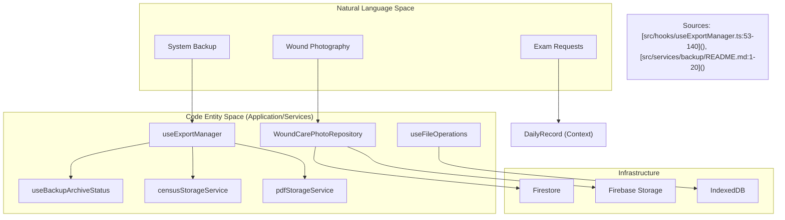

# Additional Clinical Features

# Additional Clinical Features

<details>
<summary>Relevant source files</summary>

The following files were used as context for generating this wiki page:

- [scripts/feature-dependency-matrix.json](scripts/feature-dependency-matrix.json)
- [src/application/backup-export/backupFilesUseCases.ts](src/application/backup-export/backupFilesUseCases.ts)
- [src/application/ports/backupFilesPort.ts](src/application/ports/backupFilesPort.ts)
- [src/application/ports/woundCarePort.ts](src/application/ports/woundCarePort.ts)
- [src/application/wound-care/woundCareConsentUseCases.ts](src/application/wound-care/woundCareConsentUseCases.ts)
- [src/application/wound-care/woundCarePhotoUseCases.ts](src/application/wound-care/woundCarePhotoUseCases.ts)
- [src/application/wound-care/woundCareUseCaseHelpers.ts](src/application/wound-care/woundCareUseCaseHelpers.ts)
- [src/application/wound-care/woundCareUseCases.ts](src/application/wound-care/woundCareUseCases.ts)
- [src/features/backup/README.md](src/features/backup/README.md)
- [src/features/census/components/patient-row/NameInput.tsx](src/features/census/components/patient-row/NameInput.tsx)
- [src/features/wound-care/components/PhotoUploadModal.tsx](src/features/wound-care/components/PhotoUploadModal.tsx)
- [src/features/wound-care/controllers/photoUploadController.ts](src/features/wound-care/controllers/photoUploadController.ts)
- [src/features/wound-care/public.ts](src/features/wound-care/public.ts)
- [src/hooks/controllers/backupStorageOutcomeController.ts](src/hooks/controllers/backupStorageOutcomeController.ts)
- [src/hooks/useBackupArchiveStatus.ts](src/hooks/useBackupArchiveStatus.ts)
- [src/hooks/useBackupFileBrowserActions.ts](src/hooks/useBackupFileBrowserActions.ts)
- [src/hooks/useBackupFilesQuery.ts](src/hooks/useBackupFilesQuery.ts)
- [src/hooks/useExportManager.ts](src/hooks/useExportManager.ts)
- [src/hooks/useFileOperations.ts](src/hooks/useFileOperations.ts)
- [src/schemas/zod/woundCare.ts](src/schemas/zod/woundCare.ts)
- [src/services/backup/README.md](src/services/backup/README.md)
- [src/services/backup/backupCrudResults.ts](src/services/backup/backupCrudResults.ts)
- [src/services/repositories/WoundCarePhotoRepository.ts](src/services/repositories/WoundCarePhotoRepository.ts)
- [src/shared/access/operationalAccessPolicy.ts](src/shared/access/operationalAccessPolicy.ts)
- [src/shared/contracts/applicationOutcomeFactories.ts](src/shared/contracts/applicationOutcomeFactories.ts)
- [src/tests/hooks/controllers/backupStorageOutcomeController.test.ts](src/tests/hooks/controllers/backupStorageOutcomeController.test.ts)
- [src/tests/hooks/useBackupFilesQuery.test.tsx](src/tests/hooks/useBackupFilesQuery.test.tsx)
- [src/tests/hooks/useExportManager.handoffNotices.test.ts](src/tests/hooks/useExportManager.handoffNotices.test.ts)
- [src/tests/hooks/useExportManager.test.ts](src/tests/hooks/useExportManager.test.ts)
- [src/tests/hooks/useFileOperations.test.ts](src/tests/hooks/useFileOperations.test.ts)
- [src/tests/views/census/NameInput.test.tsx](src/tests/views/census/NameInput.test.tsx)

</details>

This section covers the supplementary clinical modules that support the core census and handoff workflows. These features include specialized wound photography, diagnostic request management, and system-wide utilities for reminders and data persistence.

## 13.1. Wound Care Module

The Wound Care module provides a secure workflow for capturing and documenting clinical progress through photography. It includes a consent management system and a mobile-bridge upload feature to allow clinicians to use mobile devices as cameras while maintaining the security context of the desktop application.

- **Photography Workflow**: Managed via `WoundCareModal` and `PhotoUploadModal` [src/features/wound-care/components/PhotoUploadModal.tsx:1-20]().
- **Mobile Bridge**: Uses `woundCareMobileUploadFunctions` (Cloud Functions) to establish temporary upload sessions between devices [src/application/wound-care/woundCareMobileUploadSessionUseCases.ts:25-28]().
- **Persistence**: Handled by the `WoundCarePhotoRepository` which interacts with Firebase Storage and Firestore [src/services/repositories/WoundCarePhotoRepository.ts:1-10]().

For deep technical details on consent PDF generation and mobile session validation, see **[Wound Care Module](#13.1)**.

## 13.2. Exam & Imaging Requests

The system streamlines the generation of standardized request forms for laboratory exams and imaging (Radiology). This module ensures that patient metadata from the census is automatically synchronized with the request forms to reduce transcription errors.

- **Exam Requests**: Integrated into the patient row via `ExamRequestModal` and `ExamCheckbox` components.
- **Imaging Integration**: Supports imaging consent and requests through `ImagingRequestDialog` and `ImagingSidebar`.
- **PDF Service**: Uses `imagingRequestPdfService` to generate institutional-grade documents based on `Formularios` field definitions.

For implementation details on request logic and PDF field mapping, see **[Exam & Imaging Requests](#13.2)**.

## 13.3. Reminders & Backup/Export

This module provides administrative and operational safety nets, including a task reminder system and a multi-layered backup architecture for clinical records.

### Reminders

A contextual notification system that allows staff to set clinical or administrative alerts.

- **Logic**: Managed via `ReminderCenterContext` and `reminderUseCases` [scripts/feature-dependency-matrix.json:13]().
- **UI**: Accessible via the `UserMenu` and global shell.

### Backup & Export Management

The system implements an "Archive" policy to ensure clinical data is preserved in multiple formats (Excel, PDF, JSON).

- **Export Manager**: The `useExportManager` hook coordinates the generation of Excel and PDF backups [src/hooks/useExportManager.ts:53-64]().
- **Archive Verification**: The `useBackupArchiveStatus` hook performs opportunistic background checks to verify if the current shift's records are already safely stored in remote storage [src/hooks/useBackupArchiveStatus.ts:22-29]().
- **File Operations**: Supports manual JSON/CSV exports and local file imports via `useFileOperations` for disaster recovery scenarios [src/hooks/useFileOperations.ts:36-39]().

For details on the `censusStorageService`, `pdfStorageService`, and export outcome controllers, see **[Reminders & Backup/Export](#13.3)**.

---

### System Integration Map

The following diagram illustrates how these supplementary features interface with the core `DailyRecord` and external storage services.

**Clinical Feature to Code Entity Mapping**



### Export & Backup Workflow

This diagram details the logic within `useExportManager` for handling clinical data exports.

**Export Manager Execution Flow**

```mermaid
sequenceDiagram
    participant UI as UI Component
    participant EM as useExportManager
    participant UC as backupExportArchiveUseCases
    participant OP as operationalTelemetryOutcomeRecorder

    UI->>EM: handleBackupHandoff()
    EM->>EM: confirm() (if not skipped)
    EM->>EM: setIsBackingUp(true)
    EM->>UC: executeBackupHandoffPdf(record, shift)
    UC-->>EM: ApplicationOutcome
    EM->>OP: recordOperationalOutcome()
    alt status == 'success'
        EM->>EM: setIsArchived(true)
    end
    EM->>UI: dispatchExportManagerNotice()
    EM->>EM: setIsBackingUp(false)

    Note over EM,UC: Uses dynamic import loadBackupArchiveUseCases()

    Sources["Sources: [src/hooks/useExportManager.ts:160-200](), [src/tests/hooks/useExportManager.test.ts:123-147]()"]
```

### Backup Status & Verification

The system distinguishes between local exports and remote archival.

| Feature          | Code Hook / Service        | Target Storage         | Purpose                                 |
| :--------------- | :------------------------- | :--------------------- | :-------------------------------------- |
| **PDF Backup**   | `executeBackupHandoffPdf`  | Firebase Storage       | Institutional record of shift handoff   |
| **Excel Census** | `executeBackupCensusExcel` | Firebase Storage       | Administrative reporting and statistics |
| **Status Check** | `useBackupArchiveStatus`   | Cloud Storage Metadata | UI indicator of "Archived" status       |
| **Local Export** | `exportDataJSONWithResult` | Local Browser Download | User-driven manual data portability     |
| **JSON Import**  | `executeImportJsonBackup`  | IndexedDB              | Emergency data restoration              |

**Sources:**

- [src/hooks/useExportManager.ts:28-34]()
- [src/hooks/useBackupArchiveStatus.ts:51-63]()
- [src/hooks/useFileOperations.ts:58-86]()
- [src/services/backup/README.md:9-17]()

---
